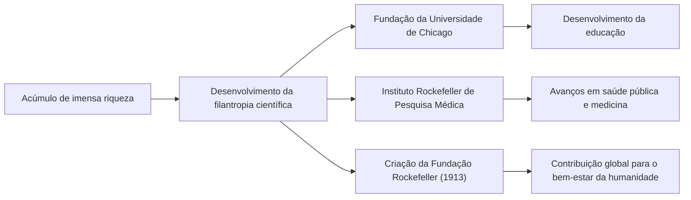

Do final do século XIX ao início do século XX, houve uma figura que teve um impacto enorme não apenas nos Estados Unidos, mas na economia global. Seu nome é John Davison Rockefeller. Amplamente conhecido como o "Rei do Petróleo", ele fundou a Standard Oil Company e construiu uma das maiores fortunas da história através de um monopólio esmagador. No entanto, sua verdadeira grandeza não residia simplesmente no acúmulo de riqueza, mas no estabelecimento do sistema capitalista moderno e na sistematização de uma filantropia sem precedentes que continua a influenciar as gerações futuras. Este artigo aprofunda-se em sua vida turbulenta, sua filosofia de negócios única e o grande legado que ele deixou para a sociedade moderna.

## Lições da Juventude e Obsessão por Livros-Razão

Nascido em Richford, Nova York, em 1839, Rockefeller foi criado por pais contrastantes. Seu pai, William, era um vendedor ambulante de remédios chamado de "Pitch Doctor", muitas vezes ausente de casa e que ganhava a vida por meio de esquemas comerciais astutos. Em contraste, sua mãe, Eliza, era uma devota batista que incutiu profundamente no filho os valores de trabalho duro, frugalidade e filantropia.

Uma das lições mais importantes que Rockefeller aprendeu na infância foi que "os números não mentem". Desde jovem, ele carregava um pequeno caderno chamado "Ledger A", registrando meticulosamente suas receitas, despesas e doações até o último centavo. Esse racionalismo absoluto e a capacidade de análise objetiva baseada em números tornaram-se a base sobre a qual ele construiu seu gigantesco império. Aos 16 anos, ele começou a trabalhar como guarda-livros para um atacadista de produtos agrícolas em Cleveland, onde rapidamente se destacou por sua precisão e diligência excepcionais.

## A Fundação da Standard Oil e a Conclusão do "Monopólio"

Em 1859, o sucesso do poço de petróleo de Drake na Pensilvânia desencadeou um boom do petróleo na América. Naquela época, o petróleo era usado principalmente como querosene para iluminação, mas o processo de refino era ineficiente e a qualidade instável. Rockefeller viu uma oportunidade nisso e entrou no negócio de refino em 1863. Ele evitou a natureza de jogo da perfuração e concentrou-se em dominar os processos de "refino" e "transporte", que geravam lucros mais estáveis.

Em 1870, ele fundou a "Standard Oil Company" com seu irmão mais novo William Rockefeller, Henry Flagler e outros. O nome "Standard" refletia a crença de sempre fornecer produtos uniformes e seguros em um mercado onde a qualidade era anteriormente inconsistente.

Seu modelo de negócios era feroz. Ele fez acordos secretos de descontos com companhias ferroviárias, reduzindo drasticamente os custos de transporte e esmagando os concorrentes. Ele comprou concorrentes em dificuldades financeiras um após o outro (integração horizontal) e, simultaneamente, construiu um sistema onde tudo, desde a fabricação de barris até a construção de oleodutos, era feito internamente (integração vertical). Em 1882, ele concebeu uma nova forma de empresa chamada "Trust", completando um monopólio sem precedentes que controlava mais de 90% da capacidade de refino de petróleo dos EUA.

## A Filosofia de Negócios de Rockefeller

A filosofia que sustentou o sucesso de Rockefeller baseava-se em um racionalismo extremamente simples e implacável.

1. **Eliminação completa do desperdício**: Com o lema "não desperdiçar uma única gota de óleo", ele comercializou todos os subprodutos (como gasolina e alcatrão) produzidos no processo de refino.
2. **Rejeição da concorrência**: Ele acreditava firmemente que "a concorrência excessiva é ruim e cria desperdício". Ele estava convencido de que o monopólio era a única maneira de maximizar a eficiência e fornecer aos consumidores um suprimento estável de produtos de alta qualidade a preços baixos.
3. **Controle emocional calmo**: Não importa a crise ou crítica que enfrentasse, ele nunca perdia a compostura. Ele mantinha o silêncio e prosseguia calmamente com seus negócios com base em suas próprias convicções.

No entanto, seus métodos agressivos atraíram gradualmente a oposição do público. Artigos de denúncia de jornalistas como Ida Tarbell (Muckrakers) provocaram críticas do público e, em 1911, a Suprema Corte dos EUA ordenou a dissolução da Standard Oil (dividida em 34 empresas) por violar a lei antitruste. Ironicamente, essa divisão fez com que os preços das ações de cada empresa disparassem, aumentando ainda mais a riqueza de Rockefeller.

## Filantropia Sem Precedentes e Legado para a Posteridade

Após se aposentar, Rockefeller dedicou a segunda metade de sua vida a devolver à sociedade a imensa riqueza que havia acumulado. Ele trouxe os métodos organizacionais e racionais desenvolvidos nos negócios para a filantropia, estabelecendo um novo conceito chamado "filantropia científica".

Ele investiu quantias colossais na fundação da Universidade de Chicago, impulsionando-a a se tornar um instituto de pesquisa de classe mundial. Ele também fundou o Instituto Rockefeller de Pesquisa Médica (agora Universidade Rockefeller) e fez grandes contribuições para a erradicação de doenças infecciosas como febre amarela e ancilostomose. Além disso, em 1913, ele fundou a Fundação Rockefeller, que expandiu as atividades de apoio global com o objetivo de "promover o bem-estar da humanidade".

John D. Rockefeller é a figura que melhor simboliza tanto a luz quanto a sombra do capitalismo americano. Ao mesmo tempo em que era criticado como um capitalista monopolista implacável, ele salvou inúmeras vidas e contribuiu para o desenvolvimento acadêmico como um dos maiores filantropos do mundo. Sua vida, na qual buscou extremos tanto em "ganhar dinheiro" quanto em "doar dinheiro", continua a apresentar questões profundas aos líderes empresariais e filantropos da atualidade. O legado que ele deixou está certamente vivo na infraestrutura de energia barata e nos benefícios médicos que desfrutamos hoje.
