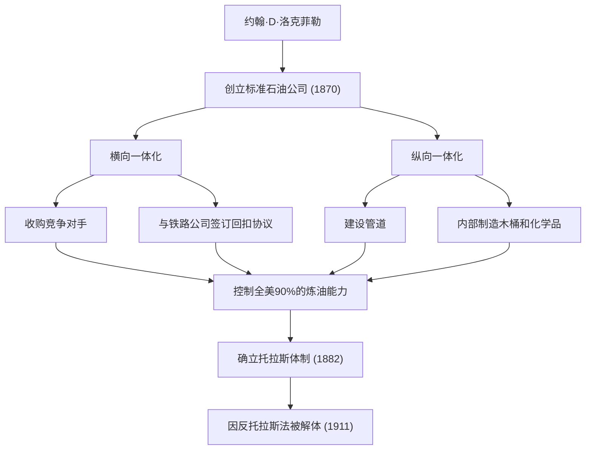
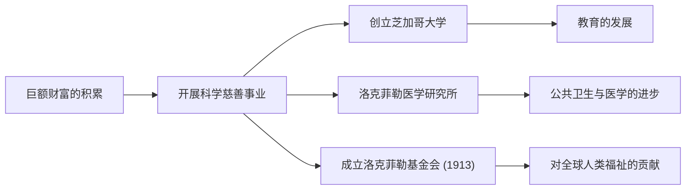

19世纪后半叶至20世纪初，有一位人物不仅对美国，更对全球经济产生了巨大影响。他的名字叫约翰·戴维森·洛克菲勒（John Davison Rockefeller）。他创立了标准石油公司（Standard Oil），通过压倒性的垄断积累了据称是史上最高额的巨额财富，作为“石油大王”而广为人知。然而，他真正的了不起之处不仅在于财富的积累，更在于确立了现代资本主义系统，并将对后世产生深远影响的史无前例的慈善事业体系化。在本文中，我们将深入探讨他充满波折的一生、独特的商业哲学，以及他给现代社会留下的伟大遗产。

## 早年的教诲与对账本的执着

1839年，洛克菲勒出生于纽约州里奇福德，在性格迥异的父母抚养下长大。父亲威廉是一名被称为“江湖游医”的巡回售药人，经常不在家，靠着狡猾的商业手段维持生计。相比之下，母亲伊莱扎是一位虔诚的浸信会教徒，她将勤勉、节约和慈善的精神深深地刻在了儿子的心中。

年幼的洛克菲勒学到的最重要的一课就是“数字不会撒谎”。他从年轻时起就随身携带一本名为“账本A（Ledger A）”的小账册，精确到1美分地记录收入、支出和捐赠。这种彻底的理性主义和基于数字的客观分析能力，成为了后来建立庞大帝国的基石。16岁时，他在克利夫兰的一家农产品批发商那里找到了一份簿记员的工作，凭借非凡的准确性和勤奋，他迅速崭露头角。

## 标准石油的创立与“垄断”的完成

1859年，宾夕法尼亚州的德雷克油井取得成功，美国迎来了石油热潮。当时，石油主要用作照明用的煤油，但炼油过程效率低下且质量不稳定。洛克菲勒看准了这一点，于1863年进入炼油业。他没有涉足具有赌博性质的石油开采，而是集中精力控制更稳定且能产生利润的“炼油”和“运输”环节。

1870年，他与弟弟威廉·洛克菲勒、亨利·弗拉格勒等人共同创立了“标准石油公司”。公司名称中的“标准（Standard）”蕴含着他们的信念：在质量参差不齐的市场中，始终提供统一、安全的产品。

他的商业模式极其冷酷。他秘密地与铁路公司签订回扣协议，通过大幅降低运输成本来压倒竞争对手。他接连收购陷入经营危机的竞争公司（横向一体化），同时建立了一个从制造木桶到建设管道全部由公司内部完成的体制（纵向一体化）。1882年，他设计了一种名为“托拉斯”的新型企业形态，完成了一个控制了全美90%以上炼油能力的史无前例的垄断企业。

## 洛克菲勒的商业哲学

支撑洛克菲勒成功的哲学，是基于极其简单且冷酷的理性主义。

1. **彻底消除浪费**：他以“不浪费一滴油”为座右铭，将炼油过程中产生的所有副产品（如汽油和焦油等）全部商品化。
2. **否定竞争**：他坚信“过度竞争是罪恶的，会产生浪费”。他毫不怀疑，垄断是使效率最大化、为消费者稳定提供廉价优质产品的唯一途径。
3. **冷静沉着的情绪控制**：无论面临何种危机或指责，他都从不慌乱。他保持沉默，基于自己的信念平静地推进事业。

然而，这种强硬的手段逐渐招致了社会的强烈反对。以伊达·塔贝尔等记者的揭黑报道（扒粪运动）为契机，公众的批评声浪高涨，1911年，美国最高法院以违反反托拉斯法为由，下令解体标准石油公司（拆分为34家公司）。具有讽刺意味的是，这次拆分导致各家公司的股价飙升，洛克菲勒的资产反而进一步膨胀。

## 史无前例的慈善事业与后世遗产

退休后的洛克菲勒将人生的后半段奉献给了将自己积累的巨额财富回馈社会。他将在商业中培养的组织化、合理化的方法引入慈善事业，确立了“科学慈善”的新概念。

他投入巨资创立了芝加哥大学，将其推向了世界顶尖研究机构的地位。他还建立了洛克菲勒医学研究所（现洛克菲勒大学），为根除黄热病和钩虫病等传染病做出了巨大贡献。此外，1913年他成立了洛克菲勒基金会，开展了以“增进人类福祉”为目的的全球性援助活动。

约翰·D·洛克菲勒是最能象征美国资本主义光明与黑暗的人物。一方面，他作为冷酷的垄断资本家受到批评；另一方面，作为世界最大规模的慈善家，他拯救了无数生命，为学术发展做出了贡献。他在“赚钱”和“捐钱”两方面都追求极致的一生，至今仍在向现代商业领袖和慈善家们提出深刻的问题。他留下的遗产，确实依然存在于我们今天享受的廉价能源基础设施和医学恩惠之中。
