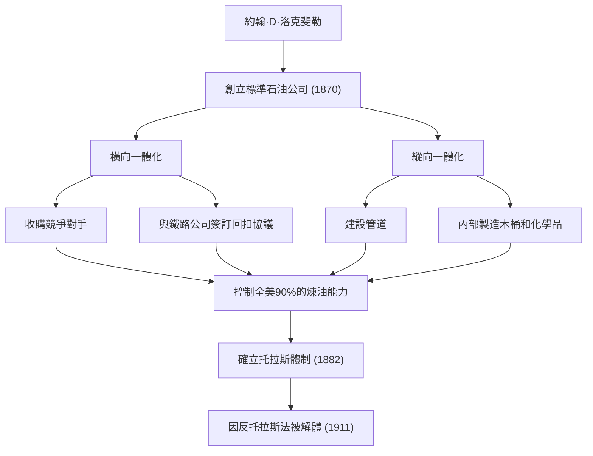
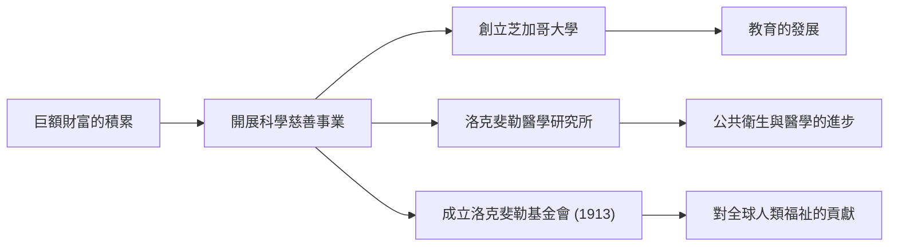

19世紀後半葉至20世紀初，有一位人物不僅對美國，更對全球經濟產生了巨大影響。他的名字叫約翰·戴維森·洛克斐勒（John Davison Rockefeller）。他創立了標準石油公司（Standard Oil），透過壓倒性的壟斷積累了據稱是史上最高額的巨額財富，作為「石油大王」而廣為人知。然而，他真正的了不起之處不僅在於財富的積累，更在於確立了現代資本主義系統，並將對後世產生深遠影響的史無前例的慈善事業體系化。在本文中，我們將深入探討他充滿波折的一生、獨特的商業哲學，以及他給現代社會留下的偉大遺產。

## 早年的教誨與對帳本的執著

1839年，洛克斐勒出生於紐約州里奇福德，在性格迥異的父母撫養下長大。父親威廉是一名被稱為「江湖遊醫」的巡迴售藥人，經常不在家，靠著狡猾的商業手段維持生計。相比之下，母親伊萊扎是一位虔誠的浸信會教徒，她將勤勉、節約和慈善的精神深深地刻在了兒子的心中。

年幼的洛克斐勒學到的最重要的一課就是「數字不會撒謊」。他從年輕時起就隨身攜帶一本名為「帳本A（Ledger A）」的小帳冊，精確到1美分地記錄收入、支出和捐贈。這種徹底的理性主義和基於數字的客觀分析能力，成為了後來建立龐大帝國的基石。16歲時，他在克利夫蘭的一家農產品批發商那裡找到了一份簿記員的工作，憑藉非凡的準確性和勤奮，他迅速嶄露頭角。

## 標準石油的創立與「壟斷」的完成

1859年，賓夕法尼亞州的德雷克油井取得成功，美國迎來了石油熱潮。當時，石油主要用作照明用的煤油，但煉油過程效率低下且品質不穩定。洛克斐勒看準了這一點，於1863年進入煉油業。他沒有涉足具有賭博性質的石油開採，而是集中精力控制更穩定且能產生利潤的「煉油」和「運輸」環節。

1870年，他與弟弟威廉·洛克斐勒、亨利·弗拉格勒等人共同創立了「標準石油公司」。公司名稱中的「標準（Standard）」蘊含著他們的信念：在品質參差不齊的市場中，始終提供統一、安全的產品。

他的商業模式極其冷酷。他秘密地與鐵路公司簽訂回扣協議，透過大幅降低運輸成本來壓倒競爭對手。他接連收購陷入經營危機的競爭公司（橫向一體化），同時建立了一個從製造木桶到建設管道全部由公司內部完成的體制（縱向一體化）。1882年，他設計了一種名為「托拉斯」的新型企業形態，完成了一個控制了全美90%以上煉油能力的史無前例的壟斷企業。

## 洛克斐勒的商業哲學

支撐洛克斐勒成功的哲學，是基於極其簡單且冷酷的理性主義。

1. **徹底消除浪費**：他以「不浪費一滴油」為座右銘，將煉油過程中產生的所有副產品（如汽油和焦油等）全部商品化。
2. **否定競爭**：他堅信「過度競爭是罪惡的，會產生浪費」。他毫不懷疑，壟斷是使效率最大化、為消費者穩定提供廉價優質產品的唯一途徑。
3. **冷靜沉著的情緒控制**：無論面臨何種危機或指責，他都從不慌亂。他保持沉默，基於自己的信念平靜地推進事業。

然而，這種強硬的手段逐漸招致了社會的強烈反對。以伊達·塔貝爾等記者的揭黑報導（扒糞運動）為契機，公眾的批評聲浪高漲，1911年，美國最高法院以違反反托拉斯法為由，下令解體標準石油公司（拆分為34家公司）。具有諷刺意味的是，這次拆分導致各家公司的股價飆升，洛克斐勒的資產反而進一步膨脹。

## 史無前例的慈善事業與後世遺產

退休後的洛克斐勒將人生的後半段奉獻給了將自己積累的巨額財富回饋社會。他將在商業中培養的組織化、合理化的方法引入慈善事業，確立了「科學慈善」的新概念。

他投入巨資創立了芝加哥大學，將其推向了世界頂尖研究機構的地位。他還建立了洛克斐勒醫學研究所（現洛克斐勒大學），為根除黃熱病和鉤蟲病等傳染病做出了巨大貢獻。此外，1913年他成立了洛克斐勒基金會，開展了以「增進人類福祉」為目的的全球性援助活動。

約翰·D·洛克斐勒是最能象徵美國資本主義光明與黑暗的人物。一方面，他作為冷酷的壟斷資本家受到批評；另一方面，作為世界最大規模的慈善家，他拯救了無數生命，為學術發展做出了貢獻。他在「賺錢」和「捐錢」兩方面都追求極致的一生，至今仍在向現代商業領袖和慈善家們提出深刻的問題。他留下的遺產，確實依然存在於我們今天享受的廉價能源基礎設施和醫學恩惠之中。
