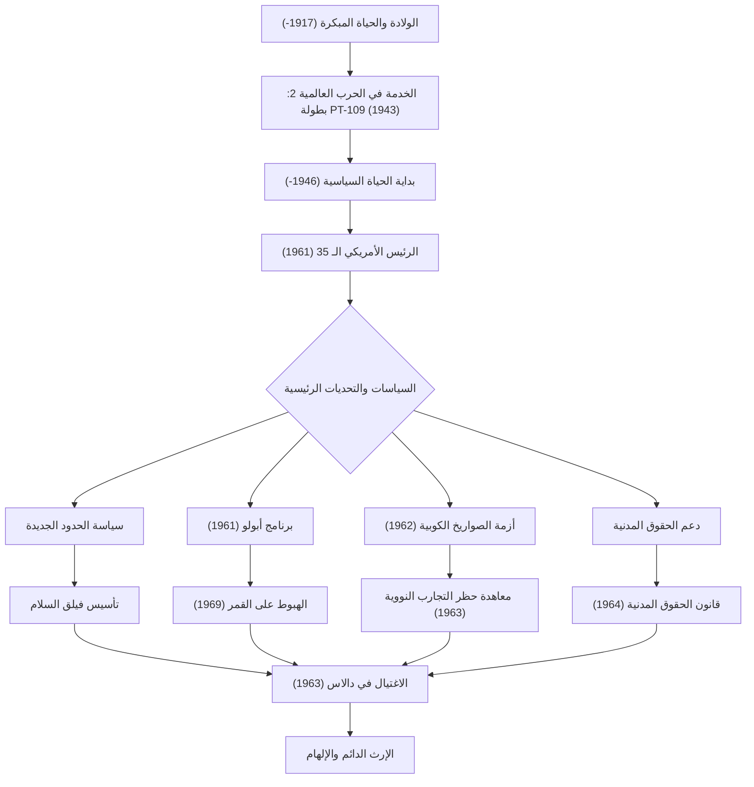

جون فيتزجيرالد كينيدي (JFK)، الرئيس الخامس والثلاثون للولايات المتحدة، كان زعيماً جذاباً وجه الأمة خلال نقطة التحول التاريخية للحرب الباردة. على الرغم من أن فترة ولايته كانت قصيرة إذ بلغت 1036 يوماً فقط، إلا أن فلسفته وأفعاله لا تزال تلهم الناس في جميع أنحاء العالم حتى اليوم. يتعمق هذا المقال في حياته، وفلسفته الأساسية، وتأثيره الذي لا يقاس وصولاً إلى يومنا هذا.

## من خلفية مميزة إلى بطل حرب

ولد كينيدي في 29 مايو 1917، في عائلة كاثوليكية أيرلندية ثرية في بروكلين، ماساتشوستس، ونشأ في بيئة عائلية تقدر المنافسة الفكرية، على الرغم من مرضه منذ الطفولة. بعد تخرجه من جامعة هارفارد، انضم إلى البحرية عند اندلاع الحرب العالمية الثانية.

في عام 1943، اصطدم قارب الطوربيد "PT-109" الذي كان يقوده بمدمرة يابانية وغرق، مما وضعه في أزمة يائسة. ومع ذلك، وعلى الرغم من إصابته، فقد قاد مرؤوسيه وسبح لعدة كيلومترات إلى جزيرة في عملية إنقاذ بطولية. أصبحت هذه التجربة نقطة البداية لـ "روحه التي لا تقهر" و"حكمه الهادئ" في مواجهة الأزمات الوطنية التي سيواجهها لاحقاً.

## الدعوة إلى "الحدود الجديدة" وتولي الرئاسة

بعد الحرب، وبدافع من وفاة شقيقه الأكبر جوزيف في المعركة، بدأ كينيدي طريقه كسياسي، حيث عمل كممثل وسيناتور قبل الترشح في الانتخابات الرئاسية لعام 1960. من خلال الاستخدام الماهر للوسيلة الجديدة للمناظرات التلفزيونية، هزم ريتشارد نيكسون بفارق ضئيل ليتم انتخابه كأصغر رئيس وأول رئيس كاثوليكي في التاريخ.

لقد تردد صدى كلماته في خطابه الافتتاحي، "لا تسأل عما يمكن أن يفعله بلدك من أجلك - اسأل عما يمكنك فعله لبلدك"، بقوة لدى الشعب الأمريكي، وخاصة الشباب. اقترح سياسة "الحدود الجديدة"، حيث تصدى بجرأة للقضايا المحلية التي لم يتم حلها مثل القضاء على الفقر، وتعزيز التعليم، وإلغاء التمييز العنصري.

## إدارة الأزمات في الحرب الباردة: أزمة الصواريخ الكوبية

كان أعظم اختبار لإدارة كينيدي هو "أزمة الصواريخ الكوبية" التي حدثت في أكتوبر 1962. عندما تم اكتشاف أن الاتحاد السوفيتي كان يبني قواعد صواريخ نووية في كوبا، وقف العالم على شفا الحرب العالمية الثالثة، حرب نووية شاملة.

في حين دعا الجيش بقوة إلى اتخاذ تدابير صارمة مثل الغارات الجوية أو غزو كوبا، اختار كينيدي الإجراء المقيد ولكن الحازم المتمثل في الحصار البحري. بعد تبادل متوتر للرسائل ومفاوضات خلف الكواليس مع رئيس الوزراء السوفيتي خروتشوف، وافق الاتحاد السوفيتي على إزالة الصواريخ. أثبت حل هذه الأزمة سلمياً ضبط النفس الاستثنائي وإيمانه بالحوار.

## برنامج أبولو: الحدود الجديدة للفضاء

تتجلى عقلية كينيدي الموجهة نحو المستقبل بشكل أفضل في تحديه لاستكشاف الفضاء. في عام 1961، أعلن عن هدف عظيم للكونغرس: "قبل نهاية هذا العقد، هبوط رجل على سطح القمر وإعادته بأمان إلى الأرض" (برنامج أبولو).

على الرغم من أنه بدا هدفاً متهوراً بالنظر إلى المستوى التكنولوجي في ذلك الوقت، إلا أنه ألهم الأمة قائلاً: "لقد اخترنا الذهاب إلى القمر في هذا العقد والقيام بالأشياء الأخرى، ليس لأنها سهلة، ولكن لأنها صعبة." تجاوز هذا القرار مجرد سباق فضاء خلال الحرب الباردة، حيث ولّد موجة هائلة من الابتكار التي دفعت الإمكانات البشرية إلى أقصى حدودها. أصبح الحلم الذي تصوره حقيقة واقعة في عام 1969، بعد وفاته، مع هبوط مركبة أبولو 11 على سطح القمر.

## النهاية المأساوية والتأثير الدائم

في 22 نوفمبر 1963، أثناء قيامه بحملة في دالاس، تكساس، سقط كينيدي برصاصة قاتل. جلب الاغتيال المفاجئ حزناً وصدمة عميقين ليس لأمريكا فحسب بل للعالم أجمع، إيذاناً بنهاية حقبة.

ومع ذلك، لم يتلاشَ إرثه. بلغ دعمه القوي لحركة الحقوق المدنية ذروته في إقرار قانون الحقوق المدنية لعام 1964 في عهد إدارة جونسون التي خلفته. وعلاوة على ذلك، فإن "فيلق السلام"، الذي أنشئ لدعم الدول النامية، لا يزال يشكل أساساً للعديد من الشباب الأمريكيين المتطوعين في جميع أنحاء العالم اليوم.

في جوهر فلسفة كينيدي كان هناك توازن دقيق بين "المثالية" و"الأساليب الواقعية". وبينما كان يرغب في السلام، فقد حافظ على قوة عسكرية قوية واعتمد بنشاط التقنيات والأفكار الجديدة دون خوف من التغيير.
في "الحدود الجديدة الحديثة" التي نواجهها اليوم - مثل تغير المناخ والصراعات الدولية والتقدم التكنولوجي السريع - يمكن أن تكون روحه المتمثلة في "تحدي المجهول" و"التضامن المدني" بمثابة بوصلة حيوية.

## مخطط ارتباطي لحياة كينيدي وإنجازاته

يوضح الرسم البياني أدناه الأحداث الرئيسية في حياة كينيدي وكيف ارتبطت سياساته بإرثه الدائم.

لم يكن جون إف كينيدي رجلاً كاملاً، لكنه كان قائداً جسد آمال العصر الأكثر إشراقاً لأمريكا. إن الكلمات والرؤية التي تركها وراءه تستمر في دفع كل أولئك الذين يؤمنون بمستقبل أفضل إلى الأمام، متجاوزين حدود الزمن.
