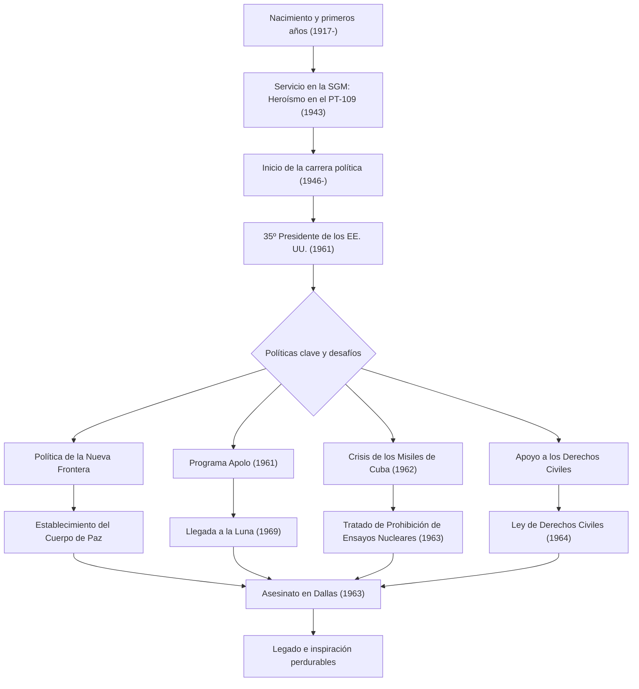

John Fitzgerald Kennedy (JFK), el 35º presidente de los Estados Unidos, fue un líder carismático que guio a la nación a través del histórico punto de inflexión de la Guerra Fría. Aunque su tiempo en el cargo fue de unos breves 1.036 días, su filosofía y sus acciones siguen inspirando a personas de todo el mundo hoy en día. Este artículo profundiza en su vida, su filosofía central y su inmenso impacto hasta el presente.

## De un entorno privilegiado a héroe de guerra

Nacido el 29 de mayo de 1917 en una acomodada familia católica irlandesa en Brookline, Massachusetts, Kennedy creció en un entorno familiar que valoraba la competencia intelectual, a pesar de ser enfermizo desde la infancia. Tras graduarse de la Universidad de Harvard, se alistó en la Marina cuando estalló la Segunda Guerra Mundial.

En 1943, la lancha torpedera "PT-109" que comandaba chocó con un destructor japonés y se hundió, colocándolo en una crisis desesperada. Sin embargo, a pesar de estar herido, lideró a sus subordinados y nadó varios kilómetros hasta una isla en un heroico rescate. Esta experiencia se convirtió en el punto de partida de su "espíritu indomable" y "juicio sereno" ante las crisis nacionales que enfrentaría más tarde.

## Defendiendo la "Nueva Frontera" y asumiendo la presidencia

Después de la guerra, motivado por la muerte de su hermano mayor Joseph en combate, Kennedy comenzó su camino como político, sirviendo como Representante y Senador antes de presentarse a las elecciones presidenciales de 1960. Utilizando hábilmente el nuevo medio de los debates televisivos, derrotó por un estrecho margen a Richard Nixon para ser elegido como el presidente más joven y el primer católico en la historia.

Sus palabras en su discurso de investidura, "No preguntes qué puede hacer tu país por ti, pregunta qué puedes hacer tú por tu país", resonaron fuertemente en el pueblo estadounidense, especialmente en los jóvenes. Propuso la política de la "Nueva Frontera", abordando con valentía problemas nacionales no resueltos como la erradicación de la pobreza, la mejora de la educación y la abolición de la discriminación racial.

## Gestión de crisis en la Guerra Fría: La Crisis de los Misiles de Cuba

La mayor prueba de la administración Kennedy fue la "Crisis de los Misiles de Cuba" que ocurrió en octubre de 1962. Cuando se descubrió que la Unión Soviética estaba construyendo bases de misiles nucleares en Cuba, el mundo se situó al borde de la Tercera Guerra Mundial, una guerra nuclear a gran escala.

Mientras que los militares abogaban fuertemente por medidas de línea dura como ataques aéreos o la invasión de Cuba, Kennedy eligió la medida moderada pero firme de un bloqueo naval. Tras tensos intercambios de cartas y negociaciones entre bastidores con el primer ministro soviético Jrushchov, la Unión Soviética acordó retirar los misiles. Resolver esta crisis pacíficamente demostró su extraordinario autocontrol y su creencia en el diálogo.

## El Programa Apolo: La nueva frontera del espacio

La mentalidad orientada al futuro de Kennedy está mejor simbolizada por su desafío a la exploración espacial. En 1961, declaró un magnífico objetivo ante el Congreso: "antes de que termine esta década, lograr que un hombre aterrice en la Luna y regrese a salvo a la Tierra" (el Programa Apolo).

Aunque parecía un objetivo imprudente dado el nivel tecnológico de la época, inspiró a la nación diciendo: "Elegimos ir a la Luna en esta década y hacer las otras cosas, no porque sean fáciles, sino porque son difíciles". Esta decisión fue más allá de una mera carrera espacial durante la Guerra Fría, generando una ola masiva de innovación que empujó el potencial humano al límite. El sueño que imaginó se hizo realidad en 1969, después de su muerte, con el alunizaje del Apolo 11.

## Final trágico e impacto duradero

El 22 de noviembre de 1963, mientras hacía campaña en Dallas, Texas, Kennedy fue abatido por la bala de un asesino. El repentino asesinato trajo profundo dolor y conmoción no solo a Estados Unidos sino al mundo entero, marcando el fin de una era.

Sin embargo, su legado no se desvaneció. Su fuerte apoyo al movimiento por los derechos civiles culminó en la aprobación de la Ley de Derechos Civiles de 1964 bajo la administración de Johnson que le sucedió. Además, el "Cuerpo de Paz" (Peace Corps), establecido para apoyar a las naciones en desarrollo, sigue siendo una base para muchos jóvenes estadounidenses que son voluntarios en todo el mundo en la actualidad.

En el centro de la filosofía de Kennedy había un delicado equilibrio entre el "idealismo" y los "enfoques realistas". Aunque deseaba la paz, mantuvo un fuerte poder militar y adoptó activamente nuevas tecnologías e ideas sin miedo al cambio.
En las "nuevas fronteras modernas" a las que nos enfrentamos hoy en día (como el cambio climático, los conflictos internacionales y el rápido avance tecnológico), su espíritu de "desafiar lo desconocido" y de "solidaridad cívica" pueden servir como una brújula vital.

## Gráfico de correlación de la vida y los logros de Kennedy

El siguiente diagrama muestra los eventos clave en la vida de Kennedy y cómo sus políticas se conectaron con su legado perdurable.

John F. Kennedy no era un hombre perfecto, pero era un líder que encarnaba las esperanzas de la era más brillante de Estados Unidos. Las palabras y la visión que dejó siguen impulsando hacia adelante a todos aquellos que creen en un futuro mejor, trascendiendo el tiempo.
