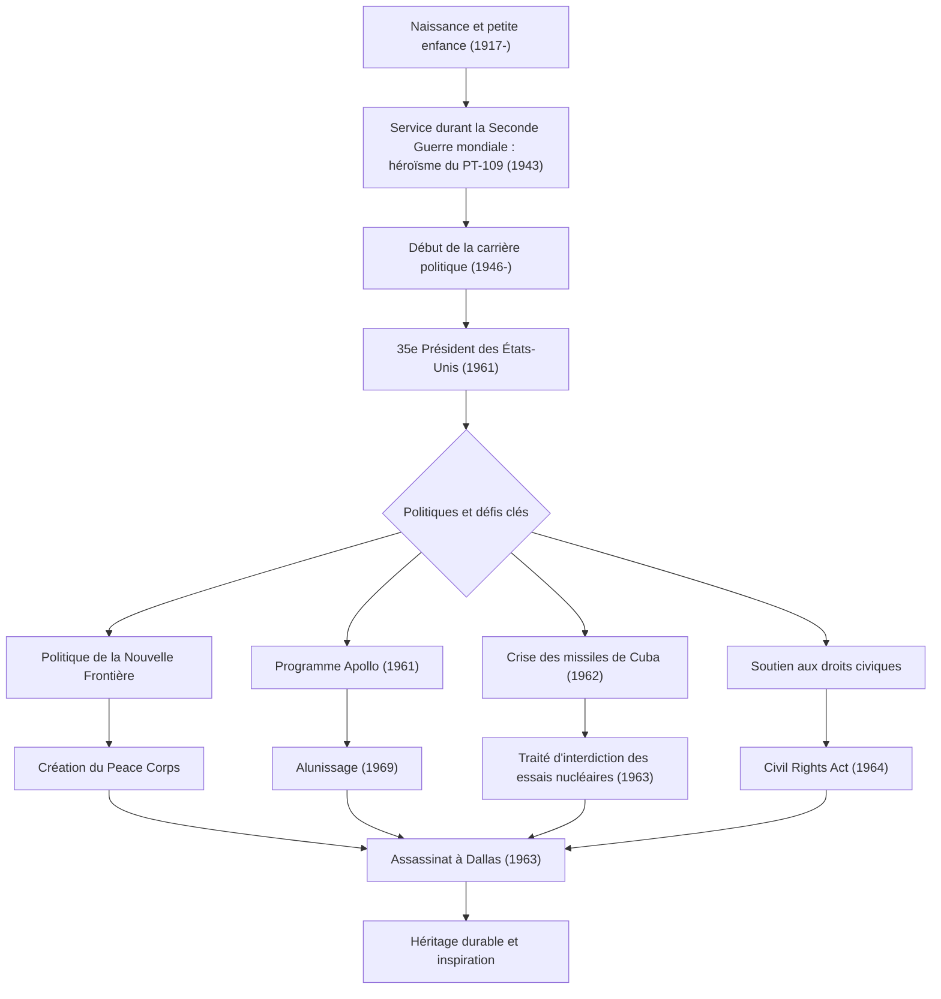

John Fitzgerald Kennedy (JFK), le 35e président des États-Unis, était un leader charismatique qui a guidé la nation à travers le tournant historique de la guerre froide. Bien que son mandat n'ait duré que 1 036 jours, sa philosophie et ses actions continuent d'inspirer les peuples du monde entier aujourd'hui. Cet article se penche sur sa vie, sa philosophie fondamentale et son impact incommensurable jusqu'à nos jours.

## D'un milieu privilégié à un héros de guerre

Né le 29 mai 1917 dans une riche famille catholique irlandaise à Brookline, dans le Massachusetts, Kennedy a grandi dans un environnement familial qui valorisait la compétition intellectuelle, bien qu'il ait été de santé fragile depuis son enfance. Après avoir obtenu son diplôme de l'Université Harvard, il a rejoint la marine lorsque la Seconde Guerre mondiale a éclaté.

En 1943, le torpilleur « PT-109 » qu'il commandait est entré en collision avec un destroyer japonais et a coulé, le plaçant dans une situation critique. Cependant, bien que blessé, il a dirigé ses subordonnés et a nagé sur plusieurs kilomètres jusqu'à une île lors d'un sauvetement héroïque. Cette expérience est devenue le point de départ de son « esprit indomptable » et de son « jugement serein » face aux crises nationales qu'il allait rencontrer plus tard.

## La promotion de la « Nouvelle Frontière » et l'accession à la présidence

Après la guerre, poussé par la mort au combat de son frère aîné Joseph, Kennedy a commencé son parcours en tant que politicien, servant comme représentant et sénateur avant de se présenter aux élections présidentielles de 1960. Utilisant habilement le nouveau média des débats télévisés, il a battu de justesse Richard Nixon pour être élu le plus jeune et le premier président catholique de l'histoire.

Les mots de son discours d'investiture, « Ne demandez pas ce que votre pays peut faire pour vous, demandez ce que vous pouvez faire pour votre pays », ont fortement résonné auprès du peuple américain, en particulier de la jeunesse. Il a proposé la politique de la « Nouvelle Frontière », s'attaquant avec audace à des problèmes nationaux non résolus tels que l'éradication de la pauvreté, l'amélioration de l'éducation et l'abolition de la discrimination raciale.

## La gestion des crises pendant la guerre froide : la crise des missiles de Cuba

La plus grande épreuve de l'administration Kennedy a été la « crise des missiles de Cuba » qui a eu lieu en octobre 1962. Lorsqu'il a été découvert que l'Union soviétique construisait des bases de missiles nucléaires à Cuba, le monde s'est retrouvé au bord de la Troisième Guerre mondiale, une guerre nucléaire à grande échelle.

Alors que l'armée prônait fortement des mesures radicales telles que des frappes aériennes ou l'invasion de Cuba, Kennedy a choisi la mesure mesurée mais ferme d'un blocus naval. Après des échanges de lettres tendus et des négociations en coulisses avec le Premier ministre soviétique Khrouchtchev, l'Union soviétique a accepté de retirer les missiles. La résolution pacifique de cette crise a prouvé son extraordinaire maîtrise de soi et sa croyance dans le dialogue.

## Le programme Apollo : la nouvelle frontière de l'espace

L'état d'esprit tourné vers l'avenir de Kennedy est le mieux symbolisé par son défi à l'exploration spatiale. En 1961, il a déclaré un objectif magnifique devant le Congrès : « avant la fin de cette décennie, de faire atterrir un homme sur la lune et de le ramener sain et sauf sur la terre » (le programme Apollo).

Bien que cela semblait être un objectif irréfléchi compte tenu du niveau technologique de l'époque, il a inspiré la nation en déclarant : « Nous choisissons d'aller sur la lune au cours de cette décennie et d'accomplir d'autres choses encore, non pas parce qu'elles sont faciles, mais bien parce qu'elles sont difficiles. » Cette décision est allée au-delà d'une simple course à l'espace pendant la guerre froide, générant une vague d'innovation massive qui a repoussé les limites du potentiel humain. Le rêve qu'il avait imaginé est devenu réalité en 1969, après sa mort, avec l'alunissage d'Apollo 11.

## Une fin tragique et un impact durable

Le 22 novembre 1963, alors qu'il faisait campagne à Dallas, au Texas, Kennedy a été abattu par la balle d'un assassin. Cet assassinat soudain a provoqué un profond chagrin et une onde de choc non seulement en Amérique, mais dans le monde entier, marquant la fin d'une époque.

Cependant, son héritage ne s'est pas effacé. Son fort soutien au mouvement des droits civiques a culminé avec l'adoption du Civil Rights Act de 1964 sous l'administration Johnson qui lui a succédé. En outre, le « Peace Corps », créé pour soutenir les pays en développement, reste aujourd'hui un pilier pour de nombreux jeunes Américains qui font du bénévolat dans le monde entier.

Au cœur de la philosophie de Kennedy, il y avait un équilibre délicat entre « idéalisme » et « approches réalistes ». Tout en désirant la paix, il a maintenu une puissance militaire forte et a activement adopté les nouvelles technologies et idées sans craindre le changement.
Dans les « nouvelles frontières modernes » auxquelles nous sommes confrontés aujourd'hui — comme le changement climatique, les conflits internationaux et le développement technologique rapide —, son esprit de « défi de l'inconnu » et de « solidarité civique » peut servir de boussole vitale.

## Diagramme de corrélation de la vie et des réalisations de Kennedy

Le diagramme ci-dessous montre les événements clés de la vie de Kennedy et comment ses politiques se sont liées à son héritage durable.

John F. Kennedy n'était pas un homme parfait, mais il était un leader qui incarnait les espoirs de l'époque la plus brillante de l'Amérique. Les mots et la vision qu'il a laissés derrière lui continuent de pousser en avant tous ceux qui croient en un avenir meilleur, transcendant le temps.
