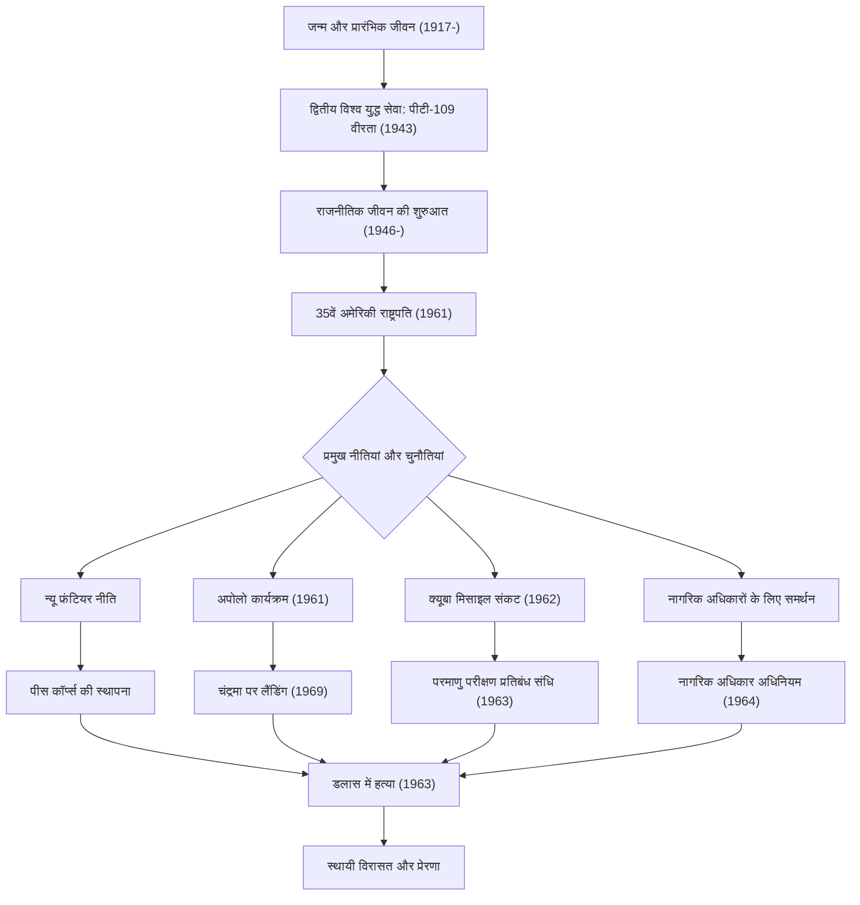

जॉन फिट्ज़राल्ड कैनेडी (जेएफके), संयुक्त राज्य अमेरिका के 35वें राष्ट्रपति, एक करिश्माई नेता थे जिन्होंने शीत युद्ध के ऐतिहासिक मोड़ के दौरान देश का मार्गदर्शन किया। हालांकि उनका कार्यकाल केवल 1,036 दिनों का छोटा था, उनका दर्शन और कार्य आज भी दुनिया भर के लोगों को प्रेरित करते हैं। यह लेख उनके जीवन, उनके मूल दर्शन, और वर्तमान समय तक उनके असीम प्रभाव की गहराई से पड़ताल करता है।

## एक संपन्न पृष्ठभूमि से युद्ध नायक तक

29 मई 1917 को मैसाचुसेट्स के ब्रुकलाइन में एक धनी आयरिश कैथोलिक परिवार में जन्मे कैनेडी, बचपन से बीमार रहने के बावजूद, एक ऐसे पारिवारिक माहौल में पले-बढ़े जो बौद्धिक प्रतिस्पर्धा को महत्व देता था। हार्वर्ड विश्वविद्यालय से स्नातक होने के बाद, द्वितीय विश्व युद्ध छिड़ने पर वह नौसेना में शामिल हो गए।

1943 में, उनके नेतृत्व वाली टॉरपीडो नाव "पीटी-109" एक जापानी विध्वंसक से टकराकर डूब गई, जिससे वे एक हताश संकट में पड़ गए। हालांकि, घायल होने के बावजूद, उन्होंने अपने अधीनस्थों का नेतृत्व किया और एक वीरतापूर्ण बचाव में कई किलोमीटर दूर एक द्वीप तक तैरकर पहुंचे। यह अनुभव बाद में आने वाले राष्ट्रीय संकटों के सामने उनकी "अदम्य भावना" और "शांत निर्णय" का प्रारंभिक बिंदु बन गया।

## "न्यू फ्रंटियर" की वकालत और राष्ट्रपति पद ग्रहण

युद्ध के बाद, अपने बड़े भाई जोसेफ की युद्ध में मृत्यु से प्रेरित होकर, कैनेडी ने एक राजनेता के रूप में अपना रास्ता शुरू किया। 1960 के राष्ट्रपति चुनाव में दौड़ने से पहले उन्होंने एक प्रतिनिधि और सीनेटर के रूप में कार्य किया। टेलीविज़न बहसों के नए माध्यम का कुशलतापूर्वक उपयोग करते हुए, उन्होंने रिचर्ड निक्सन को मामूली अंतर से हराया और इतिहास में सबसे कम उम्र के और पहले कैथोलिक राष्ट्रपति के रूप में चुने गए।

उनके उद्घाटन भाषण में उनके शब्द, "यह मत पूछो कि तुम्हारा देश तुम्हारे लिए क्या कर सकता है—यह पूछो कि तुम अपने देश के लिए क्या कर सकते हो," ने अमेरिकी लोगों, विशेष रूप से युवाओं को गहराई से प्रभावित किया। उन्होंने "न्यू फ्रंटियर" नीति का प्रस्ताव दिया, जिसमें गरीबी उन्मूलन, शिक्षा को बढ़ाना, और नस्लीय भेदभाव को समाप्त करने जैसे अनसुलझे घरेलू मुद्दों से बहादुरी से निपटा गया।

## शीत युद्ध में संकट प्रबंधन: क्यूबा मिसाइल संकट

कैनेडी प्रशासन की सबसे बड़ी परीक्षा अक्टूबर 1962 में उत्पन्न "क्यूबा मिसाइल संकट" था। जब यह पता चला कि सोवियत संघ क्यूबा में परमाणु मिसाइल बेस बना रहा है, तो दुनिया तीसरे विश्व युद्ध, यानी पूर्ण पैमाने पर परमाणु युद्ध के कगार पर खड़ी हो गई।

जबकि सेना ने क्यूबा पर हवाई हमले या आक्रमण जैसे कठोर कदमों की पुरजोर वकालत की, कैनेडी ने नौसैनिक नाकाबंदी का संयमित लेकिन दृढ़ उपाय चुना। सोवियत प्रीमियर ख्रुश्चेव के साथ पत्रों के तनावपूर्ण आदान-प्रदान और पर्दे के पीछे की बातचीत के बाद, सोवियत संघ मिसाइलों को हटाने के लिए सहमत हो गया। इस संकट को शांतिपूर्ण ढंग से सुलझाना उनके असाधारण आत्म-संयम और बातचीत में विश्वास को साबित करता है।

## अपोलो कार्यक्रम: अंतरिक्ष का नया फ्रंटियर

कैनेडी की भविष्योन्मुखी मानसिकता उनके अंतरिक्ष अन्वेषण की चुनौती से सबसे अच्छी तरह से परिलक्षित होती है। 1961 में, उन्होंने कांग्रेस के समक्ष एक शानदार लक्ष्य की घोषणा की: "इस दशक के समाप्त होने से पहले, एक मनुष्य को चंद्रमा पर उतारने और उसे सुरक्षित रूप से पृथ्वी पर वापस लाने का।" (अपोलो कार्यक्रम)।

हालांकि उस समय के तकनीकी स्तर को देखते हुए यह एक लापरवाह लक्ष्य लग रहा था, उन्होंने यह कहते हुए देश को प्रेरित किया, "हम इस दशक में चंद्रमा पर जाने और अन्य काम करने का विकल्प चुनते हैं, इसलिए नहीं कि वे आसान हैं, बल्कि इसलिए कि वे कठिन हैं।" यह निर्णय शीत युद्ध के दौरान केवल एक अंतरिक्ष दौड़ से परे था, जिसने नवाचार की एक बड़ी लहर पैदा की जिसने मानवीय क्षमता को उसकी सीमा तक धकेल दिया। उनके द्वारा देखा गया सपना उनकी मृत्यु के बाद 1969 में अपोलो 11 के चंद्रमा पर उतरने के साथ हकीकत बन गया।

## दुखद अंत और स्थायी प्रभाव

22 नवंबर, 1963 को, डलास, टेक्सास में प्रचार करते समय, कैनेडी को एक हत्यारे की गोली मार दी गई। इस अचानक हुई हत्या ने न केवल अमेरिका बल्कि पूरी दुनिया में गहरा दुख और सदमा पहुँचाया, और एक युग का अंत कर दिया।

हालांकि, उनकी विरासत (लीगेसी) फीकी नहीं पड़ी। नागरिक अधिकार आंदोलन के लिए उनके मजबूत समर्थन के परिणामस्वरूप उनके उत्तराधिकारी जॉनसन के प्रशासन के तहत 1964 का नागरिक अधिकार अधिनियम पारित हुआ। इसके अलावा, विकासशील देशों का समर्थन करने के लिए स्थापित "पीस कॉर्प्स", आज भी दुनिया भर में स्वेच्छा से काम करने वाले कई युवा अमेरिकियों के लिए एक आधार बना हुआ है।

कैनेडी के दर्शन के मूल में "आदर्शवाद" और "यथार्थवादी दृष्टिकोण" का एक नाजुक संतुलन था। शांति की कामना करते हुए भी, उन्होंने एक मजबूत सैन्य शक्ति बनाए रखी और बदलाव के डर के बिना नई तकनीकों और विचारों को सक्रिय रूप से अपनाया।
आज हम जिन "आधुनिक नए फ्रंटियर्स" का सामना कर रहे हैं - जैसे जलवायु परिवर्तन, अंतर्राष्ट्रीय संघर्ष, और तेजी से तकनीकी विकास - उसमें उनका "अज्ञात को चुनौती देने" और "नागरिक एकजुटता" का सार एक महत्वपूर्ण मार्गदर्शक बन सकता है।

## कैनेडी के जीवन और उपलब्धियों का सहसंबंध चार्ट

नीचे दिया गया आरेख कैनेडी के जीवन की प्रमुख घटनाओं और उनकी नीतियां उनकी स्थायी विरासत से कैसे जुड़ी हैं, इसे दर्शाता है।

जॉन एफ. कैनेडी एक परिपूर्ण व्यक्ति नहीं थे, लेकिन वे एक ऐसे नेता थे जिन्होंने अमेरिका के सबसे उज्ज्वल युग की उम्मीदों को मूर्त रूप दिया। उनके द्वारा छोड़े गए शब्द और दृष्टिकोण समय से परे, बेहतर भविष्य में विश्वास करने वाले सभी लोगों को आगे बढ़ने के लिए प्रेरित करते रहते हैं।
