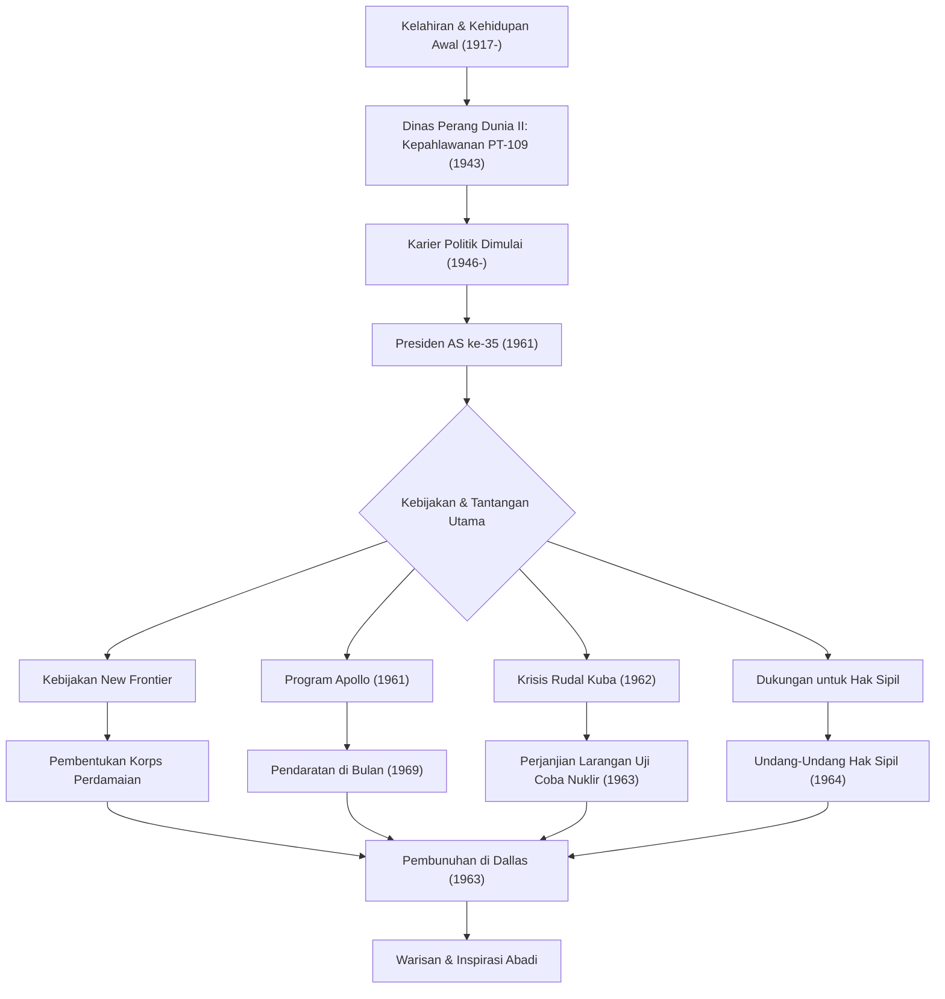

John Fitzgerald Kennedy (JFK), Presiden Amerika Serikat ke-35, adalah seorang pemimpin karismatik yang membimbing bangsa melalui titik balik bersejarah Perang Dingin. Meskipun masa jabatannya singkat, hanya 1.036 hari, filosofi dan tindakannya terus menginspirasi orang-orang di seluruh dunia hingga saat ini. Artikel ini menggali lebih dalam kehidupan, filosofi inti, dan dampaknya yang tak terukur hingga saat ini.

## Dari Latar Belakang Istimewa hingga Menjadi Pahlawan Perang

Lahir pada 29 Mei 1917, dari keluarga Katolik Irlandia yang kaya di Brookline, Massachusetts, Kennedy tumbuh dalam lingkungan keluarga yang menghargai kompetisi intelektual, meskipun ia sering sakit sejak kecil. Setelah lulus dari Universitas Harvard, ia bergabung dengan Angkatan Laut saat Perang Dunia II pecah.

Pada tahun 1943, kapal torpedo "PT-109" yang dikomandoinya bertabrakan dengan kapal perusak Jepang dan tenggelam, menempatkannya dalam krisis yang putus asa. Namun, meskipun terluka, ia memimpin bawahannya dan berenang beberapa kilometer ke sebuah pulau dalam penyelamatan heroik. Pengalaman ini menjadi titik awal dari "semangat gigih" dan "penilaian tenang"-nya dalam menghadapi krisis nasional yang akan dihadapinya kelak.

## Mengadvokasi "New Frontier" dan Mengemban Jabatan Presiden

Setelah perang, didorong oleh kematian kakak laki-lakinya, Joseph, dalam pertempuran, Kennedy memulai jalannya sebagai politisi, melayani sebagai Perwakilan dan Senator sebelum mencalonkan diri dalam pemilihan presiden 1960. Dengan terampil memanfaatkan media baru yaitu debat televisi, ia dengan tipis mengalahkan Richard Nixon untuk terpilih sebagai presiden termuda dan Katolik pertama dalam sejarah.

Kata-katanya dalam pidato pelantikannya, "Jangan tanyakan apa yang dapat negara Anda lakukan untuk Anda—tanyakan apa yang dapat Anda lakukan untuk negara Anda," sangat bergema di hati rakyat Amerika, terutama para pemuda. Ia mengusulkan kebijakan "New Frontier", dengan berani mengatasi masalah-masalah dalam negeri yang belum terselesaikan seperti pemberantasan kemiskinan, peningkatan pendidikan, dan penghapusan diskriminasi rasial.

## Manajemen Krisis di Era Perang Dingin: Krisis Rudal Kuba

Ujian terbesar pemerintahan Kennedy adalah "Krisis Rudal Kuba" yang terjadi pada Oktober 1962. Ketika diketahui bahwa Uni Soviet sedang membangun pangkalan rudal nuklir di Kuba, dunia berada di ambang Perang Dunia III, perang nuklir skala penuh.

Sementara militer sangat mendukung langkah-langkah garis keras seperti serangan udara atau invasi ke Kuba, Kennedy memilih langkah menahan diri namun tegas berupa blokade laut. Setelah pertukaran surat yang tegang dan negosiasi di balik layar dengan Perdana Menteri Soviet Khrushchev, Uni Soviet setuju untuk menyingkirkan rudal-rudal tersebut. Menyelesaikan krisis ini secara damai membuktikan pengendalian diri yang luar biasa dan keyakinannya pada dialog.

## Program Apollo: Perbatasan Baru di Luar Angkasa

Pola pikir berorientasi masa depan Kennedy paling baik disimbolkan oleh tantangannya terhadap eksplorasi luar angkasa. Pada tahun 1961, ia mendeklarasikan tujuan luar biasa kepada Kongres: "sebelum dekade ini berakhir, mendaratkan manusia di bulan dan mengembalikannya dengan selamat ke bumi" (Program Apollo).

Meskipun tampaknya merupakan tujuan yang sembrono mengingat tingkat teknologi pada masa itu, ia menginspirasi bangsa dengan mengatakan, "Kami memilih untuk pergi ke bulan dalam dekade ini dan melakukan hal-hal lain, bukan karena hal-hal tersebut mudah, tetapi karena hal-hal tersebut sulit." Keputusan ini melampaui sekadar perlombaan luar angkasa selama Perang Dingin, menghasilkan gelombang besar inovasi yang mendorong potensi manusia hingga batasnya. Impian yang ia bayangkan menjadi kenyataan pada tahun 1969, setelah kematiannya, dengan pendaratan Apollo 11 di bulan.

## Akhir Tragis dan Dampak Abadi

Pada 22 November 1963, saat berkampanye di Dallas, Texas, Kennedy tertembak peluru pembunuh. Pembunuhan mendadak itu membawa kesedihan dan keterkejutan mendalam tidak hanya bagi Amerika tetapi juga bagi seluruh dunia, menandai akhir dari sebuah era.

Namun, warisan (legacy) yang ia tinggalkan tidak memudar. Dukungan kuatnya terhadap gerakan hak-hak sipil berpuncak pada pengesahan Undang-Undang Hak Sipil tahun 1964 di bawah pemerintahan penggantinya, Johnson. Selanjutnya, "Korps Perdamaian" (Peace Corps), yang didirikan untuk mendukung negara-negara berkembang, tetap menjadi dasar bagi banyak anak muda Amerika yang menjadi sukarelawan di seluruh dunia saat ini.

Inti dari filosofi Kennedy adalah keseimbangan yang halus antara "idealisme" dan "pendekatan realistis". Meskipun menginginkan perdamaian, ia mempertahankan kekuatan militer yang kuat dan secara aktif merangkul teknologi dan ide baru tanpa takut akan perubahan.
Dalam "perbatasan baru modern" yang kita hadapi saat ini—seperti perubahan iklim, konflik internasional, dan kemajuan teknologi yang pesat—semangatnya dalam "menantang hal yang tidak diketahui" dan "solidaritas sipil" dapat berfungsi sebagai kompas yang vital.

## Bagan Korelasi Kehidupan dan Prestasi Kennedy

Diagram di bawah ini menunjukkan peristiwa-peristiwa penting dalam kehidupan Kennedy dan bagaimana kebijakannya terhubung dengan warisannya yang abadi.

John F. Kennedy bukanlah manusia yang sempurna, namun ia adalah pemimpin yang mewujudkan harapan-harapan di era paling cemerlang Amerika. Kata-kata dan visi yang ia tinggalkan terus mendorong maju semua orang yang percaya pada masa depan yang lebih baik, melampaui waktu.
