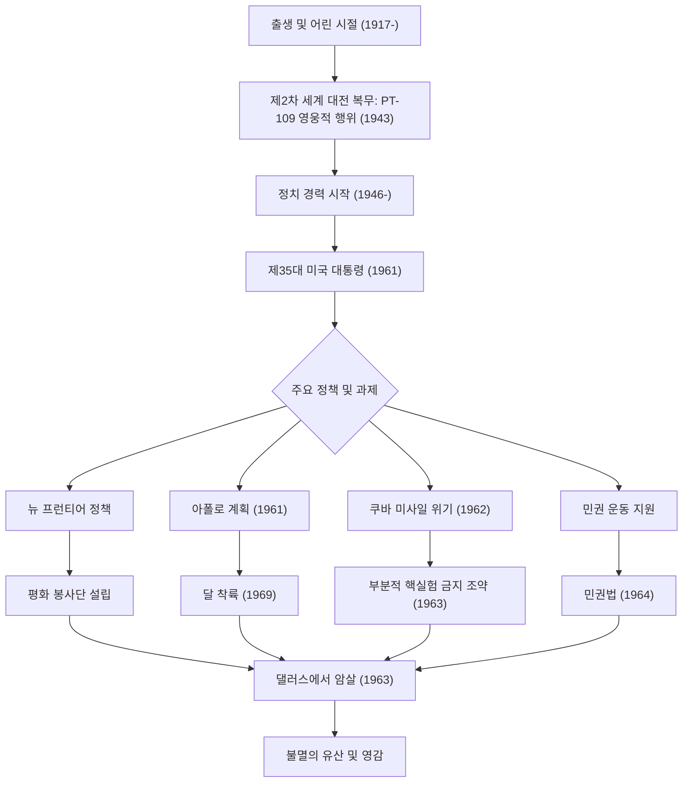

미국 제35대 대통령인 존 피츠제럴드 케네디(JFK)는 냉전이라는 역사적 전환기에서 국가를 이끈 카리스마 넘치는 지도자였습니다. 그의 재임 기간은 불과 1,036일이라는 짧은 기간이었지만, 그의 철학과 행동은 오늘날에도 전 세계 사람들에게 계속해서 영감을 주고 있습니다. 이 기사에서는 그의 생애, 핵심 철학, 그리고 현대에 이르기까지 헤아릴 수 없는 영향에 대해 깊이 파헤쳐 봅니다.

## 유복한 배경에서 전쟁 영웅으로

1917년 5월 29일, 매사추세츠주 브루클라인의 유복한 아일랜드계 가톨릭 가정에서 태어난 케네디는 어린 시절부터 병약했지만, 지적인 경쟁을 중시하는 가정 환경에서 자랐습니다. 하버드 대학교를 졸업한 후 제2차 세계 대전이 발발하자 해군에 입대했습니다.

1943년, 그가 지휘하던 어뢰정 'PT-109'가 일본 구축함과 충돌하여 침몰하는 절체절명의 위기에 빠집니다. 그러나 그는 부상을 입었음에도 불구하고 부하들을 이끌고 수 킬로미터 떨어진 섬까지 헤엄쳐 가는 영웅적인 구출극을 벌였습니다. 이 경험은 훗날 그가 직면하게 될 국가적 위기 속에서 '불굴의 정신'과 '냉철한 판단력'의 원점이 되었습니다.

## '뉴 프런티어' 제창과 대통령 취임

전쟁 후, 형 조셉의 전사를 계기로 정치인의 길을 걷기 시작한 케네디는 하원의원, 상원의원을 거쳐 1960년 대통령 선거에 출마합니다. 텔레비전 토론회라는 새로운 미디어를 교묘하게 활용하여 리처드 닉슨을 근소한 차이로 누르고 역사상 가장 젊고 최초의 가톨릭 신자 대통령으로 선출되었습니다.

그의 취임 연설 중 "국가가 여러분을 위해 무엇을 할 수 있는지 묻지 말고, 여러분이 국가를 위해 무엇을 할 수 있는지 물어보십시오"라는 말은 미국 국민, 특히 젊은이들의 마음에 강하게 울려 퍼졌습니다. 그는 '뉴 프런티어'라는 정책을 내걸고 빈곤 퇴치, 교육의 질 향상, 인종 차별 철폐 등 국내의 미해결 과제에 과감하게 도전했습니다.

## 냉전 하의 위기 관리: 쿠바 미사일 위기

케네디 행정부의 가장 큰 시련은 1962년 10월에 발생한 '쿠바 미사일 위기'였습니다. 소련이 쿠바에 핵미사일 기지를 건설하고 있다는 사실이 발각되면서, 세계는 제3차 세계 대전, 즉 전면 핵전쟁의 벼랑 끝에 섰습니다.

군부에서는 쿠바에 대한 공습이나 침공을 강경하게 주장했지만, 케네디는 해상 봉쇄라는 절제되면서도 단호한 조치를 선택합니다. 소련의 흐루쇼프 서기장과의 긴박한 서한 교환과 물밑 협상 끝에, 소련은 미사일 철거에 합의했습니다. 이 위기를 평화롭게 해결한 것은 그의 뛰어난 자제력과 대화에 대한 신념을 증명하는 것이었습니다.

## 아폴로 계획: 우주라는 새로운 프런티어

케네디의 미래 지향성을 가장 잘 상징하는 것은 우주 개발에 대한 도전입니다. 1961년 그는 "1960년대가 끝나기 전에 인간을 달에 착륙시키고 안전하게 지구로 귀환시키겠다"는 웅장한 목표를 연방 의회에서 선언했습니다(아폴로 계획).

당시의 기술 수준으로는 무모하게 보일 수 있는 목표였지만, 그는 "그것이 쉽기 때문이 아니라 어렵기 때문에 하는 것이다"라며 국민을 고무시켰습니다. 이 결정은 냉전 하의 단순한 우주 경쟁의 틀을 넘어 인류의 가능성을 극한까지 넓히는 거대한 혁신의 물결을 만들어 냈습니다. 그가 그렸던 꿈은 그가 죽은 후인 1969년 아폴로 11호의 달 착륙으로 현실이 되었습니다.

## 비극적인 최후와 후세에 미친 영향

1963년 11월 22일, 텍사스주 댈러스에서 유세 중이던 케네디는 흉탄에 쓰러졌습니다. 갑작스러운 암살은 미국뿐만 아니라 전 세계에 깊은 슬픔과 충격을 안겨주었고, 한 시대의 끝을 알렸습니다.

그러나 그가 남긴 유산(레거시)은 빛바래지 않았습니다. 그가 추진했던 민권 운동에 대한 강력한 지지는 후임인 존슨 행정부 하에서 1964년 민권법 제정으로 결실을 맺었습니다. 또한 개발도상국 지원을 목적으로 설립된 '평화 봉사단(Peace Corps)'은 오늘날에도 많은 미국의 젊은이들이 전 세계에서 자원봉사 활동에 참여하는 기반이 되고 있습니다.

케네디 철학의 근저에 있었던 것은 '이상주의'와 '현실적인 접근'의 절묘한 균형입니다. 그는 평화를 원하면서도 강력한 군사력을 유지했고, 변화를 두려워하지 않고 새로운 기술이나 사상을 적극적으로 수용했습니다.
우리가 오늘날 직면하고 있는 기후 변화나 국제 분쟁, 급속한 기술 발전이라는 '현대의 뉴 프런티어'에서도 그가 보여준 '미지에 대한 도전'과 '시민의 연대' 정신은 중요한 나침반이 될 수 있을 것입니다.

## 케네디의 생애와 업적의 상관도

아래 그림은 케네디의 생애에서 중요한 사건들과 그의 정책이 어떻게 후세의 유산으로 이어졌는지를 보여줍니다.

존 F. 케네디는 완벽한 인간은 아니었지만, 미국이 가장 빛났던 시대의 희망을 대변한 지도자였습니다. 그가 남긴 말과 비전은 시대를 초월하여 더 나은 미래를 믿는 모든 사람들의 등을 계속해서 밀어주고 있습니다.
