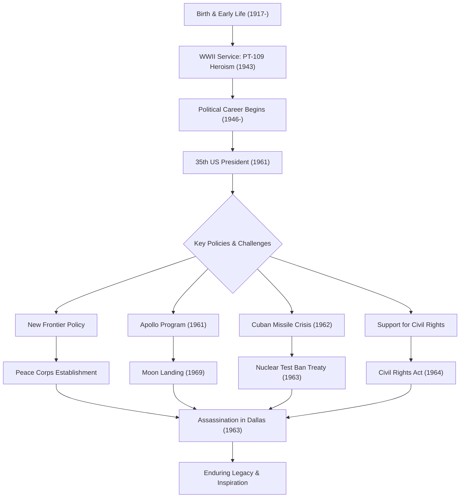

ジョン・フィッツジェラルド・ケネディ（JFK）は、アメリカ合衆国第35代大統領として、冷戦という歴史的転換期において国家を導いたカリスマ的指導者です。彼の在任期間はわずか1,036日という短いものでしたが、その哲学と行動は、今なお世界中の人々にインスピレーションを与え続けています。本記事では、彼の生涯、核となる哲学、そして現代に至るまでの計り知れない影響について深く掘り下げます。

## 恵まれた出自から戦争の英雄へ

1917年5月29日、マサチューセッツ州ブルックラインの裕福なアイルランド系カトリックの家庭に生まれたケネディは、幼少期から病弱でありながらも、知的な競争を重んじる家庭環境で育ちました。ハーバード大学を卒業後、第二次世界大戦が勃発すると海軍に入隊します。

1943年、彼が艇長を務める魚雷艇「PT-109」が日本軍の駆逐艦と衝突し沈没するという絶体絶命の危機に陥ります。しかし、彼は負傷しながらも部下を引っ張り、数キロ先の島まで泳ぎ着くという英雄的な救出劇を演じました。この経験は、後に直面する国家の危機における「不屈の精神」と「冷静な判断力」の原点となりました。

## 「ニューフロンティア」の提唱と大統領就任

戦後、兄ジョセフの戦死を受けて政治家への道を歩み始めたケネディは、下院議員、上院議員を経て、1960年の大統領選挙に出馬します。テレビ討論会という新しいメディアを巧みに活用し、リチャード・ニクソンを僅差で破り、史上最も若く、かつ初のカトリック教徒の大統領として選出されました。

大統領就任演説での「国があなたのために何ができるかを問うのではなく、あなたが国のために何ができるかを問うてほしい」という言葉は、アメリカ国民、特に若者たちの心に強く響きました。彼は「ニューフロンティア」と呼ばれる政策を掲げ、貧困の撲滅、教育の充実、そして人種差別の撤廃など、国内の未解決課題に果敢に挑みました。

## 冷戦下の危機管理：キューバ危機

ケネディ政権の最大の試練は、1962年10月に発生した「キューバ危機」です。ソビエト連邦がキューバに核ミサイル基地を建設していることが発覚し、世界は第三次世界大戦、すなわち全面核戦争の瀬戸際に立たされました。

軍部からはキューバへの空爆や侵攻を強硬に主張する声が上がりましたが、ケネディは海上封鎖という抑制された、しかし断固たる措置を選択します。ソ連のフルシチョフ書記長との緊迫した書簡のやり取りと水面下での交渉の末、ソ連はミサイル撤去に合意。この危機を平和裏に解決したことは、彼の並外れた自制心と対話への信念を証明するものでした。

## アポロ計画：宇宙という新たなフロンティア

ケネディの未来志向を最も象徴するのが、宇宙開発への挑戦です。1961年、彼は「1960年代が終わる前に、人間を月に着陸させ、安全に地球に帰還させる」という壮大な目標を連邦議会で宣言しました（アポロ計画）。

当時の技術水準では無謀とも思える目標でしたが、彼は「それが容易だからではなく、困難だからこそ行うのだ」と国民を鼓舞しました。この決断は、単なる冷戦下の宇宙競争の枠を超え、人類の可能性を極限まで押し広げる巨大なイノベーションの波を生み出しました。彼が描いた夢は、彼の死後である1969年、アポロ11号の月面着陸によって現実のものとなりました。

## 悲劇的な最期と後世への影響

1963年11月22日、テキサス州ダラスでの遊説中、ケネディは凶弾に倒れました。突然の暗殺はアメリカのみならず全世界に深い悲しみと衝撃を与え、時代の一つの終わりを告げました。

しかし、彼の残した遺産（レガシー）は色褪せることはありませんでした。彼が推進した公民権運動への強力な支持は、後継のジョンソン政権下で1964年の公民権法成立へと結実しました。また、発展途上国への支援を目的として設立された「平和部隊（Peace Corps）」は、今もなお多くのアメリカの若者が世界中でボランティア活動に従事する基盤となっています。

ケネディの哲学の根底にあったのは、「理想主義」と「現実的なアプローチ」の絶妙なバランスです。彼は平和を願いながらも強大な軍事力を維持し、変化を恐れずに新しい技術や思想を積極的に取り入れました。
私たちが今日直面する気候変動や国際紛争、急速なテクノロジーの発展といった「現代のニューフロンティア」においても、彼の示した「未知への挑戦」と「市民の連帯」の精神は、重要な羅針盤となり得るでしょう。

## ケネディの生涯と功績の相関図

以下の図は、ケネディの生涯における重要な出来事と、彼の政策がいかにして後世のレガシーへと繋がっていったかを示しています。

ジョン・F・ケネディは、完璧な人間ではありませんでしたが、アメリカが最も輝いていた時代の希望を体現したリーダーでした。彼の遺した言葉やビジョンは、時代を超えて、より良い未来を信じるすべての人々の背中を押し続けています。
