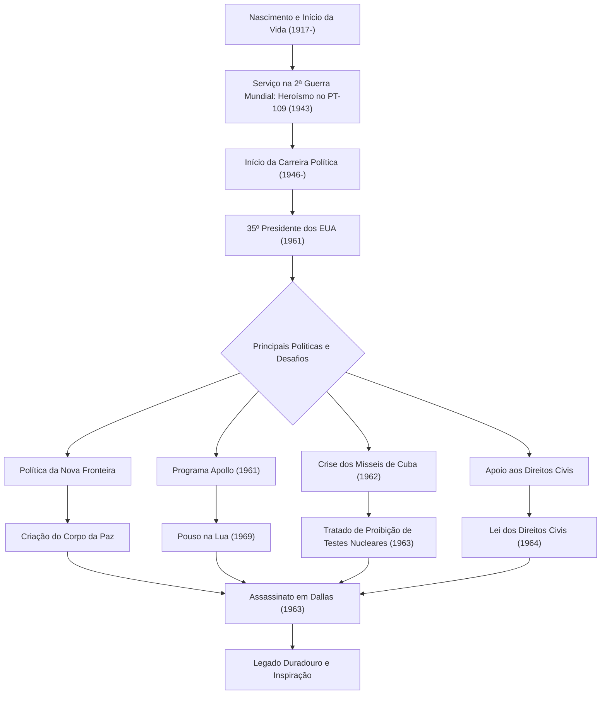

John Fitzgerald Kennedy (JFK), o 35º Presidente dos Estados Unidos, foi um líder carismático que guiou a nação através do ponto de virada histórico da Guerra Fria. Embora seu tempo no cargo tenha sido um breve período de 1.036 dias, sua filosofia e ações continuam a inspirar pessoas ao redor do mundo hoje. Este artigo investiga sua vida, sua filosofia central e seu impacto imensurável até os dias atuais.

## De uma Origem Privilegiada a Herói de Guerra

Nascido em 29 de maio de 1917, em uma rica família católica irlandesa em Brookline, Massachusetts, Kennedy cresceu em um ambiente familiar que valorizava a competição intelectual, apesar de ser doentio desde a infância. Depois de se formar na Universidade de Harvard, ele ingressou na Marinha quando estourou a Segunda Guerra Mundial.

Em 1943, o barco torpedeiro "PT-109" que ele comandava colidiu com um contratorpedeiro japonês e afundou, colocando-o em uma crise desesperadora. No entanto, apesar de ferido, ele liderou seus subordinados e nadou vários quilômetros até uma ilha em um resgate heroico. Essa experiência se tornou o ponto de partida de seu "espírito indomável" e "julgamento calmo" diante das crises nacionais que ele enfrentaria mais tarde.

## Defendendo a "Nova Fronteira" e Assumindo a Presidência

Após a guerra, impulsionado pela morte de seu irmão mais velho Joseph em combate, Kennedy iniciou seu caminho como político, servindo como Deputado e Senador antes de concorrer nas eleições presidenciais de 1960. Utilizando habilmente o novo meio dos debates na televisão, ele derrotou Richard Nixon por uma margem estreita para ser eleito o presidente mais jovem e o primeiro católico da história.

Suas palavras em seu discurso de posse: "Não pergunte o que seu país pode fazer por você - pergunte o que você pode fazer por seu país", ressoaram fortemente no povo americano, especialmente na juventude. Ele propôs a política da "Nova Fronteira", abordando corajosamente questões domésticas não resolvidas, como a erradicação da pobreza, a melhoria da educação e a abolição da discriminação racial.

## Gestão de Crises na Guerra Fria: A Crise dos Mísseis de Cuba

A maior provação do governo Kennedy foi a "Crise dos Mísseis de Cuba", ocorrida em outubro de 1962. Quando se descobriu que a União Soviética estava construindo bases de mísseis nucleares em Cuba, o mundo ficou à beira da Terceira Guerra Mundial, uma guerra nuclear em grande escala.

Enquanto os militares defendiam fortemente medidas de linha dura, como ataques aéreos ou invasão de Cuba, Kennedy escolheu a medida contida, porém firme, de um bloqueio naval. Após trocas tensas de cartas e negociações de bastidores com o primeiro-ministro soviético Khrushchev, a União Soviética concordou em remover os mísseis. Resolver esta crise pacificamente provou seu extraordinário autocontrole e crença no diálogo.

## O Programa Apollo: A Nova Fronteira do Espaço

A mentalidade voltada para o futuro de Kennedy é mais bem simbolizada pelo seu desafio à exploração espacial. Em 1961, ele declarou um objetivo magnífico ao Congresso: "antes que esta década termine, pousar um homem na Lua e trazê-lo de volta à Terra em segurança" (o Programa Apollo).

Embora parecesse um objetivo imprudente dado o nível tecnológico da época, ele inspirou a nação dizendo: "Nós escolhemos ir à Lua nesta década e fazer as outras coisas, não porque sejam fáceis, mas porque são difíceis". Esta decisão foi além de uma mera corrida espacial durante a Guerra Fria, gerando uma enorme onda de inovação que empurrou o potencial humano ao limite. O sonho que ele imaginou tornou-se realidade em 1969, após sua morte, com o pouso da Apollo 11 na Lua.

## Fim Trágico e Impacto Duradouro

Em 22 de novembro de 1963, enquanto fazia campanha em Dallas, Texas, Kennedy foi atingido pela bala de um assassino. O assassinato repentino trouxe profunda tristeza e choque não apenas para a América, mas para todo o mundo, marcando o fim de uma era.

No entanto, o seu legado não desapareceu. Seu forte apoio ao movimento dos direitos civis culminou na aprovação da Lei dos Direitos Civis de 1964 sob o governo sucessor de Johnson. Além disso, o "Corpo da Paz", estabelecido para apoiar nações em desenvolvimento, continua sendo uma base para muitos jovens americanos voluntários em todo o mundo hoje.

No cerne da filosofia de Kennedy havia um delicado equilíbrio entre "idealismo" e "abordagens realistas". Embora desejasse a paz, manteve um forte poder militar e adotou ativamente novas tecnologias e ideias sem medo de mudanças.
Nas "novas fronteiras modernas" que enfrentamos hoje - tais como as alterações climáticas, os conflitos internacionais e o rápido avanço tecnológico - o seu espírito de "desafiar o desconhecido" e de "solidariedade cívica" pode servir como uma bússola vital.

## Gráfico de Correlação da Vida e Conquistas de Kennedy

O diagrama abaixo mostra os principais eventos na vida de Kennedy e como suas políticas se conectaram ao seu legado duradouro.

John F. Kennedy não foi um homem perfeito, mas foi um líder que personificou as esperanças da era mais brilhante da América. As palavras e a visão que ele deixou para trás continuam a impulsionar todos aqueles que acreditam num futuro melhor, transcendendo o tempo.
