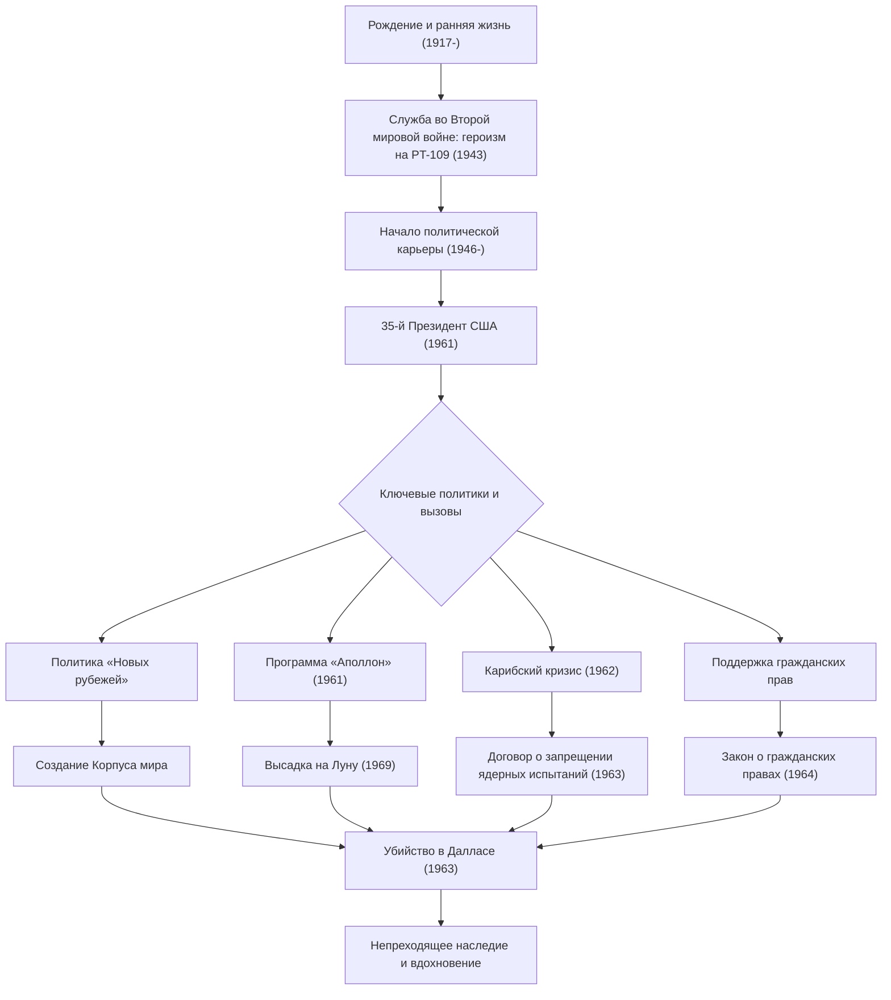

Джон Фицджеральд Кеннеди (JFK), 35-й президент США, был харизматичным лидером, который вел нацию через исторический поворотный момент холодной войны. Хотя его срок пребывания в должности составил всего 1036 дней, его философия и действия продолжают вдохновлять людей по всему миру и сегодня. В этой статье подробно рассматривается его жизнь, его основная философия и его неизмеримое влияние на сегодняшний день.

## От привилегированного происхождения до героя войны

Родившийся 29 мая 1917 года в богатой ирландской католической семье в Бруклайне, штат Массачусетс, Кеннеди вырос в семейной атмосфере, которая ценила интеллектуальную конкуренцию, несмотря на то, что с детства он был болезненным. После окончания Гарвардского университета он пошел служить во флот, когда началась Вторая мировая война.

В 1943 году торпедный катер «PT-109», которым он командовал, столкнулся с японским эсминцем и затонул, что поставило его в отчаянное положение. Однако, несмотря на ранение, он возглавил своих подчиненных и проплыл несколько километров до острова в ходе героического спасения. Этот опыт стал отправной точкой его «неукротимого духа» и «спокойного суждения» перед лицом национальных кризисов, с которыми он столкнется позже.

## Защита «Новых рубежей» и вступление в должность президента

После войны, побуждаемый гибелью своего старшего брата Джозефа в бою, Кеннеди начал свой путь политика, работая представителем и сенатором до того, как баллотироваться на президентских выборах 1960 года. Умело используя новую среду телевизионных дебатов, он с небольшим перевесом победил Ричарда Никсона и был избран самым молодым и первым президентом-католиком в истории.

Его слова в инаугурационной речи: «Не спрашивайте, что ваша страна может сделать для вас, — спросите, что вы можете сделать для своей страны», нашли сильный отклик у американского народа, особенно у молодежи. Он предложил политику «Новых рубежей», смело решая нерешенные внутренние проблемы, такие как искоренение бедности, улучшение образования и отмена расовой дискриминации.

## Антикризисное управление в холодной войне: Карибский кризис

Величайшим испытанием для администрации Кеннеди стал «Карибский кризис», разразившийся в октябре 1962 года. Когда выяснилось, что Советский Союз строит базы ядерных ракет на Кубе, мир оказался на пороге Третьей мировой войны, полномасштабной ядерной войны.

В то время как военные настойчиво выступали за жесткие меры, такие как авиаудары или вторжение на Кубу, Кеннеди выбрал сдержанную, но твердую меру — военно-морскую блокаду. После напряженного обмена письмами и закулисных переговоров с советским премьером Хрущевым Советский Союз согласился убрать ракеты. Мирное разрешение этого кризиса доказало его необычайное самообладание и веру в диалог.

## Программа «Аполлон»: новые рубежи космоса

Ориентированное на будущее мышление Кеннеди лучше всего символизирует его призыв к освоению космоса. В 1961 году он объявил Конгрессу грандиозную цель: «до конца этого десятилетия высадить человека на Луну и благополучно вернуть его на Землю» (программа «Аполлон»).

Хотя это казалось безрассудной целью, учитывая технологический уровень того времени, он вдохновил нацию, сказав: «Мы решаем лететь на Луну в этом десятилетии и делать другие вещи не потому, что они легки, а потому, что они трудны». Это решение вышло за рамки простой космической гонки во время холодной войны, породив огромную волну инноваций, которая расширила человеческий потенциал до предела. Мечта, которую он предвидел, стала реальностью в 1969 году, после его смерти, с высадкой на Луну Аполлона-11.

## Трагический конец и долговечное влияние

22 ноября 1963 года, во время предвыборной кампании в Далласе, штат Техас, Кеннеди был сражен пулей убийцы. Внезапное убийство принесло глубокую скорбь и шок не только Америке, но и всему миру, ознаменовав конец эпохи.

Однако его наследие не угасло. Его решительная поддержка движения за гражданские права завершилась принятием Закона о гражданских правах 1964 года при сменившей его администрации Джонсона. Кроме того, «Корпус мира», созданный для поддержки развивающихся стран, остается фундаментом для многих молодых американцев, которые сегодня работают волонтерами по всему миру.

В основе философии Кеннеди лежал тонкий баланс между «идеализмом» и «реалистичными подходами». Желая мира, он поддерживал сильную военную мощь и активно внедрял новые технологии и идеи, не боясь перемен.
На «современных новых рубежах», с которыми мы сталкиваемся сегодня — таких как изменение климата, международные конфликты и быстрое технологическое развитие, — его дух «вызова неизвестному» и «гражданской солидарности» может служить жизненно важным компасом.

## Схема взаимосвязи жизни и достижений Кеннеди

Приведенная ниже диаграмма показывает ключевые события в жизни Кеннеди и то, как его политика связана с его прочным наследием.

Джон Ф. Кеннеди не был идеальным человеком, но он был лидером, воплотившим надежды самой яркой эпохи Америки. Слова и видение, которые он оставил после себя, продолжают двигать вперед всех тех, кто верит в лучшее будущее, преодолевая время.
