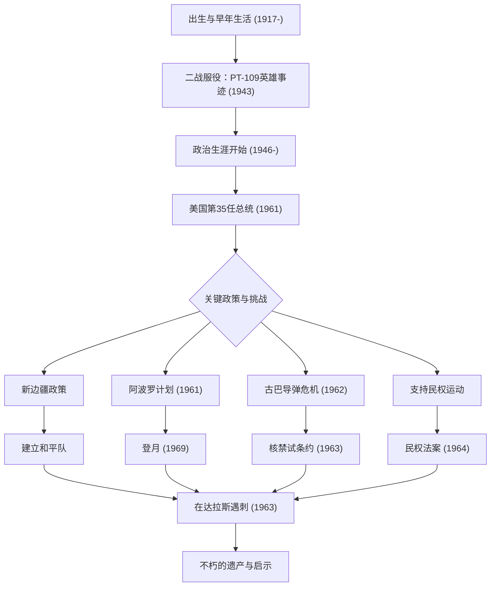

约翰·菲茨杰拉德·肯尼迪（JFK）作为美国第35任总统，是在冷战这一历史转折点领导国家的魅力型领袖。虽然他的任期只有短暂的1036天，但他的哲学和行动至今仍不断激励着世界各地的人们。本文将深入探讨他的生平、核心哲学以及对现代的深远影响。

## 从优越出身到战争英雄

1917年5月29日，肯尼迪出生于马萨诸塞州布鲁克莱恩的一个富裕的爱尔兰裔天主教家庭。尽管从小体弱多病，他却在一个重视智力竞争的家庭环境中长大。从哈佛大学毕业后，第二次世界大战爆发，他加入了海军。

1943年，他指挥的“PT-109”鱼雷艇与日军驱逐舰相撞并沉没，使他陷入了绝境。然而，尽管受了伤，他仍带领部下，游了数公里到达一个岛屿，上演了一场英雄般的救援。这次经历成为了他日后在面临国家危机时展现“不屈精神”和“冷静判断力”的起点。

## 倡导“新边疆”与就任总统

战后，受哥哥约瑟夫战死的影响，肯尼迪开始步入政界，历任众议员和参议员，并于1960年竞选总统。他巧妙地利用电视辩论这一新媒体，以微弱优势击败理查德·尼克松，成为历史上最年轻且首位信奉天主教的总统。

他在就职演说中的名言：“不要问你的国家能为你做些什么，而要问你能为你的国家做些什么”，引起了美国民众特别是年轻人的强烈共鸣。他提出了被称为“新边疆”的政策，勇敢地挑战了消除贫困、改善教育以及废除种族歧视等国内未解决的问题。

## 冷战下的危机管理：古巴导弹危机

肯尼迪政府面临的最大考验是1962年10月爆发的“古巴导弹危机”。随着苏联在古巴建立核导弹基地被发现，世界站在了第三次世界大战，即全面核战争的边缘。

尽管军方强烈主张对古巴进行空袭或入侵，肯尼迪却选择了海上封锁这一克制但坚决的措施。在与苏联领导人赫鲁晓夫进行了紧张的信件往来和私下谈判后，苏联同意撤除导弹。这场危机的和平解决证明了他非凡的自制力和对对话的信念。

## 阿波罗计划：太空的新边疆

最能象征肯尼迪面向未来思维的是他对太空探索的挑战。1961年，他在国会宣布了一个宏伟的目标：“在1960年代结束之前，把人送上月球，并安全返回地球”（阿波罗计划）。

虽然在当时的技术水平下这似乎是一个鲁莽的目标，但他激励国民说：“我们决定在这个十年间登月并实现其他目标，不是因为它们容易，而是因为它们困难。”这一决定超越了冷战时期单纯的太空竞赛的范畴，引发了一场将人类潜力推向极限的巨大创新浪潮。他描绘的梦想在他去世后的1969年，随着阿波罗11号登月而成为现实。

## 悲惨的结局与后世影响

1963年11月22日，肯尼迪在德克萨斯州达拉斯进行竞选活动时被暗杀。这起突如其来的暗杀不仅给美国，也给全世界带来了深沉的悲痛和震惊，宣告了一个时代的结束。

然而，他留下的遗产（Legacy）并未褪色。他对民权运动的强力支持，在继任的约翰逊政府下促成了1964年《民权法案》的通过。此外，旨在援助发展中国家的“和平队（Peace Corps）”至今仍是许多美国青年在世界各地从事志愿服务的平台。

肯尼迪哲学的根本，在于“理想主义”与“现实方法”的绝妙平衡。他在渴望和平的同时保持了强大的军事力量，并毫不畏惧改变，积极拥抱新技术和新思想。
在我们今天面临气候变化、国际冲突和技术快速发展等“现代新边疆”时，他展现出的“挑战未知”和“公民团结”精神，将成为重要的指南针。

## 肯尼迪生平与成就相关图

下图展示了肯尼迪一生中的重要事件，以及他的政策如何转化为后世的遗产。

约翰·F·肯尼迪并不是一个完美的人，但他是一位体现了美国最辉煌时代希望的领袖。他留下的言辞和愿景跨越时代，继续推动着所有相信美好未来的人们前行。
