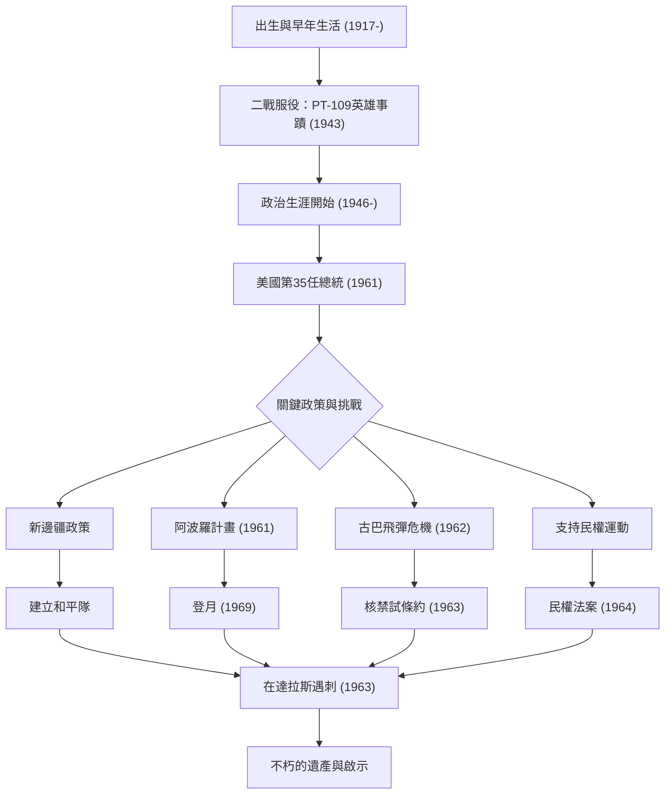

約翰·費茲傑羅·甘迺迪（JFK）作為美國第35任總統，是在冷戰這一歷史轉折點領導國家的魅力型領袖。雖然他的任期只有短暫的1036天，但他的哲學和行動至今仍不斷激勵著世界各地的人們。本文將深入探討他的生平、核心哲學以及對現代的深遠影響。

## 從優越出身到戰爭英雄

1917年5月29日，甘迺迪出生於麻薩諸塞州布魯克萊恩的一個富裕的愛爾蘭裔天主教家庭。儘管從小體弱多病，他卻在一個重視智力競爭的家庭環境中長大。從哈佛大學畢業後，第二次世界大戰爆發，他加入了海軍。

1943年，他指揮的「PT-109」魚雷艇與日軍驅逐艦相撞並沉沒，使他陷入了絕境。然而，儘管受了傷，他仍帶領部下，游了數公里到達一個島嶼，上演了一場英雄般的救援。這次經歷成為了他日後在面臨國家危機時展現「不屈精神」和「冷靜判斷力」的起點。

## 倡導「新邊疆」與就任總統

戰後，受哥哥約瑟夫戰死的影響，甘迺迪開始步入政界，歷任眾議員和參議員，並於1960年競選總統。他巧妙地利用電視辯論這一新媒體，以微弱優勢擊敗理查·尼克森，成為歷史上最年輕且首位信奉天主教的總統。

他在就職演說中的名言：「不要問你的國家能為你做些什麼，而要問你能為你的國家做些什麼」，引起了美國民眾特別是年輕人的強烈共鳴。他提出了被稱為「新邊疆」的政策，勇敢地挑戰了消除貧困、改善教育以及廢除種族歧視等國內未解決的問題。

## 冷戰下的危機管理：古巴飛彈危機

甘迺迪政府面臨的最大考驗是1962年10月爆發的「古巴飛彈危機」。隨著蘇聯在古巴建立核飛彈基地被發現，世界站在了第三次世界大戰，即全面核戰爭的邊緣。

儘管軍方強烈主張對古巴進行空襲或入侵，甘迺迪卻選擇了海上封鎖這一克制但堅決的措施。在與蘇聯領導人赫魯雪夫進行了緊張的信件往來和私下談判後，蘇聯同意撤除飛彈。這場危機的和平解決證明了他非凡的自制力和對對話的信念。

## 阿波羅計畫：太空的新邊疆

最能象徵甘迺迪面向未來思維的是他對太空探索的挑戰。1961年，他在國會宣布了一個宏偉的目標：「在1960年代結束之前，把人送上月球，並安全返回地球」（阿波羅計畫）。

雖然在當時的技術水平下這似乎是一個魯莽的目標，但他激勵國民說：「我們決定在這個十年間登月並實現其他目標，不是因為它們容易，而是因為它們困難。」這一決定超越了冷戰時期單純的太空競賽的範疇，引發了一場將人類潛力推向極限的巨大創新浪潮。他描繪的夢想在他去世後的1969年，隨著阿波羅11號登月而成為現實。

## 悲慘的結局與後世影響

1963年11月22日，甘迺迪在德州達拉斯進行競選活動時被暗殺。這起突如其來的暗殺不僅給美國，也給全世界帶來了深沉的悲痛和震驚，宣告了一個時代的結束。

然而，他留下的遺產（Legacy）並未褪色。他對民權運動的強力支持，在繼任的詹森政府下促成了1964年《民權法案》的通過。此外，旨在援助開發中國家的「和平隊（Peace Corps）」至今仍是許多美國青年在世界各地從事志願服務的平台。

甘迺迪哲學的根本，在於「理想主義」與「現實方法」的絕妙平衡。他在渴望和平的同時保持了強大的軍事力量，並毫不畏懼改變，積極擁抱新技術和新思想。
在我們今天面臨氣候變遷、國際衝突和技術快速發展等「現代新邊疆」時，他展現出的「挑戰未知」和「公民團結」精神，將成為重要的指南針。

## 甘迺迪生平與成就相關圖

下圖展示了甘迺迪一生中的重要事件，以及他的政策如何轉化為後世的遺產。

約翰·F·甘迺迪並不是一個完美的人，但他是一位體現了美國最輝煌時代希望的領袖。他留下的言辭和願景跨越時代，繼續推動著所有相信美好未來的人們前行。
