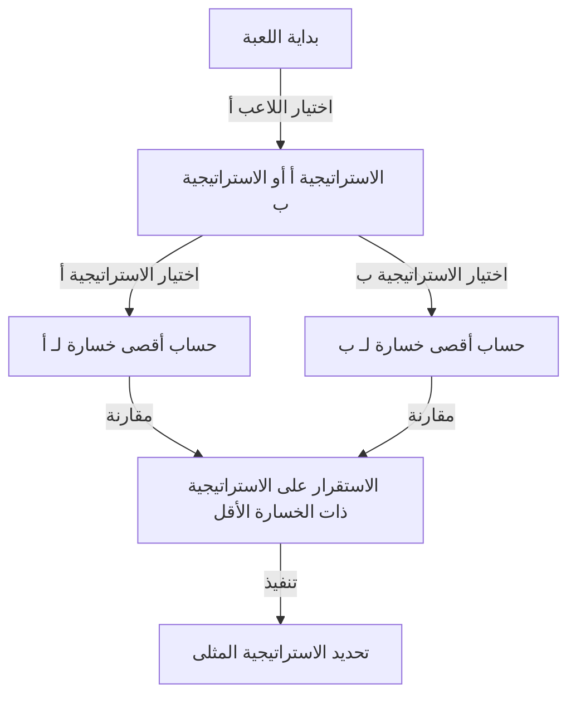
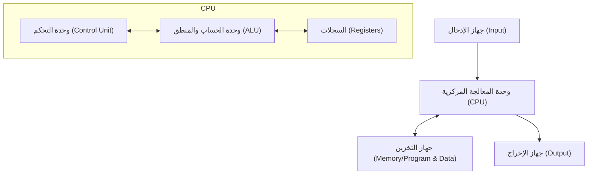

# مقدمة: الرجل الذي كان يُخشى منه كـ "مريخي"

على مر التاريخ البشري، كان هناك العديد من الأفراد الذين أُطلق عليهم لقب "عباقرة". فقد أظهرت شخصيات عظيمة مثل ألبرت أينشتاين، وإسحاق نيوتن، وليوناردو دافنشي مواهب فذة في مجالات محددة. ومع ذلك، يُقال إن عالمًا معينًا عاش في القرن العشرين كان يمتلك "ذكاءً من بُعد آخر" يفوقهم جميعًا. ذلك الرجل هو [جون فون نيومان](/ar/p/von-neumann/) (1903 - 1957).

كان دماغه يفوق البشر لدرجة أن زملائه العلماء كانوا يتهامسون مازحين بأنه "مريخي يتظاهر بأنه إنسان" أو أن لديه "دماغ شيطان". وهناك العديد من الحكايات حتى عن حائزين على جائزة نوبل أدركوا حدود عقولهم أمام فون نيومان ولم يكن لديهم خيار سوى التصرف كالأطفال.

سيتعمق هذا المقال قدر الإمكان في كيفية رعاية "دماغ الشيطان" هذا وكيف أنشأ أسس جميع جوانب المجتمع الحديث (أجهزة الكمبيوتر، وميكانيكا الكم، ونظرية الألعاب، والأسلحة النووية، وما إلى ذلك)، مستكشفًا حياته الشرسة وإنجازاته الساحقة.

## الفصل الأول: ولادة معجزة والمعجزة المجرية

### عائلة يهودية ثرية في بودابست
وُلد جون فون نيومان (اسم الولادة: نيومان يانوش لاجوس) في 28 ديسمبر 1903، في بودابست، عاصمة الإمبراطورية النمساوية المجرية. كان والده، نيومان ميكسا، مصرفيًا ناجحًا امتلك لاحقًا الثروة والمكانة التي أهلته للحصول على لقب نبالة (فون). أصبحت هذه البيئة الثرية التربة المثالية لتزدهر مواهب فون نيومان غير العادية.

### ذاكرة لا تُصدق وقدرة على الحساب
برزت طبيعة فون نيومان كطفل معجزة منذ سن مبكرة.
- في سن **6 سنوات**، كان بإمكانه حساب عمليات القسمة المكونة من 8 أرقام بالكامل في رأسه ويمزح مع والده باللغة اليونانية القديمة.
- في سن **8 سنوات**، فهم تمامًا واستخدم مفاهيم التفاضل والتكامل.
- في سن **10 سنوات**، يُقال إنه قرأ جميع المجلدات الـ 44 من "تاريخ العالم" لفيلهلم أونكن وكان بإمكانه تلاوتها حرفيًا. هذه الذاكرة، التي يمكن وصفها بالذاكرة الفوتوغرافية، أصبحت سلاحه القوي طوال حياته.

### تجمع "المريخيين"
في بودابست في ذلك الوقت، كانت المواهب اليهودية البارزة تولد واحدة تلو الأخرى جنبًا إلى جنب مع فون نيومان. وشمل هؤلاء يوجين ويغنر (جائزة نوبل في الفيزياء)، وإدوارد تيلر (أبو القنبلة الهيدروجينية)، وليو زيلارد (صاحب براءة اختراع المفاعل النووي). انتقلوا لاحقًا إلى الولايات المتحدة وأصبحوا يُعرفون باسم "المريخيين" بسبب عقولهم المتميزة. كان فون نيومان الأبرز بين هؤلاء "المريخيين"، لدرجة أنهم اعترفوا بأنفسهم، "فون نيومان وحده هو الذي يمكن أن يُطلق عليه حقًا لقب عبقري."

## الفصل الثاني: أزمة الرياضيات وصعود العبقري الشاب

### جامعة غوتنغن وديفيد هيلبرت
مع دخوله مرحلة الشباب، درس فون نيومان الرياضيات في جامعة بودابست، والهندسة الكيميائية في وقت واحد في جامعة برلين والمعهد الفدرالي السويسري للتكنولوجيا في زيورخ (كان هذا لأن والده كان قلقًا من أنه لا يستطيع كسب لقمة العيش من الرياضيات وحدها). بعد حصوله على درجة الدكتوراه في الرياضيات في سن 22 عامًا فقط، توجه إلى جامعة غوتنغن في ألمانيا، مركز عالم الرياضيات في ذلك الوقت.

عمل هناك كمساعد لديفيد هيلبرت، السلطة المطلقة في عالم الرياضيات في ذلك الوقت. كان هيلبرت يروج لـ "برنامج هيلبرت" لإثبات "اكتمال الرياضيات واتساقها"، وانخرط فون نيومان بعمق في هذه الخطة الكبرى، وقدم مساهمات حاسمة في مجال نظرية المجموعات البديهية.

### الأسس الرياضية لميكانيكا الكم
في أواخر العشرينيات من القرن الماضي، ولدت نظرية جديدة تسمى ميكانيكا الكم في عالم الفيزياء، مما تسبب في ارتباك كبير. وقفت نظريتان جنبًا إلى جنب، "ميكانيكا المصفوفات" لفيرنر هايزنبرغ و"الميكانيكا الموجية" لإروين شرودنغر، واللتان بدتا مختلفتين تمامًا في المظهر والنهج.

هنا، أظهر فون نيومان حدسه الرياضي الساحق. باستخدام المفهوم الرياضي لـ "فضاء هيلبرت"، أثبت أن هاتين النظريتين متكافئتان رياضيًا تمامًا. لا يزال كتابه "الأسس الرياضية لميكانيكا الكم"، الذي نُشر عام 1932، يُعتبر إنجيل ميكانيكا الكم كعمل ضخم جلب نظامًا رياضيًا صارمًا لعالم الفيزياء غير المؤكد.

## الفصل الثالث: معهد الدراسات المتقدمة في برينستون وأينشتاين

### صعود النازيين والهروب إلى أمريكا
في ثلاثينيات القرن العشرين، وصل النازيون بقيادة أدولف هتلر إلى السلطة في ألمانيا، وبدأ اضطهاد اليهود. استشعر فون نيومان الأزمة، فهرب إلى أمريكا في وقت مبكر. تم دعوته إلى "معهد الدراسات المتقدمة (IAS)" الذي تم إنشاؤه حديثًا في برينستون، نيو جيرسي.

جمع هذا المعهد أعظم العقول من جميع أنحاء العالم، بما في ذلك أينشتاين وكورت غودل. أصبح فون نيومان أستاذًا متفرغًا في المعهد في سن مبكرة وهي 29 عامًا (إلى جانب أينشتاين وآخرين، كان أصغر أستاذ متفرغ).

### أسلوب لعب غير تقليدي
في برينستون، تصرف فون نيومان بشكل مختلف تمامًا عن العلماء الهادئين الآخرين. كان يحل المسائل الرياضية الصعبة بينما يستمع إلى المارشات الألمانية الصاخبة، وكان يقيم حفلات فخمة بشكل متكرر، ويقود السيارات بسرعات جنونية، وكان يحطم سيارة جديدة كل عام تقريبًا (حتى أن التقاطع الذي تسبب فيه بحوادث متكررة سُمي "تقاطع فون نيومان"). بينما كان أينشتاين يفضل حياة بسيطة ومنعزلة، كان فون نيومان يرتدي دائمًا بدلات أنيقة ويستمتع كثيرًا بالملذات الدنيوية.

## الفصل الرابع: إنشاء نظرية الألعاب ومنطق "الحرب الباردة"

### إدخال الرياضيات في الاقتصاد
لم تتوقف اهتمامات فون نيومان عند الرياضيات البحتة والفيزياء. نظرًا لولعه بالألعاب الداخلية مثل البوكر، تساءل، "هل يمكن وصف صنع القرار البشري والصراعات رياضيًا؟" كانت هذه ولادة "نظرية الألعاب".

في عام 1928، أثبت "نظرية مينيماكس". هذه النظرية تنص على أنه في أي لعبة بين طرفين متعارضين، من المنطقي التصرف بحيث يتم "تقليل الحد الأقصى للخسارة التي يمكن أن يتكبدها المرء".

### "نظرية الألعاب والسلوك الاقتصادي"
في عام 1944، نشر فون نيومان "نظرية الألعاب والسلوك الاقتصادي" مع الخبير الاقتصادي أوسكار مورغنسترن. أحدث هذا الكتاب صدمة كبيرة لدرجة أنه أعاد كتابة أسس الاقتصاد بالكامل. كانت هذه هي المرة الأولى التي يتم فيها شرح كيفية تنافس البشر وتعاونهم وتحديد الأسعار في السوق من خلال نموذج رياضي صارم.

### التدمير المتبادل المؤكد (MAD) والحرب الباردة
تم تطبيق مفهوم نظرية الألعاب على العالم الحقيقي بطرق مرعبة خلال الحرب الباردة بين الشرق والغرب بعد الحرب العالمية الثانية. كان فون نيومان، بصفته أقوى عقل للحكومة والجيش الأمريكيين، متورطًا بشدة في بناء "نظرية الردع النووي".

الاستراتيجية النهائية التي دافع عنها كانت "التدمير المتبادل المؤكد (MAD)". كان منطقًا بدم بارد حيث تقاطع الجنون والمنطق: "إذا استخدم الخصم أسلحة نووية، فسننتقم بالتأكيد وندمر الخصم تمامًا. وبسبب هذا التهديد الأكيد بالدمار، لا يستطيع أي من الجانبين استخدام الأسلحة النووية."

## الفصل الخامس: أبو الكمبيوتر الحديث

من بين إنجازات فون نيومان، الإنجاز الذي له التأثير الأكثر مباشرة وهائلة على حياتنا الحديثة هو مساهمته في علوم الكمبيوتر.

### من إينياك (ENIAC) إلى إدفاك (EDVAC)
خلال الحرب العالمية الثانية، كان الجيش الأمريكي يطور جهاز كمبيوتر إلكتروني ضخم، "إينياك (ENIAC)"، للحسابات البالستية. ومع ذلك، تطلب إينياك إعادة توصيل كمية هائلة من الكابلات في كل مرة يتم فيها تغيير برنامج الحساب (يسمى هذا طريقة لوحة التوصيل).

انضم فون نيومان إلى مشروع التطوير هذا كمستشار ورأى عيوب إينياك على الفور. اقترح فكرة ثورية: "إذا تم تخزين البرامج (التعليمات) في الذاكرة تمامًا مثل البيانات، يمكنك تبديل البرامج على الفور دون تغيير الأسلاك." هذا هو مفهوم "البرنامج المخزن".

### هندسة فون نيومان
في عام 1945، كتب "المسودة الأولى لتقرير عن EDVAC"، وحدد البنية المنطقية لهذا الكمبيوتر الجديد. هذا ما يُسمى اليوم بـ "هندسة فون نيومان".

من الهاتف الذكي الذي تستخدمه حاليًا إلى أجهزة الكمبيوتر الشخصية وأجهزة الكمبيوتر العملاقة، تعمل 100% تقريبًا من أجهزة الكمبيوتر وفقًا تمامًا للهندسة التي رسمها فون نيومان قبل 80 عامًا. ليس من قبيل المبالغة القول إن دماغه كان المنشئ الحقيقي لمجتمع تكنولوجيا المعلومات.

## الفصل السادس: مشروع مانهاتن وأفعال "الشيطان"

### حساب عدسات الانفجار الداخلي
خلال الحرب العالمية الثانية، كان فون نيومان أحد أهم الشخصيات في "مشروع مانهاتن"، وهو مشروع تطوير القنبلة الذرية الجاري في مختبر لوس ألاموس الوطني.

على وجه الخصوص، لتفجير القنبلة الذرية من نوع البلوتونيوم، كانت هناك حاجة إلى "عدسات الانفجار الداخلي" لتفجير المتفجرات بدقة من المناطق المحيطة وضغط كرة البلوتونيوم إلى أقصى حد. حل فون نيومان حسابات ديناميكيات السوائل المعقدة للغاية بقوته الحسابية الساحقة. يُقال إن القنبلة الذرية "الرجل البدين" التي أسقطت على ناغازاكي لم تكن لتكتمل لولا حسابات فون نيومان الرياضية.

### قرار لجنة الاستهداف
الأمر الأكثر رعبا، كان فون نيومان أيضا عضوا في "لجنة الاستهداف" التي قررت أين سيتم إسقاط القنابل الذرية في اليابان. ودعا بقوة إلى إسقاطها على "كيوتو" لزيادة القوة التدميرية للقنبلة الذرية إلى أقصى حد، واقترح أيضا "إسقاطها دون سابق إنذار لإظهار قوة الانفجار" (على الرغم من استبعاد كيوتو في النهاية).

هذه العقلانية الشاملة والبرود هي الأسباب التي جعلت فون نيومان يُطلق عليه "دماغ الشيطان" ويُقال إنه كان أحد نماذج الدكتور سترينجلوف (من إخراج ستانلي كوبريك).

## الفصل السابع: الآلات ذاتية التكاثر والحياة الاصطناعية

في سنواته الأخيرة، وصلت أفكار فون نيومان إلى المجال الفلسفي حول "ما هي الحياة؟" و "هل يمكن للآلات أن تتكاثر؟"

ابتكر نموذجًا رياضيًا، "الآلة الخلوية"، على شبكة (خلايا) مثل ورقة الرسم البياني، حيث تتغير حالة الخلية اعتمادًا على حالة محيطها. وأثبت تمامًا البنية المنطقية لـ "آلة يمكنها إنشاء نسخ من نفسها (آلة ذاتية التكاثر)" على هذا النموذج.

حدث هذا قبل اكتشاف الهيكل المزدوج اللولبي للحمض النووي (1953). باستخدام التفكير الرياضي البحت، تنبأ فون نيومان بالآلية الأساسية للحياة: "التكاثر الذاتي يتطلب مخططًا (يعادل الحمض النووي) وآلة لقراءته وتجميعه." أدت أبحاثه لاحقًا إلى مفاهيم الحياة الاصطناعية (ALife)، وعلوم الأنظمة المعقدة، وحتى فيروسات الكمبيوتر.

## الخاتمة: ذكاء جاء مبكرًا جدًا للبشرية

في 8 فبراير 1957، توفي [جون فون نيومان](/ar/p/von-neumann/) متأثراً بمرض السرطان في مستشفى بواشنطن العاصمة عن عمر يناهز 53 عامًا. خوفًا من أن يسرب أسرارًا عسكرية دون وعي، يُقال إن الجيش احتفظ بشرطة عسكرية متمركزة في غرفته بالمستشفى في جميع الأوقات.

استمر دماغه في العمل دون توقف حتى اللحظة الأخيرة، لكنه كان يشعر برعب شديد من فقدان ذاكرته تدريجياً مع تقدم السرطان. إن عملية تحول الرجل الذي كان بإمكانه ذات يوم حفظ كتاب كامل عن ظهر قلب إلى عاجز عن القيام بعملية جمع بسيطة كانت مشهدًا قاسيًا لأي شخص حوله.

[جون فون نيومان](/ar/p/von-neumann/). لقد تسابق وبنى أسس المجالات التي كان ينبغي أن تستغرق البشرية مئات السنين لاستكشافها - من الرياضيات والفيزياء والاقتصاد وعلم الأرصاد الجوية إلى علوم الكمبيوتر - في حياة واحدة فقط.

لأن إنجازاته متنوعة وعميقة للغاية، لا يزال من الصعب تصديق أنها أنجزت بواسطة إنسان واحد. ما إذا كان "مريخيًا" أم لا غير مؤكد، لكن مستنسخاته المسماة "هندسة فون نيومان" تستمر في الحساب دون راحة في جميع أنحاء العالم في هذه اللحظة بالذات.

هذا العالم الموجه نحو المعلومات بشكل كبير الذي نعيش فيه قد يكون مجرد استمرار للحلم الذي رآه دماغ الشيطان.
