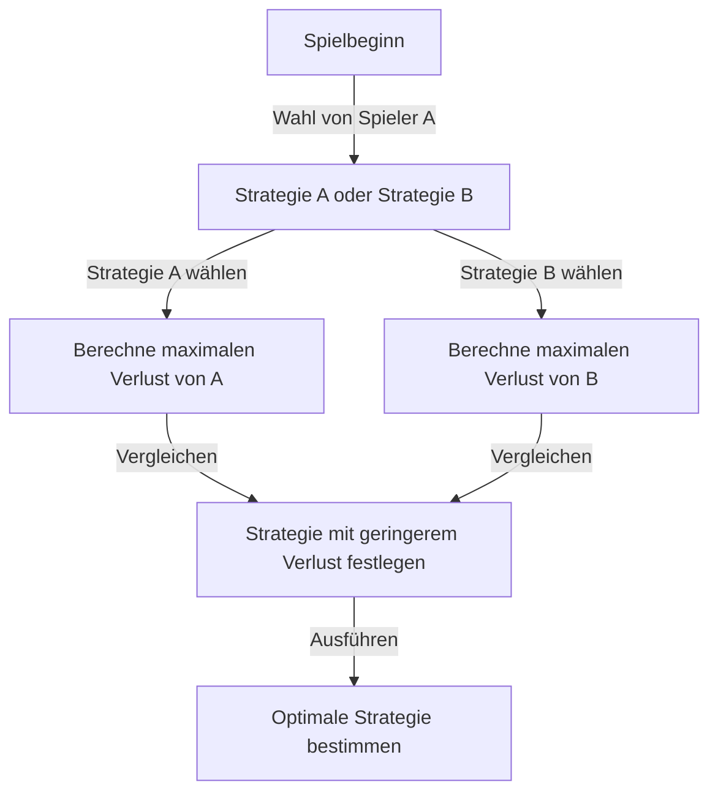
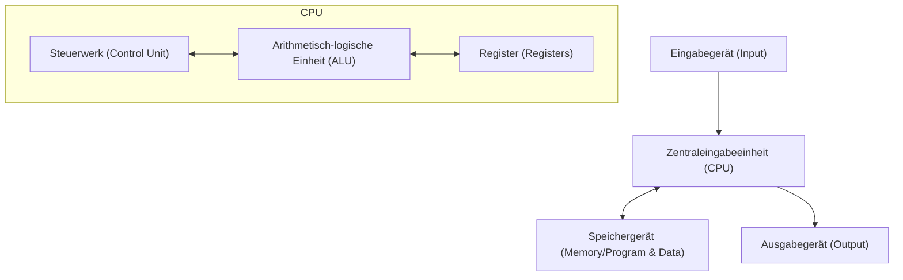

# Einleitung: Der Mann, der als "Marsianer" gefürchtet wurde

Im Laufe der Menschheitsgeschichte gab es viele Individuen, die als "Genies" bezeichnet wurden. Große Persönlichkeiten wie Albert Einstein, Isaac Newton und Leonardo da Vinci zeigten alle herausragendes Talent in bestimmten Bereichen. Es wird jedoch gesagt, dass ein bestimmter Wissenschaftler, der im 20. Jahrhundert lebte, eine "Intelligenz aus einer anderen Dimension" besaß, die sie alle übertraf. Das war John von Neumann (1903 - 1957).

Sein Gehirn war so weit jenseits des Menschlichen, dass seine wissenschaftlichen Kollegen halbscherzhaft flüsterten, er sei ein "Marsianer, der sich als Mensch ausgibt" oder habe das "Gehirn des Teufels". Es gibt viele Anekdoten darüber, dass selbst Nobelpreisträger vor von Neumann die Grenzen ihres eigenen Intellekts erkannten und keine andere Wahl hatten, als sich wie Kinder zu verhalten.

Dieser Artikel wird so tief und detailliert wie möglich untersuchen, wie dieses "Gehirn des Teufels" gefördert wurde und wie er die Grundlagen der modernen Gesellschaft (Computer, Quantenmechanik, Spieltheorie, Atomwaffen usw.) schuf, indem er sein hartes Leben und seine überwältigenden Errungenschaften beleuchtet.

## Kapitel 1: Die Geburt eines Wunderkindes und das ungarische Wunder

### Eine wohlhabende jüdische Familie in Budapest
John von Neumann (Geburtsname: Neumann János Lajos) wurde am 28. Dezember 1903 in Budapest, der Hauptstadt der österreichisch-ungarischen Monarchie, geboren. Sein Vater, Neumann Miksa, war ein erfolgreicher Bankier, der später den Reichtum und den Status hatte, um mit einem Adelstitel (von) ausgezeichnet zu werden. Dieses wohlhabende Umfeld wurde zum perfekten Nährboden für von Neumanns außergewöhnliche Talente.

### Unglaubliches Gedächtnis und Rechenfähigkeit
Von Neumanns Natur als Wunderkind stach schon in jungen Jahren hervor.
- Im Alter von **6 Jahren** konnte er achtstellige Divisionen vollständig im Kopf berechnen und scherzte mit seinem Vater auf Altgriechisch.
- Im Alter von **8 Jahren** verstand und nutzte er die Konzepte der Differential- und Integralrechnung vollständig.
- Im Alter von **10 Jahren** soll er alle 44 Bände von Wilhelm Onckens "Weltgeschichte" gelesen haben und sie Wort für Wort rezitieren können. Dieses Gedächtnis, das man als fotografisches Gedächtnis bezeichnen könnte, wurde sein ganzes Leben lang zu seiner mächtigen Waffe.

### Die Versammlung der "Marsianer"
Im damaligen Budapest wurden neben von Neumann ein herausragendes jüdisches Talent nach dem anderen geboren. Dazu gehörten Eugene Wigner (Nobelpreis für Physik), Edward Teller (Vater der Wasserstoffbombe) und Leo Szilard (Patentierer des Kernreaktors). Sie zogen später in die Vereinigten Staaten und wurden aufgrund ihres herausragenden Intellekts als "Die Marsianer" bekannt. Von Neumann war der wichtigste unter diesen "Marsianern", bis zu dem Punkt, an dem sie selbst zugaben: "Nur von Neumann kann wirklich als Genie bezeichnet werden."

## Kapitel 2: Die Krise der Mathematik und der Aufstieg des jungen Genies

### Die Universität Göttingen und David Hilbert
In seiner Jugend studierte von Neumann Mathematik an der Universität Budapest und gleichzeitig Chemieingenieurwesen an der Universität Berlin und der ETH Zürich (weil sein Vater befürchtete, er könne von der Mathematik allein nicht leben). Als er mit nur 22 Jahren in Mathematik promovierte, ging er an die Universität Göttingen in Deutschland, dem damaligen Zentrum der mathematischen Welt.

Dort diente er als Assistent von David Hilbert, der damaligen absoluten Autorität in der mathematischen Welt. Hilbert förderte das "Hilbert-Programm", um die "Vollständigkeit und Konsistenz der Mathematik" zu beweisen, und von Neumann engagierte sich zutiefst in diesem großen Plan und leistete entscheidende Beiträge auf dem Gebiet der axiomatischen Mengenlehre.

### Mathematische Grundlagen der Quantenmechanik
In den späten 1920er Jahren entstand in der Welt der Physik eine neue Theorie namens Quantenmechanik, die große Verwirrung stiftete. Zwei Theorien, Werner Heisenbergs "Matrizenmechanik" und Erwin Schrödingers "Wellenmechanik", die in Aussehen und Ansatz völlig unterschiedlich aussahen, standen Seite an Seite.

Hier bewies von Neumann seine überwältigende mathematische Intuition. Indem er das mathematische Konzept des "Hilbertraums" anwandte, bewies er, dass diese beiden Theorien mathematisch völlig äquivalent sind. Sein 1932 veröffentlichtes Buch "Mathematische Grundlagen der Quantenmechanik" gilt noch heute als die Bibel der Quantenmechanik als monumentales Werk, das in die unsichere Welt der Physik eine strenge mathematische Ordnung brachte.

## Kapitel 3: Das Institute for Advanced Study in Princeton und Einstein

### Der Aufstieg der Nazis und die Flucht nach Amerika
In den 1930er Jahren kamen in Deutschland die von Adolf Hitler geführten Nazis an die Macht, und die Verfolgung der Juden begann. Von Neumann ahnte die Krise und floh früh nach Amerika. Er wurde an das neu gegründete "Institute for Advanced Study (IAS)" in Princeton, New Jersey, eingeladen.

Dieses Institut versammelte die größten Köpfe aus der ganzen Welt, darunter Einstein und Kurt Gödel. Von Neumann wurde im jungen Alter von 29 Jahren ordentlicher Professor am Institut (zusammen mit Einstein und anderen war er der jüngste ordentliche Professor).

### Ein unorthodoxer Spielstil
In Princeton verhielt sich von Neumann völlig anders als die anderen ruhigen Gelehrten. Er löste schwierige mathematische Probleme, während er laute deutsche Märsche hörte, veranstaltete häufig rauschende Partys, fuhr Autos mit halsbrecherischer Geschwindigkeit und demolierte fast jedes Jahr ein neues Auto (die Kreuzung, an der er häufig Unfälle verursachte, wurde sogar "von-Neumann-Kreuzung" genannt). Während Einstein ein einfaches und einsames Leben bevorzugte, trug von Neumann immer tadellose Anzüge und genoss weltliche Freuden sehr.

## Kapitel 4: Die Erschaffung der Spieltheorie und die Logik des "Kalten Krieges"

### Einführung der Mathematik in die Wirtschaft
Von Neumanns Interessen beschränkten sich nicht auf die reine Mathematik und Physik. Da er Indoor-Spiele wie Poker mochte, fragte er sich: "Können menschliche Entscheidungsfindung und Konflikte mathematisch beschrieben werden?" Dies war die Geburtsstunde der "Spieltheorie".

Im Jahr 1928 bewies er das "Minimax-Theorem". Dies ist ein Theorem, das besagt, dass es in einem Spiel zwischen zwei gegnerischen Parteien rational ist, so zu handeln, dass "der maximale Verlust, den man erleiden kann, minimiert wird".

### "Spieltheorie und wirtschaftliches Verhalten"
1944 veröffentlichte von Neumann zusammen mit dem Ökonomen Oskar Morgenstern das Buch "Spieltheorie und wirtschaftliches Verhalten". Dieses Buch löste einen solchen Schock aus, dass es die Grundlagen der Wirtschaftswissenschaften komplett neu schrieb. Es war das erste Mal, dass mit einem strengen mathematischen Modell erklärt wurde, wie Menschen konkurrieren, kooperieren und Preise auf dem Markt bestimmen.

### Gegenseitig zugesicherte Zerstörung (MAD) und der Kalte Krieg
Das Konzept der Spieltheorie wurde während des Ost-West-Kalten Krieges nach dem Zweiten Weltkrieg auf erschreckende Weise auf die reale Welt angewendet. Von Neumann war als stärkstes Gehirn der US-Regierung und des Militärs tief in den Aufbau der "Theorie der nuklearen Abschreckung" involviert.

Die ultimative Strategie, die er befürwortete, war die "Mutually Assured Destruction (MAD)" (Gegenseitig zugesicherte Zerstörung). Es war eine kaltherzige Logik, in der sich Wahnsinn und Vernunft kreuzten: "Wenn der Gegner Atomwaffen einsetzt, werden wir sicherlich Vergeltung üben und den Gegner vollständig zerstören. Wegen dieser sicheren Bedrohung der Zerstörung kann keine Seite Atomwaffen einsetzen."

## Kapitel 5: Der Vater des modernen Computers

Unter den Errungenschaften von Neumanns ist diejenige, die den direktesten und immenssten Einfluss auf unser modernes Leben hat, sein Beitrag zur Informatik.

### Vom ENIAC zum EDVAC
Während des Zweiten Weltkriegs entwickelte die US-Armee einen riesigen elektronischen Computer, den "ENIAC", für ballistische Berechnungen. Der ENIAC erforderte jedoch jedes Mal, wenn das Berechnungsprogramm geändert wurde, eine massive Neuverkabelung von Kabeln (dies wird als Stecktafel-Methode bezeichnet).

Von Neumann schloss sich diesem Entwicklungsprojekt als Berater an und durchschaute sofort die Fehler des ENIAC. Er schlug eine revolutionäre Idee vor: "Wenn Programme (Anweisungen) genau wie Daten im Speicher abgelegt werden, kann man Programme sofort wechseln, ohne die Verkabelung zu ändern." Dies ist das "Stored-Program-Konzept".

### Von-Neumann-Architektur
1945 schrieb er den "First Draft of a Report on the EDVAC", in dem er die logische Struktur dieses neuen Computers definierte. Dies ist das, was man heute als "Von-Neumann-Architektur" bezeichnet.

Vom Smartphone, das Sie derzeit verwenden, bis hin zu PCs und Supercomputern arbeiten fast 100 % der Computer genau nach der Architektur, die von Neumann vor 80 Jahren entworfen hat. Es ist keine Übertreibung zu sagen, dass sein Gehirn der wahre Schöpfer der IT-Gesellschaft war.

## Kapitel 6: Das Manhattan-Projekt und die Taten des "Teufels"

### Berechnung von Implosionslinsen
Während des Zweiten Weltkriegs war von Neumann eine der wichtigsten Figuren im "Manhattan-Projekt", dem Atombombenentwicklungsprojekt, das am Los Alamos National Laboratory im Gange war.

Insbesondere zur Zündung der Plutonium-Atombombe wurden "Implosionslinsen" benötigt, um Sprengstoff präzise aus der Umgebung zur Explosion zu bringen und die Plutoniumkugel bis zum Äußersten zusammenzudrücken. Von Neumann löste diese extrem komplexe Berechnung der Fluiddynamik mit seiner überwältigenden Rechenleistung. Man sagt, dass die auf Nagasaki abgeworfene Atombombe "Fat Man" ohne von Neumanns mathematische Berechnungen nicht hätte fertiggestellt werden können.

### Entscheidung des Target Committee
Noch erschreckender war, dass von Neumann auch Mitglied des "Target Committee" war, das entschied, wo die Atombomben in Japan abgeworfen werden sollten. Er befürwortete nachdrücklich den Abwurf auf "Kyoto", um die Zerstörungskraft der Atombombe zu maximieren, und schlug außerdem vor, sie "ohne Vorwarnung abzuwerfen, um die Kraft der Explosion zu demonstrieren" (obwohl Kyoto schließlich ausgeschlossen wurde).

Dieser durchgehende Rationalismus und die Kaltherzigkeit sind die Gründe, warum von Neumann das "Gehirn des Teufels" genannt wurde und es heißt, er sei eines der Modelle für Dr. Seltsam (Regie: Stanley Kubrick) gewesen.

## Kapitel 7: Selbstreplizierende Automaten und künstliches Leben

In seinen späten Jahren erreichten von Neumanns Gedanken den philosophischen Bereich von "Was ist Leben?" und "Können Maschinen sich selbst reproduzieren?"

Er entwarf ein mathematisches Modell, den "zellulären Automaten", auf einem Gitter (Zellen) wie auf Millimeterpapier, bei dem sich der Zustand einer Zelle in Abhängigkeit vom Zustand ihrer Umgebung ändert. Und er bewies an diesem Modell vollständig die logische Struktur einer "Maschine, die Kopien von sich selbst erstellen kann (selbstreplizierender Automat)".

Dies geschah noch vor der Entdeckung der Doppelhelixstruktur der DNA (1953). Unter Verwendung rein mathematischen Denkens sagte von Neumann den grundlegenden Mechanismus des Lebens voraus: "Selbstreplikation erfordert einen Bauplan (äquivalent zur DNA) und eine Maschine, um ihn zu lesen und zusammenzusetzen." Seine Forschungen führten später zu den Konzepten des künstlichen Lebens (ALife), der Wissenschaft der komplexen Systeme und sogar zu Computerviren.

## Fazit: Eine für die Menschheit zu frühe Intelligenz

Am 8. Februar 1957 starb John von Neumann im jungen Alter von 53 Jahren in einem Krankenhaus in Washington D.C. an Krebs. Aus Angst, er könne unbewusst militärische Geheimnisse preisgeben, soll das Militär jederzeit Militärpolizei in seinem Krankenzimmer stationiert gehabt haben.

Sein Gehirn arbeitete bis zum letzten Moment ununterbrochen weiter, aber er hatte große Angst davor, mit fortschreitendem Krebs allmählich sein Gedächtnis zu verlieren. Der Prozess eines Mannes, der einst ein ganzes Buch auswendig lernen konnte und nicht einmal mehr einfache Additionen durchführen konnte, war für jeden in seiner Umgebung ein grausamer Anblick.

John von Neumann. Er durchlief und schuf die Grundlagen für Bereiche, für deren Erschließung die Menschheit Hunderte von Jahren hätte brauchen sollen – von Mathematik, Physik, Wirtschaftswissenschaften, Meteorologie bis hin zur Informatik – in nur einem einzigen Leben.

Weil seine Errungenschaften so vielfältig und tiefgreifend sind, ist es immer noch kaum zu glauben, dass sie von einem einzigen Menschen vollbracht wurden. Ob er ein "Marsianer" war oder nicht, ist ungewiss, aber seine Klone namens "Von-Neumann-Architektur" rechnen in diesem Moment auf der ganzen Welt unaufhörlich weiter.

Diese stark informationsorientierte Welt, in der wir leben, könnte genau die Fortsetzung des Traums sein, den das Gehirn des Teufels gesehen hat.
