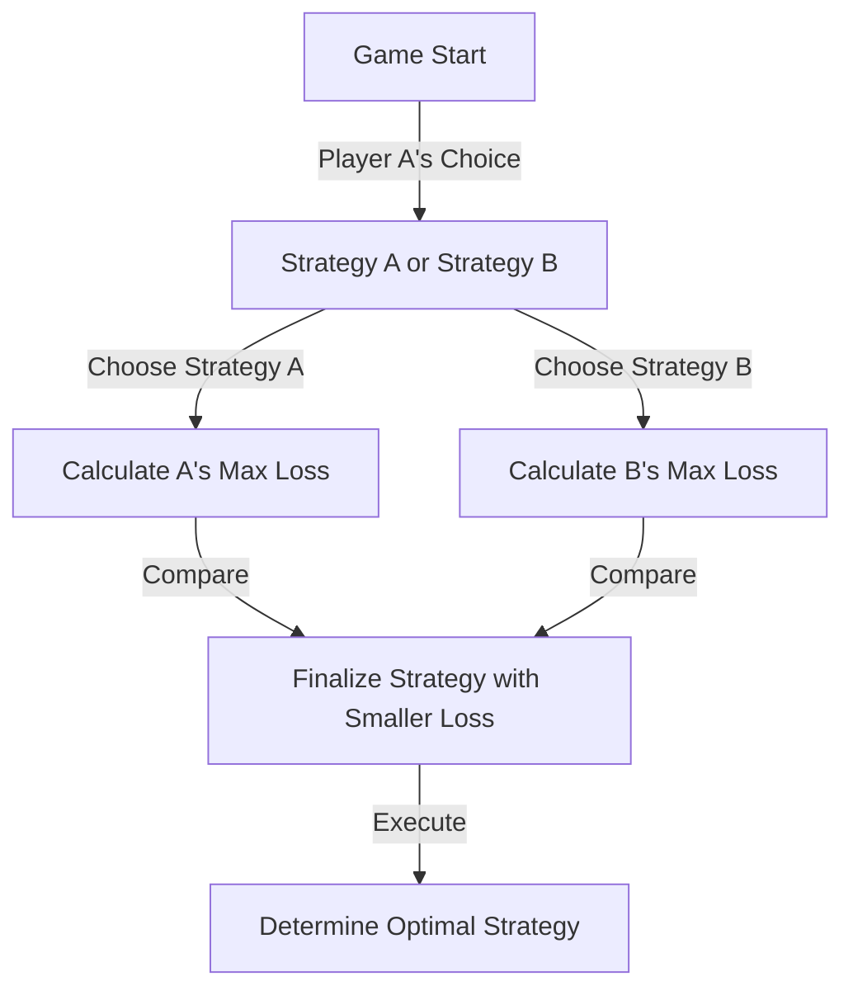
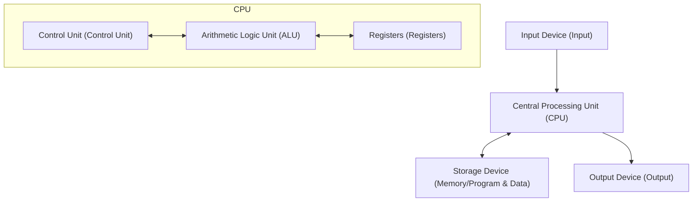

# Introduction: The Man Feared as a "Martian"

Throughout human history, there have been many individuals called "geniuses." Great figures like Albert Einstein, Isaac Newton, and Leonardo da Vinci all demonstrated outstanding talent in specific fields. However, a certain scientist who lived in the 20th century is said to have possessed an "otherworldly intelligence" that surpassed even them. That was John von Neumann (1903 - 1957).

His brain was so far beyond human that his fellow scientists half-jokingly whispered that he was a "Martian pretending to be human" or had a "Devil's Brain." There are many anecdotes of even Nobel laureates realizing the limits of their own intellects in front of von Neumann and having no choice but to act like children.

This article will dig as deeply and detailed as possible into how this "Devil's Brain" was nurtured and how he created the foundations of modern society (computers, quantum mechanics, game theory, nuclear weapons, etc.), exploring his fierce life and overwhelming achievements.

## Chapter 1: The Birth of a Prodigy and the Hungarian Miracle

### A Wealthy Jewish Family in Budapest
John von Neumann (birth name: Neumann János Lajos) was born on December 28, 1903, in Budapest, the capital of the Austro-Hungarian Empire. His father, Neumann Miksa, was a successful banker who later had the wealth and status to be awarded a title of nobility (von). This wealthy environment became the perfect soil for von Neumann's extraordinary talents to blossom.

### Incredible Memory and Calculating Ability
Von Neumann's prodigy nature stood out from an early age.
- At **age 6**, he could calculate 8-digit divisions entirely in his head and joked with his father in ancient Greek.
- At **age 8**, he fully understood and utilized the concepts of differential and integral calculus.
- At **age 10**, it is said he read all 44 volumes of Wilhelm Oncken's "World History" and could recite them word for word. This photographic memory became his powerful weapon throughout his life.

### The Gathering of the "Martians"
In Budapest at that time, outstanding Jewish talents were being born one after another alongside von Neumann. These included Eugene Wigner (Nobel Prize in Physics), Edward Teller (father of the hydrogen bomb), and Leo Szilard (patent holder for the nuclear reactor). They later moved to the United States and became known as "The Martians" due to their outstanding intellects. Von Neumann was the foremost among these "Martians," to the point where they themselves admitted, "Only von Neumann can truly be called a genius."

## Chapter 2: The Crisis of Mathematics and the Rise of the Young Genius

### The University of Göttingen and David Hilbert
Entering his youth, von Neumann studied mathematics at the University of Budapest, and chemical engineering simultaneously at the University of Berlin and ETH Zurich (this was because his father worried he couldn't make a living on mathematics alone). Earning his PhD in mathematics at just 22, he headed to the University of Göttingen in Germany, the center of the mathematical world at the time.

There he served as an assistant to David Hilbert, the absolute authority in the mathematical world at the time. Hilbert was promoting the "Hilbert Program" to prove the "completeness and consistency of mathematics," and von Neumann deeply involved himself in this grand plan, making decisive contributions in the field of axiomatic set theory.

### Mathematical Foundations of Quantum Mechanics
In the late 1920s, a new theory called quantum mechanics was born in the world of physics, causing great confusion. Two theories, Werner Heisenberg's "Matrix Mechanics" and Erwin Schrödinger's "Wave Mechanics," which looked completely different in appearance and approach, stood side by side.

Here, von Neumann demonstrated his overwhelming mathematical intuition. By using the mathematical concept of "Hilbert space," he proved that these two theories are mathematically entirely equivalent. His book "Mathematical Foundations of Quantum Mechanics," published in 1932, is still considered the bible of quantum mechanics as a monumental work that brought strict mathematical order to the uncertain world of physics.

## Chapter 3: The Institute for Advanced Study in Princeton and Einstein

### The Rise of the Nazis and Flight to America
In the 1930s, the Nazis led by Adolf Hitler rose to power in Germany, and the persecution of Jews began. Sensing the crisis, von Neumann fled to America early on. He was invited to the newly established "Institute for Advanced Study (IAS)" in Princeton, New Jersey.

This institute gathered the greatest minds from all over the world, including Einstein and Kurt Gödel. Von Neumann became a tenured professor at the institute at the young age of 29 (alongside Einstein and others, he was the youngest tenured professor).

### An Unorthodox Playstyle
At Princeton, von Neumann acted completely differently from the other quiet scholars. He solved difficult mathematical problems while listening to loud German marches, frequently threw lavish parties, drove cars at breakneck speeds, and totaled a new car almost every year (the intersection where he frequently caused accidents was even called "von Neumann's intersection"). While Einstein preferred a simple and solitary life, von Neumann always wore crisp suits and greatly enjoyed worldly pleasures.

## Chapter 4: The Creation of Game Theory and the Logic of the "Cold War"

### Introducing Mathematics into Economics
Von Neumann's interests did not stop at pure mathematics and physics. Fond of indoor games like poker, he wondered, "Can human decision-making and conflicts be described mathematically?" This was the birth of "Game Theory."

In 1928, he proved the "Minimax theorem." This is a theorem stating that in a game between two opposing parties, it is rational to act so as to "minimize the maximum loss one can suffer."

### "Theory of Games and Economic Behavior"
In 1944, von Neumann published "Theory of Games and Economic Behavior" with economist Oskar Morgenstern. This book delivered such a shock that it completely rewrote the foundations of economics. It was the first time that how humans compete, cooperate, and determine prices in the market was explained by a strict mathematical model.

### Mutual Assured Destruction (MAD) and the Cold War
The concept of game theory was applied to the real world in terrifying ways during the East-West Cold War after World War II. Von Neumann, as the strongest brain of the US government and military, was deeply involved in building the "theory of nuclear deterrence."

The ultimate strategy he advocated was "Mutual Assured Destruction (MAD)." It was a cold-hearted logic where madness and reason intersected: "If the opponent uses nuclear weapons, we will surely retaliate and completely destroy the opponent. Because of this sure threat of destruction, neither side can use nuclear weapons."

## Chapter 5: The Father of the Modern Computer

Among von Neumann's achievements, the one that has the most direct and immense impact on our modern lives is his contribution to computer science.

### From ENIAC to EDVAC
During World War II, the US Army was developing a massive electronic computer, "ENIAC," for ballistic calculations. However, ENIAC required rewiring a massive amount of cables every time the calculation program was changed (this is called the patch panel method).

Von Neumann joined this development project as a consultant and immediately saw through ENIAC's flaws. He proposed a revolutionary idea: "If programs (instructions) are stored in memory just like data, you can instantly switch programs without changing the wiring." This is the "stored-program concept."

### Von Neumann Architecture
In 1945, he wrote the "First Draft of a Report on the EDVAC," defining the logical structure of this new computer. This is what is called the "Von Neumann Architecture" today.

From the smartphone you are currently using to PCs and supercomputers, nearly 100% of computers operate exactly according to the architecture von Neumann drew up 80 years ago. It is no exaggeration to say that his brain was the true creator of the IT society.

## Chapter 6: The Manhattan Project and the "Devil's" Deeds

### Calculation of Implosion Lenses
During World War II, von Neumann was one of the most important figures in the "Manhattan Project," the atomic bomb development project underway at Los Alamos National Laboratory.

Particularly for detonating the plutonium-type atomic bomb, "implosion lenses" were needed to precisely explode explosives from the surroundings and compress the plutonium sphere to the extreme. Von Neumann solved this extremely complex fluid dynamics calculation with his overwhelming computing power. It is said that the atomic bomb "Fat Man" dropped on Nagasaki would not have been completed without von Neumann's mathematical calculations.

### Decision of the Target Committee
Even more terrifyingly, von Neumann was also a member of the "Target Committee" that decided where to drop the atomic bombs in Japan. He strongly advocated dropping it on "Kyoto" to maximize the destructive power of the atomic bomb, and further suggested "dropping it without warning to show off the power of the explosion" (though Kyoto was eventually excluded).

This thorough rationalism and cold-heartedness are the reasons why von Neumann was called the "Devil's Brain" and is said to have been one of the models for Dr. Strangelove (directed by Stanley Kubrick).

## Chapter 7: Self-Reproducing Automata and Artificial Life

In his later years, von Neumann's thoughts reached the philosophical realm of "What is life?" and "Can machines reproduce themselves?"

He devised a mathematical model, the "cellular automaton," on a grid (cells) like graph paper, where the state of a cell changes depending on the state of its surroundings. And he completely proved the logical structure of a "machine that can create copies of itself (self-reproducing automaton)" on this model.

This happened before the discovery of the double helix structure of DNA (1953). Using purely mathematical thinking, von Neumann predicted the fundamental mechanism of life: "Self-replication requires a blueprint (equivalent to DNA) and a machine to read and assemble it." His research later led to the concepts of Artificial Life (ALife), complex systems science, and even computer viruses.

## Conclusion: An Intelligence Too Early for Humanity

On February 8, 1957, John von Neumann passed away from cancer at a hospital in Washington D.C. at the young age of 53. Fearing that he might unconsciously leak military secrets, the military is said to have kept military police stationed in his hospital room at all times.

His brain continued to work without stopping until the final moment, but he held deep terror over gradually losing his memory as the cancer progressed. The process of a man who could once memorize an entire book becoming unable to do even simple addition was a cruel sight for anyone around him.

John von Neumann. He raced through and built the foundations for areas that humanity should have taken hundreds of years to pioneer—from mathematics, physics, economics, meteorology, to computer science—in just a single lifetime.

Because his achievements are so diverse and profound, it is still hard to believe that they were accomplished by a single human being. Whether he was a "Martian" or not is uncertain, but his clones named "Von Neumann Architecture" continue to calculate without rest all over the world at this very moment.

This highly information-oriented world we live in might just be the continuation of the dream seen by the devil's brain.
