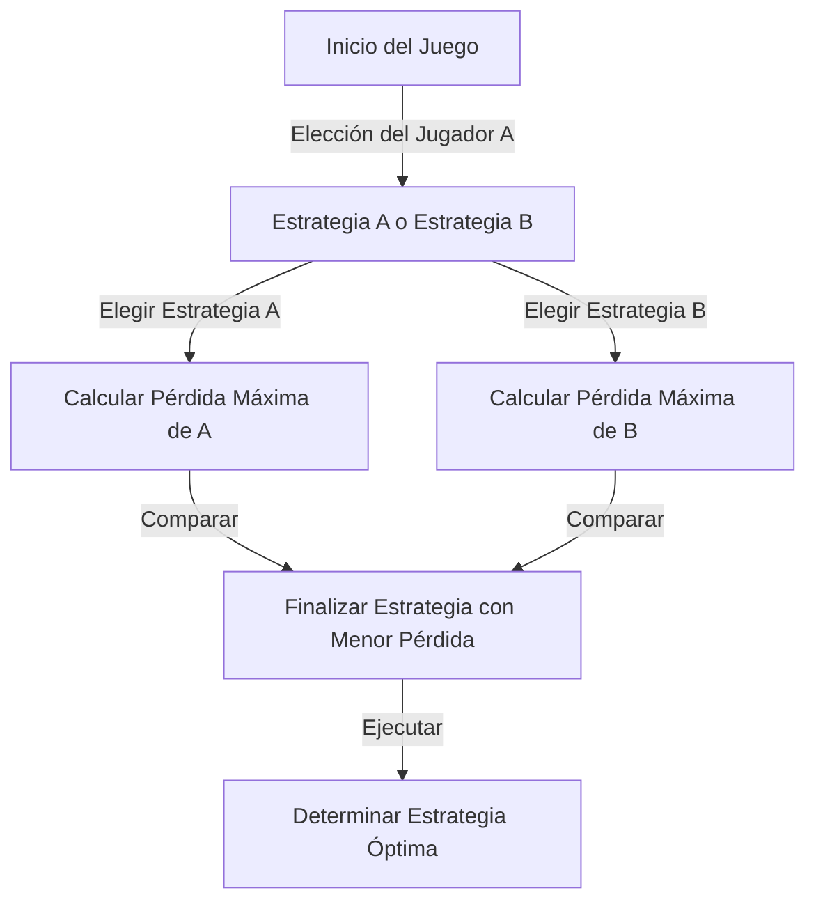
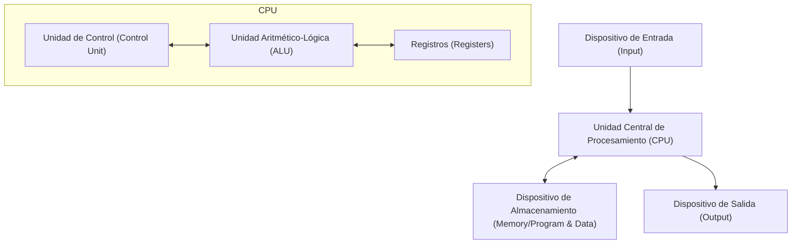

# Introducción: El hombre temido como un "Marciano"

A lo largo de la historia humana, han existido muchas personas llamadas "genios". Grandes figuras como Albert Einstein, Isaac Newton y Leonardo da Vinci demostraron un talento sobresaliente en campos específicos. Sin embargo, se dice que cierto científico que vivió en el siglo XX poseía una "inteligencia de otra dimensión" que los superaba a todos. Ese fue John von Neumann (1903 - 1957).

Su cerebro estaba tan por encima de lo humano que sus colegas científicos susurraban medio en broma que era un "marciano fingiendo ser humano" o que tenía un "Cerebro del Diablo". Hay muchas anécdotas de premios Nobel que, al darse cuenta de los límites de su propio intelecto frente a von Neumann, no tenían más remedio que actuar como niños.

Este artículo profundizará lo más posible en cómo se cultivó este "Cerebro del Diablo" y cómo creó las bases de todos los aspectos de la sociedad moderna (computadoras, mecánica cuántica, teoría de juegos, armas nucleares, etc.), explorando su feroz vida y sus abrumadores logros.

## Capítulo 1: El nacimiento de un niño prodigio y el milagro húngaro

### Una familia judía rica en Budapest
John von Neumann (nombre de nacimiento: Neumann János Lajos) nació el 28 de diciembre de 1903 en Budapest, la capital del Imperio Austrohúngaro. Su padre, Neumann Miksa, fue un exitoso banquero que luego tuvo la riqueza y el estatus para recibir un título de nobleza (von). Este entorno próspero se convirtió en el suelo perfecto para que florecieran los extraordinarios talentos de von Neumann.

### Memoria increíble y capacidad de cálculo
La naturaleza de prodigio de von Neumann destacó desde una edad temprana.
- A los **6 años**, podía calcular divisiones de 8 dígitos completamente en su cabeza y bromeaba con su padre en griego antiguo.
- A los **8 años**, entendió completamente y utilizó los conceptos de cálculo diferencial e integral.
- A los **10 años**, se dice que leyó los 44 volúmenes de la "Historia Mundial" de Wilhelm Oncken y podía recitarlos palabra por palabra. Esta memoria, que podría llamarse memoria fotográfica, se convirtió en su poderosa arma durante toda su vida.

### La reunión de los "Marcianos"
En Budapest en ese momento, nacían uno tras otro destacados talentos judíos junto a von Neumann. Estos incluían a Eugene Wigner (Premio Nobel de Física), Edward Teller (padre de la bomba de hidrógeno) y Leo Szilard (titular de la patente del reactor nuclear). Más tarde se mudaron a los Estados Unidos y fueron conocidos como "Los Marcianos" debido a sus destacados intelectos. Von Neumann fue el principal entre estos "marcianos", hasta el punto en que ellos mismos admitieron: "Solo von Neumann puede llamarse verdaderamente un genio".

## Capítulo 2: La crisis de las matemáticas y el ascenso del joven genio

### La Universidad de Gotinga y David Hilbert
Al entrar en su juventud, von Neumann estudió matemáticas en la Universidad de Budapest, e ingeniería química simultáneamente en la Universidad de Berlín y en la ETH de Zúrich (esto se debió a que a su padre le preocupaba que no pudiera ganarse la vida solo con las matemáticas). Al obtener su doctorado en matemáticas con solo 22 años, se dirigió a la Universidad de Gotinga en Alemania, el centro del mundo matemático en ese momento.

Allí se desempeñó como asistente de David Hilbert, la autoridad absoluta en el mundo matemático de la época. Hilbert estaba promoviendo el "Programa de Hilbert" para probar la "integridad y consistencia de las matemáticas", y von Neumann se involucró profundamente en este gran plan, haciendo contribuciones decisivas en el campo de la teoría axiomática de conjuntos.

### Fundamentos matemáticos de la mecánica cuántica
A fines de la década de 1920, nació una nueva teoría llamada mecánica cuántica en el mundo de la física, lo que causó una gran confusión. Dos teorías, la "mecánica matricial" de Werner Heisenberg y la "mecánica ondulatoria" de Erwin Schrödinger, que parecían completamente diferentes en apariencia y enfoque, estaban una al lado de la otra.

Aquí, von Neumann demostró su abrumadora intuición matemática. Al usar el concepto matemático del "espacio de Hilbert", demostró que estas dos teorías son matemáticamente equivalentes. Su libro "Fundamentos matemáticos de la mecánica cuántica", publicado en 1932, todavía se considera la biblia de la mecánica cuántica como una obra monumental que trajo un orden matemático estricto al mundo incierto de la física.

## Capítulo 3: El Instituto de Estudios Avanzados de Princeton y Einstein

### El ascenso de los nazis y la huida a Estados Unidos
En la década de 1930, los nazis liderados por Adolf Hitler llegaron al poder en Alemania, y comenzó la persecución de los judíos. Al percibir la crisis, von Neumann huyó a Estados Unidos temprano. Fue invitado al recién establecido "Instituto de Estudios Avanzados (IAS)" en Princeton, Nueva Jersey.

Este instituto reunió a las mentes más brillantes de todo el mundo, incluidos Einstein y Kurt Gödel. Von Neumann se convirtió en profesor titular en el instituto a la joven edad de 29 años (junto a Einstein y otros, fue el profesor titular más joven).

### Un estilo de juego poco ortodoxo
En Princeton, von Neumann actuó de manera completamente diferente a los otros académicos tranquilos. Resolvió problemas matemáticos difíciles mientras escuchaba fuertes marchas alemanas, organizó con frecuencia fiestas lujosas, condujo autos a velocidades vertiginosas y destrozó un auto nuevo casi todos los años (la intersección donde frecuentemente causaba accidentes incluso se llamaba la "intersección de von Neumann"). Mientras que Einstein prefería una vida sencilla y solitaria, von Neumann siempre vestía trajes impecables y disfrutaba mucho de los placeres mundanos.

## Capítulo 4: La creación de la teoría de juegos y la lógica de la "Guerra Fría"

### Introducción de las matemáticas en la economía
Los intereses de von Neumann no se detuvieron en las matemáticas puras y la física. Aficionado a los juegos de interior como el póquer, se preguntó: "¿Pueden describirse matemáticamente la toma de decisiones humanas y los conflictos?" Este fue el nacimiento de la "Teoría de Juegos".

En 1928, probó el "Teorema Minimax". Este es un teorema que establece que, en un juego entre dos partes opuestas, es racional actuar para "minimizar la pérdida máxima que uno puede sufrir".

### "Teoría de Juegos y Comportamiento Económico"
En 1944, von Neumann publicó la "Teoría de Juegos y Comportamiento Económico" con el economista Oskar Morgenstern. Este libro supuso tal impacto que reescribió por completo los fundamentos de la economía. Fue la primera vez que se explicó con un modelo matemático estricto cómo los humanos compiten, cooperan y determinan los precios en el mercado.

### Destrucción Mutua Asegurada (MAD) y la Guerra Fría
El concepto de la teoría de juegos se aplicó al mundo real de maneras aterradoras durante la Guerra Fría Este-Oeste después de la Segunda Guerra Mundial. Von Neumann, como el cerebro más fuerte del gobierno y el ejército de los EE. UU., Estuvo profundamente involucrado en la construcción de la "teoría de la disuasión nuclear".

La estrategia final que defendió fue la "Destrucción Mutua Asegurada (MAD)". Era una lógica fría donde se cruzaban la locura y la razón: "Si el oponente usa armas nucleares, seguramente tomaremos represalias y destruiremos por completo al oponente. Debido a esta amenaza segura de destrucción, ninguna de las partes puede usar armas nucleares".

## Capítulo 5: El padre de la computadora moderna

Entre los logros de von Neumann, el que tiene el impacto más directo e inmenso en nuestras vidas modernas es su contribución a la informática.

### De ENIAC a EDVAC
Durante la Segunda Guerra Mundial, el ejército de los EE. UU. Estaba desarrollando una enorme computadora electrónica, "ENIAC", para cálculos balísticos. Sin embargo, ENIAC requería volver a cablear una cantidad masiva de cables cada vez que se cambiaba el programa de cálculo (esto se llama el método del panel de conexiones).

Von Neumann se unió a este proyecto de desarrollo como consultor e inmediatamente vio los defectos de ENIAC. Propuso una idea revolucionaria: "Si los programas (instrucciones) se almacenan en la memoria al igual que los datos, puede cambiar de programa instantáneamente sin cambiar el cableado". Este es el "concepto de programa almacenado".

### Arquitectura de Von Neumann
En 1945, escribió el "Primer Borrador de un Informe sobre el EDVAC", definiendo la estructura lógica de esta nueva computadora. Esto es lo que hoy se llama la "Arquitectura de Von Neumann".

Desde el teléfono inteligente que está utilizando actualmente hasta las PC y supercomputadoras, casi el 100% de las computadoras funcionan exactamente de acuerdo con la arquitectura que von Neumann diseñó hace 80 años. No es exagerado decir que su cerebro fue el verdadero creador de la sociedad de la tecnología de la información.

## Capítulo 6: El Proyecto Manhattan y los hechos del "Diablo"

### Cálculo de lentes de implosión
Durante la Segunda Guerra Mundial, von Neumann fue una de las figuras más importantes en el "Proyecto Manhattan", el proyecto de desarrollo de la bomba atómica en curso en el Laboratorio Nacional de Los Álamos.

En particular, para detonar la bomba atómica de tipo plutonio, se necesitaban "lentes de implosión" para explotar explosivos con precisión desde los alrededores y comprimir la esfera de plutonio al extremo. Von Neumann resolvió este cálculo de dinámica de fluidos extremadamente complejo con su abrumadora potencia de cálculo. Se dice que la bomba atómica "Fat Man" lanzada sobre Nagasaki no se habría completado sin los cálculos matemáticos de von Neumann.

### Decisión del Comité de Objetivos
Aún más aterrador, von Neumann también fue miembro del "Comité de Objetivos" que decidió dónde lanzar las bombas atómicas en Japón. Defendió encarecidamente lanzarlo sobre "Kioto" para maximizar el poder destructivo de la bomba atómica, y sugirió además "lanzarlo sin previo aviso para mostrar el poder de la explosión" (aunque Kioto finalmente fue excluido).

Este completo racionalismo y frialdad son las razones por las que a von Neumann se le llamó el "Cerebro del Diablo" y se dice que fue uno de los modelos del Dr. Strangelove (dirigida por Stanley Kubrick).

## Capítulo 7: Autómatas autorreproductores y vida artificial

En sus últimos años, los pensamientos de von Neumann llegaron al ámbito filosófico de "¿Qué es la vida?" y "¿Pueden las máquinas reproducirse a sí mismas?"

Ideó un modelo matemático, el "autómata celular", en una cuadrícula (células) como papel cuadriculado, donde el estado de una célula cambia según el estado de su entorno. Y probó completamente la estructura lógica de una "máquina que puede crear copias de sí misma (autómata autorreproductor)" en este modelo.

Esto ocurrió antes del descubrimiento de la estructura de doble hélice del ADN (1953). Usando el pensamiento puramente matemático, von Neumann predijo el mecanismo fundamental de la vida: "La autorreplicación requiere un plano (equivalente al ADN) y una máquina para leerlo y ensamblarlo". Su investigación condujo más tarde a los conceptos de Vida Artificial (ALife), la ciencia de sistemas complejos e incluso virus informáticos.

## Conclusión: Una inteligencia demasiado temprana para la humanidad

El 8 de febrero de 1957, John von Neumann falleció de cáncer en un hospital de Washington D.C. a la joven edad de 53 años. Temiendo que inconscientemente pudiera filtrar secretos militares, se dice que el ejército mantuvo a la policía militar estacionada en su habitación del hospital en todo momento.

Su cerebro continuó trabajando sin parar hasta el momento final, pero sentía un profundo terror por perder gradualmente la memoria a medida que avanzaba el cáncer. El proceso de un hombre que una vez pudo memorizar un libro entero volviéndose incapaz de hacer incluso una simple suma fue una visión cruel para cualquiera a su alrededor.

John von Neumann. Atravesó y construyó los cimientos de áreas que la humanidad debería haber tardado cientos de años en explorar (desde matemáticas, física, economía, meteorología hasta ciencias de la computación) en una sola vida.

Debido a que sus logros son tan diversos y profundos, todavía es difícil creer que fueron logrados por un solo ser humano. Si él era un "marciano" o no es incierto, pero sus clones llamados "Arquitectura de Von Neumann" continúan calculando sin descanso en todo el mundo en este mismo momento.

Este mundo altamente orientado a la información en el que vivimos podría ser solo la continuación del sueño visto por el cerebro del diablo.
