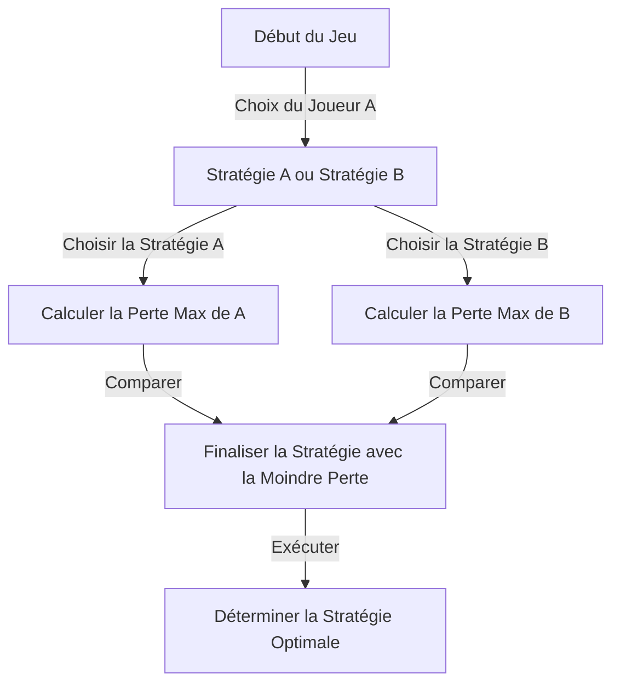
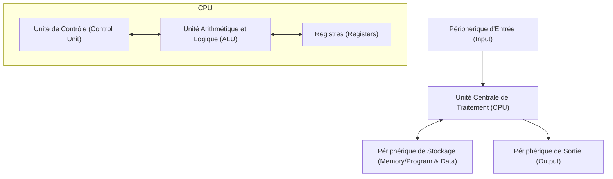

# Introduction : L'homme craint comme un "Martien"

Tout au long de l'histoire humaine, il y a eu de nombreux individus appelés "génies". De grandes figures comme Albert Einstein, Isaac Newton et Léonard de Vinci ont tous fait preuve d'un talent exceptionnel dans des domaines spécifiques. Cependant, un certain scientifique qui a vécu au 20ème siècle aurait possédé une "intelligence d'une autre dimension" qui les surpassait même. C'était John von Neumann (1903 - 1957).

Son cerveau était tellement au-delà de l'humain que ses collègues scientifiques chuchotaient à moitié en plaisantant qu'il était un "Martien se faisant passer pour un humain" ou qu'il avait le "Cerveau du Diable". De nombreuses anecdotes racontent que même des lauréats du prix Nobel réalisaient les limites de leur propre intellect devant von Neumann et n'avaient d'autre choix que d'agir comme des enfants.

Cet article approfondira autant que possible la façon dont ce "Cerveau du Diable" a été nourri et comment il a créé les fondations de la société moderne (ordinateurs, mécanique quantique, théorie des jeux, armes nucléaires, etc.), en explorant sa vie acharnée et ses réalisations écrasantes.

## Chapitre 1 : La naissance d'un prodige et le miracle hongrois

### Une riche famille juive à Budapest
John von Neumann (nom de naissance : Neumann János Lajos) est né le 28 décembre 1903 à Budapest, la capitale de l'Empire austro-hongrois. Son père, Neumann Miksa, était un banquier à succès qui eut plus tard la richesse et le statut nécessaires pour se voir attribuer un titre de noblesse (von). Cet environnement prospère est devenu le terreau idéal pour l'épanouissement des talents extraordinaires de von Neumann.

### Une mémoire et une capacité de calcul incroyables
La nature de prodige de von Neumann s'est démarquée dès son plus jeune âge.
- À l'âge de **6 ans**, il pouvait calculer des divisions à 8 chiffres entièrement de tête et plaisantait avec son père en grec ancien.
- À l'âge de **8 ans**, il comprenait parfaitement et utilisait les concepts du calcul différentiel et intégral.
- À l'âge de **10 ans**, on dit qu'il a lu les 44 volumes de l'"Histoire du monde" de Wilhelm Oncken et qu'il pouvait les réciter mot pour mot. Cette mémoire, que l'on pourrait qualifier de mémoire photographique, est devenue sa puissante arme tout au long de sa vie.

### Le rassemblement des "Martiens"
À Budapest, à cette époque, des talents juifs exceptionnels naissaient les uns après les autres aux côtés de von Neumann. Ceux-ci comprenaient Eugene Wigner (prix Nobel de physique), Edward Teller (père de la bombe à hydrogène) et Leo Szilard (détenteur du brevet du réacteur nucléaire). Ils ont ensuite déménagé aux États-Unis et sont devenus connus sous le nom de "Martiens" en raison de leur intellect exceptionnel. Von Neumann était le premier de ces "Martiens", au point où ils ont eux-mêmes admis : "Seul von Neumann peut vraiment être qualifié de génie."

## Chapitre 2 : La crise des mathématiques et l'ascension du jeune génie

### L'Université de Göttingen et David Hilbert
Entrant dans sa jeunesse, von Neumann étudie les mathématiques à l'Université de Budapest et le génie chimique simultanément à l'Université de Berlin et à l'ETH de Zurich (parce que son père craignait qu'il ne puisse pas gagner sa vie avec les seules mathématiques). Obtenant son doctorat en mathématiques à seulement 22 ans, il se rend à l'Université de Göttingen en Allemagne, le centre du monde mathématique de l'époque.

Il y a été l'assistant de David Hilbert, l'autorité absolue du monde mathématique de l'époque. Hilbert promouvait le "Programme de Hilbert" pour prouver la "complétude et la cohérence des mathématiques", et von Neumann s'est profondément impliqué dans ce grand plan, apportant des contributions décisives dans le domaine de la théorie axiomatique des ensembles.

### Fondements mathématiques de la mécanique quantique
À la fin des années 1920, une nouvelle théorie appelée mécanique quantique est née dans le monde de la physique, provoquant une grande confusion. Deux théories, la "mécanique matricielle" de Werner Heisenberg et la "mécanique ondulatoire" d'Erwin Schrödinger, qui semblaient complètement différentes dans leur apparence et leur approche, se côtoyaient.

Ici, von Neumann a démontré son intuition mathématique écrasante. En utilisant le concept mathématique d'"espace de Hilbert", il a prouvé que ces deux théories sont mathématiquement entièrement équivalentes. Son livre "Fondements mathématiques de la mécanique quantique", publié en 1932, est toujours considéré comme la bible de la mécanique quantique en tant qu'œuvre monumentale qui a apporté un ordre mathématique strict au monde incertain de la physique.

## Chapitre 3 : L'Institute for Advanced Study de Princeton et Einstein

### La montée des nazis et la fuite vers l'Amérique
Dans les années 1930, les nazis dirigés par Adolf Hitler arrivent au pouvoir en Allemagne et la persécution des Juifs commence. Sentant la crise, von Neumann fuit tôt en Amérique. Il est invité au tout nouvel "Institute for Advanced Study (IAS)" à Princeton, dans le New Jersey.

Cet institut rassemblait les plus grands esprits du monde entier, dont Einstein et Kurt Gödel. Von Neumann devient professeur titulaire à l'institut au jeune âge de 29 ans (avec Einstein et d'autres, il était le plus jeune professeur titulaire).

### Un style de jeu peu orthodoxe
À Princeton, von Neumann a agi de manière complètement différente des autres universitaires calmes. Il résolvait des problèmes mathématiques difficiles en écoutant de fortes marches allemandes, organisait fréquemment des fêtes somptueuses, conduisait des voitures à des vitesses vertigineuses et détruisait une nouvelle voiture presque chaque année (l'intersection où il causait fréquemment des accidents était même appelée "l'intersection de von Neumann"). Alors qu'Einstein préférait une vie simple et solitaire, von Neumann portait toujours des costumes impeccables et appréciait beaucoup les plaisirs du monde.

## Chapitre 4 : La création de la théorie des jeux et la logique de la "Guerre froide"

### L'introduction des mathématiques en économie
Les intérêts de von Neumann ne se sont pas arrêtés aux mathématiques pures et à la physique. Friand de jeux d'intérieur comme le poker, il s'est demandé : "La prise de décision et les conflits humains peuvent-ils être décrits mathématiquement ?" Ce fut la naissance de la "Théorie des jeux".

En 1928, il prouve le "Théorème Minimax". Il s'agit d'un théorème stipulant que dans un jeu entre deux parties opposées, il est rationnel d'agir de manière à "minimiser la perte maximale que l'on peut subir".

### "Théorie des jeux et du comportement économique"
En 1944, von Neumann publie la "Théorie des jeux et du comportement économique" avec l'économiste Oskar Morgenstern. Ce livre a provoqué un tel choc qu'il a complètement réécrit les fondements de l'économie. C'était la première fois que la façon dont les humains se font concurrence, coopèrent et déterminent les prix sur le marché était expliquée par un modèle mathématique strict.

### La destruction mutuelle assurée (MAD) et la guerre froide
Le concept de la théorie des jeux a été appliqué au monde réel de manière terrifiante pendant la guerre froide Est-Ouest après la Seconde Guerre mondiale. Von Neumann, en tant que cerveau le plus puissant du gouvernement et de l'armée des États-Unis, a été profondément impliqué dans la construction de la "théorie de la dissuasion nucléaire".

La stratégie ultime qu'il a défendue était la "Destruction Mutuelle Assurée (MAD)". C'était une logique impitoyable où se croisaient folie et raison : "Si l'adversaire utilise des armes nucléaires, nous riposterons sûrement et détruirons complètement l'adversaire. En raison de cette menace certaine de destruction, aucune des deux parties ne peut utiliser d'armes nucléaires."

## Chapitre 5 : Le père de l'ordinateur moderne

Parmi les réalisations de von Neumann, celle qui a l'impact le plus direct et le plus immense sur nos vies modernes est sa contribution à l'informatique.

### De l'ENIAC à l'EDVAC
Pendant la Seconde Guerre mondiale, l'armée américaine développait un énorme ordinateur électronique, "l'ENIAC", pour les calculs balistiques. Cependant, l'ENIAC nécessitait de recâbler une quantité massive de câbles chaque fois que le programme de calcul était modifié (c'est ce qu'on appelle la méthode du tableau de connexion).

Von Neumann a rejoint ce projet de développement en tant que consultant et a immédiatement vu les failles de l'ENIAC. Il a proposé une idée révolutionnaire : "Si les programmes (instructions) sont stockés en mémoire tout comme les données, vous pouvez instantanément changer de programme sans modifier le câblage." C'est le concept de "programme enregistré".

### L'architecture de von Neumann
En 1945, il rédige le "Premier projet de rapport sur l'EDVAC", définissant la structure logique de ce nouvel ordinateur. C'est ce qu'on appelle aujourd'hui "l'architecture de von Neumann".

Du smartphone que vous utilisez actuellement aux PC et aux superordinateurs, près de 100 % des ordinateurs fonctionnent exactement selon l'architecture conçue par von Neumann il y a 80 ans. Il n'est pas exagéré de dire que son cerveau était le véritable créateur de la société de l'informatique.

## Chapitre 6 : Le projet Manhattan et les actions du "Diable"

### Calcul des lentilles d'implosion
Pendant la Seconde Guerre mondiale, von Neumann était l'une des personnalités les plus importantes du "Projet Manhattan", le projet de développement de la bombe atomique en cours au Laboratoire national de Los Alamos.

En particulier pour faire exploser la bombe atomique de type plutonium, des "lentilles d'implosion" étaient nécessaires pour faire exploser précisément les explosifs depuis les environs et comprimer la sphère de plutonium à l'extrême. Von Neumann a résolu ce calcul de dynamique des fluides extrêmement complexe avec sa puissance de calcul écrasante. On dit que la bombe atomique "Fat Man" larguée sur Nagasaki n'aurait pas pu être achevée sans les calculs mathématiques de von Neumann.

### Décision du Comité des cibles
Encore plus terrifiant, von Neumann était également membre du "Comité des cibles" qui décidait où larguer les bombes atomiques au Japon. Il a fortement préconisé de la larguer sur "Kyoto" pour maximiser la puissance destructrice de la bombe atomique, et a en outre suggéré de "la larguer sans avertissement pour montrer la puissance de l'explosion" (bien que Kyoto ait finalement été exclue).

Ce rationalisme poussé et cette froideur sont les raisons pour lesquelles von Neumann a été appelé le "Cerveau du Diable" et on dit qu'il a été l'un des modèles du Dr Folamour (réalisé par Stanley Kubrick).

## Chapitre 7 : Les automates autoreproducteurs et la vie artificielle

Dans ses dernières années, les pensées de von Neumann ont atteint le domaine philosophique de "Qu'est-ce que la vie ?" et "Les machines peuvent-elles se reproduire ?"

Il a conçu un modèle mathématique, "l'automate cellulaire", sur une grille (cellules) semblable à du papier millimétré, où l'état d'une cellule change en fonction de l'état de son environnement. Et il a complètement prouvé la structure logique d'une "machine qui peut créer des copies d'elle-même (automate autoreproducteur)" sur ce modèle.

Cela s'est produit avant la découverte de la structure en double hélice de l'ADN (1953). En utilisant une pensée purement mathématique, von Neumann a prédit le mécanisme fondamental de la vie : "L'autoréplication nécessite un plan (équivalent à l'ADN) et une machine pour le lire et l'assembler." Ses recherches ont par la suite conduit aux concepts de vie artificielle (ALife), de la science des systèmes complexes et même des virus informatiques.

## Conclusion : Une intelligence trop précoce pour l'humanité

Le 8 février 1957, John von Neumann décède d'un cancer dans un hôpital de Washington D.C., au jeune âge de 53 ans. Craignant qu'il ne divulgue inconsciemment des secrets militaires, l'armée aurait maintenu des policiers militaires stationnés dans sa chambre d'hôpital en permanence.

Son cerveau a continué à fonctionner sans s'arrêter jusqu'au dernier moment, mais il éprouvait une terreur profonde de perdre progressivement la mémoire au fur et à mesure de l'évolution du cancer. Le processus d'un homme qui pouvait autrefois mémoriser un livre entier et devenir incapable de faire la moindre addition simple a été un spectacle cruel pour tout le monde autour de lui.

John von Neumann. Il a traversé et posé les jalons de domaines que l'humanité aurait dû mettre des centaines d'années à explorer (des mathématiques, de la physique, de l'économie, de la météorologie à l'informatique) au cours d'une seule vie.

Parce que ses réalisations sont si diverses et profondes, il est encore difficile de croire qu'elles ont été accomplies par un seul être humain. Qu'il ait été un "Martien" ou non est incertain, mais ses clones nommés "Architecture de von Neumann" continuent de calculer sans relâche partout dans le monde en ce moment même.

Ce monde hautement axé sur l'information dans lequel nous vivons pourrait bien être la continuation du rêve vu par le cerveau du diable.
