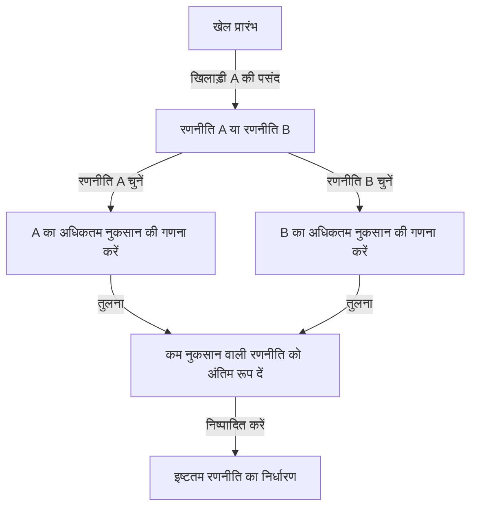
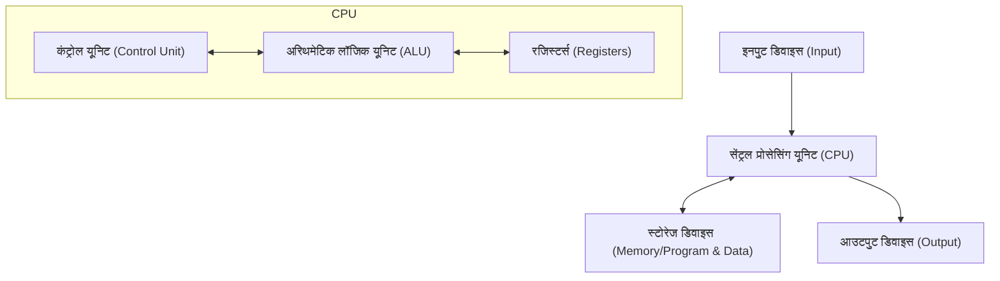

# प्रस्तावना: वो व्यक्ति जिससे "मार्टियन" (मंगल ग्रह का वासी) के रूप में डरा जाता था

मानव इतिहास में ऐसे कई व्यक्ति हुए हैं जिन्हें "जीनियस" कहा गया है। अल्बर्ट आइंस्टीन, [आइजैक न्यूटन](/hi/p/newton/) और लियोनार्डो दा विंची जैसी महान हस्तियों ने विशिष्ट क्षेत्रों में उत्कृष्ट प्रतिभा का प्रदर्शन किया। हालांकि, 20वीं सदी में रहने वाले एक निश्चित वैज्ञानिक के बारे में कहा जाता है कि उनके पास एक "अन्य आयाम की बुद्धिमत्ता" थी जो उन सभी से भी आगे थी। वो थे [जॉन वॉन न्यूमैन](/hi/p/von-neumann/) (1903 - 1957)।

उनका दिमाग मानवीय सोच से इतना परे था कि उनके साथी वैज्ञानिक आधी मज़ाकिया लहजे में फुसफुसाते थे कि वे एक "मनुष्य का नाटक करने वाले मार्टियन" हैं या उनके पास "शैतान का दिमाग" है। नोबेल पुरस्कार विजेताओं के भी वॉन न्यूमैन के सामने अपनी खुद की बुद्धि की सीमा को महसूस करने और बच्चों की तरह व्यवहार करने के अलावा कोई विकल्प न होने के कई किस्से हैं।

यह लेख जितना संभव हो उतनी गहराई और विस्तार से इस बात की पड़ताल करेगा कि इस "शैतान के दिमाग" का विकास कैसे हुआ और कैसे उन्होंने आधुनिक समाज के हर पहलू (कंप्यूटर, क्वांटम यांत्रिकी, गेम थ्योरी, परमाणु हथियार, आदि) की नींव बनाई, उनके उग्र जीवन और भारी उपलब्धियों की खोज करते हुए।

## अध्याय 1: एक विलक्षण बच्चे का जन्म और हंगेरियन चमत्कार

### बुडापेस्ट में एक अमीर यहूदी परिवार
जॉन वॉन न्यूमैन (जन्म का नाम: न्यूमैन जानोस लाजोस) का जन्म 28 दिसंबर, 1903 को ऑस्ट्रो-हंगेरियन साम्राज्य की राजधानी बुडापेस्ट में हुआ था। उनके पिता, न्यूमैन मिक्सा, एक सफल बैंकर थे, जिनके पास बाद में कुलीनता की उपाधि (वॉन) प्राप्त करने के लिए पर्याप्त धन और रुतबा था। यह समृद्ध वातावरण वॉन न्यूमैन की असाधारण प्रतिभा के खिलने के लिए एकदम सही मिट्टी बन गया।

### अविश्वसनीय स्मृति और गणना क्षमता
वॉन न्यूमैन की विलक्षण प्रकृति कम उम्र से ही स्पष्ट थी।
- **6 साल की उम्र** में, वे पूरी तरह से अपने दिमाग में 8-अंकीय विभाजन की गणना कर सकते थे और अपने पिता के साथ प्राचीन ग्रीक में मज़ाक करते थे।
- **8 साल की उम्र** में, उन्होंने अवकलन और समाकलन (डिफरेंशियल और इंटीग्रल कैलकुलस) की अवधारणाओं को पूरी तरह से समझ लिया था और उनका उपयोग करते थे।
- **10 साल की उम्र** में, ऐसा कहा जाता है कि उन्होंने विल्हेम ओन्कन की "विश्व इतिहास" के सभी 44 खंडों को पढ़ लिया था और वे उन्हें शब्दशः सुना सकते थे। यह स्मृति, जिसे फोटोग्राफिक मेमोरी कहा जा सकता है, उनके पूरे जीवन में उनका शक्तिशाली हथियार बन गई।

### "मार्टियंस" का जमावड़ा
उस समय बुडापेस्ट में, वॉन न्यूमैन के साथ-साथ एक के बाद एक उत्कृष्ट यहूदी प्रतिभाएँ पैदा हो रही थीं। इनमें यूजीन विग्नर (भौतिकी में नोबेल पुरस्कार), एडवर्ड टेलर (हाइड्रोजन बम के जनक), और लियो स्ज़ीलार्ड (परमाणु रिएक्टर के पेटेंट धारक) शामिल थे। वे बाद में संयुक्त राज्य अमेरिका चले गए और अपनी उत्कृष्ट बुद्धि के कारण "द मार्टियंस" के रूप में जाने गए। वॉन न्यूमैन इन "मार्टियंस" में सबसे प्रमुख थे, इस हद तक कि उन्होंने खुद स्वीकार किया, "केवल वॉन न्यूमैन को ही वास्तव में एक जीनियस कहा जा सकता है।"

## अध्याय 2: गणित का संकट और युवा जीनियस का उदय

### गौटिंगेन विश्वविद्यालय और डेविड हिल्बर्ट
अपनी युवावस्था में प्रवेश करते हुए, वॉन न्यूमैन ने बुडापेस्ट विश्वविद्यालय में गणित का अध्ययन किया, और साथ ही बर्लिन विश्वविद्यालय और ETH ज्यूरिख में रसायन इंजीनियरिंग का अध्ययन किया (ऐसा इसलिए था क्योंकि उनके पिता को चिंता थी कि वह केवल गणित के सहारे आजीविका नहीं कमा सकते)। केवल 22 वर्ष की आयु में गणित में पीएचडी प्राप्त करने के बाद, वे उस समय गणितीय दुनिया के केंद्र, जर्मनी के गौटिंगेन विश्वविद्यालय चले गए।

वहां उन्होंने उस समय गणितीय दुनिया के पूर्ण अधिकारी [डेविड हिल्बर्ट](/hi/p/hilbert/) के सहायक के रूप में कार्य किया। हिल्बर्ट "गणित की पूर्णता और निरंतरता" को साबित करने के लिए "हिल्बर्ट प्रोग्राम" को बढ़ावा दे रहे थे, और वॉन न्यूमैन ने इस भव्य योजना में खुद को गहराई से शामिल किया, एक्सिओमैटिक सेट थ्योरी के क्षेत्र में निर्णायक योगदान दिया।

### क्वांटम यांत्रिकी की गणितीय नींव
1920 के दशक के अंत में, भौतिकी की दुनिया में क्वांटम यांत्रिकी नामक एक नए सिद्धांत का जन्म हुआ, जिससे बहुत भ्रम पैदा हुआ। वर्नर हाइजेनबर्ग की "मैट्रिक्स मैकेनिक्स" और इरविन श्रोडिंगर की "वेव मैकेनिक्स", जो देखने और दृष्टिकोण में पूरी तरह से अलग दिखते थे, दो सिद्धांत साथ-साथ खड़े थे।

यहाँ, वॉन न्यूमैन ने अपनी जबरदस्त गणितीय अंतर्दृष्टि का प्रदर्शन किया। "हिल्बर्ट स्पेस" की गणितीय अवधारणा का उपयोग करके, उन्होंने साबित कर दिया कि ये दोनों सिद्धांत गणितीय रूप से पूरी तरह से समतुल्य हैं। 1932 में प्रकाशित उनकी पुस्तक "क्वांटम यांत्रिकी की गणितीय नींव" (Mathematical Foundations of Quantum Mechanics), को अभी भी क्वांटम यांत्रिकी की बाइबिल माना जाता है, एक स्मारकीय कार्य के रूप में जिसने भौतिकी की अनिश्चित दुनिया में सख्त गणितीय आदेश लाया।

## अध्याय 3: प्रिंसटन में उन्नत अध्ययन संस्थान और आइंस्टीन

### नाजियों का उदय और अमेरिका भागना
1930 के दशक में, एडॉल्फ हिटलर के नेतृत्व में जर्मनी में नाजियों का उदय हुआ, और यहूदियों का उत्पीड़न शुरू हो गया। संकट को भाँपते हुए, वॉन न्यूमैन जल्द ही अमेरिका भाग गए। उन्हें प्रिंसटन, न्यू जर्सी में नवनिर्मित "उन्नत अध्ययन संस्थान (IAS)" में आमंत्रित किया गया था।

इस संस्थान ने दुनिया भर के महानतम दिमागों को इकट्ठा किया, जिनमें आइंस्टीन और [कर्ट गोडेल](/hi/p/godel/) शामिल थे। वॉन न्यूमैन 29 साल की कम उम्र में संस्थान में स्थायी प्रोफेसर बन गए (आइंस्टीन और अन्य लोगों के साथ, वह सबसे कम उम्र के स्थायी प्रोफेसर थे)।

### एक अपरंपरागत खेल शैली
प्रिंसटन में, वॉन न्यूमैन ने अन्य शांत विद्वानों से पूरी तरह अलग व्यवहार किया। वे तेज़ जर्मन मार्च संगीत सुनते हुए गणितीय समस्याओं को हल करते थे, अक्सर भव्य पार्टियाँ देते थे, तेज़ गति से कार चलाते थे, और लगभग हर साल एक नई कार दुर्घटनाग्रस्त कर देते थे (जिस चौराहे पर वे अक्सर दुर्घटनाएँ करते थे, उसे "वॉन न्यूमैन चौराहा" भी कहा जाने लगा था)। जबकि आइंस्टीन एक सरल और एकांत जीवन पसंद करते थे, वॉन न्यूमैन हमेशा शानदार सूट पहनते थे और सांसारिक सुखों का भरपूर आनंद लेते थे।

## अध्याय 4: गेम थ्योरी का निर्माण और "शीत युद्ध" का तर्क

### अर्थशास्त्र में गणित का परिचय
वॉन न्यूमैन की रुचियाँ केवल शुद्ध गणित और भौतिकी तक ही सीमित नहीं रहीं। पोकर जैसे इनडोर गेम्स के शौकीन होने के कारण, उन्होंने सोचा, "क्या मानवीय निर्णय लेने की प्रक्रिया और संघर्षों का गणितीय रूप से वर्णन किया जा सकता है?" यही "गेम थ्योरी" (Game Theory) का जन्म था।

1928 में, उन्होंने "मिनिमैक्स प्रमेय" (Minimax theorem) को साबित किया। यह एक ऐसा प्रमेय है जिसमें कहा गया है कि दो विरोधी पक्षों के बीच के खेल में, इस तरह से कार्य करना तर्कसंगत है कि "उस अधिकतम नुकसान को कम किया जाए जो किसी को हो सकता है।"

### "गेम थ्योरी एंड इकोनॉमिक बिहेवियर"
1944 में, वॉन न्यूमैन ने अर्थशास्त्री ओस्कर मोर्गेनस्टर्न के साथ "थ्योरी ऑफ़ गेम्स एंड इकोनॉमिक बिहेवियर" प्रकाशित की। इस पुस्तक ने ऐसा झटका दिया कि इसने अर्थशास्त्र की नींव को पूरी तरह से फिर से लिख दिया। यह पहली बार था कि बाजार में मनुष्य कैसे प्रतिस्पर्धा करते हैं, सहयोग करते हैं और कीमतें निर्धारित करते हैं, इसे एक सख्त गणितीय मॉडल द्वारा समझाया गया था।

### पारस्परिक सुनिश्चित विनाश (MAD) और शीत युद्ध
गेम थ्योरी की अवधारणा को द्वितीय विश्व युद्ध के बाद पूर्व-पश्चिम शीत युद्ध के दौरान भयानक तरीकों से वास्तविक दुनिया में लागू किया गया था। वॉन न्यूमैन, अमेरिकी सरकार और सेना के सबसे मजबूत दिमाग के रूप में, "परमाणु निरोध के सिद्धांत" के निर्माण में गहराई से शामिल थे।

उन्होंने जिस अंतिम रणनीति की वकालत की वह थी "पारस्परिक सुनिश्चित विनाश" (Mutually Assured Destruction, MAD)। यह एक क्रूर तर्क था जहाँ पागलपन और तर्क आपस में मिलते थे: "यदि विरोधी परमाणु हथियारों का उपयोग करता है, तो हम निश्चित रूप से जवाबी कार्रवाई करेंगे और विरोधी को पूरी तरह से नष्ट कर देंगे। विनाश के इस निश्चित खतरे के कारण ही, कोई भी पक्ष परमाणु हथियारों का उपयोग नहीं कर सकता है।"

## अध्याय 5: आधुनिक कंप्यूटर के जनक

वॉन न्यूमैन की उपलब्धियों में, वह उपलब्धि जिसका हमारे आधुनिक जीवन पर सबसे प्रत्यक्ष और विशाल प्रभाव है, वह है कंप्यूटर विज्ञान में उनका योगदान।

### ENIAC से EDVAC तक
द्वितीय विश्व युद्ध के दौरान, अमेरिकी सेना बैलिस्टिक गणनाओं के लिए एक विशाल इलेक्ट्रॉनिक कंप्यूटर, "ENIAC" विकसित कर रही थी। हालांकि, गणना कार्यक्रम को बदलने पर हर बार ENIAC को बड़ी मात्रा में केबलों को फिर से तार करने की आवश्यकता होती थी (इसे पैच पैनल विधि कहा जाता है)।

वॉन न्यूमैन इस विकास परियोजना में एक सलाहकार के रूप में शामिल हुए और तुरंत ENIAC की खामियों को देख लिया। उन्होंने एक क्रांतिकारी विचार का प्रस्ताव रखा: "यदि कार्यक्रमों (निर्देशों) को डेटा की तरह ही मेमोरी में संग्रहीत किया जाता है, तो आप वायरिंग को बदले बिना तुरंत कार्यक्रमों को स्विच कर सकते हैं।" यह "संग्रहीत-प्रोग्राम अवधारणा" (stored-program concept) है।

### वॉन न्यूमैन आर्किटेक्चर
1945 में, उन्होंने "फर्स्ट ड्राफ्ट ऑफ ए रिपोर्ट ऑन द EDVAC" लिखा, जिसमें इस नए कंप्यूटर की तार्किक संरचना को परिभाषित किया गया। इसे ही आज "वॉन न्यूमैन आर्किटेक्चर" कहा जाता है।

आप वर्तमान में जिस स्मार्टफोन का उपयोग कर रहे हैं उससे लेकर पीसी और सुपर कंप्यूटर तक, लगभग 100% कंप्यूटर बिल्कुल उसी आर्किटेक्चर के अनुसार काम करते हैं जो वॉन न्यूमैन ने 80 साल पहले तैयार किया था। यह कहना अतिशयोक्ति नहीं होगी कि उनका दिमाग ही आईटी समाज का सच्चा निर्माता था।

## अध्याय 6: मैनहट्टन प्रोजेक्ट और "शैतान" के कर्म

### इम्प्लोजन लेंस की गणना
द्वितीय विश्व युद्ध के दौरान, वॉन न्यूमैन "मैनहट्टन प्रोजेक्ट" में सबसे महत्वपूर्ण हस्तियों में से एक थे, जो लॉस एलामोस नेशनल लेबोरेटरी में चल रहा परमाणु बम विकास परियोजना था।

विशेष रूप से प्लूटोनियम-प्रकार के परमाणु बम को विस्फोट करने के लिए, परिवेश से विस्फोटकों को सटीक रूप से विस्फोट करने और प्लूटोनियम क्षेत्र को चरम तक संपीड़ित करने के लिए "इम्प्लोजन लेंस" की आवश्यकता थी। वॉन न्यूमैन ने अपनी जबरदस्त कंप्यूटिंग शक्ति के साथ इस अत्यंत जटिल द्रव गतिकी गणना को हल किया। ऐसा कहा जाता है कि नागासाकी पर गिराया गया परमाणु बम "फैट मैन" वॉन न्यूमैन की गणितीय गणनाओं के बिना पूरा नहीं होता।

### लक्ष्य समिति का निर्णय
इससे भी अधिक भयावह बात यह है कि वॉन न्यूमैन उस "लक्ष्य समिति" के सदस्य भी थे जिसने जापान में परमाणु बम गिराने का फैसला किया था। उन्होंने परमाणु बम की विनाशकारी शक्ति को अधिकतम करने के लिए इसे "क्योतो" पर गिराने की दृढ़ता से वकालत की, और आगे सुझाव दिया कि "विस्फोट की शक्ति दिखाने के लिए इसे बिना किसी चेतावनी के गिराया जाए" (हालांकि अंततः क्योतो को बाहर कर दिया गया था)।

यह संपूर्ण तर्कवाद और क्रूरता ही कारण हैं कि वॉन न्यूमैन को "शैतान का दिमाग" कहा गया और ऐसा कहा जाता है कि वे डॉ. स्ट्रेंजलव (स्टेनली कुब्रिक द्वारा निर्देशित) के मॉडलों में से एक थे।

## अध्याय 7: स्व-प्रजनन ऑटोमेटा और कृत्रिम जीवन

अपने बाद के वर्षों में, वॉन न्यूमैन के विचार "जीवन क्या है?" और "क्या मशीनें खुद को पुन: उत्पन्न कर सकती हैं?" के दार्शनिक क्षेत्र में पहुँच गए।

उन्होंने ग्राफ़ पेपर की तरह एक ग्रिड (कोशिकाओं) पर एक गणितीय मॉडल, "सेलुलर ऑटोमेटन" तैयार किया, जहाँ एक कोशिका की स्थिति उसके परिवेश की स्थिति के आधार पर बदलती है। और उन्होंने इस मॉडल पर "ऐसी मशीन जो अपनी खुद की प्रतियां बना सकती है (स्व-प्रजनन ऑटोमेटन)" की तार्किक संरचना को पूरी तरह से साबित कर दिया।

यह डीएनए की डबल हेलिक्स संरचना (1953) की खोज से पहले हुआ था। विशुद्ध रूप से गणितीय सोच का उपयोग करते हुए, वॉन न्यूमैन ने जीवन के मूलभूत तंत्र की भविष्यवाणी की: "स्व-प्रतिकृति (Self-replication) के लिए एक ब्लूप्रिंट (डीएनए के बराबर) और उसे पढ़ने और इकट्ठा करने के लिए एक मशीन की आवश्यकता होती है।" उनके शोध ने बाद में कृत्रिम जीवन (ALife), जटिल प्रणालियों के विज्ञान और यहाँ तक कि कंप्यूटर वायरस की अवधारणाओं को जन्म दिया।

## निष्कर्ष: मानवता के लिए बहुत जल्दी आई एक बुद्धिमत्ता

8 फरवरी, 1957 को [जॉन वॉन न्यूमैन](/hi/p/von-neumann/) का 53 वर्ष की कम उम्र में वाशिंगटन डी.सी. के एक अस्पताल में कैंसर से निधन हो गया। इस डर से कि वे अनजाने में सैन्य रहस्य न उगल दें, ऐसा कहा जाता है कि सेना ने हर समय उनके अस्पताल के कमरे में सैन्य पुलिस तैनात कर रखी थी।

उनका दिमाग अंतिम क्षण तक बिना रुके काम करता रहा, लेकिन जैसे-जैसे कैंसर बढ़ता गया, वे धीरे-धीरे अपनी याददाश्त खोने के गहरे डर में थे। एक ऐसे व्यक्ति की प्रक्रिया, जो कभी पूरी किताब को याद कर सकता था, अब एक साधारण जोड़ करने में भी असमर्थ हो जाना उसके आस-पास के किसी भी व्यक्ति के लिए एक क्रूर दृश्य था।

[जॉन वॉन न्यूमैन](/hi/p/von-neumann/)। उन्होंने गणित, भौतिकी, अर्थशास्त्र, मौसम विज्ञान से लेकर कंप्यूटर विज्ञान तक के उन क्षेत्रों के लिए नींव का निर्माण किया, जिन्हें तलाशने में मानवता को सैकड़ों वर्ष लगने चाहिए थे, वो भी सिर्फ एक ही जीवनकाल में।

चूंकि उनकी उपलब्धियां इतनी विविध और गहरी हैं, इसलिए यह विश्वास करना अभी भी कठिन है कि वे एक ही इंसान द्वारा पूरी की गई थीं। वे "मार्टियन" थे या नहीं, यह अनिश्चित है, लेकिन "वॉन न्यूमैन आर्किटेक्चर" नामक उनके क्लोन इस क्षण भी पूरी दुनिया में बिना रुके गणना करना जारी रखे हुए हैं।

यह अत्यधिक सूचना-उन्मुख दुनिया जिसमें हम रहते हैं, शैतान के दिमाग द्वारा देखे गए सपने की निरंतरता मात्र हो सकती है।
