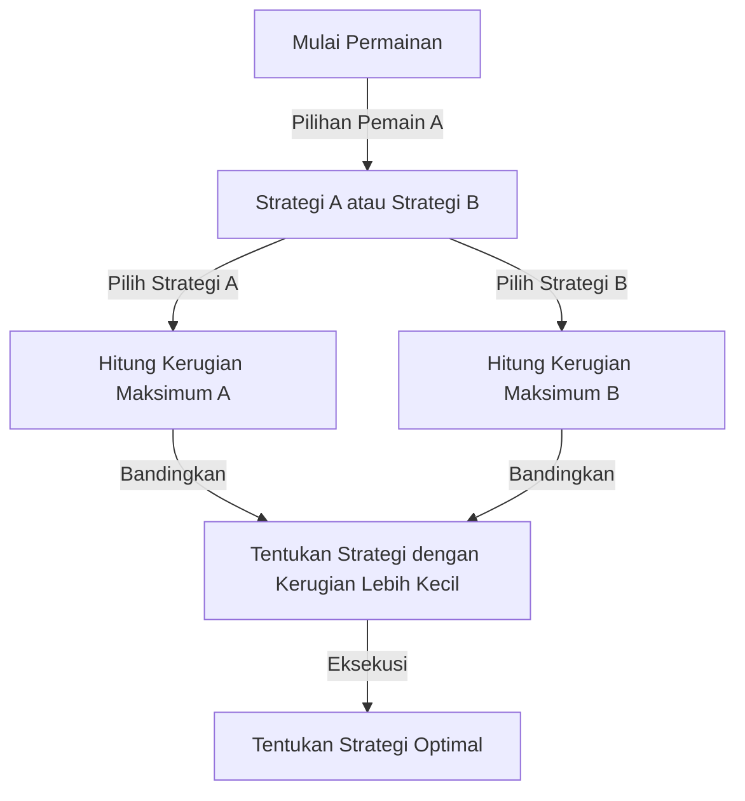
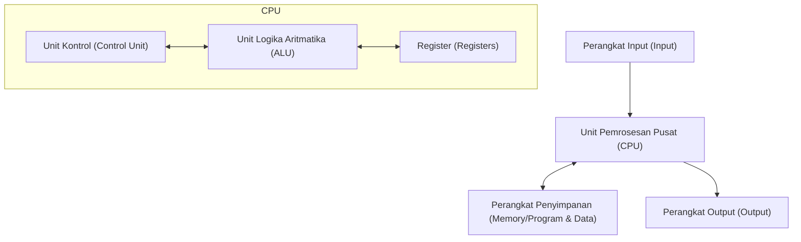

# Pendahuluan: Pria yang Ditakuti sebagai "Orang Mars"

Sepanjang sejarah manusia, telah banyak individu yang disebut sebagai "jenius." Tokoh-tokoh besar seperti Albert Einstein, [Isaac Newton](/id/p/newton/), dan Leonardo da Vinci semuanya menunjukkan bakat luar biasa di bidang tertentu. Namun, seorang ilmuwan tertentu yang hidup di abad ke-20 dikatakan memiliki "kecerdasan dari dimensi lain" yang melampaui mereka semua. Dia adalah [John von Neumann](/id/p/von-neumann/) (1903 - 1957).

Otaknya begitu jauh melampaui manusia sehingga rekan-rekan ilmuwannya berbisik setengah bercanda bahwa dia adalah "orang Mars yang berpura-pura menjadi manusia" atau memiliki "Otak Iblis." Ada banyak anekdot tentang bahkan pemenang Hadiah Nobel yang menyadari batas kecerdasan mereka sendiri di depan von Neumann dan tidak punya pilihan selain bertindak seperti anak-anak.

Artikel ini akan menggali sedalam dan sedetail mungkin tentang bagaimana "Otak Iblis" ini diasuh dan bagaimana ia menciptakan fondasi seluruh aspek masyarakat modern (komputer, mekanika kuantum, teori permainan, senjata nuklir, dll.), mengeksplorasi kehidupannya yang keras dan pencapaiannya yang luar biasa.

## Bab 1: Kelahiran Anak Ajaib dan Keajaiban Hungaria

### Keluarga Yahudi Kaya di Budapest
John von Neumann (nama lahir: Neumann János Lajos) lahir pada 28 Desember 1903, di Budapest, ibu kota Kekaisaran Austria-Hungaria. Ayahnya, Neumann Miksa, adalah seorang bankir sukses yang kemudian memiliki kekayaan dan status untuk dianugerahi gelar kebangsawanan (von). Lingkungan yang kaya ini menjadi tanah yang sempurna bagi bakat luar biasa von Neumann untuk berkembang.

### Ingatan dan Kemampuan Menghitung yang Luar Biasa
Sifat luar biasa von Neumann sudah menonjol sejak usia dini.
- Pada **usia 6**, ia dapat menghitung pembagian 8 digit seluruhnya di kepalanya dan bercanda dengan ayahnya dalam bahasa Yunani kuno.
- Pada **usia 8**, ia sepenuhnya memahami dan menggunakan konsep kalkulus diferensial dan integral.
- Pada **usia 10**, dikatakan bahwa ia telah membaca ke-44 volume "Sejarah Dunia" karya Wilhelm Oncken dan dapat melafalkannya kata demi kata. Ingatan ini, yang bisa disebut memori fotografis, menjadi senjata ampuhnya sepanjang hidupnya.

### Pertemuan "Orang-orang Mars"
Di Budapest pada waktu itu, bakat-bakat Yahudi yang luar biasa lahir satu demi satu bersama von Neumann. Ini termasuk Eugene Wigner (Hadiah Nobel Fisika), Edward Teller (bapak bom hidrogen), dan Leo Szilard (pemegang paten reaktor nuklir). Mereka kemudian pindah ke Amerika Serikat dan dikenal sebagai "The Martians" (Orang-orang Mars) karena kecerdasan mereka yang luar biasa. Von Neumann adalah yang terdepan di antara para "orang Mars" ini, sampai pada titik di mana mereka sendiri mengakui, "Hanya von Neumann yang benar-benar bisa disebut jenius."

## Bab 2: Krisis Matematika dan Bangkitnya Jenius Muda

### Universitas Göttingen dan David Hilbert
Memasuki masa mudanya, von Neumann belajar matematika di Universitas Budapest, dan teknik kimia secara bersamaan di Universitas Berlin dan ETH Zurich (ini karena ayahnya khawatir dia tidak bisa mencari nafkah dari matematika saja). Meraih gelar PhD di bidang matematika pada usia 22 tahun, ia menuju ke Universitas Göttingen di Jerman, pusat dunia matematika pada saat itu.

Di sana ia menjabat sebagai asisten [David Hilbert](/id/p/hilbert/), otoritas absolut di dunia matematika pada saat itu. Hilbert sedang mempromosikan "Program Hilbert" untuk membuktikan "kelengkapan dan konsistensi matematika," dan von Neumann sangat melibatkan dirinya dalam rencana besar ini, memberikan kontribusi yang menentukan di bidang teori himpunan aksiomatik.

### Fondasi Matematika dari Mekanika Kuantum
Pada akhir tahun 1920-an, teori baru yang disebut mekanika kuantum lahir di dunia fisika, menyebabkan kebingungan besar. Dua teori, "Mekanika Matriks" karya Werner Heisenberg dan "Mekanika Gelombang" karya Erwin Schrödinger, yang terlihat sangat berbeda dalam penampilan dan pendekatan, berdiri berdampingan.

Di sini, von Neumann menunjukkan intuisi matematikanya yang luar biasa. Dengan menggunakan konsep matematika "ruang Hilbert," ia membuktikan bahwa kedua teori ini secara matematis sepenuhnya setara. Bukunya "Fondasi Matematika dari Mekanika Kuantum," yang diterbitkan pada tahun 1932, masih dianggap sebagai alkitab mekanika kuantum sebagai karya monumental yang membawa tatanan matematika yang ketat ke dunia fisika yang tidak pasti.

## Bab 3: Institute for Advanced Study di Princeton dan Einstein

### Bangkitnya Nazi dan Pelarian ke Amerika
Pada tahun 1930-an, Nazi yang dipimpin oleh Adolf Hitler berkuasa di Jerman, dan penganiayaan terhadap orang Yahudi dimulai. Merasakan krisis tersebut, von Neumann melarikan diri ke Amerika lebih awal. Dia diundang ke "Institute for Advanced Study (IAS)" yang baru didirikan di Princeton, New Jersey.

Institut ini mengumpulkan para pemikir terhebat dari seluruh dunia, termasuk Einstein dan [Kurt Gödel](/id/p/godel/). Von Neumann menjadi profesor penuh waktu di institut tersebut pada usia muda 29 tahun (bersama Einstein dan lainnya, ia adalah profesor penuh waktu termuda).

### Gaya Bermain yang Tidak Ortodoks
Di Princeton, von Neumann bertindak sangat berbeda dari para sarjana pendiam lainnya. Dia memecahkan masalah matematika yang sulit sambil mendengarkan musik mars Jerman yang keras, sering mengadakan pesta mewah, mengendarai mobil dengan kecepatan sangat tinggi, dan menghancurkan mobil baru hampir setiap tahun (persimpangan di mana dia sering menyebabkan kecelakaan bahkan disebut "persimpangan von Neumann"). Sementara Einstein lebih menyukai kehidupan yang sederhana dan menyendiri, von Neumann selalu mengenakan setelan rapi dan sangat menikmati kesenangan duniawi.

## Bab 4: Penciptaan Teori Permainan dan Logika "Perang Dingin"

### Memperkenalkan Matematika ke dalam Ilmu Ekonomi
Ketertarikan von Neumann tidak berhenti pada matematika murni dan fisika. Menggemari permainan dalam ruangan seperti poker, dia bertanya-tanya, "Dapatkah pengambilan keputusan dan konflik manusia dijelaskan secara matematis?" Ini adalah kelahiran "Teori Permainan".

Pada tahun 1928, ia membuktikan "Teorema Minimax." Ini adalah teorema yang menyatakan bahwa dalam permainan antara dua pihak yang berlawanan, adalah rasional untuk bertindak sedemikian rupa guna "meminimalkan kerugian maksimum yang dapat dialami seseorang."

### "Teori Permainan dan Perilaku Ekonomi"
Pada tahun 1944, von Neumann menerbitkan "Teori Permainan dan Perilaku Ekonomi" bersama ekonom Oskar Morgenstern. Buku ini memberikan kejutan yang sedemikian rupa sehingga sepenuhnya menulis ulang fondasi ilmu ekonomi. Ini adalah pertama kalinya bagaimana manusia bersaing, bekerja sama, dan menentukan harga di pasar dijelaskan oleh model matematika yang ketat.

### Mutually Assured Destruction (MAD) dan Perang Dingin
Konsep teori permainan diterapkan pada dunia nyata dengan cara yang mengerikan selama Perang Dingin Timur-Barat setelah Perang Dunia II. Von Neumann, sebagai otak terkuat dari pemerintah dan militer AS, sangat terlibat dalam membangun "teori pencegahan nuklir."

Strategi pamungkas yang ia anjurkan adalah "Mutually Assured Destruction (MAD)." Itu adalah logika berdarah dingin di mana kegilaan dan nalar bersilangan: "Jika lawan menggunakan senjata nuklir, kita pasti akan membalas dan menghancurkan lawan sepenuhnya. Karena ancaman kehancuran yang pasti ini, kedua belah pihak tidak dapat menggunakan senjata nuklir."

## Bab 5: Bapak Komputer Modern

Di antara pencapaian von Neumann, salah satu yang memiliki dampak paling langsung dan besar pada kehidupan modern kita adalah kontribusinya pada ilmu komputer.

### Dari ENIAC ke EDVAC
Selama Perang Dunia II, Angkatan Darat AS sedang mengembangkan komputer elektronik raksasa, "ENIAC," untuk perhitungan balistik. Namun, ENIAC memerlukan pengkabelan ulang kabel dalam jumlah besar setiap kali program perhitungan diubah (ini disebut metode patch panel).

Von Neumann bergabung dengan proyek pengembangan ini sebagai konsultan dan segera melihat kelemahan ENIAC. Dia mengusulkan ide revolusioner: "Jika program (instruksi) disimpan dalam memori sama seperti data, Anda dapat langsung beralih program tanpa mengubah kabel." Ini adalah "konsep program tersimpan".

### Arsitektur Von Neumann
Pada tahun 1945, ia menulis "Draf Pertama Laporan tentang EDVAC," mendefinisikan struktur logis komputer baru ini. Inilah yang saat ini disebut "Arsitektur Von Neumann."

Dari ponsel cerdas yang Anda gunakan saat ini hingga PC dan superkomputer, hampir 100% komputer beroperasi persis sesuai dengan arsitektur yang dirancang von Neumann 80 tahun lalu. Tidak berlebihan untuk mengatakan bahwa otaknya adalah pencipta sebenarnya dari masyarakat TI.

## Bab 6: Proyek Manhattan dan Perbuatan "Iblis"

### Perhitungan Lensa Implosi
Selama Perang Dunia II, von Neumann adalah salah satu tokoh paling penting dalam "Proyek Manhattan," proyek pengembangan bom atom yang sedang berlangsung di Laboratorium Nasional Los Alamos.

Khususnya untuk meledakkan bom atom tipe plutonium, "lensa implosi" diperlukan untuk meledakkan bahan peledak dengan tepat dari sekitarnya dan memampatkan bola plutonium secara ekstrem. Von Neumann memecahkan perhitungan dinamika fluida yang sangat kompleks ini dengan kekuatan komputasinya yang luar biasa. Dikatakan bahwa bom atom "Fat Man" yang dijatuhkan di Nagasaki tidak akan selesai tanpa perhitungan matematika von Neumann.

### Keputusan Komite Target
Bahkan lebih mengerikan lagi, von Neumann juga merupakan anggota "Komite Target" yang memutuskan di mana akan menjatuhkan bom atom di Jepang. Dia sangat menganjurkan untuk menjatuhkannya di "Kyoto" guna memaksimalkan daya hancur bom atom, dan lebih lanjut menyarankan "menjatuhkannya tanpa peringatan untuk memamerkan kekuatan ledakan" (meskipun Kyoto pada akhirnya dikecualikan).

Rasionalisme yang menyeluruh dan sikap berdarah dingin ini adalah alasan mengapa von Neumann disebut "Otak Iblis" dan dikatakan telah menjadi salah satu model untuk Dr. Strangelove (disutradarai oleh Stanley Kubrick).

## Bab 7: Automata yang Mereproduksi Sendiri dan Kehidupan Buatan

Di tahun-tahun terakhirnya, pemikiran von Neumann mencapai ranah filosofis "Apa itu kehidupan?" dan "Dapatkah mesin mereproduksi dirinya sendiri?"

Dia merancang model matematika, "cellular automaton," pada kisi (sel) seperti kertas grafik, di mana keadaan sel berubah tergantung pada keadaan sekitarnya. Dan ia sepenuhnya membuktikan struktur logis dari "mesin yang dapat membuat salinan dirinya sendiri (automaton yang mereproduksi diri sendiri)" pada model ini.

Ini terjadi sebelum penemuan struktur heliks ganda DNA (1953). Dengan menggunakan pemikiran matematis murni, von Neumann meramalkan mekanisme dasar kehidupan: "Replikasi diri memerlukan cetak biru (setara dengan DNA) dan mesin untuk membacanya serta merakitnya." Penelitiannya kemudian mengarah pada konsep Kehidupan Buatan (ALife), ilmu sistem kompleks, dan bahkan virus komputer.

## Kesimpulan: Kecerdasan yang Terlalu Dini bagi Umat Manusia

Pada tanggal 8 Februari 1957, [John von Neumann](/id/p/von-neumann/) meninggal karena kanker di sebuah rumah sakit di Washington D.C. pada usia muda 53 tahun. Karena khawatir ia secara tidak sadar membocorkan rahasia militer, militer dikatakan selalu menempatkan polisi militer di kamar rumah sakitnya setiap saat.

Otaknya terus bekerja tanpa henti hingga saat-saat terakhir, tetapi ia sangat ketakutan karena secara bertahap kehilangan ingatannya saat kankernya memburuk. Proses seorang pria yang dulunya dapat menghafal seluruh buku menjadi tidak mampu melakukan penjumlahan sederhana pun merupakan pemandangan yang kejam bagi siapa pun di sekitarnya.

[John von Neumann](/id/p/von-neumann/). Ia memelopori dan membangun fondasi bagi area yang seharusnya membutuhkan waktu ratusan tahun bagi umat manusia untuk dijelajahi (dari matematika, fisika, ekonomi, meteorologi hingga ilmu komputer) hanya dalam satu kehidupan.

Karena pencapaiannya begitu beragam dan mendalam, masih sulit dipercaya bahwa semua itu diselesaikan oleh satu manusia saja. Apakah dia benar-benar seorang "orang Mars" atau bukan tidaklah pasti, tetapi klon-klonnya yang bernama "Arsitektur Von Neumann" terus menghitung tanpa istirahat di seluruh dunia pada saat ini juga.

Dunia yang sangat berorientasi pada informasi tempat kita hidup ini mungkin hanyalah kelanjutan dari mimpi yang dilihat oleh otak iblis.
