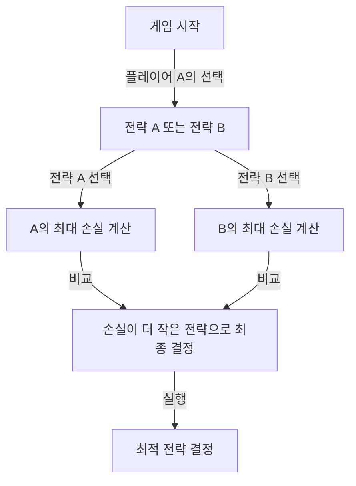
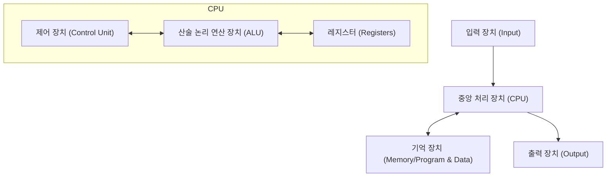

# 머리말: '화성인'이라 불리며 두려움의 대상이었던 남자

인류 역사상 '천재'라 불린 인물은 수없이 많습니다. 알베르트 아인슈타인, 아이작 뉴턴, 레오나르도 다빈치 등 역사에 이름을 남긴 위인들은 모두 특정 분야에서 두각을 나타냈습니다. 그러나 20세기에 실존했던 한 과학자는 이들마저도 뛰어넘는 '이차원의 지능'을 가졌다고 전해집니다. 그가 바로 존 폰 노이만(John von Neumann, 1903 - 1957)입니다.

그의 두뇌는 너무나도 인간의 경지를 벗어나 있었기에, 동료 과학자들은 반농담으로 "인간인 척하는 화성인", "악마의 두뇌"라고 속삭였습니다. 심지어 노벨상 수상자들조차 폰 노이만 앞에서는 자신의 지적 한계를 깨닫고 어린아이처럼 굴 수밖에 없었다는 일화가 수없이 남아있습니다.

본 기사에서는 이 "악마의 두뇌"가 어떻게 길러졌으며, 현대 사회의 모든 기초(컴퓨터, 양자역학, 게임 이론, 핵무기 등)를 어떻게 창조해냈는지 그의 치열한 생애와 압도적인 업적에 대해 가능한 한 깊고 자세하게 파헤쳐 보겠습니다.

## 제1장: 신동의 탄생과 헝가리의 기적

### 부다페스트의 부유한 유대계 가정
존 폰 노이만(본명: 노이만 야노시 러요시)은 1903년 12월 28일, 오스트리아-헝가리 제국의 수도 부다페스트에서 태어났습니다. 아버지 노이만 믹샤는 성공한 은행가로, 훗날 귀족 칭호(폰)를 받을 정도의 재력과 지위를 가지고 있었습니다. 이 부유한 환경은 폰 노이만의 비범한 재능을 꽃피우기 위한 완벽한 토양이 되었습니다.

### 경이로운 기억력과 계산 능력
폰 노이만의 신동으로서의 면모는 어릴 적부터 두드러졌습니다.
- **6세** 때 8자리 나눗셈을 암산으로 해냈고, 아버지와 고대 그리스어로 농담을 주고받았습니다.
- **8세** 때 미분과 적분의 개념을 완전히 이해하고 자유자재로 다루었습니다.
- **10세** 때 빌헬름 온켄의 『세계사』 총 44권을 독파하고, 그 내용을 토씨 하나 틀리지 않고 암송했다고 합니다. 사진 기억(Photographic Memory)이라고도 불리는 이 기억력은 평생 그의 강력한 무기가 되었습니다.

### '화성인'들의 모임
당시 부다페스트에는 폰 노이만 외에도 걸출한 유대계 인재들이 속속 태어나고 있었습니다. 유진 위그너(노벨 물리학상), 에드워드 텔러(수소폭탄의 아버지), 레오 실라르드(원자로 특허 취득자) 등이 그들입니다. 이들은 훗날 미국으로 건너가 그 뛰어난 지능 때문에 "화성인(The Martians)"이라 불리게 됩니다. 폰 노이만은 이 '화성인'들 중에서도 단연 돋보였으며, 그들 스스로 "진정한 천재라 부를 수 있는 사람은 폰 노이만뿐이다"라고 인정했을 정도입니다.

## 제2장: 수학의 위기와 젊은 천재의 대두

### 괴팅겐 대학과 다비트 힐베르트
청년기에 접어든 폰 노이만은 부다페스트 대학에서 수학을, 베를린 대학과 취리히 연방 공과대학교에서 화학 공학을 동시에 공부했습니다(이는 아버지가 수학만으로는 먹고살기 힘들 것이라 걱정했기 때문입니다). 불과 22세의 나이에 수학 박사 학위를 취득한 그는 당시 수학계의 중심지였던 독일 괴팅겐 대학으로 향합니다.

그곳에서 그는 당시 수학계의 절대적 권위자였던 다비트 힐베르트의 조수로 일했습니다. 힐베르트는 '수학의 완전성과 무모순성'을 증명하는 '힐베르트 프로그램'을 추진하고 있었는데, 폰 노이만은 이 거대한 계획에 깊이 관여하며 공리적 집합론 분야에서 결정적인 공헌을 합니다.

### 양자역학의 수학적 기초 확립
1920년대 후반, 물리학계에서는 양자역학이라는 새로운 이론이 탄생하여 큰 혼란이 일고 있었습니다. 베르너 하이젠베르크의 '행렬역학'과 에르빈 슈뢰딩거의 '파동역학'이라는 겉보기에도 접근 방식도 전혀 다른 두 이론이 병립하고 있었던 것입니다.

이때 폰 노이만은 특유의 압도적인 수학적 직관을 발휘합니다. 그는 '힐베르트 공간'이라는 수학적 개념을 도입하여 이 두 이론이 수학적으로 완전히 동치임을 증명했습니다. 1932년에 출판된 저서 『양자역학의 수학적 기초』는 불확실한 물리학의 세계에 엄밀한 수학적 질서를 부여한 금자탑으로서 현재까지도 양자역학의 바이블로 여겨집니다.

## 제3장: 프린스턴 고등연구소와 아인슈타인

### 나치의 대두와 미국으로의 망명
1930년대에 들어서자 독일에서는 아돌프 히틀러가 이끄는 나치가 대두하여 유대인에 대한 박해가 시작되었습니다. 위기를 직감한 폰 노이만은 발 빠르게 미국으로 건너갑니다. 그가 초빙된 곳은 뉴저지주에 갓 설립된 '프린스턴 고등연구소(IAS)'였습니다.

이 연구소에는 아인슈타인, 쿠르트 괴델 등 전 세계에서 최고의 두뇌들이 모여 있었습니다. 폰 노이만은 불과 29세의 나이로 이 연구소의 종신 교수로 임명됩니다(아인슈타인 등과 나란히 최연소 종신 교수였습니다).

### 이단적인 플레이 스타일
프린스턴에서의 폰 노이만은 다른 조용한 학자들과는 전혀 다른 행동을 보였습니다. 그는 엄청난 볼륨으로 독일 행진곡을 들으며 수학 난제를 풀었고, 화려한 파티를 자주 열었으며, 엄청난 속도로 차를 몰다 매년 새 차를 대파시키곤 했습니다(그가 자주 사고를 냈던 교차로는 '폰 노이만의 교차로'라 불릴 정도였습니다). 아인슈타인이 소박하고 고독한 삶을 선호했던 반면, 폰 노이만은 항상 슈트를 말끔하게 차려입고 세속적인 즐거움을 한껏 누렸습니다.

## 제4장: 게임 이론의 창시와 '냉전'의 논리

### 경제학에 수학을 도입하다
폰 노이만의 관심은 순수 수학이나 물리학에 머물지 않았습니다. 포커 등 실내 게임을 좋아했던 그는 "인간의 의사 결정이나 대립 관계를 수학적으로 기술할 수 없을까?"하고 생각했습니다. 이것이 바로 '게임 이론'의 탄생입니다.

1928년, 그는 '미니맥스 정리(Minimax theorem)'를 증명했습니다. 이는 대립하는 두 사람 간의 게임에서 "자신이 입을 수 있는 최대의 손실을 최소화"하도록 행동하는 것이 합리적이라는 정리입니다.

### 『게임 이론과 경제 행동』
1944년, 폰 노이만은 경제학자 오스카 모르겐슈테른과 함께 『게임 이론과 경제 행동』을 출판했습니다. 이 책은 경제학의 기초를 완전히 다시 쓸 정도의 충격을 안겨주었습니다. 인간이 시장에서 어떻게 경쟁하고 협력하며 가격을 결정하는지를 최초로 엄밀한 수학적 모델로 설명해낸 것입니다.

### 상호확증파괴(MAD)와 냉전
게임 이론의 사고방식은 제2차 세계대전 이후 동서 냉전 시기에 무서운 형태로 현실 세계에 적용되었습니다. 폰 노이만은 미국 정부와 군의 최고 브레인으로서 '핵 억지력 이론' 구축에 깊이 관여했습니다.

그가 제창한 전략의 극치가 바로 '상호확증파괴(Mutual Assured Destruction, MAD)'입니다. "상대방이 핵무기를 사용하면 확실하게 보복하여 상대방도 완전히 파괴한다. 이 확실한 파괴의 위협이 있기 때문에 양측 모두 핵무기를 사용할 수 없다"는, 광기와 이성이 교차하는 냉철한 논리였습니다.

## 제5장: 현대 컴퓨터의 아버지

폰 노이만의 업적 중 현대 우리의 삶에 가장 직접적이고 절대적인 영향을 미치고 있는 것이 바로 컴퓨터 과학에 대한 공헌입니다.

### ENIAC에서 EDVAC으로
제2차 세계대전 중 미국 육군은 탄도 계산을 위해 거대한 전자계산기 'ENIAC'을 개발하고 있었습니다. 그러나 ENIAC은 계산 프로그램을 바꿀 때마다 수많은 케이블의 배선을 다시 연결해야만 했습니다(이를 패치 패널 방식이라 부릅니다).

폰 노이만은 이 개발 프로젝트에 컨설턴트로 참여하여 즉시 ENIAC의 단점을 간파했습니다. 그는 "프로그램(명령)을 데이터와 마찬가지로 메모리에 기억시키면, 배선을 바꾸지 않고도 순식간에 프로그램을 전환할 수 있다"는 혁명적인 아이디어를 제안했습니다. 이것이 바로 '내장 프로그램 방식'입니다.

### 폰 노이만 아키텍처
1945년, 그는 『EDVAC에 관한 보고서 제1초안』을 집필하여 이 새로운 컴퓨터의 논리적 구조를 정의했습니다. 이것이 오늘날 '폰 노이만 아키텍처'라 불리는 것입니다.

지금 여러분이 사용하고 있는 스마트폰, PC, 슈퍼컴퓨터에 이르기까지 거의 100%의 컴퓨터가 80년 전 폰 노이만이 그린 이 아키텍처대로 작동하고 있습니다. 그의 두뇌야말로 IT 사회의 진정한 창조주였다고 해도 과언이 아닙니다.

## 제6장: 맨해튼 프로젝트와 '악마'의 소행

### 폭축 렌즈의 계산
제2차 세계대전 중 폰 노이만은 로스앨러모스 국립연구소에서 진행되던 원자폭탄 개발 프로젝트 '맨해튼 프로젝트'의 최고 핵심 인물 중 한 명이었습니다.

특히 플루토늄형 원자폭탄의 기폭에는 주변에서 폭약을 정밀하게 폭발시켜 플루토늄 구를 극한까지 압축하는 '폭축(Implosion) 렌즈'가 필요했습니다. 이 극도로 복잡한 유체역학 계산을 폰 노이만은 압도적인 계산 능력으로 해결했습니다. 나가사키에 투하된 원자폭탄 '팻 맨'은 폰 노이만의 수학적 계산이 없었다면 완성되지 못했을 것이라 일컬어집니다.

### 표적 위원회의 결정
더욱 두려운 것은 폰 노이만이 원자폭탄을 일본의 어느 곳에 투하할지를 결정하는 '표적 위원회'의 일원이기도 했다는 점입니다. 그는 원자폭탄의 파괴력을 극대화하기 위해 '교토'에 투하할 것을 강경하게 주장했으며, 나아가 "폭발의 위력을 과시하기 위해 경고 없이 투하해야 한다"고 제안했습니다(최종적으로 교토는 제외되었습니다).

이러한 철저한 합리주의와 냉철함은 폰 노이만이 '악마의 두뇌'라 불리는 이유이며, 영화 《닥터 스트레인지러브》(스탠리 큐브릭 감독)의 모델 중 한 명이 되었다고도 전해집니다.

## 제7장: 자기증식 오토마타와 인공 생명

말년에 이르러 폰 노이만의 사고는 "생명이란 무엇인가", "기계는 스스로를 복제할 수 있는가"라는 철학적인 영역에까지 도달했습니다.

그는 모눈종이 같은 격자(셀) 위에서 주변의 상태에 따라 셀의 상태가 변화하는 수학적 모델 '셀룰러 오토마타'를 고안했습니다. 그리고 이 모델 위에서 "자기 자신의 복사본을 만들어낼 수 있는 기계(자기증식 오토마타)"의 논리 구조를 완전히 증명해 냈습니다.

이는 DNA의 이중 나선 구조가 발견(1953년)되기 이전의 일입니다. 폰 노이만은 순수한 수학적 사고만으로 "자기 복제에는 설계도(DNA에 해당)와 이를 읽고 조립하는 기계가 필요하다"는 생명의 근원적인 메커니즘을 예언했던 것입니다. 그의 이 연구는 훗날 인공 생명(ALife)이나 복잡계 과학, 나아가 컴퓨터 바이러스의 개념으로 이어졌습니다.

## 맺음말: 인류에게는 너무 일렀던 지능

1957년 2월 8일, 존 폰 노이만은 암으로 인해 워싱턴 D.C.의 병원에서 53세의 젊은 나이로 세상을 떠났습니다. 그가 군사 기밀을 무의식중에 발설할 것을 두려워한 군은 그의 병실에 항상 헌병을 세워두었다고 합니다.

마지막 순간까지 그의 두뇌는 멈추지 않고 계속 움직였으나, 암의 진행으로 점차 기억을 잃어가는 것에 그는 깊은 공포를 느꼈습니다. 한때 책 한 권을 통째로 암기할 수 있었던 사내가 간단한 덧셈조차 하지 못하게 되어가는 과정은 주변의 누구에게나 너무나도 잔혹한 광경이었습니다.

존 폰 노이만. 그는 수학, 물리학, 경제학, 기상학, 컴퓨터 과학에 이르기까지 인류가 수백 년에 걸쳐 개척해야 할 영역을 단 한 사람의 생애 동안 내달리며 기초를 다져버렸습니다.

그의 업적은 너무나도 다방면에 걸쳐 있고 또 너무나도 심오하기에, 한 명의 인간이 이뤄낸 일이라고는 아직도 믿기 힘든 부분이 있습니다. 그가 진정 '화성인'이었는지는 알 수 없으나, 그가 남긴 '폰 노이만 아키텍처'라는 이름의 분신들은 지금 이 순간에도 전 세계에서 쉬지 않고 계산을 계속하고 있습니다.

우리가 살아가는 이 고도로 정보화된 세계야말로, 어쩌면 그 악마의 두뇌가 꾸었던 꿈의 연장선일지도 모릅니다.
