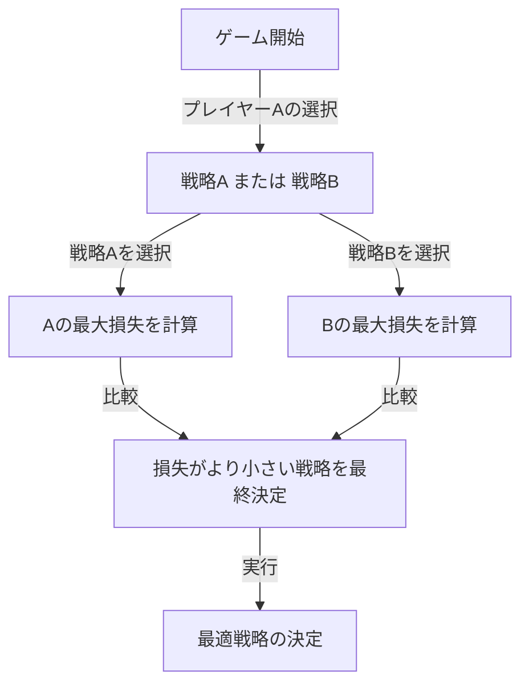
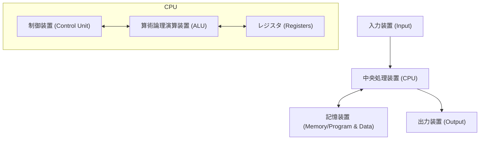

# はじめに：「火星人」と恐れられた男

人類の歴史において、「天才」と呼ばれる人物は数多く存在します。アルベルト・アインシュタイン、アイザック・ニュートン、レオナルド・ダ・ヴィンチなど、歴史に名を残す偉人たちは皆、特定の分野で突出した才能を発揮しました。しかし、20世紀に実在したある一人の科学者は、彼らをも凌駕するほどの「異次元の知能」を持っていたとされています。それが、ジョン・フォン・ノイマン（John von Neumann, 1903 - 1957）です。

彼の頭脳はあまりにも人間離れしていたため、同僚の科学者たちからは「人間のふりをしている火星人」「悪魔の頭脳」と半ば本気で囁かれていました。ノーベル賞受賞者たちでさえ、ノイマンの前では自らの知性の限界を悟り、子供のように振る舞うしかなかったという逸話が数多く残されています。

本記事では、この「悪魔の頭脳」がいかにして育まれ、そしていかにして現代社会のあらゆる基礎（コンピュータ、量子力学、ゲーム理論、核兵器など）を創り上げたのか、その壮絶な生涯と圧倒的な業績について、可能な限り深く、詳細に掘り下げていきます。

## 第1章：神童の誕生とハンガリーの奇跡

### ブダペストの裕福なユダヤ系家庭
ジョン・フォン・ノイマン（出生名：ノイマン・ヤーノシュ・ラヨシュ）は、1903年12月28日、オーストリア＝ハンガリー帝国の首都ブダペストに生まれました。父親のノイマン・ミクシャは成功した銀行家であり、後に貴族の称号（フォン）を授与されるほどの財力と地位を持っていました。この裕福な環境は、ノイマンの並外れた才能を開花させるための完璧な土壌となりました。

### 驚異的な記憶力と計算能力
ノイマンの神童ぶりは、幼少期から際立っていました。
- **6歳**で、8桁の割り算を頭の中だけで計算し、父親と古代ギリシャ語で冗談を言い合いました。
- **8歳**で、微分積分の概念を完全に理解し、使いこなしていました。
- **10歳**の時には、ウィルヘルム・オンケンの『世界史』全44巻を読破し、その内容を一言一句違わずに暗唱できたと言われています。この映像記憶（フォトグラフィック・メモリー）とも言える記憶力は、生涯を通じて彼の強力な武器となりました。

### 「火星人」たちの集い
当時のブダペストには、ノイマン以外にも傑出したユダヤ系の才能が次々と生まれていました。ユージン・ウィグナー（ノーベル物理学賞）、エドワード・テラー（水爆の父）、レオ・シラード（原子炉の特許取得者）などです。彼らは後にアメリカに渡り、その突出した知性から「火星人（The Martians）」と呼ばれるようになります。ノイマンは、この「火星人」たちの中でも筆頭格であり、彼ら自身が「本当に天才と呼べるのはノイマンだけだ」と認めていたほどです。

## 第2章：数学の危機と若き天才の台頭

### ゲッティンゲン大学とダフィット・ヒルベルト
青年期を迎えたノイマンは、ブダペスト大学で数学を、ベルリン大学とチューリッヒ工科大学で化学工学を同時に学びました（これは父親が数学だけでは食べていけないと心配したためです）。わずか22歳で数学の博士号を取得すると、当時の数学世界の中心地であったドイツのゲッティンゲン大学に赴きます。

そこで彼は、当時の数学界の絶対的権威であるダフィット・ヒルベルトの助手を務めました。ヒルベルトは「数学の完全性・無矛盾性」を証明する「ヒルベルト・プログラム」を推進していましたが、ノイマンはこの壮大な計画に深く関与し、公理的集合論の分野で決定的な貢献を果たします。

### 量子力学の数学的基礎づけ
1920年代後半、物理学の世界では量子力学という新しい理論が誕生し、大きな混乱が生じていました。ヴェルナー・ハイゼンベルクの「行列力学」とエルヴィン・シュレーディンガーの「波動力学」という、見た目もアプローチも全く異なる2つの理論が並立していたのです。

ここでノイマンは、持ち前の圧倒的な数学的直観を発揮します。彼は「ヒルベルト空間」という数学的概念を用いることで、これら2つの理論が数学的に全く同値であることを証明しました。1932年に出版された著書『量子力学の数学的基礎』は、物理学という不確実な世界に、厳密な数学的秩序をもたらした金字塔として、現在でも量子力学のバイブルとされています。

## 第3章：プリンストン高等研究所とアインシュタイン

### ナチスの台頭とアメリカへの逃亡
1930年代に入ると、ドイツでアドルフ・ヒトラー率いるナチスが台頭し、ユダヤ人に対する迫害が始まりました。危機を察知したノイマンは、いち早くアメリカへと渡ります。彼が招聘されたのは、ニュージャージー州に新設されたばかりの「プリンストン高等研究所（IAS）」でした。

この研究所には、アインシュタインやクルト・ゲーデルなど、世界中から最高峰の頭脳が集められていました。ノイマンは、わずか29歳で同研究所の終身教授に就任します（アインシュタインらと並び、最年少の終身教授でした）。

### 異端のプレイスタイル
プリンストンでのノイマンは、他の静かな学者たちとは全く異なる行動をとっていました。彼は大音量でドイツのマーチを聴きながら数学の難問を解き、頻繁に豪華なパーティーを開き、車を猛スピードで運転しては毎年のように新車を大破させていました（彼がよく事故を起こした交差点は「フォン・ノイマンの交差点」と呼ばれたほどです）。アインシュタインが質素で孤独な生活を好んだのに対し、ノイマンは常にスーツをパリッと着こなし、俗世間の楽しみを大いに享受していました。

## 第4章：ゲーム理論の創設と「冷戦」の論理

### 経済学への数学の導入
ノイマンの興味は、純粋数学や物理学にとどまりませんでした。ポーカーなどの室内ゲームが好きだった彼は、「人間の意思決定や対立関係を数学的に記述できないか」と考えました。これが「ゲーム理論」の誕生です。

1928年、彼は「ミニマックス定理（Minimax theorem）」を証明しました。これは、対立する二者間のゲームにおいて、「自分が受ける最大の損失を最小にする」ように行動するのが合理的であるという定理です。

### 『ゲームの理論と経済行動』
1944年、ノイマンは経済学者オスカー・モルゲンシュテルンと共に『ゲームの理論と経済行動』を出版しました。この本は、経済学の基礎を完全に書き換えるほどの衝撃を与えました。人間が市場でどのように競争し、協力し、価格を決定するのかを、初めて厳密な数学的モデルで説明したのです。

### 相互確証破壊（MAD）と冷戦
ゲーム理論の考え方は、第二次世界大戦後の東西冷戦において、恐ろしい形で現実世界に適用されました。ノイマンはアメリカ政府と軍の最強のブレインとして、「核抑止論」の構築に深く関与しました。

彼が提唱した戦略の極致が「相互確証破壊（Mutual Assured Destruction, MAD）」です。「相手が核兵器を使えば、確実に報復して相手も完全に破壊する。この確実な破壊の脅威があるからこそ、双方は核兵器を使えない」という、狂気と理性が交錯する冷徹な論理でした。

## 第5章：現代コンピュータの父

ノイマンの業績の中で、現代の我々の生活に最も直接的かつ絶大な影響を与えているのが、コンピュータ科学への貢献です。

### ENIACからEDVACへ
第二次世界大戦中、アメリカ陸軍は弾道計算のために巨大な電子計算機「ENIAC」を開発していました。しかし、ENIACは計算プログラムを変更するたびに、大量のケーブルを配線し直す必要がありました（これをパッチパネル方式と呼びます）。

ノイマンはこの開発プロジェクトにコンサルタントとして参加し、すぐにENIACの欠点を見抜きました。彼は、「プログラム（命令）をデータと同じようにメモリ上に記憶させれば、配線を変えずに瞬時にプログラムを切り替えられる」という革命的なアイデアを提案しました。これが「プログラム内蔵方式」です。

### フォン・ノイマン・アーキテクチャ
1945年、彼は『EDVACに関する報告書の第一草稿』を執筆し、この新しいコンピュータの論理的構造を定義しました。これが今日「フォン・ノイマン型アーキテクチャ」と呼ばれるものです。

現在あなたが使っているスマートフォン、PC、スーパーコンピュータに至るまで、ほぼ100%のコンピュータが、80年前にノイマンが描いたこのアーキテクチャの通りに動いています。彼の頭脳こそが、IT社会の真の創造主であったと言っても過言ではありません。

## 第6章：マンハッタン計画と「悪魔」の所業

### 爆縮レンズの計算
第二次世界大戦中、ノイマンはロスアラモス国立研究所で進められていた原爆開発プロジェクト「マンハッタン計画」の最重要人物の一人でした。

特にプルトニウム型原爆の起爆には、周囲から爆薬を精密に爆発させ、プルトニウム球を極限まで圧縮する「爆縮（インプロージョン）レンズ」が必要でした。この極めて複雑な流体力学の計算を、ノイマンはその圧倒的な計算力で解決しました。長崎に投下された原爆「ファットマン」は、ノイマンの数学的計算がなければ完成しなかったと言われています。

### 標的委員会の決定
さらに恐ろしいことに、ノイマンは原爆を日本のどこに投下すべきかを決定する「標的委員会」のメンバーでもありました。彼は、原爆の破壊力を最大化するために「京都」への投下を強硬に主張し、さらに「爆発の威力を誇示するために、警告なしで投下すべきだ」と提案しました（最終的に京都は除外されましたが）。

この徹底した合理主義と冷徹さは、ノイマンが「悪魔の頭脳」と呼ばれるゆえんであり、映画博士のモデルの一人（スタンリー・キューブリック監督の『博士の異常な愛情』のストレンジラヴ博士）になったとも言われています。

## 第7章：自己増殖オートマトンと人工生命

晩年、ノイマンの思考は「生命とは何か」「機械は自らを複製できるか」という哲学的な領域にまで達しました。

彼は、方眼紙のような格子（セル）の上で、周囲の状態に応じてセルの状態が変化する数学的モデル「セル・オートマトン」を考案しました。そして、このモデル上で「自分自身のコピーを作り出すことができる機械（自己増殖オートマトン）」の論理構造を完全に証明しました。

これは、DNAの二重らせん構造が発見される（1953年）よりも前の出来事です。ノイマンは純粋な数学的思考だけで、「自己複製には、設計図（DNAに相当）と、それを読み取って組み立てる機械が必要である」という生命の根源的なメカニズムを予言していたのです。彼のこの研究は、後に人工生命（ALife）や複雑系の科学、さらにはコンピュータウイルスの概念へと繋がっていきました。

## おわりに：人類には早すぎた知能

1957年2月8日、ジョン・フォン・ノイマンは癌のため、ワシントンD.C.の病院で53歳の若さでこの世を去りました。彼が軍事機密を無意識に喋ってしまうことを恐れた軍は、彼の病室に常に憲兵を立たせていたと言われています。

最後の瞬間まで彼の頭脳は止まることなく動き続けていましたが、癌の進行により徐々に記憶を失っていくことに、彼は深い恐怖を抱いていました。かつて一冊の本を丸暗記できた男が、簡単な足し算すらできなくなっていく過程は、周囲の誰にとってもあまりにも残酷な光景でした。

ジョン・フォン・ノイマン。彼は数学、物理学、経済学、気象学、コンピュータ科学に至るまで、人類が数百年かけて開拓すべき領域を、たった一人の生涯で駆け抜け、基礎を築いてしまいました。

彼の業績はあまりにも多岐にわたり、そしてあまりにも深遠であるため、一人の人間が成し遂げたこととは未だに信じがたい部分があります。彼が「火星人」であったかどうかは定かではありませんが、彼が残した「フォン・ノイマン・アーキテクチャ」という名の分身たちは、今この瞬間も世界中で休むことなく計算を続けています。

私たちが生きるこの高度に情報化された世界こそが、悪魔の頭脳が見た夢の続きなのかもしれません。
