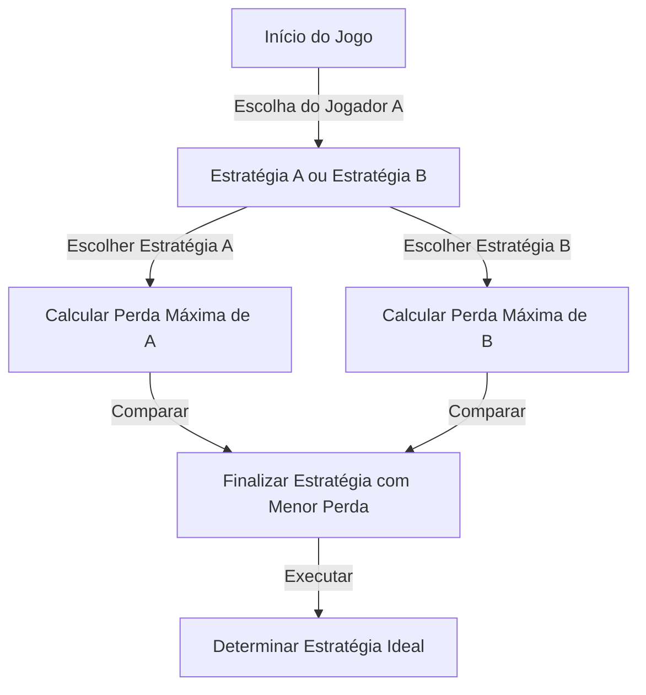
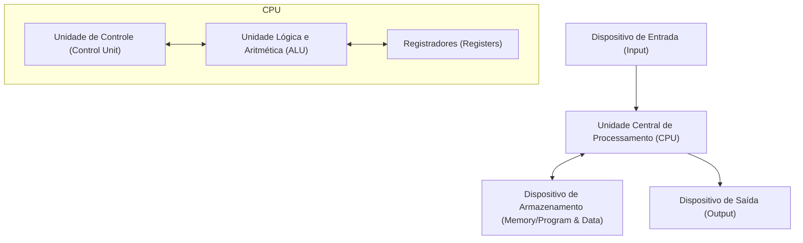

# Introdução: O Homem Temido como um "Marciano"

Ao longo da história da humanidade, existiram muitos indivíduos chamados de "gênios". Grandes figuras como Albert Einstein, Isaac Newton e Leonardo da Vinci demonstraram um talento excepcional em campos específicos. No entanto, diz-se que um certo cientista que viveu no século 20 possuía uma "inteligência de outra dimensão" que superava até mesmo a deles. Esse foi John von Neumann (1903 - 1957).

Seu cérebro estava tão além do humano que seus colegas cientistas sussurravam meio brincando que ele era um "marciano fingindo ser humano" ou que tinha o "Cérebro do Diabo". Existem muitas anedotas de até mesmo vencedores do Prêmio Nobel percebendo os limites de seus próprios intelectos diante de von Neumann e não tendo outra escolha a não ser agir como crianças.

Este artigo se aprofundará o máximo possível em como esse "Cérebro do Diabo" foi cultivado e como ele criou as bases de todos os aspectos da sociedade moderna (computadores, mecânica quântica, teoria dos jogos, armas nucleares, etc.), explorando sua vida feroz e suas realizações esmagadoras.

## Capítulo 1: O Nascimento de um Prodígio e o Milagre Húngaro

### Uma Rica Família Judaica em Budapeste
John von Neumann (nome de nascimento: Neumann János Lajos) nasceu em 28 de dezembro de 1903, em Budapeste, a capital do Império Austro-Húngaro. Seu pai, Neumann Miksa, foi um banqueiro de sucesso que mais tarde teve riqueza e status para receber um título de nobreza (von). Esse ambiente próspero tornou-se o solo perfeito para que os talentos extraordinários de von Neumann florescessem.

### Memória Incrível e Capacidade de Cálculo
A natureza de prodígio de von Neumann se destacou desde cedo.
- Aos **6 anos**, ele podia calcular divisões de 8 dígitos inteiramente de cabeça e brincava com seu pai em grego antigo.
- Aos **8 anos**, ele entendia e utilizava completamente os conceitos de cálculo diferencial e integral.
- Aos **10 anos**, diz-se que ele leu todos os 44 volumes da "História do Mundo" de Wilhelm Oncken e podia recitá-los palavra por palavra. Essa memória, que poderia ser chamada de memória fotográfica, tornou-se sua arma poderosa por toda a vida.

### O Encontro dos "Marcianos"
Na Budapeste da época, talentos judaicos excepcionais nasciam um após o outro ao lado de von Neumann. Estes incluíam Eugene Wigner (Prêmio Nobel de Física), Edward Teller (pai da bomba de hidrogênio) e Leo Szilard (detentor da patente do reator nuclear). Mais tarde, eles se mudaram para os Estados Unidos e ficaram conhecidos como "Os Marcianos" devido a seus intelectos excepcionais. Von Neumann era o principal entre esses "marcianos", a ponto de eles próprios admitirem: "Apenas von Neumann pode ser verdadeiramente chamado de gênio."

## Capítulo 2: A Crise da Matemática e a Ascensão do Jovem Gênio

### A Universidade de Göttingen e David Hilbert
Entrando na juventude, von Neumann estudou matemática na Universidade de Budapeste, e engenharia química simultaneamente na Universidade de Berlim e na ETH Zurique (isso porque seu pai temia que ele não pudesse ganhar a vida apenas com a matemática). Ao obter seu doutorado em matemática com apenas 22 anos, dirigiu-se à Universidade de Göttingen, na Alemanha, o centro do mundo matemático da época.

Lá ele atuou como assistente de David Hilbert, a autoridade absoluta no mundo matemático da época. Hilbert estava promovendo o "Programa de Hilbert" para provar a "completude e consistência da matemática", e von Neumann se envolveu profundamente nesse grande plano, fazendo contribuições decisivas no campo da teoria axiomática dos conjuntos.

### Fundamentos Matemáticos da Mecânica Quântica
No final da década de 1920, uma nova teoria chamada mecânica quântica nasceu no mundo da física, causando grande confusão. Duas teorias, a "Mecânica Matricial" de Werner Heisenberg e a "Mecânica Ondulatória" de Erwin Schrödinger, que pareciam completamente diferentes em aparência e abordagem, coexistiam lado a lado.

Aqui, von Neumann demonstrou sua esmagadora intuição matemática. Usando o conceito matemático de "espaço de Hilbert", ele provou que essas duas teorias são matematicamente inteiramente equivalentes. Seu livro "Fundamentos Matemáticos da Mecânica Quântica", publicado em 1932, ainda é considerado a bíblia da mecânica quântica como uma obra monumental que trouxe estrita ordem matemática ao mundo incerto da física.

## Capítulo 3: O Instituto de Estudos Avançados de Princeton e Einstein

### A Ascensão dos Nazistas e a Fuga para a América
Na década de 1930, os nazistas liderados por Adolf Hitler chegaram ao poder na Alemanha, e a perseguição aos judeus começou. Sentindo a crise, von Neumann fugiu para a América cedo. Ele foi convidado para o recém-criado "Instituto de Estudos Avançados (IAS)" em Princeton, Nova Jersey.

Este instituto reuniu as maiores mentes de todo o mundo, incluindo Einstein e Kurt Gödel. Von Neumann tornou-se professor titular no instituto na tenra idade de 29 anos (ao lado de Einstein e outros, ele foi o professor titular mais jovem).

### Um Estilo de Jogo Pouco Ortodoxo
Em Princeton, von Neumann agiu de forma completamente diferente dos outros estudiosos silenciosos. Ele resolvia problemas matemáticos difíceis enquanto ouvia marchas alemãs altas, frequentemente dava festas luxuosas, dirigia carros a velocidades vertiginosas e destruía um carro novo quase todos os anos (o cruzamento onde ele frequentemente causava acidentes foi até chamado de "cruzamento de von Neumann"). Enquanto Einstein preferia uma vida simples e solitária, von Neumann sempre usava ternos impecáveis e desfrutava muito dos prazeres mundanos.

## Capítulo 4: A Criação da Teoria dos Jogos e a Lógica da "Guerra Fria"

### Introduzindo a Matemática na Economia
Os interesses de von Neumann não paravam na matemática pura e física. Fã de jogos de salão como o pôquer, ele se perguntava: "A tomada de decisões e os conflitos humanos podem ser descritos matematicamente?" Este foi o nascimento da "Teoria dos Jogos".

Em 1928, ele provou o "Teorema Minimax". Este é um teorema afirmando que em um jogo entre duas partes opostas, é racional agir de forma a "minimizar a perda máxima que se pode sofrer".

### "Teoria dos Jogos e Comportamento Econômico"
Em 1944, von Neumann publicou "Teoria dos Jogos e Comportamento Econômico" com o economista Oskar Morgenstern. Este livro causou tanto choque que reescreveu completamente os fundamentos da economia. Foi a primeira vez que a forma como os humanos competem, cooperam e determinam os preços no mercado foi explicada por um modelo matemático rigoroso.

### Destruição Mútua Assegurada (MAD) e a Guerra Fria
O conceito de teoria dos jogos foi aplicado ao mundo real de maneiras aterrorizantes durante a Guerra Fria Leste-Oeste após a Segunda Guerra Mundial. Von Neumann, como o cérebro mais forte do governo e das forças armadas dos EUA, esteve profundamente envolvido na construção da "teoria da dissuasão nuclear".

A estratégia final que ele defendia era a "Destruição Mútua Assegurada (MAD)". Era uma lógica de coração frio onde a loucura e a razão se cruzavam: "Se o oponente usar armas nucleares, certamente retaliaremos e destruiremos completamente o oponente. Devido a esta ameaça certa de destruição, nenhum dos lados pode usar armas nucleares."

## Capítulo 5: O Pai do Computador Moderno

Entre as realizações de von Neumann, a que tem o impacto mais direto e imenso em nossas vidas modernas é sua contribuição para a ciência da computação.

### Do ENIAC ao EDVAC
Durante a Segunda Guerra Mundial, o Exército dos EUA estava desenvolvendo um enorme computador eletrônico, "ENIAC", para cálculos balísticos. No entanto, o ENIAC exigia refazer a fiação de uma enorme quantidade de cabos toda vez que o programa de cálculo era alterado (isso é chamado de método do painel de conexões).

Von Neumann se juntou a este projeto de desenvolvimento como consultor e imediatamente viu as falhas do ENIAC. Ele propôs uma ideia revolucionária: "Se os programas (instruções) forem armazenados na memória assim como os dados, você pode alternar instantaneamente de programa sem alterar a fiação." Este é o "conceito de programa armazenado".

### Arquitetura de Von Neumann
Em 1945, ele escreveu o "Primeiro Esboço de um Relatório sobre o EDVAC", definindo a estrutura lógica deste novo computador. Isso é o que é chamado hoje de "Arquitetura de Von Neumann".

Do smartphone que você está usando atualmente aos PCs e supercomputadores, quase 100% dos computadores operam exatamente de acordo com a arquitetura que von Neumann elaborou 80 anos atrás. Não é exagero dizer que seu cérebro foi o verdadeiro criador da sociedade da tecnologia da informação.

## Capítulo 6: O Projeto Manhattan e as Ações do "Diabo"

### Cálculo de Lentes de Implosão
Durante a Segunda Guerra Mundial, von Neumann foi uma das figuras mais importantes no "Projeto Manhattan", o projeto de desenvolvimento da bomba atômica em andamento no Laboratório Nacional de Los Alamos.

Particularmente para detonar a bomba atômica do tipo plutônio, "lentes de implosão" eram necessárias para explodir explosivos com precisão a partir dos arredores e comprimir a esfera de plutônio ao extremo. Von Neumann resolveu este cálculo de dinâmica de fluidos extremamente complexo com seu poder de computação esmagador. Diz-se que a bomba atômica "Fat Man" lançada sobre Nagasaki não teria sido concluída sem os cálculos matemáticos de von Neumann.

### Decisão do Comitê de Alvos
Ainda mais aterrorizante, von Neumann também foi membro do "Comitê de Alvos" que decidiu onde lançar as bombas atômicas no Japão. Ele defendeu fortemente lançá-la sobre "Kyoto" para maximizar o poder destrutivo da bomba atômica e sugeriu ainda "lançá-la sem aviso prévio para mostrar o poder da explosão" (embora Kyoto tenha sido eventualmente excluída).

Esse racionalismo completo e frieza são as razões pelas quais von Neumann foi chamado de "Cérebro do Diabo" e diz-se que foi um dos modelos para o Dr. Fantástico (dirigido por Stanley Kubrick).

## Capítulo 7: Autômatos Autorreprodutores e Vida Artificial

Em seus últimos anos, os pensamentos de von Neumann chegaram ao reino filosófico de "O que é a vida?" e "Podem as máquinas se reproduzir?"

Ele idealizou um modelo matemático, o "autômato celular", em uma grade (células) como papel quadriculado, onde o estado de uma célula muda dependendo do estado de seus arredores. E ele provou completamente a estrutura lógica de uma "máquina que pode criar cópias de si mesma (autômato autorreprodutor)" neste modelo.

Isso aconteceu antes da descoberta da estrutura de dupla hélice do DNA (1953). Usando o pensamento puramente matemático, von Neumann previu o mecanismo fundamental da vida: "A autorreplicação requer um projeto (equivalente ao DNA) e uma máquina para lê-lo e montá-lo." Sua pesquisa mais tarde levou aos conceitos de Vida Artificial (ALife), ciência dos sistemas complexos e até vírus de computador.

## Conclusão: Uma Inteligência Muito Precoce para a Humanidade

Em 8 de fevereiro de 1957, John von Neumann faleceu de câncer em um hospital em Washington D.C. na tenra idade de 53 anos. Temendo que ele pudesse vazar inconscientemente segredos militares, diz-se que os militares mantiveram a polícia militar estacionada em seu quarto de hospital o tempo todo.

Seu cérebro continuou a trabalhar sem parar até o momento final, mas ele tinha um profundo pavor de perder gradualmente a memória à medida que o câncer progredia. O processo de um homem que antes conseguia memorizar um livro inteiro tornar-se incapaz de fazer até mesmo adições simples foi uma visão cruel para qualquer pessoa ao seu redor.

John von Neumann. Ele percorreu e construiu os alicerces de áreas que a humanidade deveria ter levado centenas de anos para desbravar (da matemática, física, economia, meteorologia à ciência da computação) em apenas uma única vida.

Como suas realizações são tão diversas e profundas, ainda é difícil acreditar que foram realizadas por um único ser humano. Se ele era um "marciano" ou não, é incerto, mas seus clones chamados "Arquitetura de Von Neumann" continuam a calcular sem descanso em todo o mundo neste exato momento.

Este mundo altamente orientado para a informação em que vivemos pode ser apenas a continuação do sonho visto pelo cérebro do diabo.
