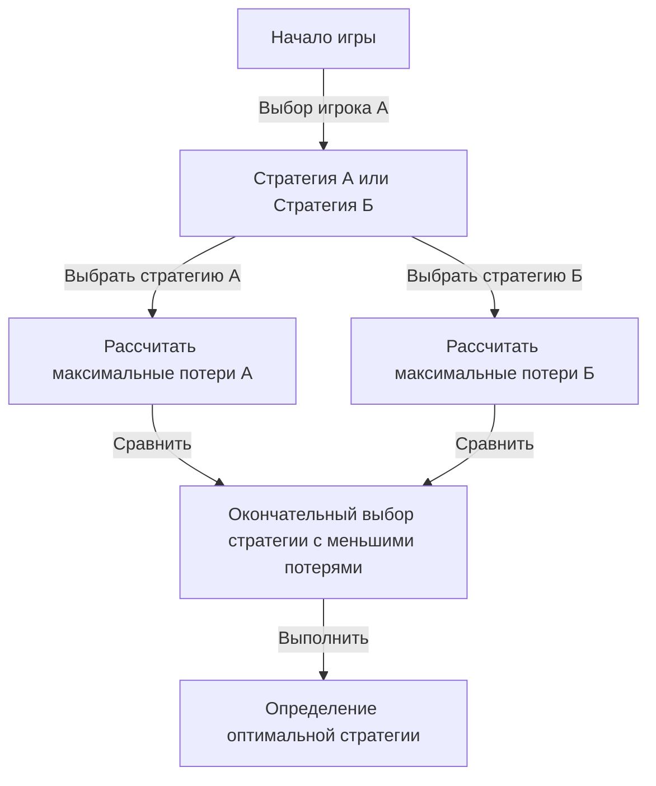
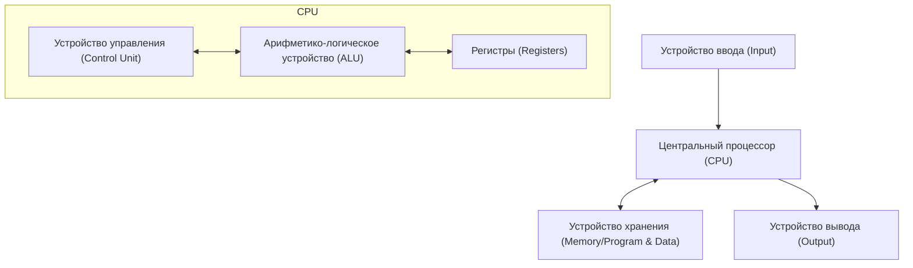

# Введение: Человек, которого боялись как "марсианина"

На протяжении всей истории человечества было много людей, которых называли «гениями». Такие великие личности, как Альберт Эйнштейн, Исаак Ньютон и Леонардо да Винчи, демонстрировали выдающиеся таланты в определенных областях. Однако говорят, что один ученый, живший в 20-м веке, обладал «интеллектом из другого измерения», который превосходил даже их. Это был Джон фон Нейман (1903 - 1957).

Его мозг настолько превосходил человеческий, что его коллеги-ученые полушутя шептались, что он «марсианин, притворяющийся человеком» или обладает «мозгом дьявола». Сохранилось множество анекдотов о том, как даже лауреаты Нобелевской премии, осознавая пределы собственного интеллекта перед фон Нейманом, не имели иного выбора, кроме как вести себя как дети.

В этой статье мы максимально глубоко и подробно рассмотрим, как развивался этот «мозг дьявола» и как он создал основы современного общества (компьютеры, квантовая механика, теория игр, ядерное оружие и т. д.), исследуя его бурную жизнь и ошеломляющие достижения.

## Глава 1: Рождение вундеркинда и венгерское чудо

### Богатая еврейская семья в Будапеште
Джон фон Нейман (имя при рождении: Нейман Янош Лайош) родился 28 декабря 1903 года в Будапеште, столице Австро-Венгерской империи. Его отец, Нейман Микша, был успешным банкиром, который впоследствии приобрел богатство и статус, позволившие ему получить дворянский титул (фон). Эта благополучная среда стала идеальной почвой для расцвета необычайных талантов фон Неймана.

### Невероятная память и вычислительные способности
Гениальность фон Неймана проявлялась с раннего возраста.
- В **6 лет** он мог в уме делить 8-значные числа и шутил с отцом на древнегреческом языке.
- В **8 лет** он полностью понимал и использовал концепции дифференциального и интегрального исчисления.
- В **10 лет**, как говорят, он прочитал все 44 тома «Всемирной истории» Вильгельма Онкена и мог цитировать их слово в слово. Эта память, которую можно назвать фотографической, стала его мощным оружием на протяжении всей жизни.

### Собрание "марсиан"
В Будапеште в то время, наряду с фон Нейманом, один за другим рождались выдающиеся еврейские таланты. Среди них были Юджин Вигнер (Нобелевская премия по физике), Эдвард Теллер (отец водородной бомбы) и Лео Силард (обладатель патента на ядерный реактор). Позже они переехали в Соединенные Штаты и стали известны как «марсиане» из-за своего выдающегося интеллекта. Фон Нейман был главным среди этих «марсиан», до такой степени, что они сами признавали: «Только фон Неймана можно по-настоящему назвать гением».

## Глава 2: Кризис математики и взлет молодого гения

### Геттингенский университет и Давид Гильберт
В юности фон Нейман изучал математику в Будапештском университете и одновременно химическую инженерию в Берлинском университете и Швейцарской высшей технической школе Цюриха (это было связано с тем, что его отец беспокоился, что он не сможет заработать на жизнь одной лишь математикой). Получив докторскую степень по математике всего в 22 года, он отправился в Геттингенский университет в Германии, бывший в то время центром математического мира.

Там он работал ассистентом Давида Гильберта, абсолютного авторитета в математическом мире того времени. Гильберт продвигал «Программу Гильберта» для доказательства «полноты и непротиворечивости математики», и фон Нейман глубоко погрузился в этот грандиозный план, внеся решающий вклад в область аксиоматической теории множеств.

### Математические основы квантовой механики
В конце 1920-х годов в мире физики родилась новая теория, названная квантовой механикой, что вызвало большую путаницу. Две теории, «матричная механика» Вернера Гейзенберга и «волновая механика» Эрвина Шрёдингера, которые выглядели совершенно по-разному с точки зрения формы и подхода, существовали параллельно.

Здесь фон Нейман продемонстрировал свою ошеломляющую математическую интуицию. Используя математическую концепцию «гильбертова пространства», он доказал, что эти две теории математически полностью эквивалентны. Его книга «Математические основы квантовой механики», опубликованная в 1932 году, до сих пор считается библией квантовой механики как монументальный труд, который привнес строгий математический порядок в неопределенный мир физики.

## Глава 3: Институт перспективных исследований в Принстоне и Эйнштейн

### Возвышение нацистов и бегство в Америку
В 1930-х годах к власти в Германии пришли нацисты во главе с Адольфом Гитлером, и начались преследования евреев. Предчувствуя кризис, фон Нейман рано бежал в Америку. Его пригласили в недавно созданный «Институт перспективных исследований (IAS)» в Принстоне, штат Нью-Джерси.

В этом институте собрались величайшие умы со всего мира, включая Эйнштейна и Курта Гёделя. Фон Нейман стал штатным профессором института в молодом возрасте 29 лет (наряду с Эйнштейном и другими он был самым молодым штатным профессором).

### Неортодоксальный стиль игры
В Принстоне фон Нейман вел себя совершенно иначе, чем другие тихие ученые. Он решал сложные математические задачи, слушая громкие немецкие марши, часто устраивал роскошные вечеринки, водил машины на головокружительной скорости и разбивал новую машину почти каждый год (перекресток, на котором он часто попадал в аварии, даже называли «перекрестком фон Неймана»). В то время как Эйнштейн предпочитал простую и уединенную жизнь, фон Нейман всегда носил безупречные костюмы и в полной мере наслаждался мирскими радостями.

## Глава 4: Создание теории игр и логика «холодной войны»

### Внедрение математики в экономику
Интересы фон Неймана не ограничивались чистой математикой и физикой. Увлекаясь комнатными играми, такими как покер, он задался вопросом: «Можно ли математически описать процесс принятия решений человеком и конфликты?» Так родилась «Теория игр».

В 1928 году он доказал «Теорему минимакса». Это теорема, утверждающая, что в игре между двумя противоборствующими сторонами рационально действовать так, чтобы «свести к минимуму максимальные потери, которые можно понести».

### «Теория игр и экономическое поведение»
В 1944 году фон Нейман вместе с экономистом Оскаром Моргенштерном опубликовал книгу «Теория игр и экономическое поведение». Эта книга вызвала такой шок, что полностью переписала основы экономики. Впервые с помощью строгой математической модели было объяснено, как люди конкурируют, сотрудничают и определяют цены на рынке.

### Взаимное гарантированное уничтожение (MAD) и холодная война
Концепция теории игр была применена к реальному миру ужасающим образом во время холодной войны между Востоком и Западом после Второй мировой войны. Фон Нейман, будучи сильнейшим умом правительства и вооруженных сил США, принимал активное участие в создании «теории ядерного сдерживания».

Окончательной стратегией, которую он отстаивал, было «Взаимное гарантированное уничтожение (MAD)». Это была холодная логика, в которой пересекались безумие и разум: «Если противник применит ядерное оружие, мы обязательно нанесем ответный удар и полностью уничтожим противника. Из-за этой верной угрозы уничтожения ни одна из сторон не может применить ядерное оружие».

## Глава 5: Отец современного компьютера

Среди достижений фон Неймана наибольшее прямое и колоссальное влияние на нашу современную жизнь оказал его вклад в информатику.

### От ENIAC к EDVAC
Во время Второй мировой войны армия США разрабатывала огромный электронный вычислитель «ENIAC» для баллистических расчетов. Однако ENIAC требовал переподключения огромного количества кабелей каждый раз при изменении программы расчета (это называется методом коммутационной панели).

Фон Нейман присоединился к этому проекту разработки в качестве консультанта и сразу же увидел недостатки ENIAC. Он предложил революционную идею: «Если программы (инструкции) хранятся в памяти так же, как и данные, вы можете мгновенно переключать программы, не меняя проводку». Это «концепция хранимой программы».

### Архитектура фон Неймана
В 1945 году он написал «Первый проект отчета об EDVAC», определив логическую структуру этого нового компьютера. Это то, что сегодня называется «Архитектурой фон Неймана».

От смартфона, которым вы сейчас пользуетесь, до ПК и суперкомпьютеров, почти 100% компьютеров работают в точности в соответствии с архитектурой, которую фон Нейман разработал 80 лет назад. Не будет преувеличением сказать, что его мозг был истинным создателем ИТ-общества.

## Глава 6: Манхэттенский проект и деяния «дьявола»

### Расчет имплозивных линз
Во время Второй мировой войны фон Нейман был одной из самых важных фигур в «Манхэттенском проекте» — проекте по разработке атомной бомбы, осуществлявшемся в Национальной лаборатории Лос-Аламоса.

В частности, для детонации плутониевой атомной бомбы требовались «имплозивные линзы», чтобы точно взорвать взрывчатку со всех сторон и максимально сжать плутониевую сферу. Фон Нейман решил этот чрезвычайно сложный расчет гидродинамики с помощью своей огромной вычислительной мощности. Говорят, что атомная бомба «Толстяк», сброшенная на Нагасаки, не была бы завершена без математических расчетов фон Неймана.

### Решение Комитета по выбору целей
Что еще более ужасающе, фон Нейман также был членом «Комитета по выбору целей», который решал, куда сбросить атомные бомбы в Японии. Он решительно выступал за то, чтобы сбросить ее на «Киото», чтобы максимизировать разрушительную силу атомной бомбы, и далее предложил «сбросить ее без предупреждения, чтобы продемонстрировать мощь взрыва» (хотя Киото в конечном итоге был исключен).

Этот крайний рационализм и бессердечность являются причинами, по которым фон Неймана называли «мозгом дьявола», и говорят, что он был одним из прототипов доктора Стрейнджлава (режиссер Стэнли Кубрик).

## Глава 7: Самовоспроизводящиеся автоматы и искусственная жизнь

В последние годы жизни мысли фон Неймана достигли философской сферы вопросов: «Что такое жизнь?» и «Могут ли машины воспроизводить сами себя?»

Он разработал математическую модель «клеточного автомата» на сетке (ячейках), похожей на миллиметровку, где состояние ячейки изменяется в зависимости от состояния ее окружения. И он полностью доказал на этой модели логическую структуру «машины, которая может создавать копии самой себя (самовоспроизводящийся автомат)».

Это произошло еще до открытия структуры двойной спирали ДНК (1953 г.). Используя чисто математическое мышление, фон Нейман предсказал фундаментальный механизм жизни: «Для самовоспроизведения требуются чертеж (эквивалент ДНК) и машина, которая могла бы его читать и собирать». Его исследования впоследствии привели к концепциям искусственной жизни (ALife), науке о сложных системах и даже к компьютерным вирусам.

## Заключение: Интеллект, опередивший человечество

8 февраля 1957 года Джон фон Нейман скончался от рака в больнице Вашингтона, округ Колумбия, в молодом возрасте 53 лет. Опасаясь, что он может бессознательно выдать военные секреты, военные, как говорят, постоянно держали военную полицию в его больничной палате.

Его мозг продолжал работать без остановки до последнего момента, но он испытывал глубокий ужас перед тем, что по мере прогрессирования рака будет постепенно терять память. Процесс превращения человека, который когда-то мог выучить наизусть целую книгу, в того, кто не мог произвести даже простое сложение, был жестоким зрелищем для всех окружающих.

Джон фон Нейман. Всего за одну жизнь он прошел через и заложил основы областей, на освоение которых человечеству должны были потребоваться сотни лет — от математики, физики, экономики, метеорологии до информатики.

Поскольку его достижения настолько разнообразны и глубоки, до сих пор трудно поверить, что они были совершены одним человеком. Был ли он «марсианином» или нет, неизвестно, но его клоны под названием «Архитектура фон Неймана» продолжают безостановочно вычислять по всему миру прямо сейчас.

Этот высокоинформационный мир, в котором мы живем, возможно, является лишь продолжением сна, который увидел мозг дьявола.
