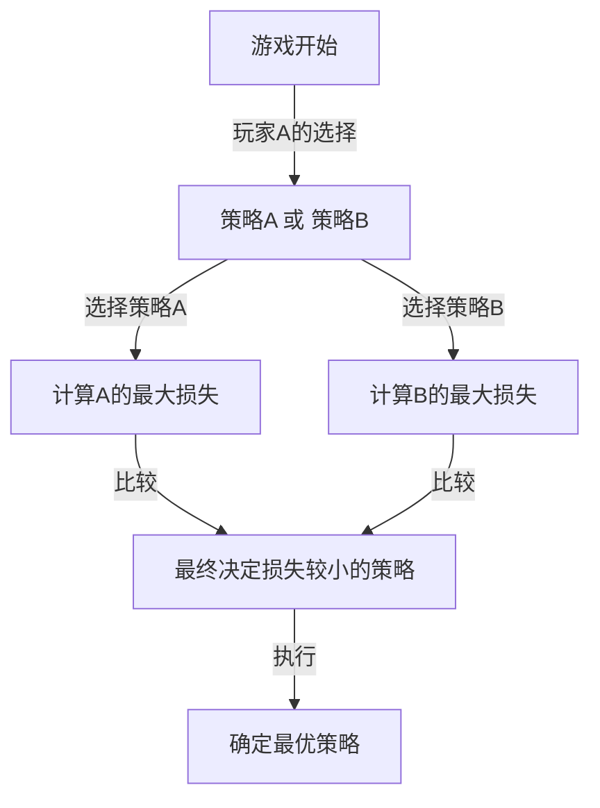
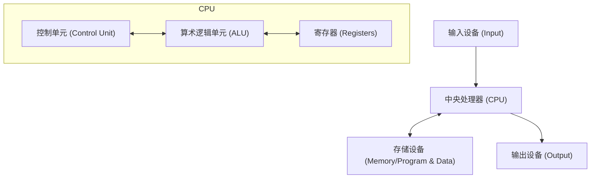

# 引言：被畏惧为“火星人”的男人

在人类历史上，有许多被称为“天才”的人物。阿尔伯特·爱因斯坦、艾萨克·牛顿、列奥纳多·达·芬奇等名垂青史的伟人们，都在特定领域展现了突出的才华。然而，在20世纪真实存在的一位科学家，被认为拥有甚至凌驾于他们之上的“异次元智能”。他就是约翰·冯·诺伊曼（John von Neumann, 1903 - 1957）。

他的大脑实在太过超乎常人，以至于他的科学家同事们半开玩笑地私下议论他是“伪装成人类的火星人”或拥有“恶魔的大脑”。有许多轶事流传，即使是诺贝尔奖得主，在冯·诺伊曼面前也会意识到自己智力的极限，只能像孩子一样行事。

本文将尽可能深入详细地探讨这个“恶魔的大脑”是如何孕育的，以及他如何创造了现代社会各个方面的基础（计算机、量子力学、博弈论、核武器等），探索他波澜壮阔的一生和压倒性的成就。

## 第1章：神童的诞生与匈牙利奇迹

### 布达佩斯的富裕犹太家庭
约翰·冯·诺伊曼（本名：诺伊曼·亚诺什·拉约什）于1903年12月28日出生在奥匈帝国首都布达佩斯。他的父亲诺伊曼·米克萨是一位成功的银行家，后来拥有被授予贵族头衔（冯）的财富和地位。这个富裕的环境成为了冯·诺伊曼非凡才华绽放的完美土壤。

### 惊人的记忆力和计算能力
冯·诺伊曼的神童本色从小就显露无遗。
- **6岁**时，他能在脑海中完全进行8位数的除法计算，并能用古希腊语与父亲开玩笑。
- **8岁**时，他完全理解并掌握了微积分的概念。
- **10岁**时，据说他读完了威廉·翁肯（Wilhelm Oncken）的44卷《世界史》，并能一字不差地背诵其内容。这种堪称照相式记忆（Photographic Memory）的记忆力，成为了他一生中强大的武器。

### “火星人”的聚会
在当时的布达佩斯，除了冯·诺伊曼之外，还诞生了一个接一个杰出的犹太裔天才。包括尤金·维格纳（诺贝尔物理学奖得主）、爱德华·泰勒（氢弹之父）和莱奥·西拉德（核反应堆专利获得者）。他们后来前往美国，因为他们突出的智慧而被称为“火星人（The Martians）”。冯·诺伊曼是这些“火星人”中的领军人物，甚至连他们自己也承认“只有冯·诺伊曼才称得上是真正的天才”。

## 第2章：数学的危机与年轻天才的崛起

### 哥廷根大学与大卫·希尔伯特
步入青年时期的冯·诺伊曼，在布达佩斯大学学习数学，同时在柏林大学和苏黎世联邦理工学院学习化学工程（这是因为他的父亲担心他仅靠数学无法谋生）。年仅22岁获得数学博士学位后，他前往了当时世界数学的中心——德国哥廷根大学。

在那里，他担任了当时数学界绝对权威大卫·希尔伯特的助手。希尔伯特正在推动旨在证明“数学的完备性和无矛盾性”的“希尔伯特计划”，冯·诺伊曼深度参与了这个宏大的计划，并在公理化集合论领域做出了决定性的贡献。

### 量子力学的数学基础
在1920年代后期，物理学界诞生了一种名为量子力学的新理论，引起了巨大的混乱。维尔纳·海森堡的“矩阵力学”和埃尔温·薛定谔的“波动力学”这两种在外观和方法上截然不同的理论并存。

在这里，冯·诺伊曼展现了他压倒性的数学直觉。通过运用“希尔伯特空间”这一数学概念，他证明了这两种理论在数学上是完全等价的。他于1932年出版的著作《量子力学的数学基础》，至今仍被视为量子力学的圣经，是为物理学这个充满不确定性的世界带来严密数学秩序的丰碑。

## 第3章：普林斯顿高等研究院与爱因斯坦

### 纳粹的崛起与逃亡美国
进入1930年代，阿道夫·希特勒领导的纳粹在德国崛起，开始迫害犹太人。察觉到危机的冯·诺伊曼早早地来到了美国。他受邀前往新泽西州刚刚成立的“普林斯顿高等研究院（IAS）”。

该研究所聚集了包括爱因斯坦和库尔特·哥德尔在内的世界顶尖大脑。冯·诺伊曼在年仅29岁时就成为了该研究所的终身教授（与爱因斯坦等人并列，是最年轻的终身教授）。

### 异端的行事风格
在普林斯顿，冯·诺伊曼的行为与其他安静的学者截然不同。他大声听着德国进行曲解答数学难题，经常举办豪华派对，开快车并几乎每年都撞毁一辆新车（他经常发生事故的十字路口甚至被称为“冯·诺伊曼十字路口”）。与爱因斯坦喜欢简朴孤独的生活相反，冯·诺伊曼总是穿着笔挺的西装，非常享受世俗的乐趣。

## 第4章：博弈论的创立与“冷战”逻辑

### 将数学引入经济学
冯·诺伊曼的兴趣不仅限于纯数学和物理学。喜欢扑克等室内游戏的他思考：“能否用数学来描述人类的决策和对抗关系？”这就是“博弈论”的诞生。

1928年，他证明了“极小极大定理（Minimax theorem）”。该定理指出，在对抗的两方游戏中，采取“使自己遭受的最大损失降至最低”的行动是理性的。

### 《博弈论与经济行为》
1944年，冯·诺伊曼与经济学家奥斯卡·摩根斯顿共同出版了《博弈论与经济行为》。这本书带来了改写经济学基础的巨大冲击。它首次用严密的数学模型解释了人类在市场中如何竞争、合作以及决定价格。

### 相互保证毁灭（MAD）与冷战
博弈论的思维在二战后的东西方冷战中以可怕的方式被应用于现实世界。冯·诺伊曼作为美国政府和军方的最强智囊，深度参与了“核威慑理论”的构建。

他提倡的战略极致是“相互保证毁灭（Mutual Assured Destruction, MAD）”。这是一种疯狂与理性交织的冷酷逻辑：“如果对方使用核武器，我们必定会报复并彻底摧毁对方。正是因为存在这种必定毁灭的威胁，双方都无法使用核武器。”

## 第5章：现代计算机之父

在冯·诺伊曼的成就中，对我们现代生活产生最直接、最巨大影响的，是他对计算机科学的贡献。

### 从ENIAC到EDVAC
在二战期间，美国陆军为了弹道计算正在开发一台巨大的电子计算机“ENIAC”。然而，ENIAC每次更改计算程序时，都需要重新连接大量的电缆（这被称为接线板方式）。

冯·诺伊曼作为顾问加入了这个开发项目，并立即看穿了ENIAC的缺点。他提出了一个革命性的想法：“如果将程序（指令）像数据一样存储在内存中，就可以在不改变布线的情况下瞬间切换程序。”这就是“存储程序概念”。

### 冯·诺伊曼架构
1945年，他撰写了《关于EDVAC的报告草案》，定义了这种新计算机的逻辑结构。这就是今天被称为“冯·诺伊曼架构”的东西。

从你现在使用的智能手机、个人电脑到超级计算机，几乎100%的计算机都在按照冯·诺伊曼80年前描绘的这种架构运行。毫不夸张地说，他的大脑是IT社会真正的造物主。

## 第6章：曼哈顿计划与“恶魔”的行径

### 内爆透镜的计算
在二战期间，冯·诺伊曼是在洛斯阿拉莫斯国家实验室进行的原子弹开发项目“曼哈顿计划”的最重要人物之一。

特别是对于钚型原子弹的起爆，需要从周围精确引爆炸药，并将钚球极度压缩的“内爆（Implosion）透镜”。冯·诺伊曼用他压倒性的计算能力解决了这个极其复杂的流体力学计算。据说，如果没有冯·诺伊曼的数学计算，投放在长崎的原子弹“胖子”就不可能完成。

### 目标委员会的决定
更令人畏惧的是，冯·诺伊曼还是决定向日本何处投掷原子弹的“目标委员会”成员。他强烈主张将其投在“京都”以最大化原子弹的破坏力，并进一步建议“为了炫耀爆炸的威力，应该在没有警告的情况下投掷”（虽然京都最终被排除在外）。

这种彻底的理性主义和冷酷无情，是冯·诺伊曼被称为“恶魔的大脑”的原因，据说他也是电影博士的原型之一（斯坦利·库布里克导演的《奇爱博士》中的奇爱博士）。

## 第7章：自复制自动机与人工生命

晚年，冯·诺伊曼的思想达到了“什么是生命？”、“机器能自我复制吗？”等哲学领域。

他设计了一个数学模型“元胞自动机”，在类似方格纸的网格（元胞）上，元胞的状态会根据周围状态而改变。并且，他在这个模型上完全证明了“能够制造自身副本的机器（自复制自动机）”的逻辑结构。

这是在DNA双螺旋结构被发现（1953年）之前发生的事情。冯·诺伊曼仅凭纯粹的数学思维，就预言了生命的基本机制：“自我复制需要蓝图（相当于DNA）和读取并组装它的机器。”他的这项研究后来催生了人工生命（ALife）、复杂系统科学，甚至计算机病毒的概念。

## 结语：对人类来说太早的智能

1957年2月8日，约翰·冯·诺伊曼因癌症在华盛顿特区的医院去世，享年仅53岁。据说，军方因为害怕他无意识地泄露军事机密，一直让宪兵站在他的病房里。

直到最后一刻，他的大脑都在不停地运转，但他对随着癌症的恶化而逐渐失去记忆感到深深的恐惧。曾经能够背诵一整本书的男人，逐渐变得连简单的加法都做不了的过程，对周围的任何人来说都是极其残酷的景象。

约翰·冯·诺伊曼。他仅仅用一生的时间，就跨越并奠定了人类需要数百年才能开拓的领域——从数学、物理学、经济学、气象学到计算机科学。

由于他的成就是如此广泛和深奥，至今仍然难以相信这是一个人所能完成的。他是否是“火星人”尚不确定，但他留下的名为“冯·诺伊曼架构”的分身们，此时此刻正在世界各地夜以继日地进行着计算。

我们生活在这个高度信息化的世界，或许正是那个恶魔大脑所做之梦的延续。
