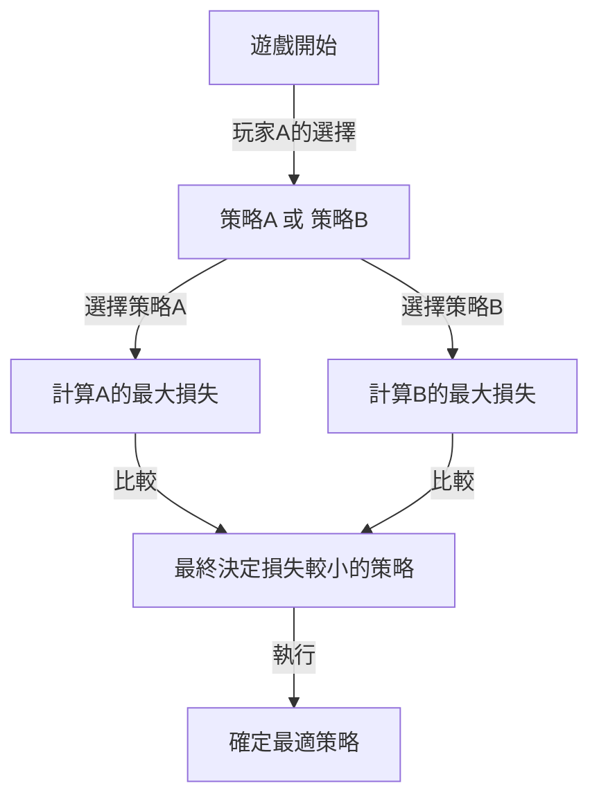
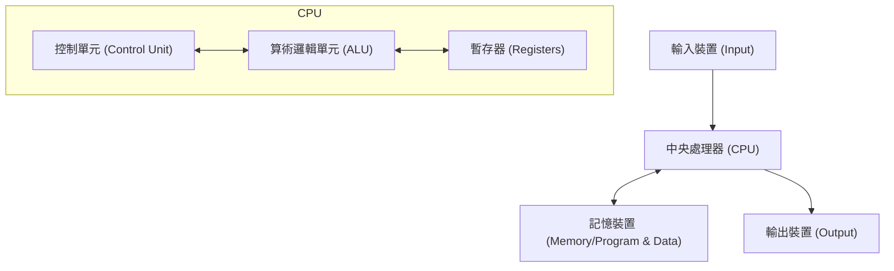

# 引言：被畏懼為「火星人」的男人

在人類歷史上，有許多被稱為「天才」的人物。阿爾伯特·愛因斯坦、艾薩克·牛頓、李奧納多·達文西等名垂青史的偉人們，都在特定領域展現了突出的才華。然而，在20世紀真實存在的一位科學家，被認為擁有甚至凌駕於他們之上的「異次元智能」。他就是約翰·馮·紐曼（John von Neumann, 1903 - 1957）。

他的大腦實在太過超乎常人，以至於他的科學家同事們半開玩笑地私下議論他是「偽裝成人類的火星人」或擁有「惡魔的大腦」。有許多軼事流傳，即使是諾貝爾獎得主，在馮·紐曼面前也會意識到自己智力的極限，只能像孩子一樣行事。

本文將盡可能深入詳細地探討這個「惡魔的大腦」是如何孕育的，以及他如何創造了現代社會各個方面的基礎（電腦、量子力學、賽局理論、核武器等），探索他波瀾壯闊的一生和壓倒性的成就。

## 第1章：神童的誕生與匈牙利奇蹟

### 布達佩斯的富裕猶太家庭
約翰·馮·紐曼（本名：紐曼·亞諾什·拉約什）於1903年12月28日出生在奧匈帝國首都布達佩斯。他的父親紐曼·米克薩是一位成功的銀行家，後來擁有被授予貴族頭銜（馮）的財富和地位。這個富裕的環境成為了馮·紐曼非凡才華綻放的完美土壤。

### 驚人的記憶力和計算能力
馮·紐曼的神童本色從小就顯露無遺。
- **6歲**時，他能在腦海中完全進行8位數的除法計算，並能用古希臘語與父親開玩笑。
- **8歲**時，他完全理解並掌握了微積分的概念。
- **10歲**時，據說他讀完了威廉·翁肯（Wilhelm Oncken）的44卷《世界史》，並能一字不差地背誦其內容。這種堪稱照相式記憶（Photographic Memory）的記憶力，成為了他一生中強大的武器。

### 「火星人」的聚會
在當時的布達佩斯，除了馮·紐曼之外，還誕生了一個接一個傑出的猶太裔天才。包括尤金·維格納（諾貝爾物理學獎得主）、愛德華·泰勒（氫彈之父）和萊奧·西拉德（核反應堆專利獲得者）。他們後來前往美國，因為他們突出的智慧而被稱為「火星人（The Martians）」。馮·紐曼是這些「火星人」中的領軍人物，甚至連他們自己也承認「只有馮·紐曼才稱得上是真正的天才」。

## 第2章：數學的危機與年輕天才的崛起

### 哥廷根大學與大衛·希爾伯特
步入青年時期的馮·紐曼，在布達佩斯大學學習數學，同時在柏林大學和蘇黎世聯邦理工學院學習化學工程（這是因為他的父親擔心他僅靠數學無法謀生）。年僅22歲獲得數學博士學位後，他前往了當時世界數學的中心——德國哥廷根大學。

在那裡，他擔任了當時數學界絕對權威大衛·希爾伯特的助手。希爾伯特正在推動旨在證明「數學的完備性和無矛盾性」的「希爾伯特計畫」，馮·紐曼深度參與了這個宏大的計畫，並在公理化集合論領域做出了決定性的貢獻。

### 量子力學的數學基礎
在1920年代後期，物理學界誕生了一種名為量子力學的新理論，引起了巨大的混亂。維爾納·海森堡的「矩陣力學」和埃爾溫·薛丁格的「波動力學」這兩種在外觀和方法上截然不同的理論並存。

在這裡，馮·紐曼展現了他壓倒性的數學直覺。透過運用「希爾伯特空間」這一數學概念，他證明了這兩種理論在數學上是完全等價的。他於1932年出版的著作《量子力學的數學基礎》，至今仍被視為量子力學的聖經，是為物理學這個充滿不確定性的世界帶來嚴密數學秩序的豐碑。

## 第3章：普林斯頓高等研究院與愛因斯坦

### 納粹的崛起與逃亡美國
進入1930年代，阿道夫·希特勒領導的納粹在德國崛起，開始迫害猶太人。察覺到危機的馮·紐曼早早地來到了美國。他受邀前往紐澤西州剛剛成立的「普林斯頓高等研究院（IAS）」。

該研究所聚集了包括愛因斯坦和庫爾特·哥德爾在內的世界頂尖大腦。馮·紐曼在年僅29歲時就成為了該研究所的終身教授（與愛因斯坦等人並列，是最年輕的終身教授）。

### 異端的行事風格
在普林斯頓，馮·紐曼的行為與其他安靜的學者截然不同。他大聲聽著德國進行曲解答數學難題，經常舉辦豪華派對，開快車並幾乎每年都撞毀一輛新車（他經常發生事故的十字路口甚至被稱為「馮·紐曼十字路口」）。與愛因斯坦喜歡簡樸孤獨的生活相反，馮·紐曼總是穿著筆挺的西裝，非常享受世俗的樂趣。

## 第4章：賽局理論的創立與「冷戰」邏輯

### 將數學引入經濟學
馮·紐曼的興趣不僅限於純數學和物理學。喜歡撲克等室內遊戲的他思考：「能否用數學來描述人類的決策和對抗關係？」這就是「賽局理論」的誕生。

1928年，他證明了「極小極大定理（Minimax theorem）」。該定理指出，在對抗的兩方遊戲中，採取「使自己遭受的最大損失降至最低」的行動是理性的。

### 《賽局理論與經濟行為》
1944年，馮·紐曼與經濟學家奧斯卡·摩根斯頓共同出版了《賽局理論與經濟行為》。這本書帶來了改寫經濟學基礎的巨大衝擊。它首次用嚴密的數學模型解釋了人類在市場中如何競爭、合作以及決定價格。

### 相互保證毀滅（MAD）與冷戰
賽局理論的思維在二戰後東西方冷戰中以可怕的方式被應用於現實世界。馮·紐曼作為美國政府和軍方的最強智囊，深度參與了「核威懾理論」的建構。

他提倡的戰略極致是「相互保證毀滅（Mutual Assured Destruction, MAD）」。這是一種瘋狂與理性交織的冷酷邏輯：「如果對方使用核武器，我們必定會報復並徹底摧毀對方。正是因為存在這種必定毀滅的威脅，雙方都無法使用核武器。」

## 第5章：現代電腦之父

在馮·紐曼的成就中，對我們現代生活產生最直接、最巨大影響的，是他對電腦科學的貢獻。

### 從ENIAC到EDVAC
在二戰期間，美國陸軍為了彈道計算正在開發一台巨大的電子計算機「ENIAC」。然而，ENIAC每次更改計算程序時，都需要重新連接大量的電纜（這被稱為接線板方式）。

馮·紐曼作為顧問加入了這個開發項目，並立即看穿了ENIAC的缺點。他提出了一個革命性的想法：「如果將程序（指令）像資料一樣存儲在記憶體中，就可以在不改變佈線的情況下瞬間切換程序。」這就是「內儲程式概念」。

### 馮·紐曼架構
1945年，他撰寫了《關於EDVAC的報告草案》，定義了這種新電腦的邏輯結構。這就是今天被稱為「馮·紐曼架構」的東西。

從你現在使用的智慧型手機、個人電腦到超級電腦，幾乎100%的電腦都在按照馮·紐曼80年前描繪的這種架構運行。毫不誇張地說，他的大腦是IT社會真正的造物主。

## 第6章：曼哈頓計劃與「惡魔」的行徑

### 內爆透鏡的計算
在二戰期間，馮·紐曼是在洛斯阿拉莫斯國家實驗室進行的原子彈開發專案「曼哈頓計劃」的最重要人物之一。

特別是對於鈽型原子彈的起爆，需要從周圍精確引爆炸藥，並將鈽球極度壓縮的「內爆（Implosion）透鏡」。馮·紐曼用他壓倒性的計算能力解決了這個極其複雜的流體力學計算。據說，如果沒有馮·紐曼的數學計算，投放在長崎的原子彈「胖子」就不可能完成。

### 目標委員會的決定
更令人畏懼的是，馮·紐曼還是決定向日本何處投擲原子彈的「目標委員會」成員。他強烈主張將其投在「京都」以最大化原子彈的破壞力，並進一步建議「為了炫耀爆炸的威力，應該在沒有警告的情況下投擲」（雖然京都最終被排除在外）。

這種徹底的理性主義和冷酷無情，是馮·紐曼被稱為「惡魔的大腦」的原因，據說他也是電影博士的原型之一（史丹利·庫柏力克導演的《奇愛博士》中的奇愛博士）。

## 第7章：自我複製自動機與人工生命

晚年，馮·紐曼的思想達到了「什麼是生命？」、「機器能自我複製嗎？」等哲學領域。

他設計了一個數學模型「細胞自動機」，在類似方格紙的網格（細胞）上，細胞的狀態會根據周圍狀態而改變。並且，他在這個模型上完全證明了「能夠製造自身副本的機器（自我複製自動機）」的邏輯結構。

這是在DNA雙螺旋結構被發現（1953年）之前發生的事情。馮·紐曼僅憑純粹的數學思維，就預言了生命的基本機制：「自我複製需要藍圖（相當於DNA）和讀取並組裝它的機器。」他的這項研究後來催生了人工生命（ALife）、複雜系統科學，甚至電腦病毒的概念。

## 結語：對人類來說太早的智能

1957年2月8日，約翰·馮·紐曼因癌症在華盛頓特區的醫院去世，享年僅53歲。據說，軍方因為害怕他無意識地洩露軍事機密，一直讓憲兵站在他的病房裡。

直到最後一刻，他的大腦都在不停地運轉，但他對隨著癌症的惡化而逐漸失去記憶感到深深的恐懼。曾經能夠背誦一整本書的男人，逐漸變得連簡單的加法都做不了的過程，對周圍的任何人來說都是極其殘酷的景象。

約翰·馮·紐曼。他僅僅用一生的時間，就跨越並奠定了人類需要數百年才能開拓的領域——從數學、物理學、經濟學、氣象學到電腦科學。

由於他的成就是如此廣泛和深奧，至今仍然難以相信這是一個人所能完成的。他是否是「火星人」尚不確定，但他留下的名為「馮·紐曼架構」的分身們，此時此刻正在世界各地夜以繼日地進行著計算。

我們生活在這個高度資訊化的世界，或許正是那個惡魔大腦所做之夢的延續。
