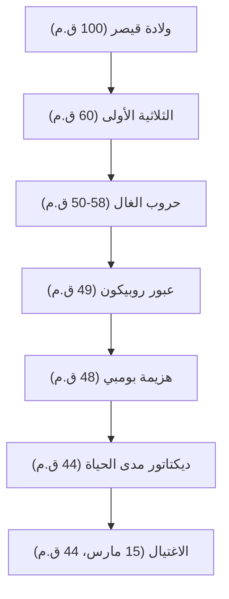

"لقد رمي النرد"، "أتيت، رأيت، غزوت"، "حتى أنت يا بروتس؟" — حتى أولئك غير الملمين بتاريخ العالم ربما سمعوا الكلمات التي تركها خلفه. غايوس يوليوس قيصر (100 ق.م - 44 ق.م)، البطل الذي ظهر كالمذنب في نهاية الجمهورية الرومانية وحدد شكل العالم الأوروبي اللاحق. لم يكن مجرد رجل عسكري وسياسي، بل كان أيضًا كاتبًا ومحاميًا وحتى مصلحًا للتقويم.

تفكك هذه المقالة حياة قيصر، الذي فكك الجمهورية الرومانية وفتح الباب للنظام الجديد للإمبراطورية، والفلسفة التي اخترقته، وتأثيره الذي يمتد إلى العصر الحديث.

## 1. حياة مضطربة: السلم نحو السلطة وهيمنة روما

### مسيرة سياسية تبدأ من الديون والعلاقات
على الرغم من ولادته في عائلة أرستقراطية نبيلة، إلا أن شباب قيصر لم يكن سلسًا على الإطلاق. فرارًا من اضطهاد الأعداء السياسيين وأحيانًا أسيرًا لدى القراصنة، عاش حياة مليئة بالتقلبات. كانت ميزته الرائعة هي أنه، على الرغم من امتلاكه لديون ضخمة، إلا أنه استثمرها في ضيافة عامة الناس والأشغال العامة، مما أكسبه شعبية ساحقة. جسد في وقت مبكر الديناميكية السياسية الباردة التي لا تزال ذات صلة حتى اليوم: "حتى الديون، إذا كانت على نطاق واسع بما فيه الكفاية، تصبح قوة."

في عام 60 ق.م، شكل "الثلاثية الأولى" مع بومبي وكراسوس. من خلال هذا، أرسى قيصر مكانة صلبة في السياسة الوطنية الرومانية.

### حروب الغال والعبقرية العسكرية
ما جعل اسم قيصر ثابتًا هو "حروب الغال"، التي استمرت لحوالي 8 سنوات ابتداءً من عام 58 ق.م. أخضع منطقة شاسعة من فرنسا الحالية إلى بلجيكا وسويسرا، وحتى وضع قدمه في الأراضي المجهولة لبريطانيا وجرمانيا.
سجله المكتوب الخاص، "تعليقات على الحرب الغالية"، يُعرف كتحفة فنية من النثر اللاتيني الموجز والواضح، ولم يكن مجرد سجل حرب، بل كان أيضًا دعاية سياسية ممتازة موجهة إلى شعب روما في وطنه.

### "لقد رمي النرد" — الحرب الأهلية والاستيلاء على السلطة المطلقة
أدى النجاح في الغال إلى صراع حاسم مع فصيل مجلس الشيوخ، بما في ذلك بومبي. في عام 49 ق.م، متجاهلاً أمر مجلس الشيوخ بحل جيشه، عبر قيصر نهر روبيكون. وتقدم بجيشه مع الكلمات الشهيرة، "لقد رمي النرد (Alea iacta est)"، ودخل روما دون إراقة دماء. في وقت لاحق، قاتل عبر اليونان، ومصر (حيث التقى كليوباترا)، وأفريقيا، وإسبانيا، وهزم خصومه السياسيين واحدًا تلو الآخر.

في النهاية عين كديكتاتور مدى الحياة (Dictator Perpetuo)، وحقق قيصر تركيز السلطة في يديه فقط.

## 2. فلسفة قيصر: الرأفة (Clementia) والعقلانية

كانت السمة الفريدة لقيصر هي ممارسته الشاملة لـ "الرأفة (clementia)" تجاه المهزومين. في الحروب الأهلية في ذلك الوقت، كان من المنطق السليم أن يطهر المنتصر المهزومين ويصادر ممتلكاتهم. ومع ذلك، سامح قيصر الأعداء السياسيين الذين استسلموا، بل وعين بعضهم في مناصب مهمة.
لم يكن هذا مجرد لطف، بل كان حكمًا عقلانيًا قائمًا على استراتيجية سياسية محسوبة للغاية. فبدلاً من شراء ضغائن جديدة بإراقة دماء لا داعي لها، سعى إلى تحقيق الانسجام الداخلي والاستقرار في الحكم من خلال إظهار الرأفة.

علاوة على ذلك، تضمنت مبادئه السلوكية نظرة عميقة في علم النفس البشري: "يرى الناس فقط الواقع الذي يرغبون في رؤيته." كان يقرأ رغبات الجماهير بدقة، ويوفر الخبز والسيرك (الطعام والترفيه)، بينما يأسر قلوبهم بالكلمات والخطب. قد يُطلق على هذا الشكل جيدًا اسم رائد السياسة الشعبوية الحديثة.

## 3. التأثير الهائل على الأجيال القادمة: من التقويم اليولياني إلى أصل كلمة إمبراطور

حتى بعد اغتيال قيصر، استمر النظام والاسم الذي تركه في حكم العالم.

**إصلاح التقويم (إنشاء التقويم اليولياني)**
أحد أكثر إنجازاته المألوفة هو إصلاح التقويم. قدم التقويم الشمسي وأنشأ "التقويم اليولياني"، جاعلًا السنة 365.25 يومًا. استمر استخدام هذا في جميع أنحاء أوروبا حتى تم تعديله إلى التقويم الغريغوري في القرن السادس عشر. السبب في أن يوليو لا يزال يسمى "يوليو" (July) اليوم مشتق من اسمه، "يوليوس" (Julius).

**الطريق إلى الإمبراطورية ولقب الإمبراطور**
لم يطلق قيصر على نفسه لقب ملك أو إمبراطور، لكن خليفته أوكتافيان (أغسطس) أصبح أول إمبراطور روماني، وانتقلت روما إلى نظام إمبراطوري استمر لمئات السنين.
في وقت لاحق، أصبح اسم "قيصر (Caesar)" هو لقب الإمبراطور الروماني نفسه. علاوة على ذلك، وبالعودة إلى التاريخ، أصبح أصل الكلمات التي تعني "إمبراطور" في اللغات الأوروبية، مثل "Kaiser" باللغة الألمانية و "Tsar" باللغة الروسية.

## 4. الخاتمة: العبقري غير المكتمل

في 15 مارس 44 ق.م، اغتيل قيصر في مجلس الشيوخ على يد بروتس وآخرين حاولوا حماية تقاليد الجمهورية. في ذروة قوته، سقط قبل خطة جديدة للبعثة البارثية.

من المستحيل الآن معرفة كيف كان التصميم الكبير الكامل للإمبراطورية الرومانية الذي تصوره. ومع ذلك، فإن المسار الذي يبدأ من النبيل الشاب المثقل بالديون، باستخدام القوة العسكرية، والفكر، والموهبة الأدبية للوصول إلى قمة أكبر إمبراطورية في العالم، يستمر في التألق كواحد من أكثر القصص الرائعة في تاريخ البشرية حتى بعد مرور أكثر من 2000 عام. كان قيصر "عبقريًا" حقيقيًا نحت مصيره الخاص ومصير العالم بيديه.
