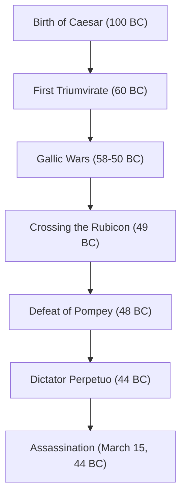

"The die is cast," "I came, I saw, I conquered," "Et tu, Brute?" — Even those unfamiliar with world history have likely heard the words he left behind. Gaius Julius Caesar (100 BC - 44 BC), the hero who appeared like a comet at the end of the Roman Republic and determined the shape of the subsequent European world. He was not merely a military man and politician, but also a writer, trial lawyer, and even a calendar reformer.

This article unravels the life of Caesar, who dismantled the Roman Republic and opened the door to the new system of the Empire, the philosophy that pierced through him, and his influence that reaches into the modern era.

## 1. A Turbulent Life: The Stairway to Power and Rome's Hegemony

### A Political Career Starting from Debt and Connections
Despite being born into a noble patrician family, Caesar's youth was by no means smooth. Fleeing persecution from political enemies and at times captured by pirates, he lived a life full of ups and downs. His remarkable trait was that, despite holding enormous debts, he invested them in treating the common people and public works, thereby gaining overwhelming popularity. He embodied early on the cold political dynamic still relevant today: "Even debt, if on a large enough scale, becomes power."

In 60 BC, he formed the "First Triumvirate" with Pompey and Crassus. Through this, Caesar established a solid position in Roman national politics.

### The Gallic Wars and Military Genius
What made Caesar's name immovable was the "Gallic Wars," which lasted for about 8 years starting in 58 BC. He subjugated a vast region from present-day France to Belgium and Switzerland, and even set foot in the unknown lands of Britannia (Britain) and Germania (Germany).
His own written record, "Commentaries on the Gallic War," is known as a masterpiece of concise and clear Latin prose, and was not merely a war record, but also excellent political propaganda directed at the populace of Rome back home.

### "The Die is Cast" — Civil War and Seizure of Absolute Power
Success in Gaul led to a decisive conflict with the Senatorial faction, including Pompey. In 49 BC, ignoring the Senate's order to disband his army, Caesar crossed the Rubicon. Advancing his army with the famous words, "The die is cast (Alea iacta est)," he entered Rome bloodlessly. Subsequently, he fought across Greece, Egypt (where he met Cleopatra), Africa, and Spain, defeating his political rivals one after another.

Ultimately appointed as Dictator in perpetuity (Dictator Perpetuo), Caesar achieved the concentration of power solely in his hands.

## 2. Caesar's Philosophy: Clementia (Clemency) and Rationality

Caesar's unique trait was his thorough practice of "clemency (clementia)" toward the defeated. In the civil wars of that time, it was common sense for the victor to purge the defeated and confiscate their property. However, Caesar forgave political enemies who surrendered, and even appointed some to important posts.
This was not mere kindness, but a rational judgment based on highly calculated political strategy. Rather than buying new grudges by spilling unnecessary blood, he sought to achieve domestic harmony and stability in governance by showing clemency.

Moreover, his behavioral principles included a deep insight into human psychology: "People only see the reality they wish to see." Accurately reading the desires of the masses, providing bread and circuses (food and entertainment), while capturing their hearts with words and speeches. This figure might well be called a pioneer of modern populist politics.

## 3. Immense Influence on Posterity: From the Julian Calendar to the Etymology of Emperor

Even after Caesar was assassinated, the system and name he left behind continued to rule the world.

**Calendar Reform (Establishment of the Julian Calendar)**
One of his most familiar achievements is the reform of the calendar. He introduced the solar calendar and established the "Julian Calendar," making a year 365.25 days. This continued to be used throughout Europe until it was reformed into the Gregorian calendar in the 16th century. The reason July is still called "July" today derives from his name, "Julius."

**The Path to the Empire and the Title of Emperor**
Caesar himself did not call himself a king or emperor, but his successor Octavian (Augustus) became the first Roman Emperor, and Rome transitioned to an imperial system that lasted for hundreds of years.
Subsequently, the name "Caesar" became the very title of the Roman Emperor itself. Furthermore, going down in history, it became the etymology for words meaning "emperor" in European languages, such as "Kaiser" in German and "Tsar" in Russian.

## 4. Conclusion: The Unfinished Genius

On March 15, 44 BC, Caesar was assassinated in the Senate house by Brutus and others trying to protect the tradition of the Republic. At the zenith of his power, he fell just before a new plan for the Parthian expedition.

What the complete grand design of the Roman Empire he envisioned was like is now impossible to know. However, the trajectory starting from a debt-ridden young nobleman, using military force, intellect, and literary talent to climb to the peak of the world's largest empire, continues to shine as one of the most fascinating stories in human history even after more than 2,000 years have passed. Caesar was a true "genius" who carved out his own destiny and the destiny of the world with his own hands.
