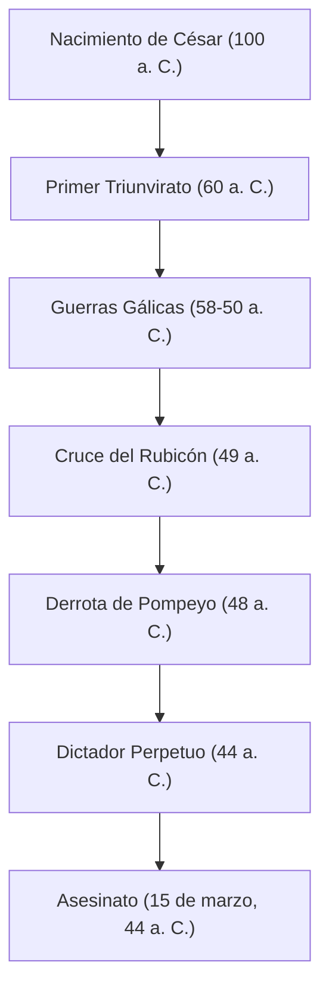

"La suerte está echada", "Vine, vi, vencí", "¿Tú también, Bruto?" — Incluso aquellos que no están familiarizados con la historia mundial probablemente hayan escuchado las palabras que dejó atrás. Cayo Julio César (100 a. C. - 44 a. C.), el héroe que apareció como un cometa a fines de la República Romana y determinó la forma del mundo europeo posterior. No fue solo un militar y político, sino también escritor, abogado e incluso reformador del calendario.

Este artículo desentraña la vida de César, quien desmanteló la República Romana y abrió la puerta al nuevo sistema del Imperio, la filosofía que lo atravesó y su influencia que llega hasta la era moderna.

## 1. Una vida turbulenta: La escalera hacia el poder y la hegemonía de Roma

### Una carrera política que comenzó con deudas y conexiones
A pesar de provenir de una noble familia patricia, la juventud de César de ninguna manera fue tranquila. Huyendo de la persecución de sus enemigos políticos y, en ocasiones, capturado por piratas, vivió una vida llena de altibajos. Su rasgo más notable fue que, a pesar de tener enormes deudas, las invirtió en agasajar a la gente común y en obras públicas, ganando así una popularidad abrumadora. Encarnó desde temprano la fría dinámica política que aún es relevante hoy en día: "Incluso la deuda, si es a gran escala, se convierte en poder".

En el año 60 a. C., formó el "Primer Triunvirato" con Pompeyo y Craso. A través de esto, César estableció una posición sólida en la política nacional romana.

### Las Guerras Gálicas y el genio militar
Lo que hizo inamovible el nombre de César fueron las "Guerras Gálicas", que duraron unos 8 años a partir del 58 a. C. Subyugó una vasta región desde la actual Francia hasta Bélgica y Suiza, e incluso pisó las tierras desconocidas de Britania (Gran Bretaña) y Germania (Alemania).
Su propio registro escrito, "Comentarios sobre la guerra de las Galias", se conoce como una obra maestra de la prosa latina concisa y clara, y no fue solo un registro de guerra, sino también una excelente propaganda política dirigida al pueblo de Roma en su país.

### "La suerte está echada" — Guerra civil y toma del poder absoluto
El éxito en la Galia llevó a un conflicto decisivo con la facción senatorial, incluido Pompeyo. En el 49 a. C., ignorando la orden del Senado de disolver su ejército, César cruzó el Rubicón. Avanzando con su ejército con las famosas palabras "La suerte está echada (Alea iacta est)", entró en Roma sin derramamiento de sangre. Posteriormente, luchó en Grecia, Egipto (donde conoció a Cleopatra), África y España, derrotando a sus rivales políticos uno tras otro.

Nombrado finalmente Dictador vitalicio (Dictator Perpetuo), César logró la concentración del poder únicamente en sus manos.

## 2. La filosofía de César: Clementia (Clemencia) y racionalidad

El rasgo único de César fue su práctica exhaustiva de la "clemencia (clementia)" hacia los derrotados. En las guerras civiles de la época, el sentido común dictaba que el vencedor purgara a los derrotados y confiscara sus propiedades. Sin embargo, César perdonó a los enemigos políticos que se rindieron e incluso nombró a algunos para puestos importantes.
Esto no era mera amabilidad, sino un juicio racional basado en un cálculo político altamente estratégico. En lugar de ganarse nuevos rencores derramando sangre innecesaria, buscó lograr la armonía doméstica y la estabilidad en la gobernanza mostrando clemencia.

Además, sus principios de comportamiento incluían una profunda visión de la psicología humana: "La gente solo ve la realidad que desea ver". Leyó con precisión los deseos de las masas, proporcionando pan y circo (comida y entretenimiento), mientras capturaba sus corazones con palabras y discursos. Esta figura bien podría ser llamada pionera de la política populista moderna.

## 3. Inmensa influencia en la posteridad: Del calendario juliano a la etimología de Emperador

Incluso después del asesinato de César, el sistema y el nombre que dejó continuaron gobernando el mundo.

**Reforma del calendario (Establecimiento del calendario juliano)**
Uno de sus logros más familiares es la reforma del calendario. Introdujo el calendario solar y estableció el "Calendario Juliano", con un año de 365,25 días. Esto continuó usándose en toda Europa hasta que fue reformado al calendario gregoriano en el siglo XVI. La razón por la que julio todavía se llama "Julio" en la actualidad se deriva de su nombre, "Julius".

**El camino hacia el Imperio y el título de Emperador**
El propio César no se llamó rey ni emperador, pero su sucesor Octavio (Augusto) se convirtió en el primer emperador romano, y Roma pasó a un sistema imperial que duró cientos de años.
Posteriormente, el nombre "César" se convirtió en el título mismo del Emperador Romano. Además, pasando a la historia, se convirtió en la etimología de las palabras que significan "emperador" en lenguas europeas, como "Kaiser" en alemán y "Tsar" en ruso.

## 4. Conclusión: El genio inacabado

El 15 de marzo del 44 a. C., César fue asesinado en el edificio del Senado por Bruto y otros que intentaban proteger la tradición de la República. En el cenit de su poder, cayó justo antes de un nuevo plan para la expedición parta.

Cómo era el gran diseño completo del Imperio Romano que imaginó ahora es imposible de saber. Sin embargo, la trayectoria que comenzó a partir de un joven noble endeudado, usando la fuerza militar, el intelecto y el talento literario para escalar hasta la cima del imperio más grande del mundo, continúa brillando como una de las historias más fascinantes de la historia humana incluso después de más de 2000 años. César fue un verdadero "genio" que forjó su propio destino y el destino del mundo con sus propias manos.
