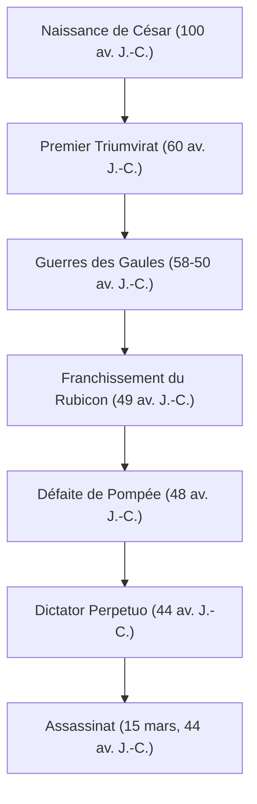

« Le sort en est jeté », « Je suis venu, j'ai vu, j'ai vaincu », « Toi aussi, mon fils ? » — Même ceux qui ne sont pas familiers avec l'histoire mondiale ont probablement entendu les mots qu'il a laissés derrière lui. Gaius Julius Caesar (100 av. J.-C. - 44 av. J.-C.), le héros apparu telle une comète à la fin de la République romaine et qui a déterminé la forme du monde européen ultérieur. Il n'était pas seulement un militaire et un politicien, mais aussi un écrivain, un avocat de procès, et même un réformateur de calendrier.

Cet article retrace la vie de César, qui a démantelé la République romaine et ouvert la porte au nouveau système de l'Empire, la philosophie qui l'a animé, et son influence qui s'étend jusqu'à l'ère moderne.

## 1. Une vie mouvementée : L'escalier vers le pouvoir et l'hégémonie de Rome

### Une carrière politique qui commence par des dettes et des relations
Bien qu'il soit né dans une noble famille patricienne, la jeunesse de César ne fut en aucun cas un long fleuve tranquille. Fuyant les persécutions de ses ennemis politiques et parfois capturé par des pirates, il a vécu une vie pleine de rebondissements. Son trait le plus remarquable était que, bien qu'ayant d'énormes dettes, il les investissait pour régaler le peuple et dans des travaux publics, gagnant ainsi une popularité écrasante. Il incarnait très tôt la froide dynamique politique toujours pertinente aujourd'hui : « Même la dette, si elle est à grande échelle, devient pouvoir. »

En 60 av. J.-C., il forma le « Premier Triumvirat » avec Pompée et Crassus. Par ce biais, César établit une position solide dans la politique nationale romaine.

### Les guerres des Gaules et le génie militaire
Ce qui a rendu le nom de César immuable, ce sont les « Guerres des Gaules », qui ont duré environ 8 ans à partir de 58 av. J.-C. Il a subjugué une vaste région allant de la France actuelle à la Belgique et à la Suisse, et a même posé le pied dans les terres inconnues de Britannia (Grande-Bretagne) et de Germania (Allemagne).
Ses propres écrits, les *Commentaires sur la Guerre des Gaules*, sont reconnus comme un chef-d'œuvre de prose latine concise et claire, et n'étaient pas seulement un récit de guerre, mais aussi une excellente propagande politique destinée à la population de Rome.

### « Le sort en est jeté » — Guerre civile et prise du pouvoir absolu
Le succès en Gaule a conduit à un conflit décisif avec la faction sénatoriale, dont Pompée. En 49 av. J.-C., ignorant l'ordre du Sénat de dissoudre son armée, César franchit le Rubicon. Avançant son armée avec la célèbre phrase, « Le sort en est jeté (Alea iacta est) », il est entré dans Rome sans effusion de sang. Par la suite, il a combattu en Grèce, en Égypte (où il a rencontré Cléopâtre), en Afrique et en Espagne, battant ses rivaux politiques les uns après les autres.

Finalement nommé Dictateur à vie (Dictator Perpetuo), César a achevé la concentration du pouvoir entre ses seules mains.

## 2. La philosophie de César : Clementia (Clémence) et rationalité

Le trait unique de César était sa pratique approfondie de la « clémence (clementia) » envers les vaincus. Dans les guerres civiles de l'époque, il était de bon ton que le vainqueur purge les vaincus et confisque leurs biens. Cependant, César a pardonné aux ennemis politiques qui se sont rendus et en a même nommé certains à des postes importants.
Ce n'était pas de la simple gentillesse, mais un jugement rationnel basé sur un calcul politique hautement stratégique. Plutôt que de s'attirer de nouvelles rancunes en versant du sang inutile, il cherchait à parvenir à l'harmonie intérieure et à la stabilité de la gouvernance en faisant preuve de clémence.

De plus, ses principes de comportement incluaient une vision profonde de la psychologie humaine : « Les gens ne voient que la réalité qu'ils souhaitent voir. » Lisant avec précision les désirs des masses, fournissant du pain et des jeux (nourriture et divertissement), tout en capturant leurs cœurs avec des mots et des discours. Ce personnage pourrait bien être qualifié de pionnier de la politique populiste moderne.

## 3. Une influence immense sur la postérité : Du calendrier julien à l'étymologie du mot Empereur

Même après l'assassinat de César, le système et le nom qu'il a laissés ont continué à dominer le monde.

**Réforme du calendrier (Établissement du calendrier julien)**
L'une de ses réalisations les plus familières est la réforme du calendrier. Il a introduit le calendrier solaire et établi le « calendrier julien », avec une année de 365,25 jours. Celui-ci a continué à être utilisé dans toute l'Europe jusqu'à ce qu'il soit réformé en calendrier grégorien au 16ème siècle. La raison pour laquelle juillet s'appelle encore « juillet » aujourd'hui vient de son nom, « Julius ».

**Le chemin vers l'Empire et le titre d'Empereur**
César lui-même ne s'est pas fait appeler roi ou empereur, mais son successeur Octave (Auguste) est devenu le premier empereur romain, et Rome a fait la transition vers un système impérial qui a duré des centaines d'années.
Par la suite, le nom « César » est devenu le titre même de l'empereur romain. De plus, entrant dans l'histoire, il est devenu l'étymologie de mots signifiant « empereur » dans les langues européennes, comme « Kaiser » en allemand et « Tsar » en russe.

## 4. Conclusion : Le génie inachevé

Le 15 mars 44 av. J.-C., César a été assassiné au Sénat par Brutus et d'autres personnes tentant de protéger la tradition de la République. Au zénith de son pouvoir, il est tombé juste avant un nouveau plan pour l'expédition parthe.

À quoi ressemblait le grand dessein complet de l'Empire romain qu'il envisageait est désormais impossible à savoir. Cependant, la trajectoire d'un jeune noble criblé de dettes qui a utilisé la force militaire, l'intellect et le talent littéraire pour se hisser au sommet du plus grand empire du monde continue de briller comme l'une des histoires les plus fascinantes de l'histoire humaine, même plus de 2000 ans plus tard. César était un véritable « génie » qui a forgé son propre destin et celui du monde de ses propres mains.
