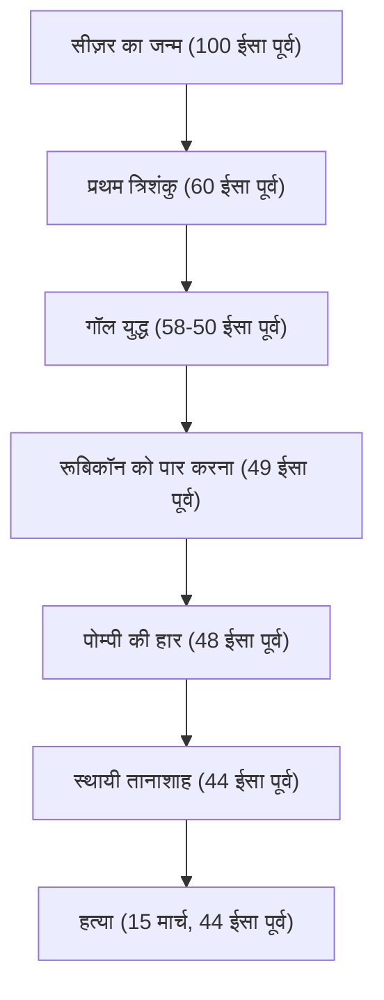

"पासा फेंका जा चुका है," "मैं आया, मैंने देखा, मैंने जीत लिया," "तुम भी, ब्रूटस?" — विश्व इतिहास से अपरिचित लोगों ने भी शायद उनके द्वारा छोड़े गए शब्द सुने होंगे। गयुस जूलियस सीज़र (100 ईसा पूर्व - 44 ईसा पूर्व), वह नायक जो रोमन गणराज्य के अंत में धूमकेतु की तरह प्रकट हुआ और बाद की यूरोपीय दुनिया का आकार निर्धारित किया। वह न केवल एक सैन्य व्यक्ति और राजनेता थे, बल्कि एक लेखक, परीक्षण वकील और यहां तक कि एक कैलेंडर सुधारक भी थे।

यह लेख सीज़र के जीवन को उजागर करता है, जिसने रोमन गणराज्य को नष्ट कर दिया और साम्राज्य की नई प्रणाली के द्वार खोले, वह दर्शन जिसने उसे भेद दिया, और उसका प्रभाव जो आधुनिक युग तक पहुंचता है।

## 1. एक अशांत जीवन: सत्ता और रोम के आधिपत्य की सीढ़ी

### कर्ज और संबंधों से शुरू हुआ एक राजनीतिक करियर
एक कुलीन पेट्रीशियन परिवार में पैदा होने के बावजूद, सीज़र की युवावस्था किसी भी तरह से सुचारू नहीं थी। राजनीतिक दुश्मनों से उत्पीड़न से भागते हुए और कभी-कभी समुद्री लुटेरों द्वारा पकड़े जाने पर, उन्होंने उतार-चढ़ाव से भरा जीवन व्यतीत किया। उनका उल्लेखनीय गुण यह था कि, भारी कर्ज होने के बावजूद, उन्होंने उन्हें आम लोगों और सार्वजनिक कार्यों के इलाज में निवेश किया, जिससे भारी लोकप्रियता हासिल हुई। उन्होंने उस शीत राजनीतिक गतिशीलता को बहुत पहले ही मूर्त रूप दे दिया जो आज भी प्रासंगिक है: "यहां तक कि कर्ज भी, यदि पर्याप्त रूप से बड़े पैमाने पर हो, तो शक्ति बन जाता है।"

60 ईसा पूर्व में, उन्होंने पोम्पी और क्रैसस के साथ "प्रथम त्रिशंकु (First Triumvirate)" का गठन किया। इसके माध्यम से, सीज़र ने रोमन राष्ट्रीय राजनीति में एक ठोस स्थिति स्थापित की।

### गॉल युद्ध और सैन्य प्रतिभा
जिस चीज ने सीज़र का नाम अचल बना दिया वह "गॉल युद्ध" था, जो 58 ईसा पूर्व से शुरू होकर लगभग 8 वर्षों तक चला। उसने वर्तमान फ्रांस से लेकर बेल्जियम और स्विटजरलैंड तक एक विशाल क्षेत्र को अपने अधीन कर लिया, और यहां तक कि ब्रिटानिया (ब्रिटेन) और जर्मेनिया (जर्मनी) की अज्ञात भूमि में भी कदम रखा।
उनका अपना लिखित रिकॉर्ड, "गैलिक युद्ध पर टिप्पणियां (Commentaries on the Gallic War)," संक्षिप्त और स्पष्ट लैटिन गद्य की उत्कृष्ट कृति के रूप में जाना जाता है, और यह केवल एक युद्ध रिकॉर्ड नहीं था, बल्कि स्वदेश में रोम की जनता को निर्देशित उत्कृष्ट राजनीतिक प्रचार भी था।

### "पासा फेंका जा चुका है" — गृह युद्ध और पूर्ण सत्ता पर कब्ज़ा
गॉल में सफलता के कारण पोम्पी सहित सीनेटरियल गुट के साथ निर्णायक संघर्ष हुआ। 49 ईसा पूर्व में, सीनेट की अपनी सेना को भंग करने के आदेश की अनदेखी करते हुए, सीज़र ने रूबिकॉन को पार किया। प्रसिद्ध शब्दों के साथ अपनी सेना को आगे बढ़ाते हुए, "पासा फेंका जा चुका है (Alea iacta est)," वह बिना खून बहाए रोम में प्रवेश कर गया। इसके बाद, उसने ग्रीस, मिस्र (जहां वह क्लियोपेट्रा से मिला), अफ्रीका और स्पेन में लड़ाई लड़ी और एक के बाद एक अपने राजनीतिक प्रतिद्वंद्वियों को हराया।

अंततः स्थायी तानाशाह (Dictator Perpetuo) के रूप में नियुक्त, सीज़र ने पूरी तरह से अपने हाथों में सत्ता का एकाग्रता हासिल किया।

## 2. सीज़र का दर्शन: क्लेमेंटिया (क्षमा) और तार्किकता

सीज़र का अनूठा गुण पराजितों के प्रति "क्षमा (clementia)" का पूरी तरह से अभ्यास था। उस समय के गृह युद्धों में, विजेता के लिए पराजित को शुद्ध करना और उनकी संपत्ति को जब्त करना सामान्य ज्ञान था। हालाँकि, सीज़र ने आत्मसमर्पण करने वाले राजनीतिक दुश्मनों को क्षमा कर दिया, और यहाँ तक कि कुछ को महत्वपूर्ण पदों पर भी नियुक्त किया।
यह महज दयालुता नहीं थी, बल्कि उच्च गणना वाली राजनीतिक रणनीति पर आधारित एक तर्कसंगत निर्णय था। अनावश्यक खून बहाकर नई शिकायतें खरीदने के बजाय, उसने क्षमा दिखाकर शासन में घरेलू सद्भाव और स्थिरता प्राप्त करने की मांग की।

इसके अलावा, उनके व्यवहार सिद्धांतों में मानव मनोविज्ञान में एक गहरी अंतर्दृष्टि शामिल थी: "लोग केवल वही वास्तविकता देखते हैं जो वे देखना चाहते हैं।" जनता की इच्छाओं को सटीक रूप से पढ़ना, रोटी और सर्कस (भोजन और मनोरंजन) प्रदान करना, जबकि शब्दों और भाषणों से उनके दिलों पर कब्जा करना। इस आंकड़े को आधुनिक लोकलुभावन राजनीति का अग्रणी कहा जा सकता है।

## 3. भावी पीढ़ी पर अपार प्रभाव: जूलियन कैलेंडर से लेकर सम्राट की व्युत्पत्ति तक

सीज़र की हत्या के बाद भी, उनके द्वारा छोड़ी गई प्रणाली और नाम ने दुनिया पर शासन करना जारी रखा।

**कैलेंडर सुधार (जूलियन कैलेंडर की स्थापना)**
उनकी सबसे परिचित उपलब्धियों में से एक कैलेंडर में सुधार है। उन्होंने सौर कैलेंडर पेश किया और 365.25 दिनों का एक वर्ष बनाते हुए "जूलियन कैलेंडर" की स्थापना की। 16वीं शताब्दी में ग्रेगोरियन कैलेंडर में सुधार होने तक इसका उपयोग पूरे यूरोप में किया जाता रहा। जुलाई को आज भी "जुलाई" कहे जाने का कारण उनके नाम "जूलियस" से लिया गया है।

**साम्राज्य का मार्ग और सम्राट की उपाधि**
सीज़र ने खुद को राजा या सम्राट नहीं कहा, लेकिन उनके उत्तराधिकारी ऑक्टेवियन (अगस्तस) पहले रोमन सम्राट बने, और रोम एक शाही प्रणाली में परिवर्तित हो गया जो सैकड़ों वर्षों तक चली।
इसके बाद, "सीज़र (Caesar)" नाम ही रोमन सम्राट की उपाधि बन गया। इसके अलावा, इतिहास में नीचे जाते हुए, यह यूरोपीय भाषाओं में "सम्राट" अर्थ वाले शब्दों की व्युत्पत्ति बन गया, जैसे कि जर्मन में "कैसर (Kaiser)" और रूसी में "ज़ार (Tsar)"।

## 4. निष्कर्ष: अधूरा प्रतिभाशाली

15 मार्च, 44 ईसा पूर्व को, गणतंत्र की परंपरा की रक्षा करने की कोशिश कर रहे ब्रूटस और अन्य लोगों द्वारा सीनेट हाउस में सीज़र की हत्या कर दी गई थी। अपनी सत्ता के चरम पर, वह पार्थियन अभियान की एक नई योजना से ठीक पहले गिर गया।

उन्होंने जिस रोमन साम्राज्य की कल्पना की थी, उसका पूरा भव्य डिजाइन कैसा था, यह जानना अब असंभव है। हालाँकि, एक कर्ज में डूबे युवा रईस से शुरू होने वाला प्रक्षेपवक्र, दुनिया के सबसे बड़े साम्राज्य की चोटी पर चढ़ने के लिए सैन्य बल, बुद्धि और साहित्यिक प्रतिभा का उपयोग करते हुए, 2,000 से अधिक वर्षों के बीत जाने के बाद भी मानव इतिहास की सबसे आकर्षक कहानियों में से एक के रूप में चमकता है। सीज़र एक सच्चा "प्रतिभाशाली" था जिसने अपने ही हाथों से अपनी नियति और दुनिया की नियति को गढ़ा।
