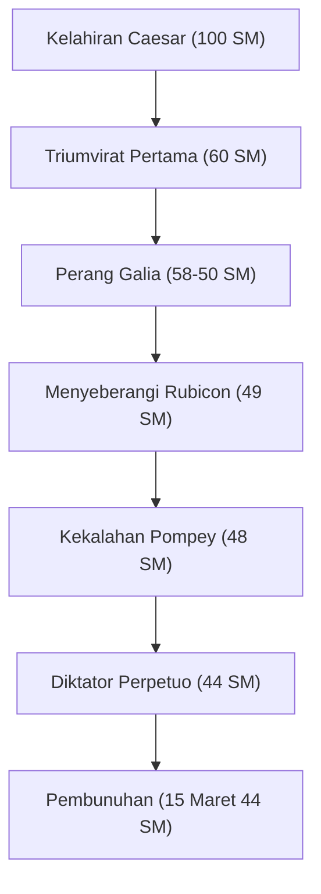

"Dadu telah dilemparkan", "Veni, vidi, vici (Aku datang, aku melihat, aku menang)", "Et tu, Brute? (Kamu juga, Brutus?)" — Bahkan mereka yang tidak akrab dengan sejarah dunia kemungkinan besar pernah mendengar kata-kata yang ditinggalkannya. Gaius Julius Caesar (100 SM - 44 SM), pahlawan yang muncul seperti komet di akhir Republik Romawi dan menentukan bentuk dunia Eropa berikutnya. Ia bukan sekadar pria militer dan politikus, melainkan juga seorang penulis, pengacara pengadilan, dan bahkan pembaharu kalender.

Artikel ini mengungkap kehidupan Caesar, yang membongkar Republik Romawi dan membuka pintu ke sistem Kekaisaran yang baru, filosofi yang menembus dirinya, dan pengaruhnya yang mencapai era modern.

## 1. Kehidupan yang Penuh Gejolak: Tangga menuju Kekuasaan dan Hegemoni Roma

### Karier Politik yang Dimulai dari Utang dan Koneksi
Meskipun lahir di keluarga bangsawan, masa muda Caesar tidaklah mulus. Melarikan diri dari penganiayaan musuh politik dan terkadang ditangkap oleh bajak laut, ia menjalani kehidupan yang penuh pasang surut. Sifatnya yang luar biasa adalah bahwa, meskipun memiliki utang yang sangat besar, ia menginvestasikannya dalam menjamu rakyat jelata dan pekerjaan umum, sehingga mendapatkan popularitas yang luar biasa. Ia mewujudkan sejak awal dinamika politik dingin yang masih relevan hingga saat ini: "Bahkan utang, jika dalam skala yang cukup besar, akan menjadi kekuatan."

Pada 60 SM, ia membentuk "Triumvirat Pertama" bersama Pompey dan Crassus. Melalui ini, Caesar menetapkan posisi yang solid dalam politik nasional Romawi.

### Perang Galia dan Kejeniusan Militer
Apa yang membuat nama Caesar tak tergoyahkan adalah "Perang Galia," yang berlangsung sekitar 8 tahun mulai 58 SM. Ia menaklukkan wilayah luas dari Prancis saat ini hingga Belgia dan Swiss, dan bahkan menginjakkan kaki di tanah tak dikenal Britannia (Inggris) dan Germania (Jerman).
Catatan tertulisnya sendiri, "Commentaries on the Gallic War," dikenal sebagai mahakarya prosa Latin yang ringkas dan jelas, dan bukan hanya sekadar catatan perang, melainkan juga propaganda politik yang sangat baik yang diarahkan kepada rakyat Roma di tanah kelahirannya.

### "Dadu Telah Dilemparkan" — Perang Saudara dan Perebutan Kekuasaan Mutlak
Keberhasilan di Galia berujung pada konflik menentukan dengan faksi Senator, termasuk Pompey. Pada 49 SM, mengabaikan perintah Senat untuk membubarkan pasukannya, Caesar menyeberangi Rubicon. Memajukan pasukannya dengan kata-kata terkenal, "Dadu telah dilemparkan (Alea iacta est)," ia memasuki Roma tanpa pertumpahan darah. Selanjutnya, ia bertempur melintasi Yunani, Mesir (di mana ia bertemu Cleopatra), Afrika, dan Spanyol, mengalahkan saingan politiknya satu per satu.

Akhirnya diangkat sebagai Diktator seumur hidup (Dictator Perpetuo), Caesar mencapai konsentrasi kekuasaan semata-mata di tangannya.

## 2. Filosofi Caesar: Clementia (Pengampunan) dan Rasionalitas

Sifat unik Caesar adalah praktiknya yang menyeluruh tentang "pengampunan (clementia)" terhadap yang kalah. Dalam perang saudara pada masa itu, merupakan hal yang wajar bagi pemenang untuk menyingkirkan yang kalah dan menyita properti mereka. Namun, Caesar memaafkan musuh politik yang menyerah, dan bahkan mengangkat beberapa dari mereka ke jabatan penting.
Ini bukan sekadar kebaikan, melainkan penilaian rasional yang didasarkan pada strategi politik yang sangat diperhitungkan. Alih-alih membeli dendam baru dengan menumpahkan darah yang tidak perlu, ia berusaha mencapai keharmonisan domestik dan stabilitas dalam pemerintahan dengan menunjukkan pengampunan.

Selain itu, prinsip-prinsip perilakunya mencakup wawasan mendalam tentang psikologi manusia: "Orang-orang hanya melihat realitas yang ingin mereka lihat." Membaca dengan akurat keinginan massa, menyediakan roti dan sirkus (makanan dan hiburan), sambil merebut hati mereka dengan kata-kata dan pidato. Sosok ini bisa dibilang sebagai pelopor politik populis modern.

## 3. Pengaruh Besar pada Anak Cucu: Dari Kalender Julian hingga Etimologi Kaisar

Bahkan setelah Caesar dibunuh, sistem dan nama yang ditinggalkannya terus menguasai dunia.

**Reformasi Kalender (Pembentukan Kalender Julian)**
Salah satu pencapaiannya yang paling dikenal adalah reformasi kalender. Ia memperkenalkan kalender matahari dan menetapkan "Kalender Julian," dengan menjadikan satu tahun 365,25 hari. Ini terus digunakan di seluruh Eropa hingga direformasi menjadi kalender Gregorian pada abad ke-16. Alasan mengapa bulan Juli masih disebut "Juli (July)" saat ini berasal dari namanya, "Julius."

**Jalan menuju Kekaisaran dan Gelar Kaisar**
Caesar sendiri tidak menyebut dirinya raja atau kaisar, tetapi penerusnya Octavian (Augustus) menjadi Kaisar Romawi pertama, dan Roma beralih ke sistem kekaisaran yang berlangsung selama ratusan tahun.
Selanjutnya, nama "Caesar" menjadi gelar dari Kaisar Romawi itu sendiri. Lebih jauh lagi, turun dalam sejarah, ia menjadi etimologi untuk kata-kata yang berarti "kaisar" dalam bahasa-bahasa Eropa, seperti "Kaiser" dalam bahasa Jerman dan "Tsar" dalam bahasa Rusia.

## 4. Kesimpulan: Jenius yang Belum Selesai

Pada tanggal 15 Maret 44 SM, Caesar dibunuh di gedung Senat oleh Brutus dan orang-orang lain yang mencoba melindungi tradisi Republik. Di puncak kekuasaannya, ia jatuh tepat sebelum rencana baru untuk ekspedisi Parthia.

Seperti apa desain besar Kekaisaran Romawi yang ia bayangkan sekarang tidak mungkin untuk diketahui. Namun, lintasan yang berawal dari seorang bangsawan muda yang terlilit utang, menggunakan kekuatan militer, kecerdasan, dan bakat sastra untuk mendaki ke puncak kekaisaran terbesar di dunia, terus bersinar sebagai salah satu kisah paling menarik dalam sejarah manusia bahkan setelah lebih dari 2.000 tahun berlalu. Caesar adalah seorang "jenius" sejati yang mengukir takdirnya sendiri dan takdir dunia dengan tangannya sendiri.
