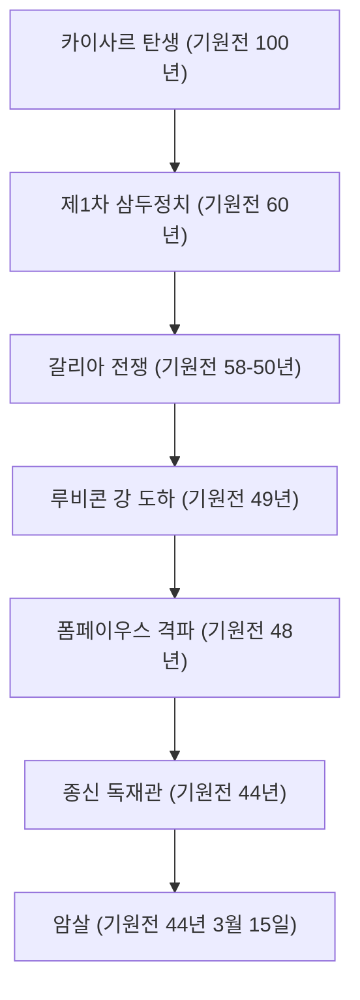

"주사위는 던져졌다", "왔노라, 보았노라, 이겼노라", "브루투스, 너마저도?" — 세계사에 밝지 않은 사람이라도 그가 남긴 명언은 한 번쯤 들어보았을 것이다. 가이우스 율리우스 카이사르(기원전 100년 - 기원전 44년), 그는 로마 공화정 말기에 혜성처럼 나타나 그 후 유럽 세계의 형태를 결정지은 영웅이다. 그는 단순한 군인이나 정치가에 그치지 않고 작가, 법정 변호사, 심지어 달력의 개혁자로서의 얼굴도 가지고 있었다.

본 기사에서는 로마 공화국을 해체하고 제정이라는 새로운 시스템으로의 문을 연 카이사르의 생애, 그를 관통하고 있던 철학, 그리고 현대에까지 이르는 그 영향력을 파헤쳐 본다.

## 1. 격동의 생애: 권력을 향한 계단과 로마의 패권

### 빚과 인맥에서 시작된 정치가 인생
명문 귀족 출신이면서도 카이사르의 청년기는 결코 순탄치 않았다. 정적들로부터의 박해를 피해 도망치고, 때로는 해적에게 붙잡히는 등 파란만장한 나날을 보냈다. 그의 특기할 만한 점은 막대한 빚을 지고 있으면서도 그것을 민중에게 대접하거나 공공사업에 투자하여 압도적인 인기를 얻었다는 것이다. "빚도 규모가 크면 권력이 된다"라는 현대에도 통용되는 냉철한 정치 역학을 그는 일찍부터 몸소 실천하고 있었다.

기원전 60년, 폼페이우스, 크라수스와 함께 '제1차 삼두정치'를 결성한다. 이로써 카이사르는 로마 국정에서 확고한 지위를 구축하게 된다.

### 갈리아 원정과 군사적 재능
카이사르의 이름을 부동의 것으로 만든 것이 기원전 58년부터 약 8년에 걸쳐 치러진 '갈리아 전쟁'이다. 현재의 프랑스에서 벨기에, 스위스에 이르는 광대한 지역을 평정하고, 나아가 미지의 땅이었던 브리타니아(영국)와 게르마니아(독일)까지 발을 들여놓았다.
그가 직접 남긴 『갈리아 전기』는 간결하고 명석한 라틴어 명문으로 알려져 있으며, 단순한 전쟁 기록이 아니라 본국 로마의 민중을 향한 뛰어난 정치적 프로파간다이기도 했다.

### "주사위는 던져졌다" — 내전과 절대 권력의 장악
갈리아에서의 성공은 폼페이우스 등 원로원파와의 결정적인 대립을 낳는다. 기원전 49년, 원로원의 군대 해산 명령을 무시하고 카이사르는 루비콘 강을 건넌다. "주사위는 던져졌다(Alea iacta est)"라는 유명한 말과 함께 군대를 진격시켜 로마에 무혈입성한다. 그 후 그리스, 이집트(클레오파트라와의 만남), 아프리카, 스페인을 전전하며 정적들을 차례차례 물리쳤다.

최종적으로 종신 독재관(Dictator Perpetuo)에 취임한 카이사르는 단독으로 권력을 집중하는 데 성공한다.

## 2. 카이사르의 철학: 관용(Clementia)과 합리성

카이사르의 특이한 점은 패자에 대한 '관용(Clementia)'을 철저히 했다는 것이다. 당시 내전에서는 승자가 패자를 숙청하고 재산을 몰수하는 것이 상식이었다. 그러나 카이사르는 항복한 정적을 용서했고, 그중에는 요직에 등용된 자조차 있었다.
이는 단순한 상냥함이 아니라 고도의 정치적 계산에 기반한 합리적인 판단이었다. 무익한 피를 흘림으로써 새로운 원한을 사기보다 관용을 베풂으로써 국내의 융화와 통치의 안정을 꾀했던 것이다.

또한 그의 행동 원리에는 "사람들은 자신이 보고 싶어 하는 현실밖에 보지 않는다"라는 인간 심리에 대한 깊은 통찰이 있었다. 대중의 욕망을 정확히 읽어내어 빵과 서커스(식량과 오락)를 제공하면서, 말과 연설로 그들의 마음을 사로잡는다. 그 모습은 현대 포퓰리즘 정치의 선구자라고 할 수도 있을 것이다.

## 3. 후세에 미친 지대한 영향: 율리우스력에서 '황제'의 어원까지

카이사르가 암살된 후에도 그가 남긴 시스템과 이름은 세계를 계속해서 지배했다.

**달력의 개혁 (율리우스력의 제정)**
가장 친숙한 업적 중 하나가 달력의 개혁이다. 태양력을 도입하여 1년을 365.25일로 하는 '율리우스력'을 제정했다. 이는 16세기에 그레고리력으로 개력될 때까지 유럽 전역에서 계속 사용되었다. 현재에도 7월을 'July'라고 부르는 것은 그의 이름 'Julius'에서 유래한 것이다.

**제정으로의 길과 '황제'의 칭호**
카이사르 자신은 왕이나 황제를 자칭하지 않았으나, 그의 후계자인 옥타비아누스(아우구스투스)가 초대 로마 황제가 되며 로마는 수백 년 이어지는 제정으로 이행했다.
그 후 '카이사르(Caesar)'라는 이름은 로마 황제의 칭호 그 자체가 되었다. 더 나아가 시대가 흘러 독일어의 '카이저(Kaiser)'나 러시아어의 '차르(Tsar)' 등 유럽 언어에서 '황제'를 의미하는 단어의 어원이 되었다.

## 4. 맺음말: 미완의 천재

기원전 44년 3월 15일, 원로원 회의장에서 카이사르는 공화정의 전통을 지키려는 브루투스 일파에 의해 암살된다. 권력의 절정에 있으면서 파르티아 원정이라는 새로운 계획의 직전에 쓰러진 것이다.

그가 구상하고 있던 로마 제국의 완전한 그랜드 디자인이 어떤 것이었는지는 이제 와서 알 길이 없다. 그러나 빚투성이 청년 귀족에서 시작하여 무력과 지성, 문장력을 구사하여 세계 최대 제국의 정점에 오른 그 궤적은 2000년 이상이 지난 지금도 인류 역사상 가장 매력적인 스토리 중 하나로 빛나고 있다. 카이사르는 그야말로 자신의 손으로 자신의 운명, 그리고 세계의 운명을 개척한 진정한 '천재'였다.
