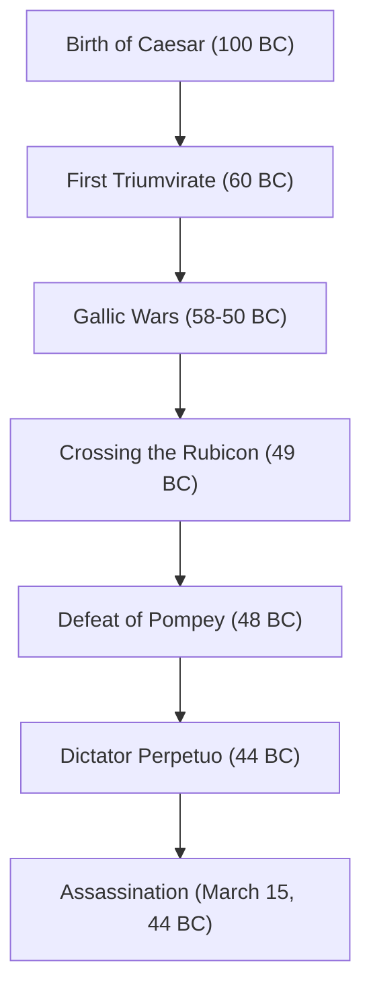

「賽は投げられた」「来た、見た、勝った」「ブルータス、お前もか」——世界史に疎くても、彼の遺した言葉を耳にしたことのない人はいないだろう。共和政ローマの末期に彗星のごとく現れ、その後のヨーロッパ世界の形を決定づけた英雄、ガイウス・ユリウス・カエサル（紀元前100年 - 紀元前44年）。彼は単なる軍人や政治家にとどまらず、文筆家、法廷弁護士、さらには暦の改革者としての顔も持っていた。

本記事では、ローマ共和国を解体し、帝政という新たなシステムへの扉を開いたカエサルの生涯、彼を貫いていた哲学、そして現代にまで至るその影響力を紐解いていく。

## 1. 激動の生涯：権力への階段とローマの覇権

### 借金と人脈から始まった政治家人生
名門貴族の出身でありながら、カエサルの青年期は決して平坦ではなかった。政敵からの迫害から逃れ、時には海賊に捕らえられるなど波乱万丈な日々を送っている。彼の特筆すべき点は、莫大な借金を抱えながらもそれを民衆への饗応や公共事業に投資し、圧倒的な人気を獲得していったことだ。「借金も規模が大きければ権力になる」という現代にも通じる冷徹な政治力学を、彼は早くから体現していた。

紀元前60年、ポンペイウス、クラッススと共に「第1回三頭政治」を結成。これによりカエサルはローマの国政において確固たる地位を築くことになる。

### ガリア遠征と軍事的才能
カエサルの名を不動のものとしたのが、紀元前58年から約8年にわたって行われた「ガリア戦争」である。現在のフランスからベルギー、スイスに至る広大な地域を平定し、さらには未知の地であったブリタンニア（イギリス）やゲルマニア（ドイツ）にまで足を踏み入れた。
彼が自ら書き残した『ガリア戦記』は、簡潔にして明晰なラテン語の名文として知られ、単なる戦の記録ではなく、本国ローマの民衆に向けた優れた政治的プロパガンダでもあった。

### 「賽は投げられた」——内戦と絶対権力の掌握
ガリアでの成功は、ポンペイウスら元老院派との決定的な対立を生む。紀元前49年、元老院の軍隊解散命令を無視し、カエサルはルビコン川を渡る。「賽は投げられた（Alea iacta est）」という有名な言葉とともに軍を進め、ローマに無血入城。その後、ギリシャ、エジプト（クレオパトラとの出会い）、アフリカ、スペインと転戦し、政敵を次々と打ち破った。

最終的に終身独裁官（ディクタトル・ペルペトゥオ）に就任したカエサルは、単独での権力集中を果たす。

## 2. カエサルの哲学：クレメンティア（寛容）と合理性

カエサルの特異な点は、敗者に対する「寛容（クレメンティア）」を徹底したことである。当時の内戦では、勝者が敗者を粛清し、財産を没収するのが常識であった。しかし、カエサルは降伏した政敵を許し、中には要職に登用する者さえいた。
これは単なる優しさではなく、高度な政治的計算に基づく合理的な判断だった。無用な血を流すことで新たな恨みを買うより、寛容を示すことで国内の融和と統治の安定を図ったのである。

また、彼の行動原理には「人々は、自分の見たいと欲する現実しか見ない」という人間心理への深い洞察があった。大衆の欲望を正確に読み取り、パンとサーカス（食糧と娯楽）を提供しつつ、言葉と演説で彼らの心を掌握する。その姿は、現代のポピュリズム政治の先駆者とも言えるかもしれない。

## 3. 後世への絶大な影響：ユリウス暦から「皇帝」の語源まで

カエサルが暗殺された後も、彼の遺したシステムと名前は世界を支配し続けた。

**暦の改革（ユリウス暦の制定）**
最も身近な功績のひとつが暦の改革である。太陽暦を導入し、1年を365.25日とする「ユリウス暦」を制定した。これは16世紀にグレゴリオ暦に改暦されるまでヨーロッパ全土で使われ続けた。現在でも7月を「July」と呼ぶのは、彼の名「Julius」に由来している。

**帝政への道筋と「皇帝」の称号**
カエサル自身は王や皇帝を名乗らなかったが、彼の後継者であるオクタウィアヌス（アウグストゥス）が初代ローマ皇帝となり、ローマは数百年続く帝政へと移行した。
その後、「カエサル（Caesar）」という名前は、ローマ皇帝の称号そのものとなった。さらに時代を下り、ドイツ語の「カイザー（Kaiser）」やロシア語の「ツァーリ（Tsar）」など、ヨーロッパ言語における「皇帝」を意味する言葉の語源となっている。

## 4. 結び：未完の天才

紀元前44年3月15日、元老院議場でカエサルは共和政の伝統を守ろうとするブルータスらによって暗殺される。権力の絶頂にありながら、パルティア遠征という新たな計画の直前に倒れた。

彼が構想していたローマ帝国の完全なグランドデザインがどのようなものであったかは、今となっては知る由もない。しかし、借金まみれの青年貴族から始まり、武力と知性と文才を駆使して世界最大の帝国の頂点に登り詰めたその軌跡は、2000年以上が経過した今もなお、人類の歴史上最も魅力的なストーリーのひとつとして輝き続けている。カエサルは、まさに自らの手で自らの運命、そして世界の運命を切り開いた真の「天才」であった。
