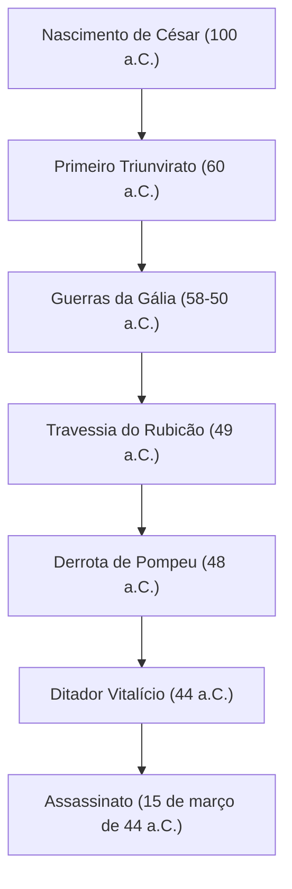

"A sorte está lançada", "Vim, vi, venci", "Até tu, Brutus?" — Mesmo aqueles que não estão familiarizados com a história mundial provavelmente já ouviram as palavras que ele deixou para trás. Caio Júlio César (100 a.C. - 44 a.C.), o herói que apareceu como um cometa no final da República Romana e determinou a forma do mundo europeu subsequente. Ele não era apenas um militar e político, mas também escritor, advogado e até reformador do calendário.

Este artigo desvenda a vida de César, que desmantelou a República Romana e abriu as portas para o novo sistema do Império, a filosofia que o atravessou e a sua influência que chega até a era moderna.

## 1. Uma Vida Turbulenta: A escada para o poder e a hegemonia de Roma

### Uma carreira política que começou com dívidas e contatos
Apesar de ter nascido em uma nobre família patrícia, a juventude de César não foi de forma alguma tranquila. Fugindo da perseguição de inimigos políticos e por vezes capturado por piratas, ele viveu uma vida cheia de altos e baixos. Seu traço notável era que, apesar de ter enormes dívidas, ele as investia no tratamento de pessoas comuns e em obras públicas, ganhando assim uma popularidade esmagadora. Ele incorporou desde cedo a fria dinâmica política que ainda hoje é relevante: "Mesmo a dívida, se for em grande escala, torna-se poder".

Em 60 a.C., ele formou o "Primeiro Triunvirato" com Pompeu e Crasso. Com isso, César estabeleceu uma posição sólida na política nacional romana.

### As Guerras da Gália e a genialidade militar
O que tornou o nome de César inamovível foram as "Guerras da Gália", que duraram cerca de 8 anos a partir de 58 a.C. Ele subjugou uma vasta região, da atual França à Bélgica e à Suíça, e chegou a pisar nas terras desconhecidas da Britânia (Grã-Bretanha) e Germânia (Alemanha).
Seu próprio registro escrito, "Comentários sobre a Guerra Gálica", é conhecido como uma obra-prima da prosa latina concisa e clara, e não era apenas um registro de guerra, mas também uma excelente propaganda política dirigida à população de Roma em sua terra natal.

### "A sorte está lançada" — Guerra Civil e a tomada do poder absoluto
O sucesso na Gália levou a um conflito decisivo com a facção senatorial, incluindo Pompeu. Em 49 a.C., ignorando a ordem do Senado para dissolver seu exército, César cruzou o Rubicão. Avançando com seu exército com as famosas palavras, "A sorte está lançada (Alea iacta est)", ele entrou em Roma sem derramamento de sangue. Posteriormente, lutou na Grécia, Egito (onde conheceu Cleópatra), África e Espanha, derrotando seus rivais políticos um após o outro.

Nomeado finalmente como Ditador vitalício (Dictator Perpetuo), César alcançou a concentração de poder unicamente em suas mãos.

## 2. A Filosofia de César: Clementia (Clemência) e racionalidade

A característica única de César foi a sua prática meticulosa de "clemência (clementia)" para com os derrotados. Nas guerras civis da época, era senso comum que o vencedor expurgasse os derrotados e confiscasse as suas propriedades. No entanto, César perdoou os inimigos políticos que se renderam e até nomeou alguns para cargos importantes.
Não se tratava de mera bondade, mas de um julgamento racional baseado numa estratégia política altamente calculada. Em vez de comprar novos ressentimentos derramando sangue desnecessário, ele procurou alcançar a harmonia interna e a estabilidade na governação, demonstrando clemência.

Além disso, os seus princípios comportamentais incluíam uma visão profunda da psicologia humana: "As pessoas só veem a realidade que desejam ver". Lendo com precisão os desejos das massas, fornecendo pão e circo (comida e entretenimento), ao mesmo tempo em que capturava os seus corações com palavras e discursos. Esta figura pode muito bem ser chamada de pioneira da política populista moderna.

## 3. Imensa Influência na Posteridade: Do Calendário Juliano à Etimologia de Imperador

Mesmo após o assassinato de César, o sistema e o nome que ele deixou continuaram a governar o mundo.

**Reforma do Calendário (Estabelecimento do Calendário Juliano)**
Uma de suas conquistas mais familiares é a reforma do calendário. Ele introduziu o calendário solar e estabeleceu o "Calendário Juliano", fazendo um ano ter 365,25 dias. Este continuou a ser utilizado em toda a Europa até ser reformado para o calendário gregoriano no século XVI. A razão pela qual o mês de julho ainda hoje é chamado de "julho" deriva de seu nome, "Julius".

**O Caminho para o Império e o Título de Imperador**
O próprio César não se chamou rei ou imperador, mas o seu sucessor Octaviano (Augusto) tornou-se o primeiro imperador romano, e Roma fez a transição para um sistema imperial que durou centenas de anos.
Posteriormente, o nome "César (Caesar)" tornou-se o próprio título do Imperador Romano. Além disso, entrando para a história, tornou-se a etimologia para palavras que significam "imperador" em línguas europeias, como "Kaiser" em alemão e "Tsar" em russo.

## 4. Conclusão: O Gênio Inacabado

Em 15 de março de 44 a.C., César foi assassinado no Senado por Brutus e outros que tentavam proteger a tradição da República. No zênite de seu poder, ele caiu pouco antes de um novo plano para a expedição parta.

Como seria o projeto completo e grandioso do Império Romano que ele imaginou agora é impossível saber. No entanto, a trajetória que começou de um jovem nobre endividado, usando força militar, intelecto e talento literário para subir ao pico do maior império do mundo, continua a brilhar como uma das histórias mais fascinantes da história humana, mesmo após mais de 2.000 anos se passarem. César foi um verdadeiro "gênio" que esculpiu seu próprio destino e o destino do mundo com as suas próprias mãos.
