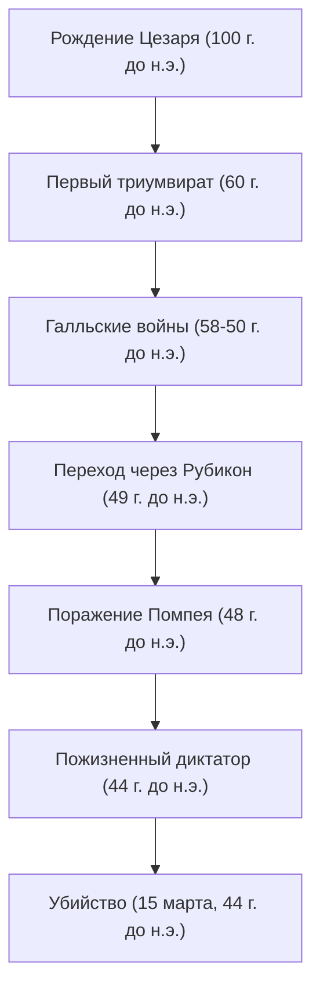

«Жребий брошен», «Пришел, увидел, победил», «И ты, Брут?» — Даже те, кто не знаком с мировой историей, наверняка слышали слова, которые он оставил после себя. Гай Юлий Цезарь (100 г. до н.э. - 44 г. до н.э.), герой, появившийся как комета на закате Римской республики и определивший облик последующего европейского мира. Он был не просто военным и политиком, но также писателем, судебным адвокатом и даже реформатором календаря.

Эта статья раскрывает жизнь Цезаря, который демонтировал Римскую республику и открыл дверь в новую систему Империи, философию, которая пронизывала его, и его влияние, которое достигает современной эпохи.

## 1. Бурная жизнь: Лестница к власти и гегемонии Рима

### Политическая карьера, начавшаяся с долгов и связей
Несмотря на рождение в благородной патрицианской семье, молодость Цезаря отнюдь не была гладкой. Спасаясь от преследований политических врагов и временами попадая в плен к пиратам, он прожил жизнь, полную взлетов и падений. Его примечательной чертой было то, что, несмотря на огромные долги, он инвестировал их в угощение простых людей и общественные работы, тем самым завоевывая ошеломляющую популярность. Он рано воплотил холодную политическую динамику, актуальную и сегодня: «Даже долг, если он достаточно масштабный, становится властью».

В 60 г. до н.э. он образовал «Первый триумвират» с Помпеем и Крассом. Благодаря этому Цезарь занял прочные позиции в римской национальной политике.

### Галльские войны и военный гений
Что сделало имя Цезаря незыблемым, так это «Галльские войны», которые длились около 8 лет, начиная с 58 г. до н.э. Он подчинил огромный регион от нынешней Франции до Бельгии и Швейцарии и даже ступил на неизведанные земли Британии (Великобритания) и Германии.
Его собственная письменная летопись «Записки о Галльской войне» известна как шедевр лаконичной и ясной латинской прозы, и была не просто военной хроникой, но и превосходной политической пропагандой, направленной на население Рима на родине.

### «Жребий брошен» — Гражданская война и захват абсолютной власти
Успех в Галлии привел к решающему конфликту с сенатской фракцией, включая Помпея. В 49 г. до н.э., игнорируя приказ Сената распустить армию, Цезарь пересек Рубикон. Продвигая свою армию со знаменитыми словами «Жребий брошен (Alea iacta est)», он без крови вошел в Рим. Впоследствии он воевал в Греции, Египте (где встретил Клеопатру), Африке и Испании, побеждая своих политических соперников одного за другим.

В конечном итоге назначенный пожизненным диктатором (Dictator Perpetuo), Цезарь добился концентрации власти исключительно в своих руках.

## 2. Философия Цезаря: Clementia (Милосердие) и рациональность

Уникальной чертой Цезаря была его тщательная практика «милосердия (clementia)» по отношению к побежденным. Во время гражданских войн того времени здравый смысл диктовал победителю очищать ряды побежденных и конфисковать их имущество. Однако Цезарь прощал сдавшихся политических врагов и даже назначал некоторых на важные посты.
Это было не просто добротой, а рациональным суждением, основанным на высоко расчетливой политической стратегии. Вместо того, чтобы наживать новые обиды, проливая ненужную кровь, он стремился достичь внутренней гармонии и стабильности в управлении, проявляя милосердие.

Более того, его принципы поведения включали глубокое понимание человеческой психологии: «Люди видят только ту реальность, которую хотят видеть». Точно считывая желания масс, предоставляя хлеб и зрелища (еду и развлечения), и одновременно завоевывая их сердца словами и речами. Эту фигуру вполне можно назвать пионером современной популистской политики.

## 3. Огромное влияние на потомков: От юлианского календаря до этимологии слова Император

Даже после убийства Цезаря оставленные им система и имя продолжали править миром.

**Реформа календаря (Учреждение юлианского календаря)**
Одно из самых известных его достижений — реформа календаря. Он ввел солнечный календарь и установил «Юлианский календарь», сделав год равным 365,25 дням. Он продолжал использоваться по всей Европе до тех пор, пока в 16 веке не был реформирован в григорианский календарь. Причина, по которой июль до сих пор называется «Июль» (July), происходит от его имени «Julius».

**Путь к Империи и титул Императора**
Сам Цезарь не называл себя царем или императором, но его преемник Октавиан (Август) стал первым римским императором, и Рим перешел к имперской системе, которая просуществовала сотни лет.
Впоследствии имя «Цезарь» (Caesar) стало самим титулом римского императора. Более того, уходя в историю, оно стало этимологией слов, означающих «император» в европейских языках, таких как «Кайзер» (Kaiser) в немецком и «Царь» (Tsar) в русском.

## 4. Заключение: Незавершенный гений

15 марта 44 г. до н.э. Цезарь был убит в здании Сената Брутом и другими, пытавшимися защитить традиции Республики. В зените своей власти он пал как раз перед новым планом Парфянского похода.

Каков был бы полный грандиозный проект Римской империи, который он представлял, теперь узнать невозможно. Тем не менее, траектория от обремененного долгами молодого дворянина, который использовал военную силу, интеллект и литературный талант, чтобы взобраться на вершину крупнейшей в мире империи, продолжает сиять как одна из самых захватывающих историй в истории человечества даже спустя более 2000 лет. Цезарь был настоящим «гением», который своими руками выковал свою судьбу и судьбу мира.
