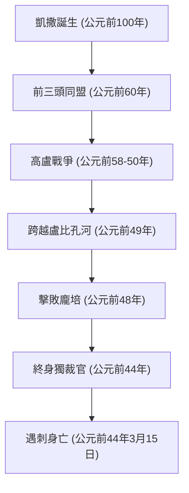

「骰子已擲出」、「我來，我見，我征服」、「布魯圖，你也在內嗎？」——即使是對世界歷史不甚了解的人，也一定聽說過他留下的這些名言。蓋烏斯·尤利烏斯·凱撒（公元前100年 - 公元前44年），這位在羅馬共和國末期如彗星般出現、並決定了此後歐洲世界格局的英雄。他不僅是一名軍人和政治家，還擁有作家、出庭律師，甚至曆法改革者的多重身份。

本文將梳理凱撒解體羅馬共和國、開啟帝制新系統大門的一生，貫穿他生命的哲學，以及他直至今日依然深遠的影響力。

## 1. 動蕩的一生：通往權力的階梯與羅馬的霸權

### 從債務與人脈開始的政治生涯
儘管出身於名門貴族，凱撒的青年時期卻絕非坦途。為了逃避政敵的迫害，他有時甚至被海盜俘虜，度過了波瀾壯闊的歲月。他最值得一提的特點是，儘管背負著巨額債務，他卻將其投資於款待民眾和公共事業，從而獲得了壓倒性的人氣。「債務只要規模足夠大，就會成為權力」——這種在現代依然適用的冷酷政治力學，他很早便已身體力行。

公元前60年，他與龐培、克拉蘇結成了「前三頭同盟」。由此，凱撒在羅馬國政中確立了堅不可摧的地位。

### 高盧戰爭與軍事才能
讓凱撒名垂青史的，是始於公元前58年、歷時約8年的「高盧戰爭」。他平定了從現在的法國到比利時、瑞士的廣大地區，甚至踏入了當時不列顛尼亞（英國）和日耳曼尼亞（德國）等未知之地。
他親自撰寫的《高盧戰記》以簡潔明晰的拉丁文名篇著稱，這不僅是單純的戰爭記錄，更是面向國內羅馬民眾的出色政治宣傳。

### 「骰子已擲出」——內戰與絕對權力的掌握
在高盧的成功，導致了他與龐培等元老院派的決定性對立。公元前49年，凱撒無視元老院解散軍隊的命令，跨越了盧比孔河。伴隨著「骰子已擲出（Alea iacta est）」的著名宣言，他率軍前進，兵不血刃地進入了羅馬。此後，他轉戰希臘、埃及（與克婁巴特拉相遇）、非洲和西班牙，將政敵逐一擊破。

最終就任終身獨裁官（Dictator Perpetuo）的凱撒，實現了權力的個人集中。

## 2. 凱撒的哲學：寬容（Clementia）與理性

凱撒的獨特之處在於，他對敗者徹底實行「寬容（Clementia）」。在當時的內戰中，勝者肅清敗者並沒收其財產是常識。然而，凱撒赦免了投降的政敵，其中甚至有人被任命為要職。
這並非單純的仁慈，而是基於高度政治計算的合理判斷。與其通過無謂的流血招致新的仇恨，不如通過展示寬容來謀求國內的融和與統治的穩定。

此外，他的行為準則中包含了對人類心理的深刻洞察：「人們只看得見他們希望看到的現實。」準確解讀大眾的慾望，提供麵包與馬戲（食物與娛樂），同時用言辭和演講掌握他們的心。這種姿態，或許可以說是現代民粹主義政治的先驅。

## 3. 對後世的巨大影響：從儒略曆到「皇帝」的語源

即使在凱撒被暗殺後，他留下的系統和名字依然繼續統治著世界。

**曆法改革（儒略曆的制定）**
最貼近我們生活的功績之一是曆法改革。他引入了太陽曆，制定了將1年定為365.25天的「儒略曆」。直到16世紀格里高利曆取代它之前，儒略曆在整個歐洲被持續使用。今天，7月之所以被稱為「July」，也是源自他的名字「Julius」。

**通往帝制之路與「皇帝」的稱號**
凱撒本人並沒有自稱為國王或皇帝，但他的繼承者屋大維（奧古斯都）成為了第一位羅馬皇帝，羅馬也過渡到了持續數百年的帝制。
此後，「凱撒（Caesar）」這個名字本身成為了羅馬皇帝的稱號。隨著時代的推移，它更成為了歐洲語言中意為「皇帝」的詞彙語源，例如德語中的「Kaiser」和俄語中的「Tsar」。

## 4. 結語：未完成的天才

公元前44年3月15日，在元老院議事堂內，凱撒被試圖保護共和國傳統的布魯圖等人暗殺。在權力的頂峰，他在前往帕提亞遠征的新計劃前夕倒下了。

他所構想的羅馬帝國完整宏偉藍圖究竟是怎樣的，如今已無從知曉。然而，從一個債台高築的青年貴族開始，運用武力、智慧和文采攀登至世界最大帝國頂點的軌跡，在2000多年後的今天，依然作為人類歷史上最迷人的故事之一閃耀著光芒。凱撒，正是一位親手開創了自己命運、乃至世界命運的真正「天才」。
