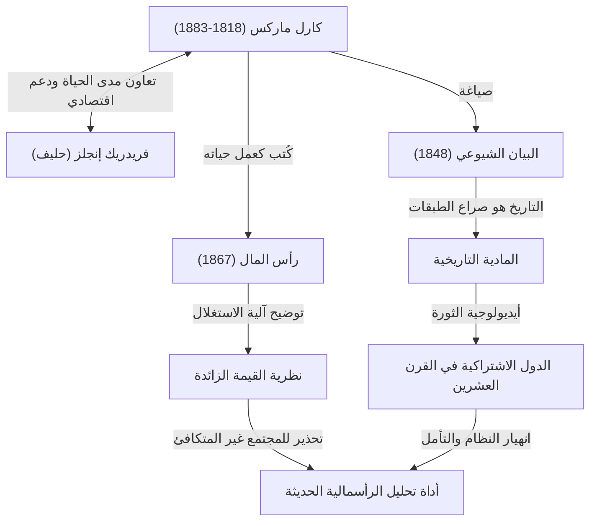

كارل ماركس. عند سماع هذا الاسم، ما الذي يتبادر إلى ذهنك؟ قد يعتبره البعض شخصية تاريخية عظيمة بصفته "أبو الشيوعية"، بينما قد ينظر إليه آخرون على أنه "مفكر خطير خلق دولًا دكتاتورية". ومع ذلك، إذا أزلنا حجاب الأيديولوجية ونظرنا بشكل نقي إلى أفكاره، فإن ما نجده هو صورة "مصصح أخطاء (مصحح أخطاء) عبقري قام بتحليل أخطاء (تناقضات) النظام الرأسمالي بعمق أكثر من أي شخص آخر".

المجتمع غير المتكافئ، وظروف العمل القاسية، والأزمات الاقتصادية الدورية التي نواجهها اليوم. والمثير للدهشة أن هذه هي نفس "العيوب الهيكلية للرأسمالية" التي توقعها ماركس قبل أكثر من 150 عامًا. في هذا المقال، ومن منظور كاتب تاريخ محترف، سنتعمق في حياة كارل ماركس المضطربة، وجوهر الفلسفة التي أسسها، ولماذا تعود أفكاره إلى دائرة الضوء في المجتمع الحديث.

## مسار الحياة: كيف وُلد المفكر المتمرد؟

وُلد كارل هاينريش ماركس عام 1818 في ترير، مملكة بروسيا (ألمانيا الآن)، في عائلة ثرية من المحامين اليهود. أثناء دراسته للقانون والفلسفة في جامعتي بون وبرلين، تأثر بشدة بالفلسفة الهيغلية التي كانت تجتاح العالم الفلسفي الألماني في ذلك الوقت. ومع ذلك، لم يكتفِ بتأكيد الوضع الراهن، بل مال نحو "الهيغليين الشباب"، الذين انتقدوا التناقضات الاجتماعية للواقع.

بعد التخرج من الجامعة، بدأ ماركس العمل كصحفي، ولكن بسبب انتقاداته الحادة للحكومة، أُجبرت الصحيفة على تعليق النشر وتم نفيه إلى باريس. أصبحت فترة باريس هذه نقطة تحول رئيسية حددت [مسار](/ar/p/windows-%E3%81%A7%D9%85%D8%B3%D8%A7%D8%B1%E3%81%AE%E9%80%9A%E3%81%A3%E3%81%9F%D9%85%D9%84%D9%81-%D8%AA%D9%86%D9%81%D9%8A%D8%B0%D9%8A%E3%81%AE%E5%A0%B4%E6%89%80%E3%82%92%E8%A6%8B%E3%81%A4%E3%81%91%E3%82%8B%E6%96%B9%E6%B3%95/) حياته. هنا كان لديه لقاء مصيري مع فريدريك إنجلز، الذي سيصبح حليفه مدى الحياة. نقل إنجلز، نجل مالك مصنع غزل ثري، الواقع المأساوي للطبقة العاملة البريطانية إلى ماركس، وانسجم الاثنان معًا. ومنذ ذلك الحين، أصبح شريكًا لا مثيل له استمر في دعم ماركس أيديولوجياً واقتصادياً.

وحتى بعد ذلك، اعتبرته حكومات بلدان مختلفة شخصًا خطيرًا وتم نفيه تباعًا إلى بروكسل، وكولونيا، وأخيرًا إلى لندن. كانت الحياة في لندن تتسم بالفقر المدقع، وعاش مأساة فقدان أطفاله الواحد تلو الآخر بسبب سوء التغذية والمرض. ومع ذلك، كان ماركس يزور غرفة القراءة في المتحف البريطاني يوميًا ويلتهم كميات هائلة من الأدبيات الاقتصادية. كانت ثمرة بحثه المضني هذا هي عمله الرئيسي، "رأس المال".

## تحليل فكر ماركس بالرسوم البيانية

تم تلخيص الصورة الكاملة لإنجازاته وتأثيره الأيديولوجي في مخطط الارتباط التالي.

## جوهر الفلسفة الماركسية: المادية التاريخية ولغز القيمة الزائدة

تنقسم أفكار ماركس بشكل عام إلى ثلاث ركائز: "الفلسفة" و"الرؤية التاريخية" و"الاقتصاد"، ولكن جوهرها يتكون من "المادية التاريخية" و"نظرية القيمة الزائدة".

### ما يحرك التاريخ هو "الظروف المادية"
المادية التاريخية هي الفكرة الثورية القائلة بأن "ليس الوعي البشري هو الذي يحدد المجتمع، بل إن علاقات الإنتاج المادية للمجتمع هي التي تحدد الوعي البشري". وبينما روى المؤرخون السابقون التاريخ من خلال القصص البطولية للملوك والنبلاء أو المثل الدينية، حدد ماركس التناقض بين "قوى الإنتاج" و"علاقات الإنتاج" على أنه المحرك الذي يدفع التاريخ إلى المرحلة التالية. المقطع الشهير في "البيان الشيوعي"، "إن تاريخ كل مجتمع موجود حتى الآن هو تاريخ صراع الطبقات"، يعبر بإيجاز عن هذه النظرة التاريخية.

### "القيمة الزائدة": لماذا لا يستطيع العمال أن يصبحوا أثرياء؟
أعظم إنجازاته في الاقتصاد هو "نظرية القيمة الزائدة"، التي أوضحت منطقياً كيف تولد الرأسمالية الأرباح وتوسع عدم المساواة في نفس الوقت.
يقوم الرأسماليون بتوظيف العمال ودفع أجور لهم. ومع ذلك، ينتج العمال من خلال عملهم قيمة أكبر من أجورهم (قيمة قوة عملهم). أطلق ماركس على هذه القيمة المنتجة بما يتجاوز الأجر اسم "القيمة الزائدة"، وكشف أن هذا هو بالضبط مصدر أرباح الرأسماليين والطبيعة الحقيقية لـ "استغلال" العمال.
وبعبارة أخرى، جادل بأن الحالة ذاتها التي يعمل فيها النظام الرأسمالي بشكل طبيعي مبرمجة حتماً للتسبب في "التوزيع غير المتكافئ للثروة" و"فقر العمال".

## تأثيره الهائل على الأجيال اللاحقة وماركس اليوم

بعد وفاة ماركس، قسمت أفكاره العالم حرفيًا إلى قسمين في القرن العشرين. وضع زعيم الثورة الروسية لينين نظريته موضع التنفيذ، فولد الاتحاد السوفيتي، أول دولة اشتراكية في تاريخ البشرية. وبعد ذلك، انتشرت في جميع أنحاء العالم، بما في ذلك الصين وكوبا، وواجهت الكتلة الرأسمالية في شكل الحرب الباردة. ونتيجة لذلك، انهار الاتحاد السوفيتي، وأصبحت العديد من أنظمة الدول التي دافعت عن الماركسية مختلة وظيفيًا. وبسبب هذا، كانت هناك فترة قيل فيها أن "ماركس قد انتهى".

ومع ذلك، بدخول القرن الحادي والعشرين، وبعد أزمة ليمان والوباء، عادت أفكاره لتجذب الانتباه. فالأشخاص المعاصرون الذين يعانون من تركز الثروة في جزء صغير من الشركات العالمية والأثرياء للغاية، والطبقة الوسطى المتراجعة، والعمالة غير المنتظمة، و"الوظائف التافهة"، هم بالضبط "العمال المغتربون" الذين وصفهم ماركس في "رأس المال".
حتى بالنسبة للتحديات العالمية مثل تغير المناخ والتدمير البيئي، فإن منظور ماركس، الذي يشكك بشكل أساسي في السعي اللانهائي للرأسمالية وراء الربح، قد تم تحديثه من قبل الاقتصاديين المعاصرين الذين يشيرون إلى حدود الليبرالية الجديدة، وتم إحياؤه كأداة تحليلية قوية.

## الخلاصة: "نظام تشغيل" للتفكير في المستقبل

لم يرسم كارل ماركس مخططًا تفصيليًا لمدينة فاضلة (يوتوبيا) مستقبلية. ما تركه وراءه كان منطقًا قويًا لفك تشفير "الكود المصدري" للنظام الرأسمالي القوي والقاسي للغاية، والإشارة إلى نقاط ضعفه.
عندما نحاول تصميم نظام اجتماعي أفضل، فإن أفكاره العظيمة ليست من بقايا الماضي، بل تستمر في العمل اليوم كـ "نظام تشغيل (قاعدة تفكير)" لا غنى عنه لتصحيح أخطاء المجتمع الحديث.
