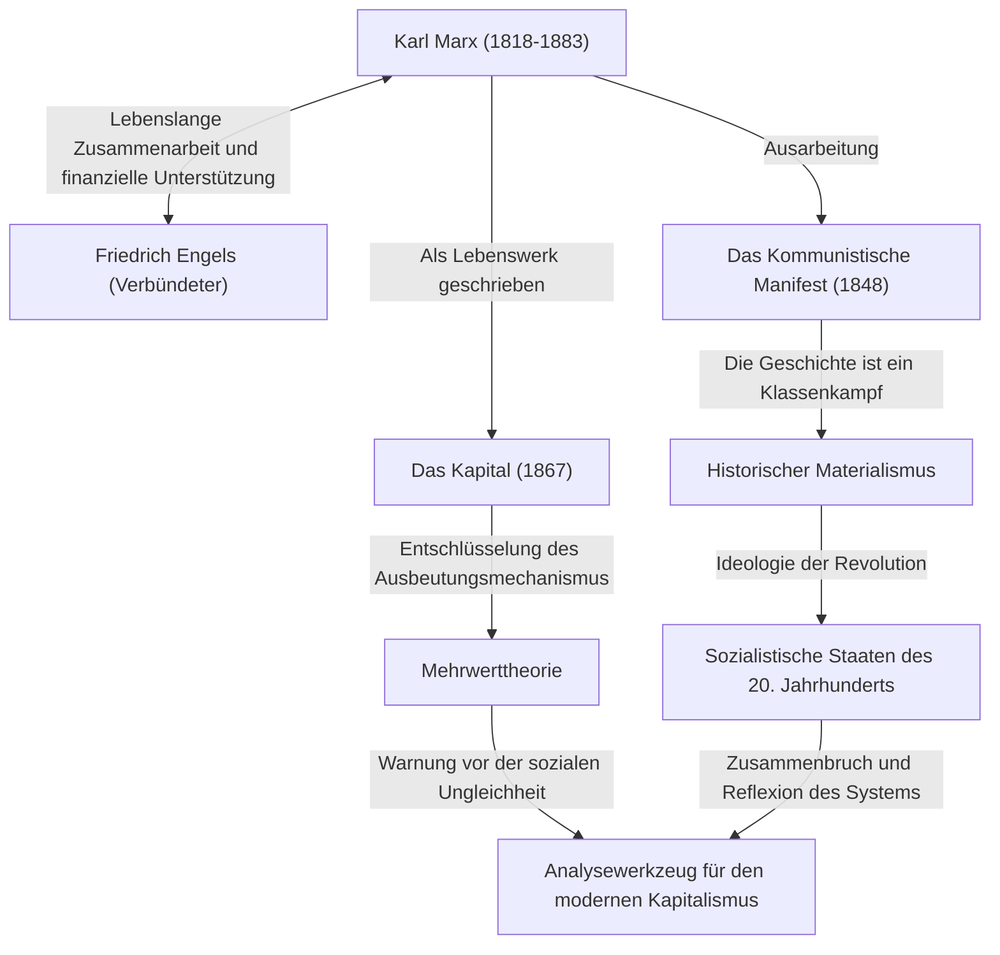

Karl Marx. Was kommt Ihnen in den Sinn, wenn Sie diesen Namen hören? Einige betrachten ihn vielleicht als eine große historische Figur, den „Vater des Kommunismus“, während andere ihn vielleicht als einen „gefährlichen Denker, der diktatorische Staaten hervorbrachte“ sehen. Wenn man jedoch den Schleier der Ideologie entfernt und seine Ideen rein betrachtet, findet man die Figur eines „genialen Debuggers, der den Bug (die Widersprüche) des kapitalistischen Systems tiefer analysierte als jeder andere“.

Die soziale Ungleichheit, die harten Arbeitsbedingungen und die zyklischen Wirtschaftskrisen, mit denen wir heute konfrontiert sind – es ist erstaunlich, dass dies genau die „strukturellen Mängel des Kapitalismus“ sind, die Marx vor über 150 Jahren vorhersah. In diesem Artikel werden wir aus der Perspektive eines professionellen Geschichtsautors tief in das turbulente Leben von Karl Marx, den Kern der von ihm begründeten Philosophie und die Frage eintauchen, warum seine Ideen in der heutigen Gesellschaft wieder im Rampenlicht stehen.

## Spuren eines Lebens: Wie der rebellische Denker entstand

Karl Heinrich Marx wurde 1818 in Trier, im Königreich Preußen (heutiges Deutschland), in eine wohlhabende jüdische Anwaltsfamilie geboren. Während seines Studiums der Rechtswissenschaften und Philosophie an der Universität Bonn und der Universität Berlin wurde er stark von der Hegelschen Philosophie beeinflusst, die damals die deutsche philosophische Welt dominierte. Er bejahte jedoch nicht einfach den Status quo, sondern wandte sich den „Junghegelianern“ zu, die die realen gesellschaftlichen Widersprüche kritisierten.

Nach seinem Universitätsabschluss begann Marx als Journalist zu arbeiten, aber seine scharfe Regierungskritik führte dazu, dass seine Zeitung verboten wurde, und er floh nach Paris ins Exil. Diese Pariser Zeit wurde zu einem entscheidenden Wendepunkt in seinem Leben. Hier hatte er eine schicksalhafte Begegnung mit Friedrich Engels, der sein lebenslanger Verbündeter werden sollte. Engels, der Sohn eines wohlhabenden Spinnereibesitzers, berichtete Marx von der tragischen Realität der britischen Arbeiterklasse, und die beiden verstanden sich sofort. Von da an wurde Engels zu einem unersetzlichen Partner, der Marx ideologisch und finanziell unterstützte.

Danach wurde er weiterhin von Regierungen verschiedener Länder als gefährlich eingestuft und floh nach Brüssel, Köln und schließlich nach London. Das Leben in London war von extremer Armut geprägt; eine brutale Realität, in der er nacheinander seine Kinder durch Unterernährung und Krankheit verlor. Dennoch besuchte Marx täglich den Lesesaal des British Museum und las sich durch eine enorme Menge an wirtschaftswissenschaftlicher Literatur. Die Kristallisation dieser blutigen und schweißtreibenden Forschung ist sein Hauptwerk „Das Kapital“.

## Marx' Ideen grafisch entschlüsseln

Das Gesamtbild seiner Errungenschaften und seines ideologischen Einflusses ist im folgenden Korrelationsdiagramm zusammengefasst.

## Der Kern der marxistischen Philosophie: Das Rätsel des historischen Materialismus und des Mehrwerts

Marx' Ideen bestehen im Großen und Ganzen aus drei Säulen: „Philosophie“, „Geschichtsauffassung“ und „Wirtschaftswissenschaften“, aber ihr Kernstück bilden der „Historische Materialismus“ und die „Mehrwerttheorie“.

### Es sind die „materiellen Bedingungen“, die die Geschichte bewegen
Der historische Materialismus ist die revolutionäre Idee, dass „nicht das Bewusstsein der Menschen ihr Sein, sondern umgekehrt ihr gesellschaftliches Sein ihr Bewusstsein bestimmt“. Während bisherige Historiker die Geschichte anhand von Heldengeschichten über Könige und Adlige oder religiösen Idealen erzählten, definierte Marx, dass gerade der Widerspruch zwischen den „Produktivkräften“ und den „Produktionsverhältnissen“ die Triebkraft (der Motor) ist, die die Geschichte in die nächste Phase vorantreibt. Der berühmte Satz aus dem *Kommunistischen Manifest*: „Die Geschichte aller bisherigen Gesellschaft ist die Geschichte von Klassenkämpfen“, drückt diese Geschichtsauffassung prägnant aus.

### „Mehrwert“ ―― Warum Arbeiter nicht reich werden können
Seine größte Errungenschaft in den Wirtschaftswissenschaften ist die „Mehrwerttheorie“, die logisch aufklärt, wie der Kapitalismus Profite generiert und gleichzeitig die Ungleichheit vergrößert.
Der Kapitalist stellt Arbeiter ein und zahlt ihnen einen Lohn. Der Arbeiter schafft jedoch durch seine Arbeit einen Wert, der über seinen eigenen Lohn (den Wert seiner Arbeitskraft) hinausgeht. Marx nannte diesen über den Lohn hinaus geschaffenen Wert „Mehrwert“ und entlarvte, dass genau dies die Quelle des Profits des Kapitalisten und die wahre Natur der „Ausbeutung“ der Arbeiter ist.
Mit anderen Worten: Er argumentierte, dass allein der Zustand, in dem das kapitalistische System normal funktioniert, zwangsläufig so programmiert ist, dass er eine „ungleiche Verteilung des Reichtums“ und die „Armut der Arbeiter“ verursacht.

## Gewaltiger Einfluss auf die Nachwelt und Marx in der Moderne

Nach Marx' Tod spalteten seine Ideen das 20. Jahrhundert buchstäblich in zwei Hälften. Der Führer der Russischen Revolution, Lenin, setzte seine Theorien in die Praxis um und schuf die Sowjetunion, den ersten sozialistischen Staat der Menschheitsgeschichte. Danach breitete sich dies auf der ganzen Welt aus, etwa nach China und Kuba, und trat dem kapitalistischen Lager in Form des Kalten Krieges entgegen. Infolgedessen brach die Sowjetunion zusammen, und viele der staatlichen Systeme, die den Marxismus hochhielten, wurden funktionsunfähig. Infolgedessen gab es eine Zeit, in der man sagte: „Marx ist am Ende“.

Zu Beginn des 21. Jahrhunderts, nach der Lehman-Pleite und der Pandemie, rücken seine Ideen jedoch wieder in den Mittelpunkt. Der moderne Mensch, der unter der Konzentration des Reichtums bei einer winzigen Minderheit globaler Konzerne und den Superreichen, dem Niedergang der Mittelschicht und prekärer Beschäftigung oder „Bullshit-Jobs“ leidet, ist genau der „entfremdete Arbeiter“, den Marx im *Kapital* beschrieb.
Auch bei globalen Herausforderungen wie dem Klimawandel und der Umweltzerstörung wird Marx' Perspektive, die das grenzenlose Streben nach Profit des Kapitalismus grundlegend in Frage stellt, von modernen Ökonomen, die auf die Grenzen des Neoliberalismus hinweisen, aktualisiert und als mächtiges Analysewerkzeug wiederbelebt.

## Fazit: Ein „OS“ zum Nachdenken über die Zukunft

Karl Marx hat keinen detaillierten Bauplan für eine zukünftige Utopie gezeichnet. Was er hinterließ, war eine robuste Logik, um den „Quellcode“ dieses extrem mächtigen und rücksichtslosen Systems namens Kapitalismus zu entschlüsseln und auf seine Schwachstellen hinzuweisen.
Wenn wir versuchen, ein besseres Gesellschaftssystem zu entwerfen, sind seine großartigen Ideen, die er hinterlassen hat, kein Relikt der Vergangenheit, sondern fungieren auch heute noch als unverzichtbares „Betriebssystem (OS / Denkstruktur)“, um die Bugs der modernen Gesellschaft zu beheben.
