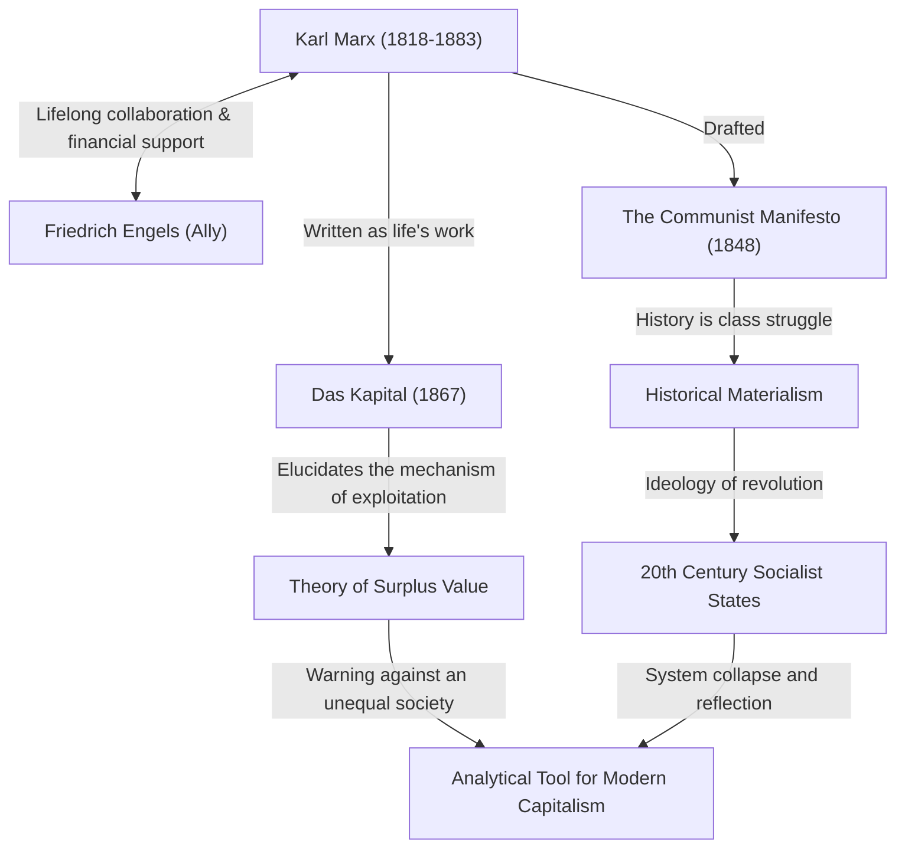

Karl Marx. What comes to mind when you hear that name? Some might think of him as a great historical figure, the "father of communism," while others might see him as a "dangerous thinker who spawned dictatorial states." However, if we strip away the veil of ideology and look purely at his thought, we find the figure of a "genius debugger who analyzed the bugs (contradictions) of the capitalist system more deeply than anyone else."

The unequal society, harsh working conditions, and cyclical economic crises we face today—surprisingly, these are the very "structural flaws of capitalism" that Marx foresaw over 150 years ago. In this article, from the perspective of a professional historical writer, we will delve deeply into Karl Marx's turbulent life, the core of the philosophy he established, and why his ideas are once again in the spotlight in modern society.

## The Trajectory of His Life: How the Rebellious Thinker Was Born

Karl Heinrich Marx was born in 1818 in Trier, Kingdom of Prussia (present-day Germany), to a wealthy Jewish lawyer's family. While studying law and philosophy at the universities of Bonn and Berlin, he was strongly influenced by Hegelian philosophy, which swept the German philosophical world at the time. However, instead of simply affirming the status quo, he leaned towards the "Young Hegelians," who criticized the social contradictions of reality.

After graduating from university, Marx began working as a journalist, but his sharp criticism of the government forced his newspaper to suspend publication, leading to his exile in Paris. This Paris period became a crucial turning point that would determine his life. Here he had a fateful encounter with Friedrich Engels, who would become his lifelong friend. Engels, the son of a wealthy textile factory owner, told Marx about the miserable reality of the working class in England, and the two hit it off. From then on, he became an unparalleled partner who continued to support Marx both ideologically and financially.

Even after that, viewed as dangerous by governments of various countries, he was repeatedly exiled to Brussels, Cologne, and finally London. His life in London was one of extreme poverty, a gruesome ordeal in which he lost his children one after another to malnutrition and illness. Nevertheless, Marx went to the reading room of the British Museum every day, devouring a vast amount of economic literature. The crystallization of this blood-sweat-and-tears research is his magnum opus, "Das Kapital" (Capital).

## Deciphering Marx's Thought with Diagrams

The overall picture of his achievements and ideological influence is organized in the correlation diagram below.

## The Core of Marxist Philosophy: Historical Materialism and the Mystery of Surplus Value

Marx's thought largely consists of three pillars: "Philosophy," "View of History," and "Economics," but its core is formed by "Historical Materialism" and the "Theory of Surplus Value."

### "Material Conditions" Drive History
Historical materialism is the revolutionary idea that "it is not the consciousness of men that determines their being, but, on the contrary, their social being that determines their consciousness." While previous historians told history through the heroic tales of royalty and nobility or religious ideals, Marx defined the contradiction between "productive forces" and "relations of production" as the driving force (engine) that moves history to the next stage. The famous passage from The Communist Manifesto, "The history of all hitherto existing society is the history of class struggles," succinctly expresses this view of history.

### "Surplus Value" — Why Workers Cannot Become Wealthy
His greatest achievement in economics is the "Theory of Surplus Value," which logically elucidated how capitalism generates profit while simultaneously widening inequality. 
Capitalists hire workers and pay them wages. However, workers produce more value through their labor than the amount of their wages (the value of their labor power). Marx called the value created beyond this wage "surplus value," revealing that this is the very source of capitalist profit and the true nature of "exploitation" of workers. 
In other words, he argued that the very state in which the capitalist system operates normally is programmed to inevitably cause the "maldistribution of wealth" and the "poverty of workers."

## Massive Influence on Posterity and Marx in the Modern Era

After Marx's death, his ideas literally bisected the world in the 20th century. Lenin, the leader of the Russian Revolution, put his theories into practice, giving birth to the Soviet Union, the first socialist state in human history. After that, it spread throughout the world to places like China and Cuba, confronting the capitalist bloc in the form of the Cold War. As a result, the Soviet Union collapsed, and many state systems flying the flag of Marxism fell into dysfunction. Because of this, there was a time when it was said that "Marx is finished."

However, entering the 21st century, going through the Lehman shock and the pandemic, his ideas are once again attracting attention. Modern people, suffering from wealth concentrated in a tiny fraction of global corporations and the wealthy, the fall of the middle class, non-regular employment, and "bullshit jobs," are exactly the "alienated workers" Marx depicted in "Das Kapital". 
Even regarding global issues such as climate change and environmental destruction, Marx's perspective, which fundamentally questions capitalism's infinite pursuit of profit, has been updated by modern economists who point out the limits of neoliberalism, reviving it as a powerful analytical tool.

## Conclusion: An "OS" for Thinking About the Future

Karl Marx did not draw a detailed blueprint of a future utopia. What he left behind was a robust logic for deciphering the "source code" of the extremely powerful and ruthless system of capitalism and pointing out its vulnerabilities. 
When we try to design a better social system, his grand ideas that he left behind are not relics of the past, but continue to function even now as an indispensable "OS (foundation of thought)" for fixing the bugs of modern society.
