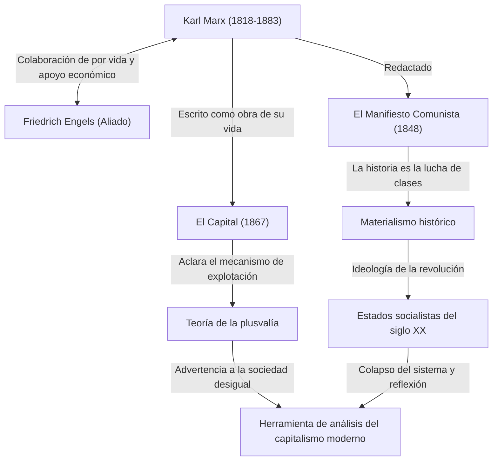

Karl Marx. Al escuchar ese nombre, ¿qué le viene a la mente? Algunas personas pueden considerarlo una gran figura histórica como el "padre del comunismo", mientras que otras pueden percibirlo como un "pensador peligroso que creó estados dictatoriales". Sin embargo, si quitamos el velo de la ideología y volvemos a mirar puramente su pensamiento, lo que encontramos es la figura de "un depurador genial que analizó más profundamente que nadie los errores (contradicciones) del sistema capitalista".

La sociedad desigual, las duras condiciones laborales y las crisis económicas periódicas que enfrentamos hoy en día. Sorprendentemente, estos son los mismos "defectos estructurales del capitalismo" que Marx previó hace más de 150 años. En este artículo, desde la perspectiva de un escritor de historia profesional, profundizaremos en la turbulenta vida de Karl Marx, el núcleo de la filosofía que estableció y por qué su pensamiento está volviendo a ser el centro de atención en la sociedad moderna.

## Trayectoria de vida: ¿Cómo nació el pensador rebelde?

Karl Heinrich Marx nació en 1818 en Tréveris, Reino de Prusia (actual Alemania), en una rica familia de abogados judíos. Mientras estudiaba derecho y filosofía en las Universidades de Bonn y Berlín, estuvo fuertemente influenciado por la filosofía hegeliana, que arrasaba en el mundo filosófico alemán de la época. Sin embargo, no se limitó a afirmar el statu quo, sino que se inclinó hacia los "jóvenes hegelianos", que criticaban las contradicciones sociales de la realidad.

Después de graduarse de la universidad, Marx comenzó a trabajar como periodista, pero debido a sus agudas críticas al gobierno, el periódico se vio obligado a suspender su publicación y se exilió en París. Este período en París se convirtió en un importante punto de inflexión que determinaría su vida. Aquí tuvo un encuentro fatídico con Friedrich Engels, quien se convertiría en su aliado de por vida. Engels, hijo de un rico propietario de una fábrica de hilados, transmitió a Marx la triste realidad de la clase trabajadora británica, y los dos congeniaron. A partir de entonces, se convirtió en un compañero inigualable que continuó apoyando a Marx tanto ideológica como económicamente.

Incluso después, fue considerado peligroso por los gobiernos de varios países y se exilió sucesivamente a Bruselas, Colonia y, finalmente, Londres. La vida en Londres fue de extrema pobreza, y experimentó la tragedia de perder a sus hijos uno tras otro debido a la desnutrición y las enfermedades. Aun así, Marx visitaba a diario la sala de lectura del Museo Británico y devoraba una enorme cantidad de literatura económica. El fruto de su exhaustiva investigación es su obra principal, "El Capital".

## Analizando el pensamiento de Marx con diagramas

La imagen completa de sus logros y la influencia de su pensamiento se resumen en el siguiente diagrama de correlación.

## El núcleo de la filosofía marxista: El materialismo histórico y el misterio de la plusvalía

El pensamiento de Marx se compone a grandes rasgos de tres pilares: "filosofía", "visión histórica" y "economía", pero su núcleo lo forman el "materialismo histórico" y la "teoría de la plusvalía".

### Lo que mueve la historia son las "condiciones materiales"
El materialismo histórico es la idea revolucionaria de que "no es la conciencia humana la que determina la sociedad, sino que son las relaciones materiales de producción de la sociedad las que determinan la conciencia humana". Mientras que los historiadores anteriores habían narrado la historia a través de las historias heroicas de la realeza y la nobleza o los ideales religiosos, Marx definió que la contradicción entre las "fuerzas productivas" y las "relaciones de producción" es el motor que hace avanzar la historia a la siguiente etapa. El famoso pasaje de "El Manifiesto Comunista", "La historia de todas las sociedades hasta nuestros días es la historia de la lucha de clases", expresa sucintamente esta visión histórica.

### "Plusvalía": ¿Por qué los trabajadores no pueden enriquecerse?
Su mayor logro en economía es la "teoría de la plusvalía", que aclaró lógicamente cómo el capitalismo genera ganancias y al mismo tiempo expande la desigualdad.
Los capitalistas contratan trabajadores y les pagan un salario. Sin embargo, los trabajadores producen con su trabajo más valor que su salario (el valor de su fuerza de trabajo). Marx llamó a este valor producido por encima del salario "plusvalía", y reveló que esta es precisamente la fuente de las ganancias de los capitalistas y la verdadera naturaleza de la "explotación" de los trabajadores.
En otras palabras, argumentó que el propio estado en el que el sistema capitalista funciona normalmente está inevitablemente programado para causar una "distribución desigual de la riqueza" y la "pobreza de los trabajadores".

## Su enorme influencia en las generaciones posteriores y Marx en la actualidad

Después de la muerte de Marx, su pensamiento dividió literalmente al mundo en dos en el siglo XX. El líder de la Revolución Rusa, Lenin, puso en práctica su teoría, dando origen a la Unión Soviética, el primer estado socialista en la historia de la humanidad. Posteriormente, se extendió por todo el mundo, incluidos China y Cuba, y se enfrentó al bloque capitalista en forma de Guerra Fría. Como resultado, la Unión Soviética colapsó y muchos de los sistemas estatales que defendían el marxismo se volvieron disfuncionales. Por ello, hubo una época en la que se decía que "Marx estaba acabado".

Sin embargo, al entrar en el siglo XXI, tras la crisis de Lehman y la pandemia, su pensamiento vuelve a atraer la atención. Las personas modernas que sufren por la riqueza concentrada en una pequeña fracción de empresas globales y los muy ricos, la clase media en declive, el empleo no regular y los "trabajos de mierda", son exactamente los "trabajadores alienados" que Marx describió en "El Capital".
Incluso para los desafíos globales como el cambio climático y la destrucción del medio ambiente, la perspectiva de Marx, que cuestiona fundamentalmente la búsqueda infinita de ganancias del capitalismo, ha sido actualizada por los economistas modernos que señalan los límites del neoliberalismo y ha revivido como una poderosa herramienta de análisis.

## Resumen: Un "sistema operativo" para pensar en el futuro

Karl Marx no dibujó un plano detallado de una utopía futura. Lo que dejó atrás fue una lógica sólida para descifrar el "código fuente" del sistema capitalista extremadamente poderoso y despiadado, y señalar sus vulnerabilidades.
Cuando intentamos diseñar un sistema social mejor, su grandioso pensamiento no es una reliquia del pasado, sino que continúa funcionando hoy como un "sistema operativo (base de pensamiento)" indispensable para corregir los errores de la sociedad moderna.
