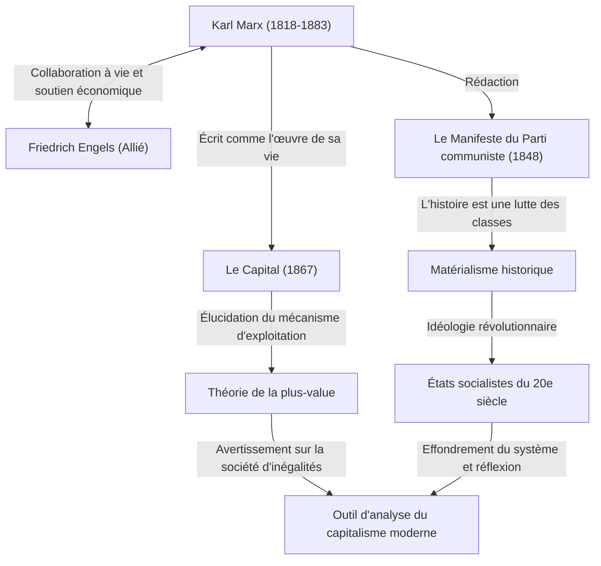

Karl Marx. Que vous vient-il à l'esprit lorsque vous entendez ce nom ? Certains peuvent le considérer comme un grand homme de l'histoire en tant que « père du communisme », tandis que d'autres peuvent le voir comme un « dangereux penseur qui a donné naissance à des États dictatoriaux ». Cependant, si l'on retire le voile de l'idéologie pour réexaminer purement sa pensée, ce qui apparaît est la figure d'un « débogueur de génie qui a analysé plus profondément que quiconque les bugs (contradictions) du système capitaliste ».

La société des inégalités, les conditions de travail difficiles et les crises économiques cycliques auxquelles nous sommes confrontés aujourd'hui. De manière surprenante, ce sont précisément les « défauts structurels du capitalisme » que Marx avait prédits il y a plus de 150 ans. Dans cet article, du point de vue d'un rédacteur historique professionnel, nous explorerons en profondeur la vie tumultueuse de Karl Marx, le cœur de la philosophie qu'il a fondée et les raisons pour lesquelles sa pensée revient aujourd'hui sur le devant de la scène dans la société moderne.

## La trajectoire de sa vie : Comment est né le penseur rebelle

Karl Heinrich Marx est né en 1818 à Trèves, dans le royaume de Prusse (l'actuelle Allemagne), dans la famille d'un riche avocat d'origine juive. En étudiant le droit et la philosophie aux universités de Bonn et de Berlin, il fut fortement influencé par la philosophie hégélienne, qui dominait alors le monde philosophique allemand. Cependant, au lieu de simplement affirmer le statu quo, il s'est tourné vers les « jeunes hégéliens » qui critiquaient les contradictions sociales de la réalité.

Après l'obtention de son diplôme, Marx a commencé à travailler comme journaliste, mais ses critiques acerbes du gouvernement ont conduit à la suspension de son journal, et il a dû s'exiler à Paris. Cette période parisienne a été un tournant majeur et décisif dans sa vie. C'est là qu'il a fait la rencontre fatidique de Friedrich Engels, qui allait devenir son allié de toujours. Engels, fils d'un riche propriétaire de filature, a transmis à Marx la réalité misérable de la classe ouvrière britannique, et les deux hommes se sont immédiatement entendus. Dès lors, Engels est devenu un partenaire irremplaçable qui n'a cessé de soutenir Marx sur le plan idéologique et financier.

Par la suite, considéré comme dangereux par les gouvernements de divers pays, il s'est exilé successivement à Bruxelles, à Cologne, et finalement à Londres. Sa vie à Londres fut d'une pauvreté extrême, marquée par la tragédie de perdre ses enfants les uns après les autres à cause de la malnutrition et de la maladie. Malgré cela, Marx se rendait tous les jours à la salle de lecture du British Museum, dévorant une immense quantité de littérature économique. Le fruit de ces recherches acharnées est son œuvre majeure, « Le Capital ».

## Décrypter la pensée de Marx par des schémas

Nous avons résumé l'ensemble de ses réalisations et de son influence idéologique dans le diagramme de relations ci-dessous.

## Le cœur de la philosophie de Marx : Le matérialisme historique et le mystère de la plus-value

La pensée de Marx se compose de trois piliers principaux : la « philosophie », la « conception de l'histoire » et l'« économie ». Le cœur en est constitué par le « matérialisme historique » et la « théorie de la plus-value ».

### Ce qui fait bouger l'histoire, ce sont les « conditions matérielles »
Le matérialisme historique est l'idée révolutionnaire selon laquelle « ce n'est pas la conscience des hommes qui détermine la société, mais ce sont les rapports de production matériels de la société qui déterminent la conscience des hommes ». Alors que les historiens précédents racontaient l'histoire à travers les récits héroïques des rois et des nobles ou les idéaux religieux, Marx a défini que la contradiction entre les « forces productives » et les « rapports de production » est le moteur même qui fait avancer l'histoire à l'étape suivante. La célèbre phrase du « Manifeste du Parti communiste », « L'histoire de toute société jusqu'à nos jours n'a été que l'histoire de luttes de classes », exprime clairement cette conception de l'histoire.

### La « plus-value » — Pourquoi les travailleurs ne peuvent-ils pas s'enrichir ?
La plus grande réalisation en économie est la « théorie de la plus-value », qui a expliqué logiquement comment le capitalisme génère des profits tout en élargissant les inégalités.
Le capitaliste embauche des travailleurs et leur verse un salaire. Cependant, les travailleurs créent par leur travail une valeur supérieure à ce salaire (la valeur de la force de travail). Marx a appelé cette valeur créée au-delà du salaire la « plus-value », et il a révélé que c'est là la source du profit du capitaliste et la véritable nature de l'« exploitation » des travailleurs.
En d'autres termes, il a soutenu que l'état même où le système capitaliste fonctionne normalement est intrinsèquement programmé pour provoquer inévitablement la « concentration des richesses » et la « pauvreté des travailleurs ».

## Son immense influence sur la postérité et Marx à l'époque moderne

Après la mort de Marx, sa pensée a littéralement divisé le monde du 20e siècle. Le dirigeant de la Révolution russe, Lénine, a mis sa théorie en pratique, donnant naissance au premier État socialiste de l'histoire de l'humanité, l'Union soviétique. Par la suite, la pensée s'est propagée dans le monde entier, comme en Chine et à Cuba, et s'est opposée au camp capitaliste sous la forme de la guerre froide. En fin de compte, l'Union soviétique s'est effondrée, et nombre des régimes étatiques se réclamant du marxisme sont tombés dans un dysfonctionnement. C'est pourquoi il y a eu une période où l'on disait que « Marx est fini ».

Cependant, au 21e siècle, après le choc Lehman et la pandémie, sa pensée attire de nouveau l'attention. Les personnes modernes qui souffrent de la concentration des richesses entre les mains d'une poignée d'entreprises mondiales et de personnes fortunées, du déclin de la classe moyenne, des emplois précaires et des « bullshit jobs » (emplois à la con) correspondent exactement aux « travailleurs aliénés » décrits par Marx dans « Le Capital ».
Même face aux défis mondiaux tels que le changement climatique et la destruction de l'environnement, la perspective de Marx, qui remet fondamentalement en question la recherche infinie de profit du capitalisme, a été mise à jour par les économistes modernes soulignant les limites du néolibéralisme, renaissant ainsi comme un puissant outil d'analyse.

## Conclusion : Un « OS » pour penser l'avenir

Karl Marx n'a pas dessiné de plan détaillé d'une utopie future. Ce qu'il a laissé, c'est une logique robuste pour décrypter le « code source » du système extrêmement puissant et impitoyable qu'est le capitalisme, et pour souligner ses vulnérabilités.
Lorsque nous tentons de concevoir un meilleur système social, la pensée grandiose qu'il a laissée derrière lui n'est pas une relique du passé, mais continue de fonctionner aujourd'hui encore comme un « OS » (système d'exploitation) indispensable pour corriger les bugs de la société moderne.
