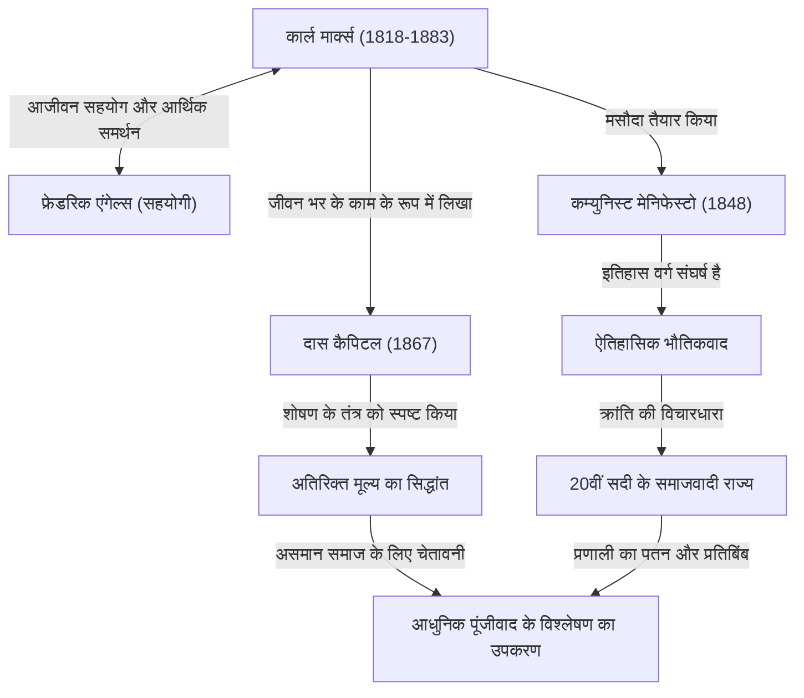

कार्ल मार्क्स। यह नाम सुनकर आपके दिमाग में क्या आता है? कुछ लोग उन्हें "साम्यवाद के पिता" के रूप में एक महान ऐतिहासिक व्यक्ति मान सकते हैं, जबकि अन्य उन्हें एक "खतरनाक विचारक जिसने तानाशाही राज्यों का निर्माण किया" के रूप में देख सकते हैं। हालाँकि, यदि हम विचारधारा के आवरण को हटा दें और विशुद्ध रूप से उनके विचारों को देखें, तो हमें जो मिलता है वह "एक प्रतिभाशाली डिबगर है जिसने किसी भी अन्य की तुलना में पूंजीवादी व्यवस्था के बग (अंतर्विरोधों) का अधिक गहराई से विश्लेषण किया"।

आज हम जिस असमान समाज, कठोर कार्य परिस्थितियों और आवधिक आर्थिक संकटों का सामना कर रहे हैं। आश्चर्यजनक रूप से, ये वही "पूंजीवाद की संरचनात्मक खामियां" हैं जिनकी मार्क्स ने 150 से अधिक वर्ष पहले भविष्यवाणी की थी। इस लेख में, एक पेशेवर इतिहास लेखक के दृष्टिकोण से, हम कार्ल मार्क्स के अशांत जीवन, उनके द्वारा स्थापित दर्शन के मूल और आधुनिक समाज में उनके विचार फिर से ध्यान का केंद्र क्यों बन रहे हैं, इसकी गहराई में जाएंगे।

## जीवन का प्रक्षेपवक्र: विद्रोही विचारक का जन्म कैसे हुआ?

कार्ल हेनरिक मार्क्स का जन्म 1818 में प्रशिया साम्राज्य (अब जर्मनी) के ट्रायर में एक धनी यहूदी वकील के परिवार में हुआ था। बॉन और बर्लिन विश्वविद्यालयों में कानून और दर्शनशास्त्र का अध्ययन करते हुए, वे हेगेलियन दर्शन से बहुत प्रभावित थे, जो उस समय जर्मन दार्शनिक दुनिया में छाया हुआ था। हालाँकि, उन्होंने केवल यथास्थिति की पुष्टि नहीं की, बल्कि "युवा हेगेलियन" की ओर झुक गए, जिन्होंने वास्तविकता के सामाजिक अंतर्विरोधों की आलोचना की।

विश्वविद्यालय से स्नातक होने के बाद, मार्क्स ने एक पत्रकार के रूप में काम करना शुरू किया, लेकिन सरकार की उनकी तीखी आलोचना के कारण, समाचार पत्र को प्रकाशन निलंबित करने के लिए मजबूर होना पड़ा और उन्हें पेरिस निर्वासित कर दिया गया। पेरिस में यह अवधि एक प्रमुख महत्वपूर्ण मोड़ बन गई जो उनके जीवन का निर्धारण करेगी। यहाँ उनकी मुलाकात फ्रेडरिक एंगेल्स से हुई, जो उनके आजीवन सहयोगी बने। एक धनी कताई कारखाने के मालिक के बेटे एंगेल्स ने मार्क्स को ब्रिटिश मजदूर वर्ग की दुखद वास्तविकता से अवगत कराया, और दोनों की अच्छी बनने लगी। उसके बाद से, वे एक अद्वितीय साथी बन गए जिन्होंने मार्क्स का वैचारिक और आर्थिक दोनों तरह से समर्थन करना जारी रखा।

उसके बाद भी, उन्हें विभिन्न देशों की सरकारों द्वारा खतरनाक माना गया और वे क्रमिक रूप से ब्रुसेल्स, कोलोन और अंततः लंदन निर्वासित कर दिए गए। लंदन में जीवन अत्यधिक गरीबी का था, और उन्होंने कुपोषण और बीमारी के कारण एक के बाद एक अपने बच्चों को खोने की त्रासदी का अनुभव किया। फिर भी, मार्क्स रोजाना ब्रिटिश संग्रहालय के वाचनालय में जाते थे और भारी मात्रा में आर्थिक साहित्य पढ़ते थे। उनके इस गहन शोध का परिणाम उनका मुख्य कार्य, "दास कैपिटल" (पूंजी) है।

## आरेखों के साथ मार्क्स के विचार को समझना

उनकी उपलब्धियों और वैचारिक प्रभाव की पूरी तस्वीर को निम्नलिखित सहसंबंध आरेख में संक्षेपित किया गया है।

## मार्क्सवादी दर्शन का मूल: ऐतिहासिक भौतिकवाद और अतिरिक्त मूल्य का रहस्य

मार्क्स के विचारों को मोटे तौर पर तीन स्तंभों में विभाजित किया गया है: "दर्शन", "ऐतिहासिक दृष्टिकोण" और "अर्थशास्त्र", लेकिन उनका मूल "ऐतिहासिक भौतिकवाद" और "अतिरिक्त मूल्य का सिद्धांत" है।

### यह "भौतिक परिस्थितियां" हैं जो इतिहास को चलाती हैं
ऐतिहासिक भौतिकवाद यह क्रांतिकारी विचार है कि "मानव चेतना समाज को निर्धारित नहीं करती है, बल्कि समाज के उत्पादन के भौतिक संबंध ही मानव चेतना को निर्धारित करते हैं"। जबकि पहले के इतिहासकारों ने रॉयल्टी और कुलीनता की वीर कहानियों या धार्मिक आदर्शों के माध्यम से इतिहास सुनाया था, मार्क्स ने परिभाषित किया कि "उत्पादक शक्तियों" और "उत्पादन के संबंधों" के बीच का अंतर्विरोध ही वह इंजन है जो इतिहास को अगले चरण की ओर ले जाता है। कम्युनिस्ट मेनिफेस्टो का प्रसिद्ध अंश, "अब तक मौजूद सभी समाजों का इतिहास वर्ग संघर्ष का इतिहास है," इस ऐतिहासिक दृष्टिकोण को संक्षेप में व्यक्त करता है।

### "अतिरिक्त मूल्य": मजदूर अमीर क्यों नहीं बन सकते?
अर्थशास्त्र में उनकी सबसे बड़ी उपलब्धि "अतिरिक्त मूल्य का सिद्धांत" है, जिसने तार्किक रूप से स्पष्ट किया कि कैसे पूंजीवाद लाभ उत्पन्न करता है और साथ ही असमानता का विस्तार करता है।
पूंजीपति मजदूरों को काम पर रखते हैं और उन्हें वेतन देते हैं। हालाँकि, मजदूर अपने काम से अपने वेतन (उनकी श्रम शक्ति का मूल्य) से अधिक मूल्य का उत्पादन करते हैं। मार्क्स ने वेतन से अधिक उत्पादित इस मूल्य को "अतिरिक्त मूल्य" कहा, और खुलासा किया कि यही पूंजीपतियों के लाभ का स्रोत है और मजदूरों के "शोषण" की वास्तविक प्रकृति है।
दूसरे शब्दों में, उन्होंने तर्क दिया कि वह स्थिति जिसमें पूंजीवादी व्यवस्था सामान्य रूप से कार्य कर रही है, अनिवार्य रूप से "धन के असमान वितरण" और "मजदूरों की गरीबी" का कारण बनने के लिए प्रोग्राम की गई है।

## बाद की पीढ़ियों पर भारी प्रभाव और आज मार्क्स

मार्क्स की मृत्यु के बाद, उनके विचारों ने 20वीं सदी में सचमुच दुनिया को दो हिस्सों में बांट दिया। रूसी क्रांति के नेता लेनिन ने उनके सिद्धांत को व्यवहार में लाया, जिससे मानव इतिहास के पहले समाजवादी राज्य सोवियत संघ का जन्म हुआ। बाद में, यह चीन और क्यूबा सहित दुनिया भर में फैल गया, और शीत युद्ध के रूप में पूंजीवादी ब्लॉक का सामना किया। नतीजतन, सोवियत संघ ढह गया, और मार्क्सवाद की वकालत करने वाली कई राज्य प्रणालियां निष्क्रिय हो गईं। इस वजह से, एक समय ऐसा भी आया जब यह कहा गया कि "मार्क्स समाप्त हो गए हैं।"

हालाँकि, 21वीं सदी में प्रवेश करते हुए, लीमन शॉक और महामारी के बाद, उनके विचार फिर से ध्यान आकर्षित कर रहे हैं। आधुनिक लोग जो कुछ वैश्विक कंपनियों और अति-अमीरों में केंद्रित धन, घटते मध्यम वर्ग, गैर-नियमित रोजगार और "बुलशिट जॉब्स" (बकवास नौकरियों) से पीड़ित हैं, वे बिल्कुल "अलग-थलग मजदूर" हैं जिनका मार्क्स ने "दास कैपिटल" में वर्णन किया है।
जलवायु परिवर्तन और पर्यावरणीय विनाश जैसी वैश्विक चुनौतियों के लिए भी, मार्क्स का दृष्टिकोण, जो पूंजीवाद की अनंत लाभ की खोज पर मौलिक रूप से सवाल उठाता है, आधुनिक अर्थशास्त्रियों द्वारा अद्यतन किया गया है जो नवउदारवाद की सीमाओं को इंगित करते हैं, और एक शक्तिशाली विश्लेषणात्मक उपकरण के रूप में पुनर्जीवित हुआ है।

## सारांश: भविष्य के बारे में सोचने के लिए एक "ओएस"

कार्ल मार्क्स ने भविष्य के यूटोपिया का विस्तृत खाका नहीं खींचा। उन्होंने जो पीछे छोड़ा वह अत्यंत शक्तिशाली और क्रूर पूंजीवादी व्यवस्था के "सोर्स कोड" को समझने और इसकी कमजोरियों को इंगित करने के लिए एक ठोस तर्क था।
जब हम एक बेहतर सामाजिक व्यवस्था को डिजाइन करने का प्रयास करते हैं, तो उनके महान विचार अतीत के अवशेष नहीं हैं, बल्कि आधुनिक समाज के बग्स को ठीक करने के लिए एक अपरिहार्य "ओएस (थिंकिंग बेस)" के रूप में आज भी काम कर रहे हैं।
