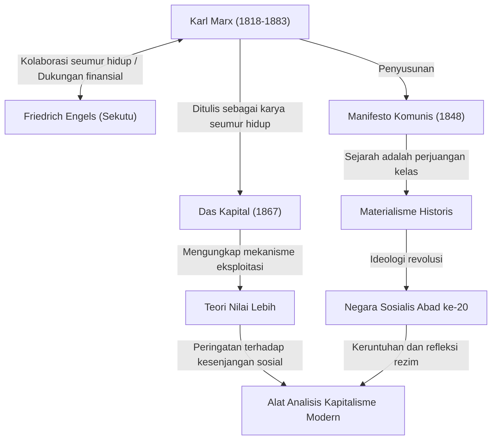

Karl Marx. Mendengar nama itu, apa yang terlintas dalam pikiran Anda? Seseorang mungkin menganggapnya sebagai tokoh besar dalam sejarah, "Bapak Komunisme", sementara yang lain mungkin memandangnya sebagai "pemikir berbahaya yang melahirkan negara-negara diktator". Namun, jika kita menyingkirkan selubung ideologi dan melihat pemikirannya secara murni, yang akan kita temukan adalah sosok "debugger jenius yang menganalisis bug (kontradiksi) dalam sistem kapitalisme lebih dalam dari siapa pun".

Kesenjangan sosial, kondisi kerja yang keras, dan krisis ekonomi siklis yang kita hadapi saat ini, mengejutkannya, adalah "cacat struktural kapitalisme" yang telah diprediksi Marx lebih dari 150 tahun yang lalu. Dalam artikel ini, dari sudut pandang penulis sejarah profesional, kita akan menggali lebih dalam kehidupan Karl Marx yang penuh gejolak, inti filosofi yang ia bangun, dan mengapa pemikirannya kembali menjadi sorotan di masyarakat modern.

## Jejak Kehidupan: Bagaimana Sang Pemikir Pemberontak Lahir

Karl Heinrich Marx lahir pada tahun 1818 di Trier, Kerajaan Prusia (sekarang Jerman), dalam keluarga pengacara Yahudi yang kaya. Saat mempelajari hukum dan filsafat di Universitas Bonn dan Universitas Berlin, ia sangat dipengaruhi oleh filsafat Hegel yang mendominasi dunia filsafat Jerman saat itu. Namun, alih-alih sekadar mengafirmasi status quo, ia lebih condong ke arah "Hegelian Muda" (Pemuda Hegelian) yang mengkritik kontradiksi sosial yang nyata.

Setelah lulus universitas, Marx mulai bekerja sebagai jurnalis, tetapi kritik tajamnya terhadap pemerintah menyebabkan surat kabarnya dilarang terbit, dan ia mengasingkan diri ke Paris. Masa di Paris ini menjadi titik balik penting yang menentukan hidupnya. Di sinilah ia mengalami pertemuan yang menentukan dengan Friedrich Engels, yang akan menjadi sekutu seumur hidupnya. Engels, putra seorang pemilik pabrik pemintalan yang kaya, menyampaikan kenyataan tragis kelas pekerja Inggris kepada Marx, dan keduanya menemukan kecocokan. Sejak saat itu, ia menjadi mitra tak tergantikan yang terus mendukung Marx baik secara ideologis maupun finansial.

Setelah itu, ia terus dipandang berbahaya oleh pemerintah di berbagai negara dan berulang kali mengasingkan diri ke Brussel, Köln, dan akhirnya ke London. Kehidupan di London sangat miskin; sebuah kenyataan brutal di mana ia kehilangan anak-anaknya satu per satu karena kekurangan gizi dan penyakit. Meskipun demikian, Marx mengunjungi perpustakaan British Museum setiap hari dan membaca banyak literatur ekonomi. Kristalisasi dari penelitian yang sangat melelahkan itu adalah karya utamanya, "Das Kapital" (Modal).

## Membedah Pemikiran Marx dengan Diagram

Gambaran keseluruhan tentang pencapaian dan pengaruh ideologisnya dirangkum dalam diagram korelasi berikut.

## Inti Filsafat Marx: Misteri Materialisme Historis dan Nilai Lebih

Pemikiran Marx secara garis besar terdiri dari tiga pilar: "filsafat", "pandangan sejarah", dan "ekonomi", tetapi inti utamanya adalah "Materialisme Historis" dan "Teori Nilai Lebih".

### Yang Menggerakkan Sejarah adalah "Kondisi Material"
Materialisme historis adalah gagasan revolusioner bahwa "bukan kesadaran manusia yang menentukan masyarakat, melainkan hubungan produksi material masyarakatlah yang menentukan kesadaran manusia". Sementara para sejarawan masa lalu menceritakan sejarah berdasarkan kisah kepahlawanan raja dan bangsawan atau cita-cita keagamaan, Marx mendefinisikan bahwa kontradiksi antara "tenaga produktif" dan "hubungan produksi" adalah kekuatan pendorong (mesin) yang memajukan sejarah ke tahap berikutnya. Kalimat terkenal dalam *Manifesto Komunis*, "Sejarah dari semua masyarakat yang ada hingga saat ini adalah sejarah perjuangan kelas", secara singkat mengekspresikan pandangan sejarah ini.

### "Nilai Lebih" ―― Mengapa Pekerja Tidak Bisa Menjadi Kaya
Pencapaian terbesar dalam bidang ekonomi adalah "Teori Nilai Lebih", yang secara logis mengungkap bagaimana kapitalisme menghasilkan keuntungan sekaligus memperlebar kesenjangan.
Kapitalis mempekerjakan buruh dan membayar upah. Namun, pekerja menghasilkan nilai melalui kerja mereka yang melebihi porsi upah mereka (nilai tenaga kerja). Marx menyebut nilai yang dihasilkan melebihi upah ini sebagai "nilai lebih", dan ia mengungkap bahwa ini adalah sumber keuntungan kapitalis dan sifat sebenarnya dari "eksploitasi" pekerja.
Dengan kata lain, ia berargumen bahwa kondisi normal ketika sistem kapitalis berjalan sudah secara alami diprogram untuk menyebabkan "distribusi kekayaan yang tidak merata" dan "kemiskinan pekerja".

## Pengaruh Besar bagi Generasi Mendatang dan Marx di Era Modern

Setelah kematian Marx, pemikirannya benar-benar membelah dunia abad ke-20. Pemimpin Revolusi Rusia, Lenin, mempraktikkan teorinya dan melahirkan Uni Soviet, negara sosialis pertama dalam sejarah umat manusia. Setelah itu, paham ini menyebar ke seluruh dunia, seperti di Cina dan Kuba, serta berhadapan dengan blok kapitalis dalam bentuk Perang Dingin. Hasilnya, Uni Soviet runtuh, dan sebagian besar sistem negara yang mengusung Marxisme tidak berfungsi. Karena hal ini, ada masa ketika orang berkata "Marx telah berakhir".

Namun, memasuki abad ke-21, melalui krisis finansial global 2008 dan pandemi, pemikirannya kembali menarik perhatian. Orang-orang modern yang menderita akibat kekayaan yang terkonsentrasi pada segelintir perusahaan global dan orang super kaya, runtuhnya kelas menengah, dan pekerjaan tidak tetap atau "pekerjaan omong kosong" (bullshit jobs), persis seperti "pekerja teralienasi" yang digambarkan Marx dalam *Das Kapital*.
Bahkan terhadap isu-isu global seperti perubahan iklim dan kerusakan lingkungan, sudut pandang Marx yang secara fundamental mempertanyakan pengejaran keuntungan tanpa batas dari kapitalisme, sedang diperbarui oleh para ekonom modern yang menunjukkan keterbatasan neoliberalisme, dan dibangkitkan sebagai alat analisis yang kuat.

## Kesimpulan: "OS" untuk Memikirkan Masa Depan

Karl Marx tidak menggambar cetak biru terperinci dari utopia masa depan. Apa yang ia tinggalkan adalah logika yang kuat untuk membaca "kode sumber" dari sistem yang sangat kuat dan kejam bernama kapitalisme, serta menunjukkan kerentanannya.
Ketika kita mencoba merancang sistem sosial yang lebih baik, pemikirannya yang agung bukanlah peninggalan masa lalu, melainkan terus berfungsi sebagai "OS (dasar pemikiran)" yang sangat diperlukan untuk memperbaiki bug dalam masyarakat modern.
