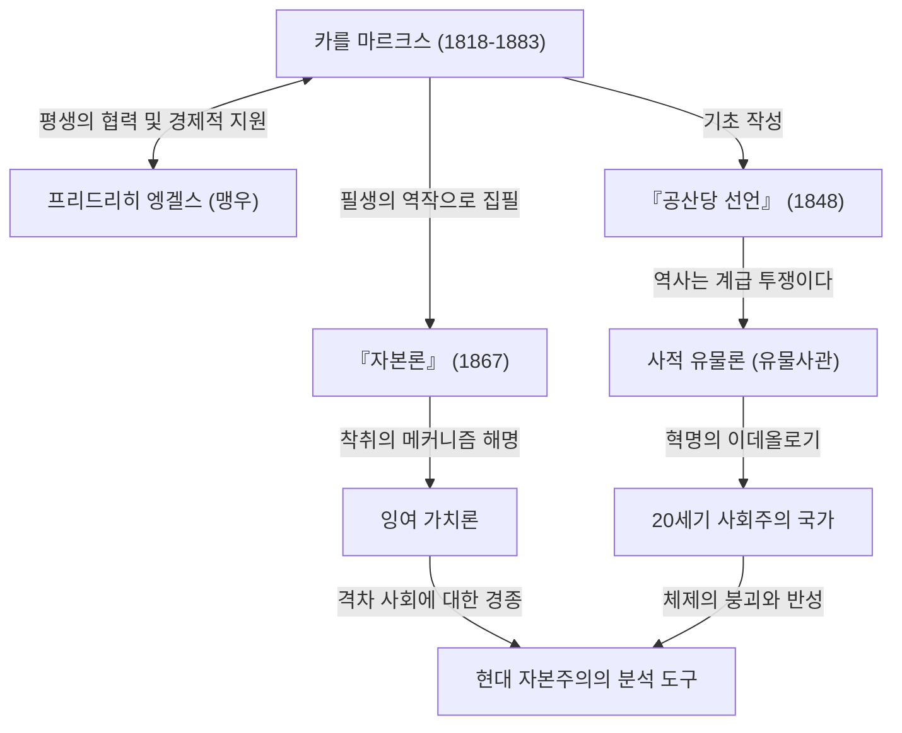

카를 마르크스. 그 이름을 들으면 당신은 무엇이 떠오르나요? 어떤 사람은 역사의 위대한 인물인 '공산주의의 아버지'라고 생각할 수도 있고, 다른 사람은 '독재 국가를 탄생시킨 위험한 사상가'로 여길 수도 있습니다. 하지만 이데올로기의 베일을 벗겨내고 그의 사상을 순수하게 바라보면, 거기에는 "자본주의라는 시스템의 버그(모순)를 누구보다 깊이 분석한 천재적인 디버거"의 모습이 있습니다.

오늘날 우리가 직면하고 있는 격차 사회, 가혹한 노동 환경, 그리고 주기적으로 찾아오는 경제 위기. 놀랍게도 이것들은 마르크스가 150여 년 전에 예견했던 '자본주의의 구조적 결함' 그 자체입니다. 본 기사에서는 전문 역사 작가의 관점에서 카를 마르크스의 파란만장한 생애, 그가 확립한 철학의 핵심, 그리고 현대 사회에서 그의 사상이 왜 다시 각광받고 있는지를 깊이 파헤쳐 보겠습니다.

## 생애의 궤적: 반역의 사상가는 어떻게 탄생했는가

카를 하인리히 마르크스는 1818년 프로이센 왕국(현재의 독일)의 트리어에서 유대계 부유한 변호사 가정에서 태어났습니다. 본 대학과 베를린 대학에서 법학과 철학을 공부하면서, 당시 독일 철학계를 휩쓸고 있던 헤겔 철학에 강한 영향을 받습니다. 그러나 그는 단순히 현상을 긍정하는 것에 그치지 않고, 현실의 사회 모순을 비판하는 '청년 헤겔파'에 기울게 되었습니다.

대학 졸업 후 언론인으로 활동을 시작한 마르크스였지만, 그의 날카로운 정부 비판으로 인해 신문은 발행 정지 처분을 받았고, 그는 파리로 망명합니다. 이 파리 시대는 그의 인생을 결정짓는 중요한 전환점이 되었습니다. 이곳에서 그는 평생의 맹우가 될 프리드리히 엥겔스와 운명적인 만남을 갖게 된 것입니다. 부유한 방적 공장 주인의 아들이었던 엥겔스는 영국 노동자 계급의 비참한 현실을 마르크스에게 전했고, 두 사람은 의기투합했습니다. 이후 사상적으로도 경제적으로도 마르크스를 계속 지원하는 둘도 없는 파트너가 되었습니다.

그 후에도 각국 정부로부터 위험인물로 지목되어 브뤼셀, 쾰른, 그리고 최종적으로는 런던으로 거듭 망명길에 오릅니다. 런던에서의 생활은 극심한 빈곤 그 자체였으며, 영양실조와 질병으로 아이들을 차례로 잃는 처절한 것이었습니다. 그럼에도 마르크스는 매일 대영 박물관의 열람실에 틀어박혀 방대한 경제학 문헌을 탐독했습니다. 그 피나는 연구의 결정체가 바로 그의 주저인 『자본론』입니다.

## 마르크스 사상 도해로 읽기

그의 업적과 사상적 영향의 전체상을 다음 상관도로 정리했습니다.

## 마르크스 철학의 핵심: 유물사관과 잉여 가치의 수수께끼

마르크스의 사상은 크게 '철학', '역사관', '경제학'의 세 가지 기둥으로 이루어져 있지만, 그 핵심을 이루는 것은 '사적 유물론(유물사관)'과 '잉여 가치론'입니다.

### 역사를 움직이는 것은 '물질적 조건'이다
사적 유물론은 "인간의 의식이 사회를 결정하는 것이 아니라, 사회의 물질적인 생산 관계가 인간의 의식을 결정한다"는 혁명적인 생각입니다. 기존의 역사가들이 왕후장상의 영웅전이나 종교적 이념으로 역사를 이야기했던 반면, 마르크스는 '생산력'과 '생산 관계'의 모순이야말로 역사를 다음 단계로 나아가게 하는 원동력(엔진)이라고 정의했습니다. "지금까지의 모든 사회의 역사는 계급 투쟁의 역사이다"라는 『공산당 선언』의 유명한 구절은 이 역사관을 단적으로 보여줍니다.

### '잉여 가치' ―― 왜 노동자는 부유해질 수 없는가
경제학에 있어서 최대의 공적은 자본주의가 어떻게 이익을 창출하고 동시에 격차를 확대하는지를 논리적으로 해명한 '잉여 가치론'입니다.
자본가는 노동자를 고용하고 임금을 지불합니다. 그러나 노동자는 자신의 임금 분(노동력의 가치) 이상의 가치를 노동을 통해 만들어냅니다. 마르크스는 이 임금을 초과하여 창출된 가치를 '잉여 가치'라고 불렀고, 이것이야말로 자본가의 이윤의 원천이자 노동자에 대한 '착취'의 정체라고 폭로했습니다.
즉, 자본주의 시스템이 정상적으로 가동되고 있는 상태 자체가 필연적으로 '부의 편재'와 '노동자의 빈곤'을 야기하도록 프로그램되어 있다는 것이 그의 주장입니다.

## 후세에 미친 거대한 영향과 현대의 마르크스

마르크스 사후, 그의 사상은 20세기 세계를 말 그대로 양분했습니다. 러시아 혁명의 지도자 레닌은 그의 이론을 실천에 옮겨, 소비에트 연방이라는 인류 역사상 최초의 사회주의 국가를 탄생시켰습니다. 그 후에도 중국, 쿠바 등 전 세계로 파급되었고, 냉전이라는 형태로 자본주의 진영과 대치했습니다. 결과적으로 소련은 붕괴했고, 마르크스주의를 내건 국가 체제의 대부분은 기능 부전에 빠졌습니다. 이로 인해 '마르크스는 끝났다'고 일컬어지던 시기도 있었습니다.

그러나 21세기에 들어서 리먼 쇼크와 팬데믹을 거치면서 그의 사상은 다시 주목을 받고 있습니다. 부가 극소수의 글로벌 기업과 부유층에 집중되고, 중산층이 몰락하며, 비정규직이나 '헛소리 직업(Bullshit Jobs)'으로 고통받는 현대인은 바로 마르크스가 『자본론』에서 묘사한 '소외된 노동자' 그 자체입니다.
기후 변화나 환경 파괴와 같은 글로벌 과제에 대해서도 자본주의의 무한한 이윤 추구를 근본부터 다시 묻는 마르크스의 시각은 신자유주의의 한계를 지적하는 현대의 경제학자들에 의해 업데이트되어, 강력한 분석 도구로 되살아나고 있습니다.

## 요약: 미래를 사유하기 위한 'OS'

카를 마르크스는 미래의 이상향에 대한 상세한 청사진을 그린 것은 아닙니다. 그가 남긴 것은 자본주의라는 지극히 강력하고 냉혹한 시스템의 '소스 코드'를 해독하고, 그 취약성을 지적하기 위한 견고한 논리입니다.
우리가 더 나은 사회 시스템을 설계하려고 할 때, 그가 남긴 장대한 사상은 과거의 유물이 아니라, 현대 사회의 버그를 수정하기 위한 필수 불가결한 'OS(사고 기반)'로서 지금도 여전히 기능하고 있는 것입니다.
