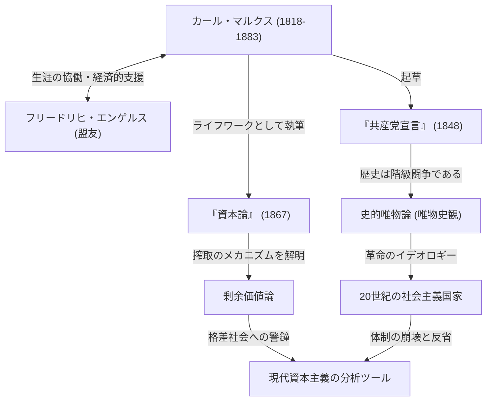

カール・マルクス。その名を聞いて、あなたは何を思い浮かべるでしょうか。ある人は「共産主義の父」として歴史上の偉人と考え、またある人は「独裁国家を生み出した危険な思想家」と捉えるかもしれません。しかし、イデオロギーのベールを剥がして彼の思想を純粋に見つめ直すと、そこにあるのは「資本主義というシステムのバグ（矛盾）を誰よりも深く分析した、天才的なデバッガー」としての姿です。

現代の私たちが直面している格差社会、過酷な労働環境、そして周期的に訪れる経済危機。これらは驚くべきことに、150年以上前にマルクスが予見していた「資本主義の構造的欠陥」そのものです。本記事では、プロの歴史ライターの視点から、カール・マルクスの波乱に満ちた生涯、彼が打ち立てた哲学の核心、そして現代社会において彼の思想がなぜ再び脚光を浴びているのかを深く掘り下げていきます。

## 生涯の軌跡：反逆の思想家はいかにして生まれたか

カール・ハインリヒ・マルクスは1818年、プロイセン王国（現在のドイツ）のトリーアで、ユダヤ系の裕福な弁護士の家庭に生まれました。ボン大学、ベルリン大学で法学や哲学を学ぶ中で、当時のドイツ哲学界を席巻していたヘーゲル哲学に強い影響を受けます。しかし、彼は単に現状を肯定するのではなく、現実の社会矛盾を批判する「青年ヘーゲル派」へと傾倒していきました。

大学卒業後、ジャーナリストとして活動を始めたマルクスですが、その鋭い政府批判により新聞は発行停止に追い込まれ、彼はパリへと亡命します。このパリ時代は、彼の人生を決定づける重要な転換点となりました。ここで彼は生涯の盟友となるフリードリヒ・エンゲルスと運命的な出会いを果たしたのです。裕福な紡績工場主の息子であったエンゲルスは、イギリスの悲惨な労働者階級の現実をマルクスに伝え、二人は意気投合。以後、思想的にも経済的にもマルクスを支え続ける無二のパートナーとなりました。

その後も各国の政府から危険視され、ブリュッセル、ケルン、そして最終的にはロンドンへと亡命を重ねます。ロンドンでの生活は極貧を極め、栄養失調や病気で子供たちを次々と失うという壮絶なものでした。それでもマルクスは大英博物館の図書室に毎日通い詰め、膨大な経済学の文献を読み漁りました。その血のにじむような研究の結晶が、彼の主著『資本論』です。

## マルクス思想を図解で読み解く

彼の功績と思想的影響の全体像を、以下の相関図で整理しました。

## マルクス哲学の中核：唯物史観と剰余価値の謎

マルクスの思想は、大きく分けて「哲学」「歴史観」「経済学」の3つの柱から成り立っていますが、その核心を成すのが「史的唯物論（唯物史観）」と「剰余価値論」です。

### 歴史を動かすのは「物質的条件」である
史的唯物論は、「人間の意識が社会を決定するのではなく、社会の物質的な生産関係が人間の意識を決定する」という革命的な考え方です。これまでの歴史家が王侯貴族の英雄伝や宗教的理念で歴史を語っていたのに対し、マルクスは「生産力」と「生産関係」の矛盾こそが歴史を次のステージへ進める原動力（エンジン）だと定義しました。「これまでのあらゆる社会の歴史は、階級闘争の歴史である」という『共産党宣言』の有名な一節は、この歴史観を端的に表しています。

### 「剰余価値」――なぜ労働者は豊かになれないのか
経済学における最大の功績は、資本主義がいかにして利益を生み出し、同時に格差を拡大させるかを論理的に解明した「剰余価値論」です。
資本家は労働者を雇い、給料を支払います。しかし労働者は、自分の給料分（労働力の価値）以上の価値を労働によって生み出しています。マルクスは、この給料を超えて生み出された価値を「剰余価値」と呼び、これこそが資本家の利潤の源泉であり、労働者からの「搾取」の正体であると暴きました。
つまり、資本主義システムが正常に稼働している状態そのものが、必然的に「富の偏在」と「労働者の貧困」を引き起こすようにプログラムされているのだ、と彼は主張したのです。

## 後世への巨大な影響と現代におけるマルクス

マルクスの死後、彼の思想は20世紀の世界を文字通り二分しました。ロシア革命の指導者レーニンは彼の理論を実践に移し、ソビエト連邦という人類史上初の社会主義国家を誕生させます。その後も中国、キューバなど世界中に波及し、冷戦という形で資本主義陣営と対峙しました。結果としてソ連は崩壊し、マルクス主義を掲げた国家体制の多くは機能不全に陥りました。これにより「マルクスは終わった」と語られた時期もありました。

しかし、21世紀に入り、リーマン・ショックやパンデミックを経て、彼の思想は再び注目を集めています。富がごく一部のグローバル企業や富裕層に集中し、中間層が没落し、非正規雇用や「ブルシット・ジョブ」に苦しむ現代人は、まさにマルクスが『資本論』で描いた「疎外された労働者」そのものです。
気候変動や環境破壊といったグローバルな課題に対しても、資本主義の無限の利潤追求を根本から問い直すマルクスの視座は、新自由主義の限界を指摘する現代の経済学者によってアップデートされ、強力な分析ツールとして蘇っています。

## まとめ：未来を思考するための「OS」

カール・マルクスは、未来の理想郷の詳細な見取り図を描いたわけではありません。彼が残したのは、資本主義という極めて強力で冷酷なシステムの「ソースコード」を読み解き、その脆弱性を指摘するための堅牢な論理です。
私たちがより良い社会システムを設計しようとする時、彼の残した壮大な思想は、過去の遺物ではなく、現代社会のバグを修正するための不可欠な「OS（思考基盤）」として、今もなお機能し続けているのです。
