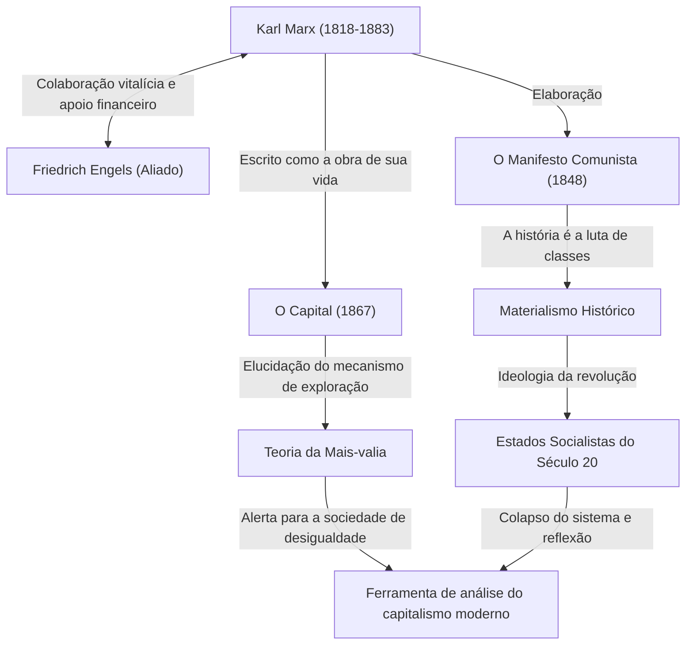

Karl Marx. O que lhe vem à mente quando você ouve esse nome? Alguns podem considerá-lo um grande homem na história como o "pai do comunismo", enquanto outros podem vê-lo como um "pensador perigoso que deu origem a estados ditatoriais". No entanto, se removermos o véu da ideologia e reexaminarmos seu pensamento puramente, o que emerge é a figura de um "depurador genial que analisou os bugs (contradições) do sistema capitalista mais profundamente do que qualquer outra pessoa".

A sociedade desigual, as duras condições de trabalho e as crises econômicas cíclicas que enfrentamos hoje. Surpreendentemente, esses são precisamente os "defeitos estruturais do capitalismo" que Marx previu há mais de 150 anos. Neste artigo, sob a perspectiva de um escritor profissional de história, nos aprofundaremos na vida turbulenta de Karl Marx, no cerne da filosofia que ele fundou e na razão pela qual suas ideias estão novamente no centro das atenções na sociedade moderna.

## A Trajetória de Vida: Como Nasceu o Pensador Rebelde

Karl Heinrich Marx nasceu em 1818 em Trier, no Reino da Prússia (atual Alemanha), em uma rica família judaica de advogados. Enquanto estudava direito e filosofia nas Universidades de Bonn e Berlim, ele foi fortemente influenciado pela filosofia hegeliana, que dominava o mundo filosófico alemão na época. No entanto, em vez de simplesmente afirmar o status quo, ele se inclinou para os "jovens hegelianos", que criticavam as contradições sociais da realidade.

Após se formar na universidade, Marx começou a trabalhar como jornalista, mas suas severas críticas ao governo levaram à suspensão da publicação de seu jornal, e ele foi forçado a se exilar em Paris. Esse período em Paris foi um momento decisivo em sua vida. Foi lá que ele teve um encontro fatídico com Friedrich Engels, que se tornaria seu aliado para toda a vida. Engels, filho de um rico proprietário de fábrica de fiação, transmitiu a Marx a triste realidade da classe trabalhadora britânica, e os dois se deram bem imediatamente. A partir de então, Engels tornou-se um parceiro insubstituível que continuou a apoiar Marx ideológica e financeiramente.

Posteriormente, visto como perigoso pelos governos de vários países, ele se exilou sucessivamente em Bruxelas, Colônia e, finalmente, Londres. A vida em Londres foi de extrema pobreza, e ele perdeu seus filhos um após o outro de forma trágica devido à desnutrição e doenças. Apesar disso, Marx visitava a sala de leitura do Museu Britânico todos os dias, devorando uma enorme quantidade de literatura econômica. O fruto de sua pesquisa extenuante é sua principal obra, "O Capital".

## Desvendando o Pensamento de Marx Através de Diagramas

Resumimos suas conquistas e influência ideológica geral no diagrama de relações abaixo.

## O Cerne da Filosofia de Marx: O Materialismo Histórico e o Mistério da Mais-valia

O pensamento de Marx consiste amplamente em três pilares: "filosofia", "visão da história" e "economia". O cerne disso é formado pelo "materialismo histórico" e pela "teoria da mais-valia".

### O Que Move a História São as "Condições Materiais"
O materialismo histórico é a ideia revolucionária de que "não é a consciência dos homens que determina a sociedade, mas são as relações materiais de produção da sociedade que determinam a consciência dos homens". Enquanto os historiadores anteriores narravam a história através de contos heroicos de reis e nobres ou ideais religiosos, Marx definiu que a contradição entre as "forças produtivas" e as "relações de produção" é o motor que impulsiona a história para o próximo estágio. A famosa frase de "O Manifesto Comunista": "A história de todas as sociedades até hoje existentes é a história das lutas de classes", expressa claramente essa visão da história.

### A "Mais-valia" — Por Que os Trabalhadores Não Podem Enriquecer?
A maior conquista na economia é a "teoria da mais-valia", que explicou logicamente como o capitalismo gera lucros ao mesmo tempo em que amplia a desigualdade.
O capitalista contrata trabalhadores e paga-lhes salários. No entanto, os trabalhadores criam mais valor através de seu trabalho do que o valor de seu salário (o valor da força de trabalho). Marx chamou esse valor criado além do salário de "mais-valia", e revelou que essa é a fonte do lucro do capitalista e a verdadeira natureza da "exploração" dos trabalhadores.
Em outras palavras, ele argumentou que o próprio estado normal de funcionamento do sistema capitalista é inevitavelmente programado para causar a "concentração de riqueza" e a "pobreza dos trabalhadores".

## A Enorme Influência na Posteridade e Marx na Era Moderna

Após a morte de Marx, seu pensamento literalmente dividiu o mundo do século 20. O líder da Revolução Russa, Lênin, colocou sua teoria em prática, dando origem ao primeiro estado socialista da história da humanidade, a União Soviética. Posteriormente, o pensamento se espalhou pelo mundo, incluindo China e Cuba, e confrontou o campo capitalista na forma da Guerra Fria. Como resultado, a União Soviética entrou em colapso e muitos dos regimes estatais que abraçaram o marxismo tornaram-se disfuncionais. Devido a isso, houve um período em que se dizia que "Marx acabou".

No entanto, entrando no século 21, após o choque da Lehman Brothers e a pandemia, seu pensamento está mais uma vez chamando a atenção. As pessoas modernas que sofrem com a concentração de riqueza em um punhado de corporações globais e indivíduos ricos, o declínio da classe média, o emprego não regular e os "bullshit jobs" (trabalhos inúteis) são exatamente os "trabalhadores alienados" descritos por Marx em "O Capital".
Mesmo diante de desafios globais como a mudança climática e a destruição ambiental, a perspectiva de Marx, que questiona fundamentalmente a busca infinita de lucro pelo capitalismo, foi atualizada por economistas modernos que apontam as limitações do neoliberalismo, renascendo como uma poderosa ferramenta de análise.

## Conclusão: Um "OS" Para Pensar Sobre o Futuro

Karl Marx não desenhou um plano detalhado de uma utopia futura. O que ele deixou para trás foi uma lógica robusta para decifrar o "código-fonte" do extremamente poderoso e cruel sistema do capitalismo e apontar suas vulnerabilidades.
Quando tentamos projetar um sistema social melhor, o grande pensamento que ele deixou não é uma relíquia do passado, mas continua a funcionar até hoje como um "OS (sistema operacional / base de pensamento)" indispensável para corrigir os bugs da sociedade moderna.
