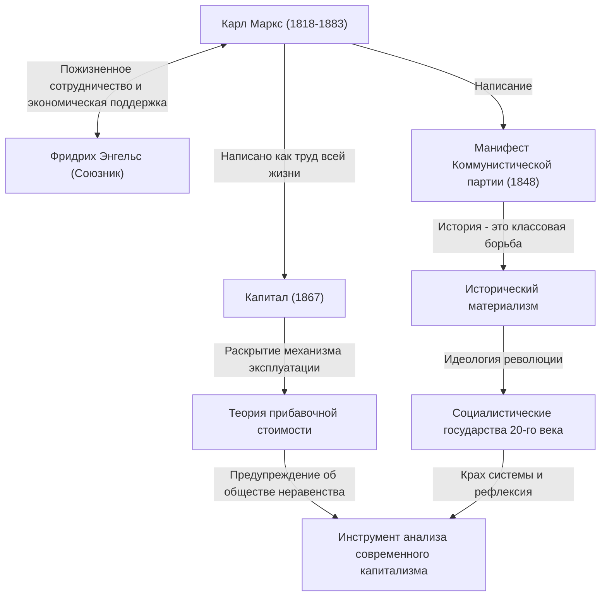

Карл Маркс. Что приходит вам на ум, когда вы слышите это имя? Некоторые могут считать его великим историческим деятелем как «отца коммунизма», тогда как другие могут воспринимать его как «опасного мыслителя, породившего диктаторские государства». Однако, если сбросить завесу идеологии и взглянуть на его мысли в чистом виде, перед нами предстанет образ «гениального отладчика, который глубже всех проанализировал баги (противоречия) капиталистической системы».

Общество неравенства, суровые условия труда и периодические экономические кризисы, с которыми мы сталкиваемся сегодня. Удивительно, но это именно те «структурные дефекты капитализма», которые Маркс предвидел более 150 лет назад. В этой статье, с точки зрения профессионального исторического писателя, мы глубоко погрузимся в бурную жизнь Карла Маркса, суть заложенной им философии и причины, по которым его идеи снова привлекают внимание в современном обществе.

## Траектория жизни: Как родился мятежный мыслитель

Карл Генрих Маркс родился в 1818 году в Трире, королевство Пруссия (современная Германия), в состоятельной еврейской семье юриста. Изучая право и философию в Боннском и Берлинском университетах, он находился под сильным влиянием гегельянской философии, которая в то время доминировала в немецких философских кругах. Однако вместо того чтобы просто утверждать статус-кво, он примкнул к «младогегельянцам», критиковавшим социальные противоречия реальности.

После окончания университета Маркс начал работать журналистом, но из-за его резкой критики правительства газета была закрыта, и он был вынужден эмигрировать в Париж. Этот парижский период стал важнейшим поворотным моментом в его жизни. Именно здесь он роковым образом встретился с Фридрихом Энгельсом, который стал его союзником на всю жизнь. Энгельс, сын богатого владельца прядильной фабрики, рассказал Марксу о плачевном положении британского рабочего класса, и они сразу же нашли общий язык. С тех пор Энгельс стал незаменимым партнером, который продолжал поддерживать Маркса как идеологически, так и финансово.

Впоследствии правительства различных стран сочли его опасным, и он последовательно эмигрировал в Брюссель, Кёльн и, в конце концов, в Лондон. Его жизнь в Лондоне проходила в крайней нищете, где он трагически потерял одного за другим своих детей из-за недоедания и болезней. Несмотря на это, Маркс каждый день посещал читальный зал Британского музея, поглощая огромное количество экономической литературы. Плодом этих изнурительных исследований стал его главный труд — «Капитал».

## Понимание идей Маркса через диаграммы

Мы обобщили его достижения и идеологическое влияние на следующей диаграмме связей.

## Ядро философии Маркса: Исторический материализм и загадка прибавочной стоимости

Мысль Маркса в общих чертах состоит из трех столпов: «философия», «взгляд на историю» и «экономика». Ядром этого являются «исторический материализм» и «теория прибавочной стоимости».

### Что движет историей, так это «материальные условия»
Исторический материализм — это революционная идея о том, что «не сознание людей определяет общество, а материальные производственные отношения общества определяют сознание людей». В то время как предшествующие историки объясняли историю через героические рассказы о королях и дворянах или через религиозные идеалы, Маркс определил, что противоречие между «производительными силами» и «производственными отношениями» является тем самым двигателем, который продвигает историю на следующий этап. Известная фраза из «Манифеста Коммунистической партии»: «История всех до сих пор существовавших обществ была историей борьбы классов», четко выражает этот взгляд на историю.

### «Прибавочная стоимость» — Почему рабочие не могут разбогатеть?
Величайшим достижением в экономике является «теория прибавочной стоимости», логически объяснившая, как капитализм генерирует прибыль, одновременно увеличивая неравенство.
Капиталист нанимает рабочих и платит им заработную плату. Однако рабочие своим трудом создают стоимость, превышающую их заработную плату (стоимость рабочей силы). Маркс назвал эту созданную сверх заработной платы стоимость «прибавочной стоимостью» и раскрыл, что именно она является источником прибыли капиталиста и истинной природой «эксплуатации» рабочих.
Другими словами, он утверждал, что само нормальное функционирование капиталистической системы неизбежно запрограммировано на то, чтобы вызывать «концентрацию богатства» и «бедность рабочих».

## Огромное влияние на потомков и Маркс в современную эпоху

После смерти Маркса его идеи в буквальном смысле раскололи мир 20-го века. Лидер Русской революции Ленин применил его теорию на практике, создав первое в истории человечества социалистическое государство — Советский Союз. Впоследствии его идеи распространились по всему миру, включая Китай и Кубу, и в форме холодной войны противостояли капиталистическому лагерю. В конечном итоге Советский Союз распался, а многие государственные режимы, провозгласившие марксизм, оказались нежизнеспособными. Из-за этого был период, когда говорили: «С Марксом покончено».

Однако в 21 веке, после шока Lehman и пандемии, его идеи вновь привлекают внимание. Современные люди, страдающие от концентрации богатства в руках горстки глобальных корпораций и богачей, упадка среднего класса, нестандартной занятости и «бредовой работы» (bullshit jobs), в точности соответствуют образу «отчужденных рабочих», описанному Марксом в «Капитале».
Даже перед лицом таких глобальных проблем, как изменение климата и разрушение окружающей среды, марксовская перспектива, фундаментально ставящая под сомнение бесконечную погоню капитализма за прибылью, была обновлена современными экономистами, указывающими на пределы неолиберализма, и возродилась как мощный инструмент анализа.

## Заключение: «ОС» для размышлений о будущем

Карл Маркс не нарисовал подробного чертежа будущей утопии. То, что он оставил, — это надежная логика для расшифровки «исходного кода» чрезвычайно мощной и безжалостной системы капитализма и для указания на ее уязвимости.
Когда мы пытаемся спроектировать лучшую социальную систему, оставленная им грандиозная мысль — это не пережиток прошлого, а незаменимая «ОС (база мышления)» для исправления багов современного общества, которая продолжает функционировать и сегодня.
