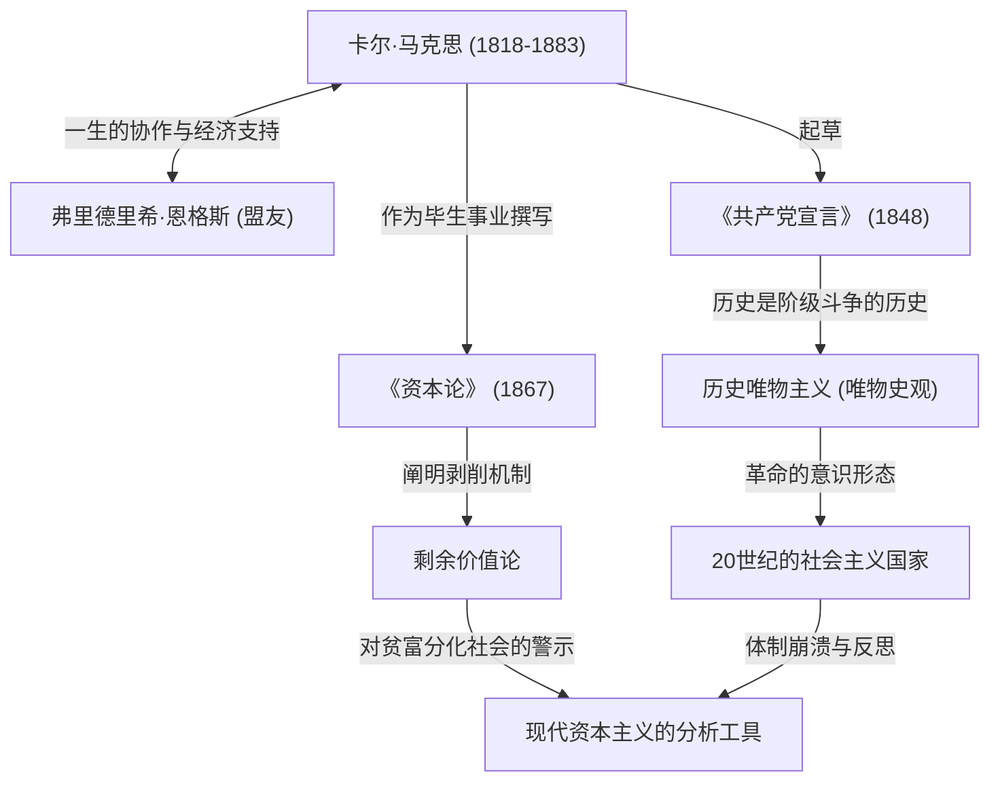

卡尔·马克思。听到这个名字，你会想到什么？有些人可能会把他看作历史上的伟人、“共产主义之父”，而另一些人可能会把他视为“催生独裁国家的危险思想家”。然而，如果剥去意识形态的面纱，纯粹地审视他的思想，我们会发现他是一个“比任何人都更深刻地分析了资本主义系统漏洞（矛盾）的天才调试员（Debugger）”。

我们今天所面临的贫富分化、恶劣的劳动环境以及周期性的经济危机——令人惊讶的是，这正是马克思在150多年前就预见到的“资本主义结构性缺陷”。在本文中，我们将以专业历史作家的视角，深入探讨卡尔·马克思波澜壮阔的一生、他所建立的哲学核心，以及为什么他的思想在现代社会再次备受瞩目。

## 生涯轨迹：反叛的思想家是如何诞生的

1818年，卡尔·海因里希·马克思出生于普鲁士王国（今德国）特里尔市一个富裕的犹太律师家庭。在波恩大学和柏林大学学习法律和哲学期间，他深受当时席卷德国哲学界的黑格尔哲学的影响。然而，他并没有简单地肯定现状，而是倾向于批判现实社会矛盾的“青年黑格尔派”。

大学毕业后，马克思开始以记者的身份活动，但他对政府的尖锐批评导致报纸被迫停刊，他流亡到了巴黎。在巴黎的这段时期成为决定他一生的重要转折点。在这里，他与一生的挚友弗里德里希·恩格斯命运般地相遇了。作为富裕纺织厂主的儿子，恩格斯向马克思讲述了英国工人阶级悲惨的现实，两人一拍即合。此后，恩格斯成为了在思想和经济上持续支持马克思的无与伦比的伙伴。

此后，他依然被各国政府视为危险分子，先后流亡布鲁塞尔、科隆，最终定居伦敦。在伦敦的生活极度贫困，他在营养不良和疾病中接连失去孩子，经历了极其悲惨的遭遇。尽管如此，马克思每天仍坚持去大英博物馆阅览室，饱览浩如烟海的经济学文献。他呕心沥血的研究结晶，正是他的代表作《资本论》。

## 图解马克思思想

下面的关联图梳理了他的成就和思想影响的全貌。

## 马克思哲学的核心：唯物史观与剩余价值之谜

马克思的思想大致由“哲学”、“历史观”和“经济学”三大支柱组成，而其核心是“历史唯物主义（唯物史观）”和“剩余价值论”。

### 推动历史的是“物质条件”
历史唯物主义是一种革命性的观念，即“不是人们的意识决定人们的存在，相反，是人们的社会存在决定人们的意识”。以前的历史学家用王侯贵族的英雄事迹或宗教理念来讲述历史，而马克思则将“生产力”与“生产关系”的矛盾定义为推动历史进入下一阶段的动力（引擎）。《共产党宣言》中著名的论断“至今一切社会的历史都是阶级斗争的历史”，正是这一历史观的简明表达。

### “剩余价值”——为什么工人富裕不起来？
他在经济学领域最大的成就是“剩余价值论”，它在逻辑上阐明了资本主义是如何产生利润，同时又扩大了贫富差距的。
资本家雇佣工人并支付工资。然而，工人通过劳动创造的价值超过了他们工资（劳动力价值）的部分。马克思将这部分超出工资创造的价值称为“剩余价值”，并揭示这正是资本家利润的源泉，也是对工人“剥削”的真相。
换句话说，他主张，资本主义系统正常运转的状态本身，就注定会导致“财富分配不均”和“工人的贫困”。

## 对后世的巨大影响与现代的马克思

马克思逝世后，他的思想在20世纪字面意义上将世界一分为二。俄国革命的领导者列宁将他的理论付诸实践，诞生了人类历史上第一个社会主义国家——苏联。此后，它波及中国、古巴等世界各地，并以冷战的形式与资本主义阵营对峙。结果苏联解体，许多打着马克思主义旗号的国家体制陷入瘫痪。因此，曾有一段时期人们宣称“马克思已终结”。

然而，进入21世纪，经历了雷曼危机和全球大流行病，他的思想再次受到关注。财富集中在极少数全球企业和富豪手中，中产阶级衰落，深受非正式雇佣和“狗屁工作”折磨的现代人，正是马克思在《资本论》中所描绘的“异化劳动者”。
即便是面对气候变化和环境破坏等全球性挑战，马克思从根本上质疑资本主义无限追求利润的视角，也被指出新自由主义局限的现代经济学家所更新，并作为一种强大的分析工具而复苏。

## 结语：思考未来的“操作系统 (OS)”

卡尔·马克思并没有绘制出一幅未来乌托邦的详细蓝图。他留下的是为了解读资本主义这个极其强大且冷酷的系统的“源代码”，并指出其脆弱性的坚实逻辑。
当我们试图设计一个更好的社会系统时，他留下的宏大思想并非过去的遗物，而是作为修复现代社会漏洞不可或缺的“操作系统 (思维基础)”，在今天依然持续发挥着作用。
